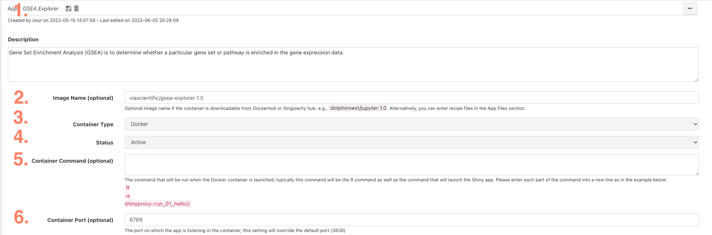

## Recommended Practices for App Development

The following section contains guidelines to help you develop your own apps. Although nothing in this section is required, we find these guidelines helpful to create applications that are both reproducible and easy to maintain.

### Directory Structure

A directory structure similar to below can be tracked on Github and Dockerhub for easy version control and containerization.

```

|-- parent-directory/
	|-- README.md
	|-- Dockerfile
	|-- app-directory/
		|-- app.R
		|-- R/
			|-- # additional scripts sourced by app
			|--
			|--
		|-- www/
			|-- # CSS files
			|--
			|--
		|-- data/
			|-- # Data files used for app
			|--
			|--
```

### Dockerfile

Docker is an open-source platform that allows developers to automate the deployment and management of applications within lightweight, isolated containers. It provides an additional layer of abstraction and standardization, enabling software to be packaged with all its dependencies and run consistently over time across different environments.

When building a docker, it is best to aim for a minimalistic approach - only including the necessary components and dependencies required for your application.

```
FROM rocker/shiny:4.3.0
LABEL author="zach@viascientific.com" description="Docker image containing all requirements for the Via Scientific GSEA explorer App"

ENV LANG=C.UTF-8 LC_ALL=C.UTF-8

# Install System libraries
RUN apt-get update --fix-missing && \
    apt-get install -y gcc unzip curl make zlib1g-dev libglpk-dev libgmp3-dev libxml2-dev pandoc libicu-dev vim

# Install required R packages
RUN R -e 'install.packages(c("shiny", "BiocManager", "dplyr", "DT", "ggplot2", "shinydashboard", "shinydashboardPlus", "shinycssloaders", "igraph", "shinyjs"), \
    repos="https://packagemanager.posit.co/cran/__linux__/focal/2023-06-01")'
RUN R -e "BiocManager::install(version = '3.17')"
RUN R -e "BiocManager::install(c('fgsea', 'clusterProfiler', 'org.Hs.eg.db', 'org.Mm.eg.db'))"

# Copy app directory onto image
ADD gsea-explorer /gsea-explorer/

# Run the app when the container is started
CMD ["R", "-e", "shiny::runApp('/gsea-explorer')"]
```

In the above example, a minimal base image (rocker/shiny:4.3.0) was selected that supports shiny applications. Only the necessary system libraries and R packages are installed. The entire app directory (gsea-explorer) is copied onto the image. Finally, the app is automatically started when the app is run.

[Posit's Package Manager](https://packagemanager.posit.co/client/#/repos/2/packages/A3) is a useful tool in determining which system libraries are necessary for each R package. Navigate to the cran or bioconductor package of interest and look for the "Install System Prerequisites" section. Select the distribution that matches your base image.

Additionally, when using `install.packages()`, setting the `repos` argument to use posit's package manager allows you to both download pre-built binaries (significantly speeding up docker build time) as well as freezing the version of each library to a specific date in time.

### Port Selection

The shiny app file should set the host to `0.0.0.0` and specify the port. An example skeleton is below:

```
ui = dashboardPage(

	# UI Code

)

server = function(input, output, session) {

	# Sever Code

}

options(shiny.host = "0.0.0.0", shiny.port = 8789)
shinyApp(ui = ui, server = server)
```

### Host App on Foundry

To host the app on Foundry, navigate to the `Apps` page and select the `My Apps` tab and then click `Create App`


#### App Definition File

In the app definition file, set the following values:




1. Set the name of the app
2. If the docker image is hosted on Dockerhub, provide the path
3. Select the container
4. Set status to active
5. The command to run when the container is activated. This can be left blank if the run command was set in the dockerfile. (as above `CMD ["R", "-e", "shiny::runApp('/gsea-explorer')"]`)
6. Set the port number. This should match the port that is set in the app.R file.

	```
	options(shiny.host = "0.0.0.0", shiny.port = 8789)
	```

7. Set Websocket-reconnection-mode to None (default)
8. Set the Container Environment to
	```
	DISABLE_AUTH: true
	WWW_ROOT_PATH: "/api/route/#{proxy.getRuntimeValue('SHINYPROXY_PROXY_ID')}/"
	```
	
## How To Cite Us

If you use Via Foundry (formerly DolphinNext) in your research, please
cite:

Yukselen, O., Turkyilmaz, O., Ozturk, A.R. et al. DolphinNext: a
distributed data processing platform for high throughput genomics. BMC
Genomics 21, 310 (2020). <https://doi.org/10.1186/s12864-020-6714-x>

## Support

For any questions or help, please reach out to
<support@viascientific.com> with your name and question.