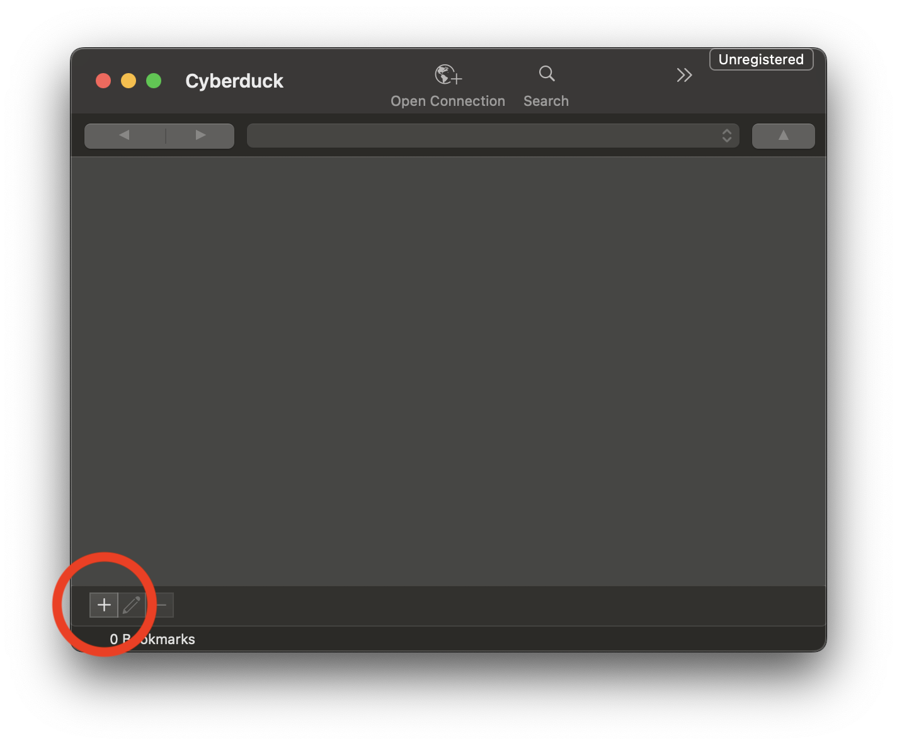

# Upload with Cyber Ducker

Cyberduck is an open-source file transfer client for Mac and Windows that supports various protocols, including FTP, SFTP, WebDAV, and cloud storage services such as Amazon S3, Google Drive, Dropbox, and Microsoft OneDrive. It is known for its user-friendly interface, which allows users to connect to and manage files on remote servers or cloud storage accounts easily.

You can use Cyber Duck to upload data to Via Foundry. This walkthrough assumes a Mac installation, but similar steps apply to Windows installation.

## Prerequisites:

Download Cyber Duck for your platform. Follow the instructions [here](https://cyberduck.io/download/)

## Step-by-Step Instructions:

1. **Contact Support**:
     * Before you begin, contact Via Scientific support at `support@viascientific.com` to obtain:
         * **Bucket Name**
         * **AWS Credentials** (Access Key and Secret Key)
     * Remember these credentials you'll need them later

2. **Launch Cyber Duck**
    - 
3. **Select S3 Bookmark**
    - 
4. **Enter AWS access key and Secret access key**
    - Enter the AWS credentials you received from support.
    - 
5. **Enter Bucket**
    - Enter the bucket name you received from support.
    - 
6. **Upload Data**
    - Select the settings cog
    - Select "Upload..." from the menu
    - Select a file from your local machine
    - 
