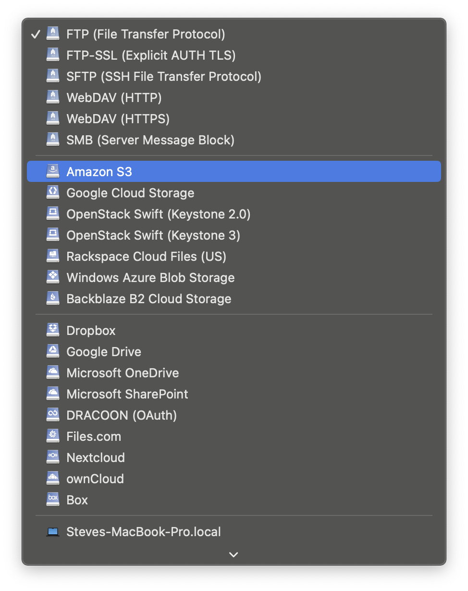
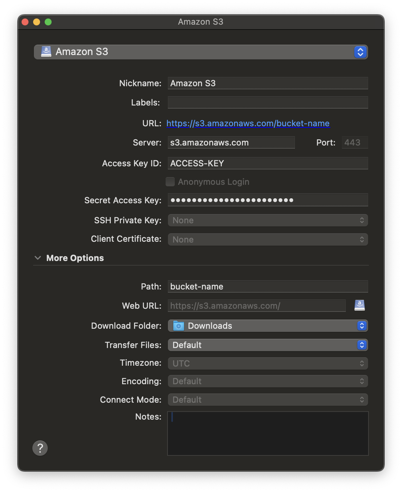
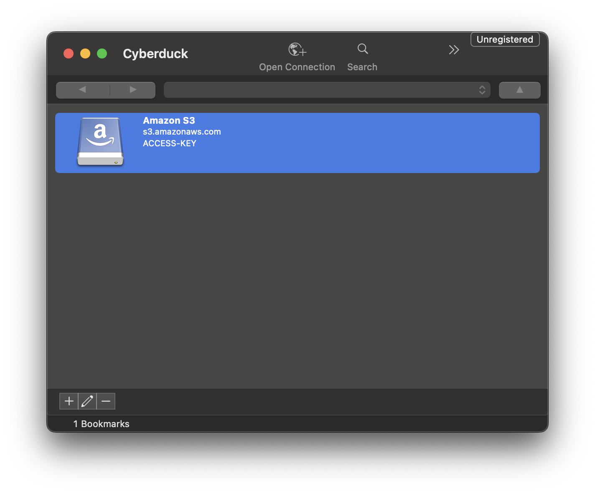
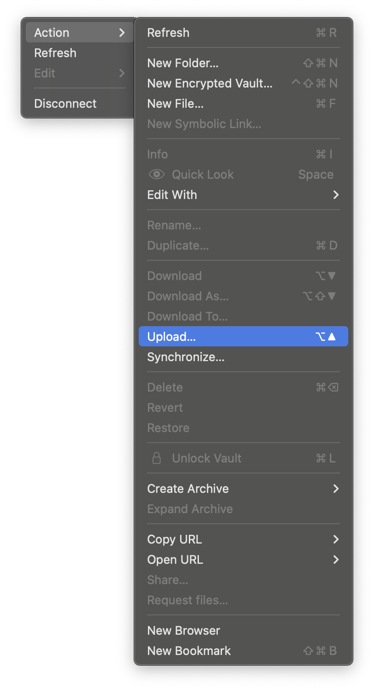

# Data Guide

The Data Guide is your go-to resource for learning how to efficiently connect and manage your data with Via Foundry. Whether you're integrating data from external sources or uploading local datasets, Via Foundry has you covered. In this section, we'll walk you through the various features and methods Via Foundry offers for seamless data integration.

## Access your Data in the Cloud

!!! tip

    Foundry readily integrate with Cloud Infrastructure. We recommend using [xCloud](https://www.viascientific.com/products/) to take full advantage of Foundry in your environment.

### Integrate your Cloud with Foundry xCloud

With Foundry [xCloud](https://www.viascientific.com/products/), deploying Via Foundry in your AWS or GCP account has never been easier. Leveraging xCloud, you can set up Via Foundry in your existing cloud environment. This setup allows you to maintain your cloud infrastructure in AWS and Google Cloud while taking advantage of the the robust, feature-rich Via Foundry experience .

Want to get started with Foundry xCloud? Reach out to our support team at <support@viascientific.com>, and we'll get you started.

### Connect your Cloud with Foundry vCloud

For users who want to use Via Foundry public cloud, but want a greater control of data we allow you connect your private S3 or Google bucket to Via Foundry [vCloud](https://www.viascientific.com/products/) product. Reach out to support to get started, `support@viascientific.com`.

## Upload from your computer

!!! tip

    When uploading data from your local machine to the cloud, it's crucial to organize your data effectively. This will make it much easier to locate your files when you need them.

### Prerequisites

#### Contact Support

Before you begin, contact Via Scientific support at `support@viascientific.com` to obtain:  

* **Bucket Name** You'll need this to know where to upload data.
* **AWS Credentials** AWS Access Key and Secret Key. We'll use these later to upload.

### Using CLI using `aws cli`

Install AWS CLI following the instructions [here](https://docs.aws.amazon.com/cli/latest/userguide/install-cliv2.html).

#### Step-by-Step

1. **Configure AWS CLI**:
     * Open your terminal or command prompt.
     * Run the following command to configure your AWS CLI with the credentials provided by support:
     ```bash
     aws configure
     ```
     * Enter the Access Key ID, Secret Access Key, and region when prompted.
     * Set `us-east-1` as the region
     * Example configuration:
        ```
        AWS Access Key ID [None]: <ACCESS KEY>
        AWS Secret Access Key [None]: <SECRET ACCESS KEY>
        Default region name [None]: us-east-1
        Default output format [None]:
        ```

2. **Prepare Your Data**:
    * Organize them in a directories on your local machine.
    * The organization on your local machine will match the organization on AWS

3. **Upload Data to S3 Bucket**:
     * Use the `aws s3 cp` command to upload a single file. Replace `<bucket-name>` with the bucket name provided by support and `<file-path>` with the path to your data file or directory.
     * For a single file:
     ```bash
     aws s3 cp <file-path> s3://<bucket-name>/
     ```
     * Use the `aws s3 sync` command to upload all files within the directory, retaining the directory structure starting with `<directory-path>`:
     ```bash
     aws s3 sync <directory-path> s3://<bucket-name>/ --recursive
     ```

4. **Verify Upload**:
     * List the contents of your S3 bucket to verify that your files have been uploaded successfully:
     ```bash
     aws s3 ls s3://<bucket-name>/
     aws s3 ls s3://<bucket-name>/<directory-path>
     ```

### Using Cyber Ducker

!!! warning

    Cyberduck is a 3rd party tool. Via Scientific doesn't own, control, support, or distribute this tool. It's one of many UI friendly ways to upload data to the Cloud

Cyberduck is an open-source file transfer client for Mac and Windows that supports various protocols, including FTP, SFTP, WebDAV, and cloud storage services such as Amazon S3, Google Drive, Dropbox, and Microsoft OneDrive. It is known for its user-friendly interface, which allows users to connect to and manage files on remote servers or cloud storage accounts easily.

You can use Cyber Duck to upload data to Via Foundry. This walkthrough assumes a Mac installation, but similar steps apply to Windows installation.

#### Step-by-Step

You'll need the **Bucket Name** and **AWS Credentials** (Access Key and Secret Key) you received from support. Download Cyber Duck for your platform. Follow the instructions [here](https://cyberduck.io/download/)

<figure markdown="span">
    { width="600" }
    <figcaption>Launch Cyber Duck and add a new bookmark</figcaption>
</figure>

<figure markdown="span">
    { width="600" }
    <figcaption>Select S3 Bookmark</figcaption>
</figure>


<figure markdown="span">
    { width="600" }
    <figcaption>Enter Bucket name, AWS access key, and Secret access key</figcaption>
</figure>

<figure markdown="span">
    { width="600" }
    <figcaption>Select newly created bookmark</figcaption>
</figure>

<figure markdown="span">
    { width="350" }
    <figcaption>Select "Upload..." from the menu and select a file from your local machine</figcaption>
</figure>
