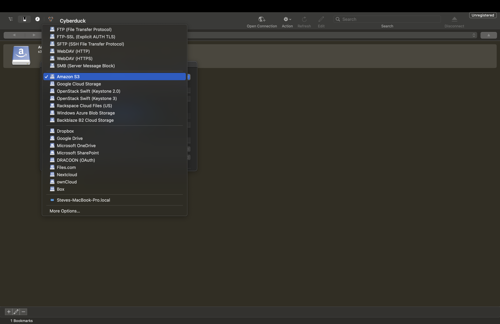
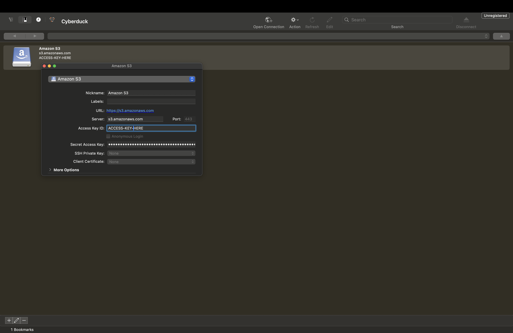
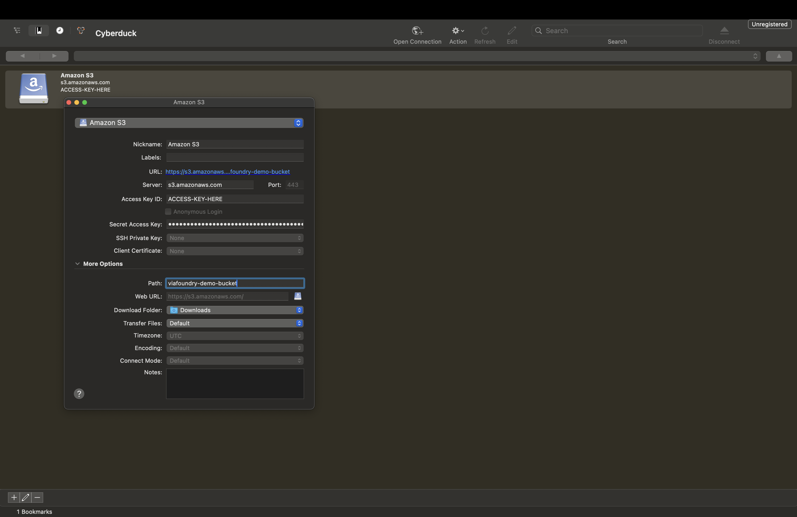
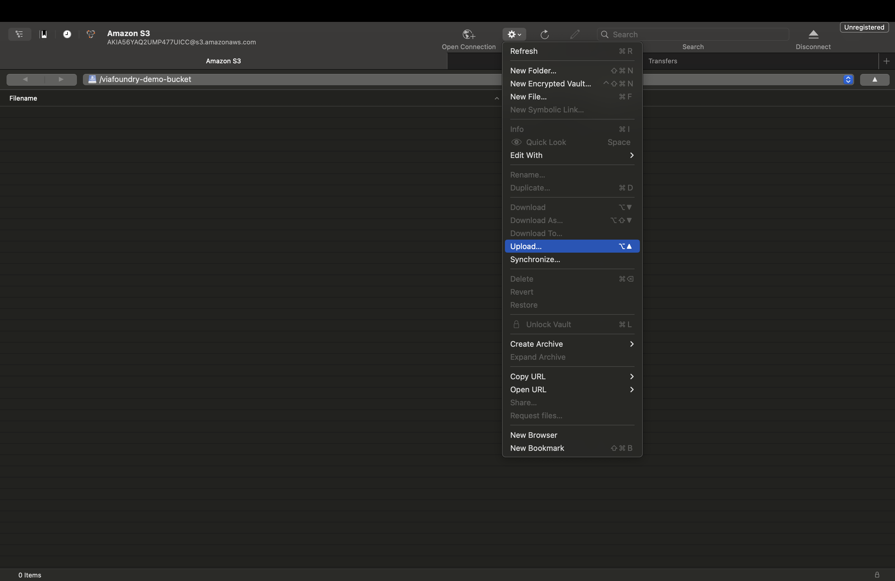

# Data Guide

The Data Guide is your go-to resource for learning how to efficiently connect and manage your data with Via Foundry. Whether you're integrating data from external sources or uploading local datasets, Via Foundry has you covered. In this section, we'll walk you through the various features and methods Via Foundry offers for seamless data integration.

## Connect to your Data in the Cloud

### Integrate your Cloud with Foundry xCloud

With Foundry [xCloud](https://www.viascientific.com/products/), deploying Via Foundry in your AWS or GCP account has never been easier. Leveraging xCloud, you can set up Via Foundry in your existing cloud environment. This setup allows you to maintain your cloud infrastructure in AWS and Google Cloud while taking advantage of the the robust, feature-rich Via Foundry experience .

Want to get started with Foundry xCloud? Reach out to our support team at <support@viascientific.com>, and we'll get you started.

### Connect your Cloud with Foundry vCloud

For users seeking greater control of data management we allow you connect your private S3 or Google bucket to Via Foundry [vCloud](https://www.viascientific.com/products/) product. Reach out to support to get started, `support@viascientific.com`.

## Upload from your computer

### Prerequisites

Install AWS CLI following the instructions [here](https://docs.aws.amazon.com/cli/latest/userguide/install-cliv2.html).

### Using CLI using `aws cli`

#### Step-by-Step Instructions:

1. **Contact Support**:
     * Before you begin, contact Via Scientific support at `support@viascientific.com` to obtain:
     * **Bucket Name**
     * **AWS Credentials** (Access Key and Secret Key)

2. **Configure AWS CLI**:
     * Open your terminal or command prompt.
     * Run the following command to configure your AWS CLI with the credentials provided by support:
     ```bash
     aws configure
     ```
     * Enter the Access Key ID, Secret Access Key, and region when prompted.
         * Set `us-east-1` as the region

3. **Prepare Your Data**:
    * Ensure your data files are ready for upload. Organize them in a directory on your local machine.

4. **Upload Data to S3 Bucket**:
     * Use the `aws s3 cp` command to upload your data. Replace `<bucket-name>` with the bucket name provided by support and `<file-path>` with the path to your data file or directory.
     * For a single file:
     ```bash
     aws s3 cp <file-path> s3://<bucket-name>/
     ```
     * For a directory (uploads all files within the directory):
     ```bash
     aws s3 cp <directory-path> s3://<bucket-name>/ --recursive
     ```

5. **Verify Upload**:
     * List the contents of your S3 bucket to verify that your files have been uploaded successfully:
     ```bash
     aws s3 ls s3://<bucket-name>/
     ```

#### Example:
If you have a file `data.csv` and a bucket name `via-foundry-bucket`, your commands will look like this:
```bash
aws s3 cp data.csv s3://via-foundry-bucket/
aws s3 ls s3://via-foundry-bucket/
```

### Using Cyber Ducker

Cyberduck is an open-source file transfer client for Mac and Windows that supports various protocols, including FTP, SFTP, WebDAV, and cloud storage services such as Amazon S3, Google Drive, Dropbox, and Microsoft OneDrive. It is known for its user-friendly interface, which allows users to connect to and manage files on remote servers or cloud storage accounts easily.

You can use Cyber Duck to upload data to Via Foundry. This walkthrough assumes a Mac installation, but similar steps apply to Windows installation.

#### Prerequisites:

Download Cyber Duck for your platform. Follow the instructions [here](https://cyberduck.io/download/)

#### Step-by-Step Instructions:

1. **Contact Support**:
     * Before you begin, contact Via Scientific support at `support@viascientific.com` to obtain:
         * **Bucket Name**
         * **AWS Credentials** (Access Key and Secret Key)
     * Remember these credentials you'll need them later

2. **Launch Cyber Duck**
    - 
3. **Select S3 Bookmark**
    - 
4. **Enter AWS access key and Secret access key**
    - Enter the AWS credentials you received from support.
    - 
5. **Enter Bucket**
    - Enter the bucket name you received from support.
    - 
6. **Upload Data**
    - Select the settings cog
    - Select "Upload..." from the menu
    - Select a file from your local machine
    - 
