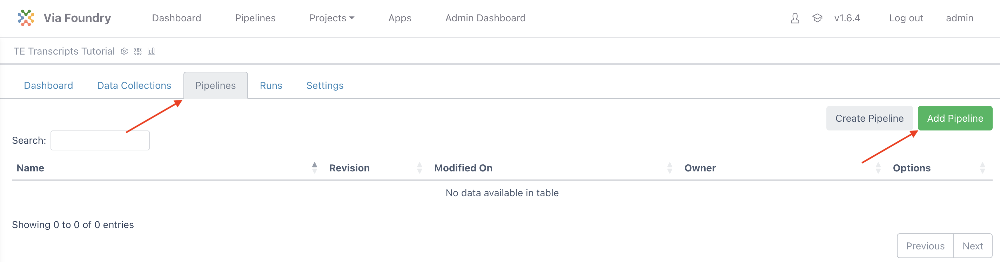
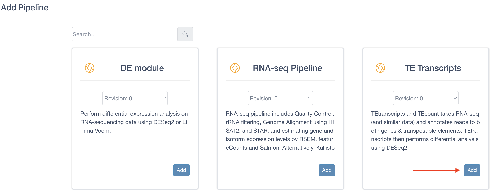
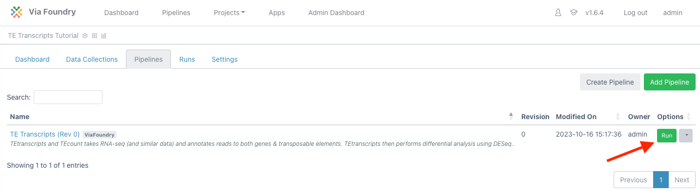
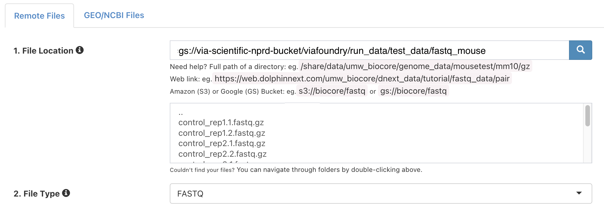
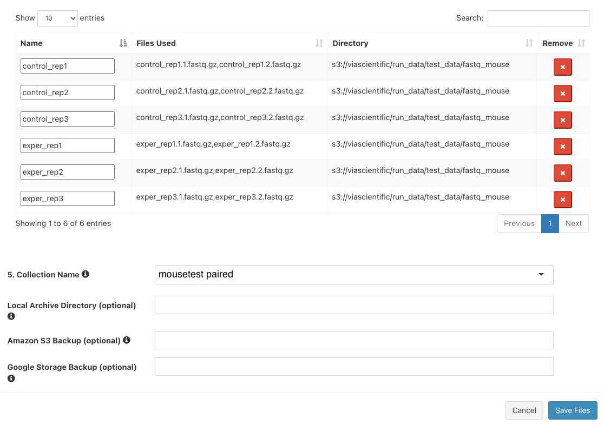
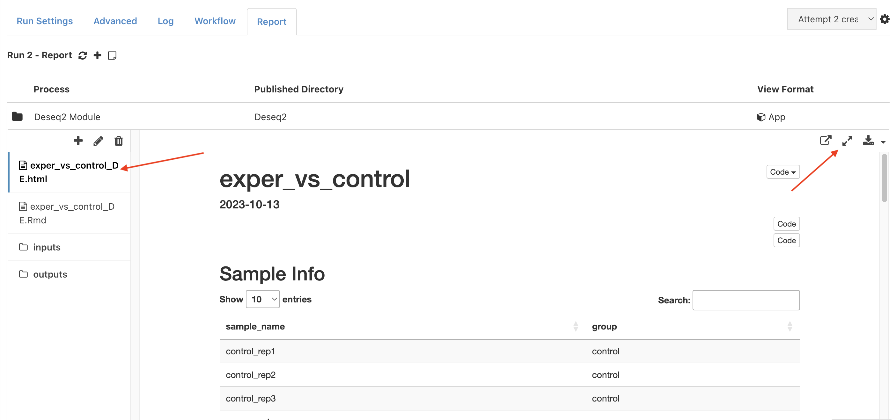

Expected learning outcome
========

To understand the basics of running a pipeline in Foundry by running the TE Transcripts analysis pipeline on sample mouse data.

# Before you start

Please go to <https://www.viafoundry.com> and login into your account. If you have any issues logging in, please let us know (support@viascientific.com) and we will help to create an account for you.

Creating a Project
========
In Foundry, analysis is organized by project. Each run belongs to a project and a project can consist of multiple runs.

Once logged in, to create and configure a new project click on the `Projects` tab in the top menu and select `Add a New Project` button in the dropdown. In the pop-up, give the project a name (e.g. `TE Transcripts Tutorial`) and click save.


Attaching Pipeline to Project
========
To help with organization, pipelines used in a project are attached to that project.

**Note:** The same pipeline can be attached to multiple projects.

 To attach a pipeline select the `Pipelines` tab and then click the `Add Pipeline` button. 



Locate `TE Transcripts`, click on the `Add` button, and then close the window.



Creating a Run
========
Once the project is created and a pipeline is attached, you are ready to create a run:

1. Click the `Run` button next to the `TE Transcripts` entry in the table to load the "Run Page"

    

2. On the run page, under "Run Environment" select `viafoundry`
3. In the Inputs section, next to `FASTQ Input`, click `Enter File`
4. In the files tab, click `Add File` button to enter new files.
5. Next to "1. File Location", enter:

	```
	gs://via-scientific-nprd-bucket/viafoundry/run_data/test_data/fastq_mouse
	```

6. Click the magnifying glass icon. The box below will populate with files like so:

    

7. In the `3. Collection Type` dropdown, select `Paired List`
8. Under `4. File Pattern`, next to `Forward Pattern`, enter `.1`. Similarly, enter `.2` for `Reverse Pattern`.

    

9. Click `Add All Files` button. You should now see 6 entries below.

    

10. Next to `5. Collection Name`, enter `mousetest paired`. The final three boxes can be left blank. Click `Save Files`
11. The "Select/Add Input File" screen will now have 6 entries. Click "Save".
12. For "Library Type", select `pair`
13. For "Genome Build", select `mouse`
14. For "Groups file", click `Enter File`
15. In the "File Location", enter:

	```
	gs://via-scientific-nprd-bucket/viafoundry/run_data/test_data/fastq_mouse_metadata/groups.tsv
	```

16. Click `Save`
17. For "Comparison file", click `Enter File`
18. In the "File Location", enter:

	```
	gs://via-scientific-nprd-bucket/viafoundry/run_data/test_data/fastq_mouse_metadata/comparisons.tsv
	```

19. Click `Save`
20. Leave the rest of the inputs as defaults
21. Click `Run` in the top right and then select `Start`. For this dataset, the TE Transcripts pipeline run typically takes several minutes to complete.
22. Navigate to the Log tab and click on log.txt to follow the progress of your run.
23. Once the status bar in the top right changes from a blue "Running" status to a green "Completed" status go to the Report tab to see the final reports.
24. Click on `Deseq2` to open the "Differential Expression" section. Select the first file on the left tab (exper_vs_control_DE.html). This is a differential expression report for the comparison. The report can be expanded to fit the full screen with the button on the top left.

    
    
25. Launch the `GSEA Explorer` application by clicking the second file on the left tab (exper_vs_control_DE.Rmd) and then click `Launch`

**Note:** For the purposes of speeding up the runtime of this tutorial, the demo dataset has been downsampled to only include a few genes. Differential expression analysis graphs and Gene Set Enrichment Analysis graphs will look very sparse with this dataset.

Congratulations! You have run and tested the TE Transcripts pipeline on Foundry!
