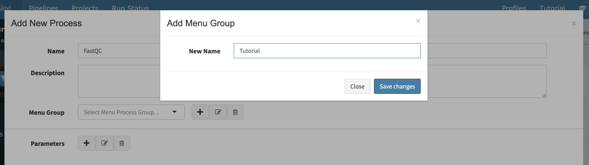
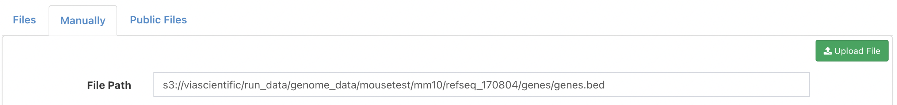
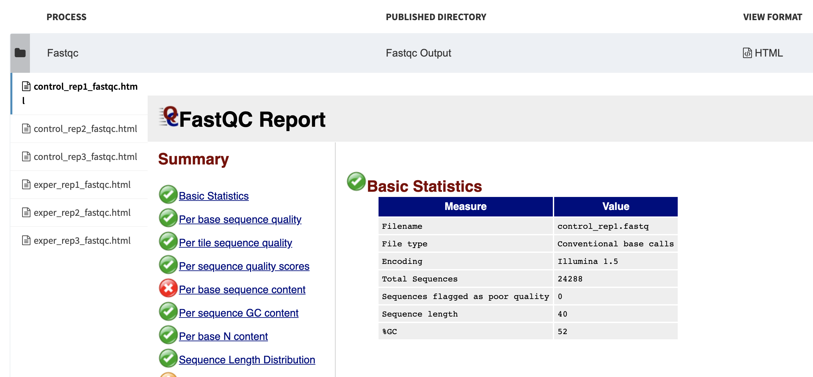

## Introduction

Via Foundry is an easy-to-use, intuitive platform for creating, deploying, and executing complex multi-omics pipelines for high-throughput data processing.

## Foundry provides: 

1. A drag and drop user interface to build nextflow pipelines
2. Reproducible pipelines with version tracking 
3. Seamless portability to different computing environments with containerization
4. Simplified pipeline sharing using GitHub (github.com)
5. Support for continuous integration and tests (travis-ci.org)
6. Easy re-execution of pipelines by copying previous runs settings
7. Integrated data analysis and reporting interface with R markdown support

**All with the intentions of:**

1. Reusability
2. Reproducibility
3. Shareability
4. Easy execution
5. Easy monitoring
6. Easy reporting


## Expected learning outcome

To understand the basics of Foundry, including how to use Foundry's pipeline builder to suit a diverse array of needs, and to familiarize yourself with Nextflow and some standard software packages for analysis therein. This guide will walk you through how to start using Foundry's comprehensive repository of ready-made pipelines, as well as the process of creating new pipelines.

## Before you start

Please go to [Via Foundry's home page](https://viafoundry.com) and log into your account. If you encounter issues while logging in, please let us know about it by emailing support@viascientific.com, and we will set up an account for you.

## Exercise 1 - Creating processes

### Setting Up

Once you're logged in, click on the `Projects` section at the top menu and click the `Add a New Project` button. Here is where you can readily configure your project. To begin editing your project, you'll need to add a pipeline to its configuration - more on that later, but for now, just follow these instructions to instantiate a simple pipeline that you'll fill in later on in the tutorial. To access the pipeline builder page, just click the `Pipelines` tab and then click the `Create Pipeline` button. 


Now you can write a descripton about your pipeline using the `Description` tab, start developing your pipeline with the `Workflow` tab, and add extra files or set some extra parameters using the `Advanced` tab. Now, let's get into some details about the pipeline elements themselves.


### What is a "process"?

A process is a basic programming element in Nextflow, designed to run user scripts. Please [click here](https://www.nextflow.io/docs/latest/process.html) to learn more about Nextflow's processes.

A process usually has inputs, outputs and script sections. In this tutorial, we'll go through the simple procedure needed to define a process. During this procedure, you'll see data (the necessary name, menu group, inputs, outputs, and script of a given process) formatted as it is in the top screenshot on the left side of the image below. Simply copy that information into the relevant fields of the "Add New Process" form, depicted in the middle screenshot below, and Foundry will convert the information into a Nextflow process (shown at right below), at which point it will be ready to run in your pipeline. For your convenience, the mapping between corresponding sections of the tutorial info, the Foundry process creation screen, and the automatically created Nextflow script is shown by sets of colored rectangles in the image below.   


Over the course of this exercise, we'll build three processes from scratch: a FastQC process, a Hisat2 process, and an RSeqC process.

Once you're on the dashboard page for your new test pipeline, you’ll notice several buttons in the menu on the left-hand side of the page. New processes are created by clicking the blue `New process` button {: width="4%"}.

### 1. FastQC process

**a.** First, please click the blue `New process` button {: width="4%"} in the left menu to open the `Add New Process` window.

**b.** In the `Name` field, enter "FastQC", and when prompted to select a menu group, define a new one, called "Tutorial". 



**c.** To execute the FastQC process, here are all the arguments needed for each field on the `Add New Process` screen:

```
Name: "FastQC"
Menu Group: "Tutorial"
Inputs: 
  reads(fastq,set) name: val(name),file(reads)
  
Outputs: 
  outputFileHTML(html,file) name: "*.html"
  
Script:
  fastqc ${reads}
```  

**d.** Let's select input and output parameters (`reads` and `outputFileHTML`, respectively) and define their "Input Names" that we are going to reference in the script section.


 
**e.** In the `Script` section, enter:

``` 
fastqc ${reads}
```


**f.** Press the `Save changes` button at the bottom of the module to create the process. Now, simple as that, this process is ready to use. We'll put it on the backburner for now, but rest assured, it will be used soon when creating a custom pipeline in Exercise 2.

### 2. Hisat2 process

Now, let's create the Hisat2 process. 

**a.** First, as before, please click the blue `New process` button to open "Add New Process" module.

**b.** Inputs, outputs and scripts should be defined like they are here:

```
Name: "Hisat2"
Menu Group: "Tutorial"
Inputs: 
  reads(fastq,set) name: val(name),file(reads)
  hisat2Index(file) name: hisat2Index
      
Outputs: 
  mapped_reads(bam,set) name: val(name), file("${name}.bam")
  outputFileTxt(txt,file) name: "${name}.align_summary.txt"

Script:
  basename=\$(basename ${hisat2Index}/*.8.ht2 | cut -d. -f1)
  hisat2 -x ${hisat2Index}/\${basename} -U ${reads} -S ${name}.sam &> ${name}.align_summary.txt
  samtools view -bS ${name}.sam > ${name}.bam 

```

**c.** After you select input (`reads` and `hisat2Index`) and output parameters (`mapped_reads` and `outputFileTxt`), add their names and enter the script. Once you've done so, the page should look like this:


**d.** Just as you did with the FastQC process, please save your changes before closing the window.

### 3. RSeQC process

**a.** Again, please click the blue `New process` button to open the `Add New Process` module.

**b.** Fill out the `Add New Process` screen as such, making sure that the file types and qualifiers (more info [here](process.md#parameters)) are exactly as specified:

```
Name: "RSeQC"
Menu Group: "Tutorial"
Inputs:
  mapped_reads(bam,set) name: val(name), file(bam)
  bedFile(bed,file) name: bed
  
Outputs: 
  outputFileTxt(txt,file) name: "RSeQC.${name}.txt"
  
Script:
  read_distribution.py  -i ${bam} -r ${bed}> RSeQC.${name}.txt
```

**c.** Once you enter in the information pertaining to the input parameters, output parameters, and script, the page should look like this:


**d.** Once the process looks like the one above, save your changes before you close the screen.

Now, you've finished Exercise 1, with three shiny new processes to show for it. Keep following along with Exercise 2 to build the pipeline using the processes you just created. 

## Exercise 2 - Building a pipeline

Before you start building the pipeline, make sure you have your newly minted processes available in your Process Menu by clicking the `Tutorial` dropdown menu under the `Processes` section on the left-hand side menu.

{: width="20%"}


**a.** At the top of the pipeline dashboard page, you’ll notice a `Pipeline Name` box. You can rename your pipeline by clicking here and entering your desired name for it (e.g. "RNA-Seq-Tutorial") and pressing the `Save` button or simply clicking outside of the box.

{: width="70%"}

**b.** Click on the `Workflow` tab underneath your pipeline's name. From here, you can utilize Foundry's intuitive drag-and-drop interface to add the processes you just made to the pipeline. Click the `Tutorial` dropdown menu in the `Processes` section on the left side of your screen, where you should see each of your new processes. Now, simply drag and drop FastQC, Hisat2 and RSeQC to your workspace. The workflow should now look something like this:

{: width="70%"}


**c.** Now, drag and drop three `Input Parameters` (shown at the top of the left-side menu) into the workflow. You can change their names by clicking the `Edit` button (shaped like a pencil and on the left of the parameter's circle) and entering a new name when prompted. Please change your new input parameters' names to `Input_Reads`, `Hisat2_Index` and `bedFile`, respectively, and connect them to their corresponding processes as such:

{: width="30%"}


**d.** Note that your Hisat2 process has a "mapped_reads" output parameter, and your RSeQC process has a "mapped_reads" input parameter. To connect parameters with compatible types, just click on the relevant nodes of each parameter. For example, to connect the Hisat2 and RSeQC processes, click on the Hisat2 "mapped_reads" output node, then the RSeQC "mapped_reads" input node. Please do so. At this stage, your workflow should look identical to the one above.

**e.** Next, drag and drop three `Output Parameters` from the sidebar: 

{: width="30%"}


You should name these output parameters `FastQC_output`, `Hisat2_Summary`, and `RSeQC_output`, respectively, and connect them to their corresponding processes. While naming them, check off their `Publish to Web Directory` field and choose the right output format from the dropdown menu according to the output type of the process. As shown below, the FastQC_output parameter should be in an HTML format, and both the RSeQC_output and Hisat2_summary parameters should be in a Text format.
 
{: width="50%"}
{: width="50%"}
{: width="50%"}

**f.** At this point, the overall pipeline should look like it does below:


Now you're ready to run your first pipeline!

## Exercise 3 - Executing a pipeline

  **1.** Once a pipeline has been created, you'll see a green `Run` button at the top right of the page.

{: width="20%"}


  **2.** This button opens a new window, where you can select your project by clicking on its name. At this point, you'll be prompted to enter a name for your run, which will catalog the run in your project. From here, clicking `Save run` will automatically redirect you to the run page, where you can initiate your run.


  **3.** Here, please choose your `Run Environment` as "Via Demo Environment(AWS Batch)"
  


  **4.** Then, click on the `Advanced` tab at the top of the page. Under the `Run Container` header, click `Use Docker Image` and enter the `Image Path` below;
  
```
Run Container:
Use Docker Image: Checked
Image Path: public.ecr.aws/t4w5x8f2/viascientific/rnaseq:3.0

```  


  **5.** Now, we are ready to enter the inputs we defined for the pipeline. 
  Click the `Run Settings` tab to enter values for all your input parameters. First, click `Enter file` next to the bedFile parameter. Click on the **Manually** tab at the top of the pop-up window and enter the following filepath:
  
```
bedFile:  s3://viascientific/run_data/genome_data/mousetest/mm10/refseq_170804/genes/genes.bed
```




**6.** Once you've saved the bedFile path, enter the Hisat2_Index directory. Again, please use the **Manually** tab to enter the following filepath: 
```
Hisat2_Index: s3://viascientific/run_data/genome_data/mousetest/mm10/refseq_170804/Hisat2Index
```


#### Creating Collection
**7.**  To enter the appropriate Input_Reads files, click its `Enter File` button. From here, go to the **Files** Tab and click the green `Add File` button, located in the top right.


**8.**  Enter the below file location and click the **Search** button (represented by a magnifying glass) to get the list of files: 

```
s3://viascientific/run_data/test_data/fastq_mouse_single
```


**8.** In the **Collection Type** dropdown menu, select `Single List`, then press the `Add All Files` button at the bottom of the page.

**9.** Here, there's an additional option to change the file names, but for our purposes here, we'll just keep them as they are. Enter an arbitrary collection name and click `Save Files`.
```
Collection name: Test Collection (this name is arbitrary)
```


**10.** In the next screen, you can still add or remove some samples to be analyzed. Let's click the checkbox at the top left of the file table, then the `Save File` button, to process all samples.


#### Running Your Pipeline
**11.** After all the input values have been initialized, the orange `Waiting` button at the top right should change to a green `Run` button. Now, you can press that button to start your run.

**12.** This run should finish in only a couple of minutes. When the run ends, the `Log` section of the runpage will look something like this:

  **a. Logs**:
  This constantly up-to-date log keeps track of the submission of each process and the execution of the overall pipeline, with error messages if/whenever something goes awry.

  


  **b. Timeline**:
  This visualization chronologically shows the time and memory consumed by each process.

  

#### Reports

**13.** In the runpage's `Report` section, you're able to see interactive and insightful reports generated based on the output parameters specified in your processes:

  **FastQC**
  


  **Hisat2**
  


  **RSeQC**
  


## Wrapping Up

And that's it! You've created your first pipeline in Via Foundry. If you have any questions, please contact us at support@viascientific.com.


