## Expected learning outcome

To understand the basics of Metadata Tracking System.

## Before you start

Please go to <https://www.viafoundry.com> and login into your account. If you have an issue about login, please let us know about it (support@viascientific.com). We will set an account for you.

## Creating Project and Adding Metadata Tracker

Once logged in, click on the `Projects` section at the top menu and click `Add a New Project` button. Enter your project name and click OK. This is the place to configure your project. Click on the `Settings` tab and click on `Create Metadata Tracker` button to add `Metadata` tab into your project. 

   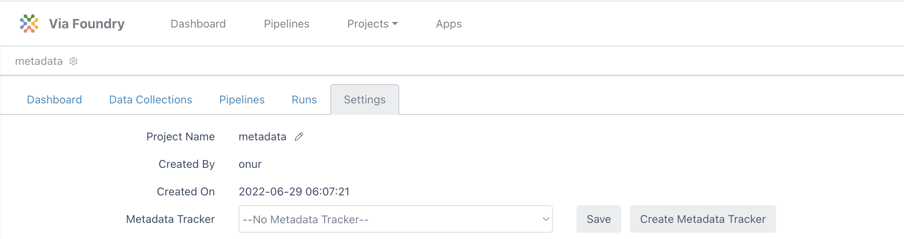

Click on the `Metadata` tab. This window is the `Data View` section of the Metadata tracker where you will insert your data. Before inserting new data, we need to configure the database structure. To start configuring click on the "Configure Metadata" button at the right. 

   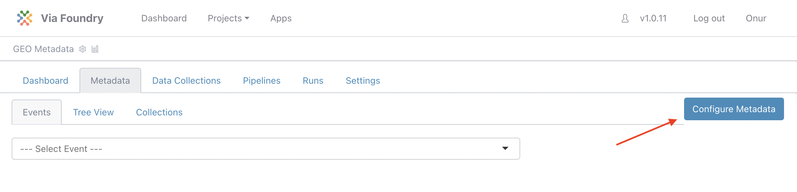

## Configuring Metadata Tracker

1. In this configuration window there are a couple of tabs available:

      - All Collections: List of project collections(tables).
      - All Events: List of events that are defined for Data view.
      - Tree View: Shows your project collections(tables) in tree visualization.
      - Templates: Predefined collections to import into your project

      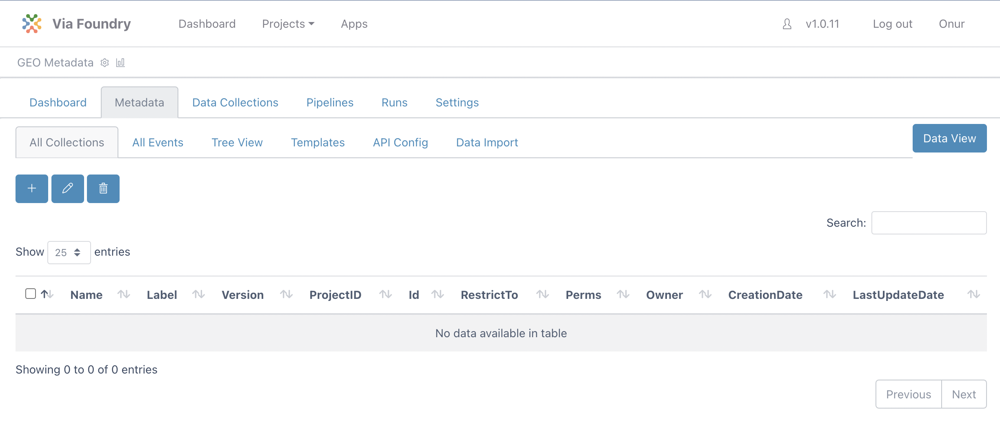


2. Please click the `Templates` tab to import predefined collections. Select all the collections by clicking checkboxes. After choosing them, click the `Import Collection` Button.

      

3. Now you can revisit `All Collections` and `Tree View` Tabs to see imported collections and their relationships.

      
      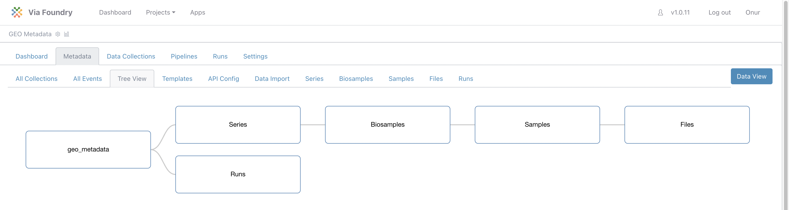

4. If you click each `Series` tab, you will see the columns defined for the `Series` collection. The NamingPattern feature is defined for the id column to set a unique id for each inserted value. Since the pattern is `SE-${AUTOINCREMENT}`, new data will have the following ids: SE-1, SE-2, etc.

      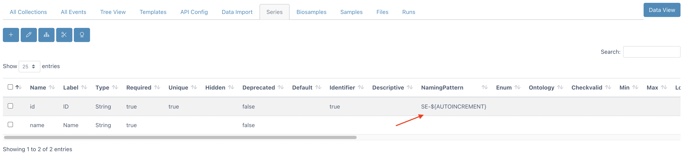

5. Now click on the `Biosamples` tab to see its columns. Type of the series_id column is `mongoose.Schema.ObjectId` which means that this value will be referencing data in another collection. If you scroll to the right, you will see the ref column is set to `{yourProjectID}_series`, therefore it is referencing data in series collection in this project. By using this referencing method, we don't need to enter series details each time we insert data into the `Biosamples` collection. Instead, we will reference the data in the `Series` collection.

      


6. Similarly `Samples` collection referencing data in `Biosamples` collection and `Files` collection referencing `Samples` collection. You can visualize their relationship in the `Tree View` tab.

      


7. To add new columns to the Biosamples collection, click the plus button located at the top left corner.

      | New Column Name      | New Column Label       | 
      | :----:      |    :----:              |    
      | Organism          | Organism          | 
      | Treatment          | Treatment          | 
      | Tissue          | Tissue          | 

      Enter new name and label values using the table above and click save button. You can see the example for the `Organism` column below.

      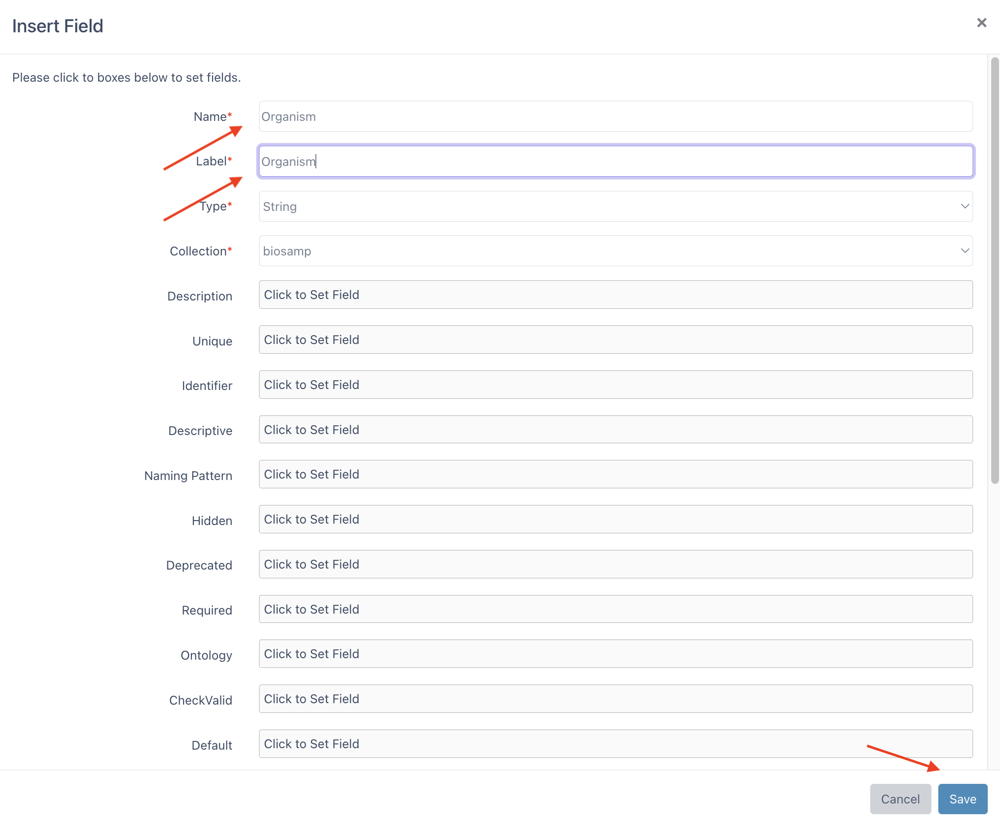


      This should create the following database structure:

      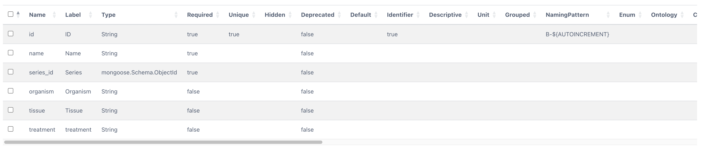


      ```
      * Note: The name column has been normalized to lowercase.
      ```
        

8. Lets, enter new columns into Samples collection by clicking the plus button at the top left. Enter new name and label values using the table below.

      | New Column Name      | New Column Label       | 
      | :----:      |    :----:              |    
      | Assay Type            | Assay Type            |
      | Instrument          | Instrument          | 

      Expected database structure of sample collection:

      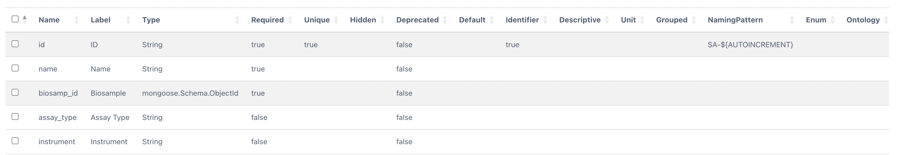

9. Now we're ready to insert metadata. Click on the "Data View" Button, Located right handside of the tabs menu. 

## Importing Metadata

1. Click the `Collections` Tab and select `Series` Collection from dropdown. 

      


2. Click the Insert button to enter Demo Project into the name field using the form. After that, click the save button. 

      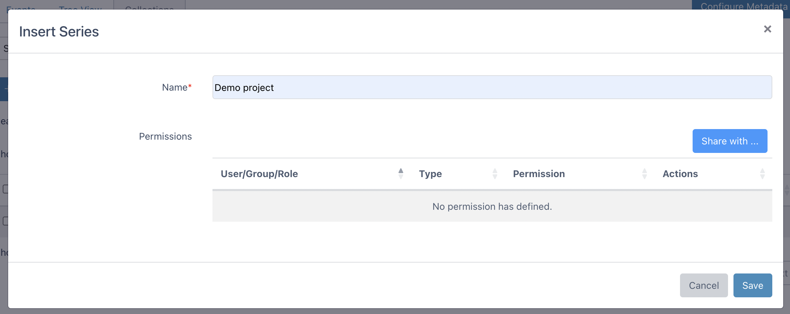

3. Importing Biosamples: Go to the collection dropdown and change its value to `Biosamples`. This time we will insert 6 Biosamples using Spreadsheet view. Click the `Edit in Spreadsheet` button. 

      

4. You will see an empty Excel sheet with table headers. 

      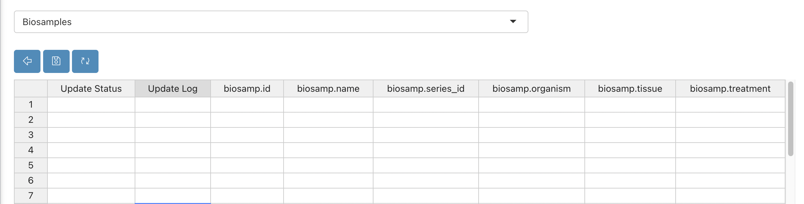


5. Copy and paste the example data from here: <a href="../../metadata_basic_files/Biosamples_data.xlsx" download="Biosamples_data.xlsx"> biosamples data</a> to this empty sheet as shown below:

      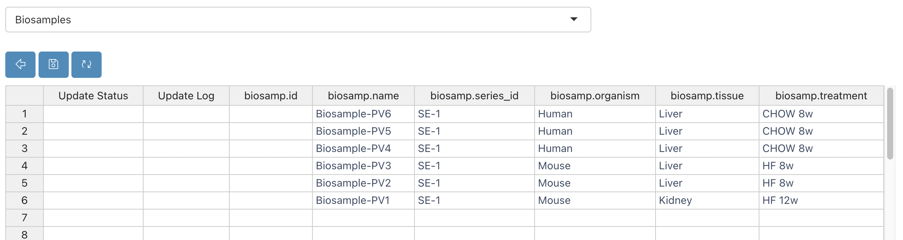


      ```
      Note: `series_id` column values belong to Series Collection IDs.
      ```

6. It will show the rows that are going to be inserted/updated in yellow. Click the `Save` button at the top left.

      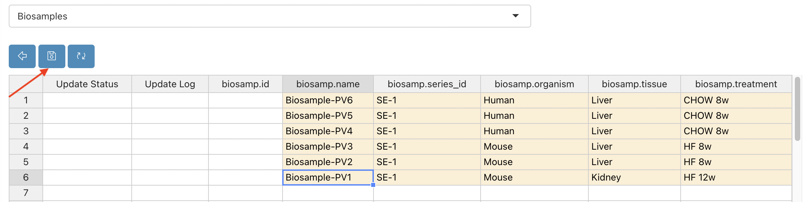


7. It will insert the rows as follows and the status of the operation will be shown at the left side.

      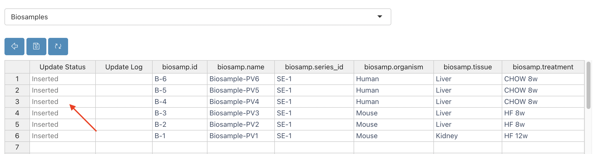


8. Now you can return to table view by clicking the button below:

      


9. Importing Samples: Switch to `Samples` collection by using collection dropdown. Similar to the biosamples collection, click the `Edit in Spreadsheet` button. Copy and paste the example <a href="../../metadata_basic_files/Samples_data.xlsx?raw=true" download="Samples_data.xlsx"> here.</a>:

      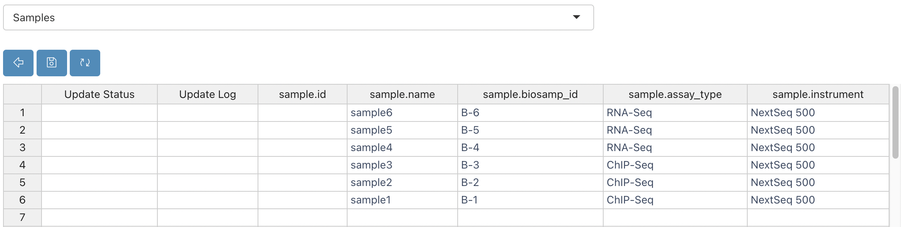


      ```
      Note: `Biosamp_id` column values belong to Biosample Collection IDs.
      ```

10. Go to the collection dropdown and change its value to `Files`. This time click on the `Insert` Button. Then enter the following information:
      - Enter the Directory: `https://web.dolphinnext.com/umw_biocore/dnext_data/tutorial/fastq_data/pair` and click the search button. This will list all the files on that location.
      - File Type: FASTQ
      - Collection Type: `Paired List`
      - Enter the R1 Pattern: `.1`
      - Enter the R2 Pattern: `.2`

      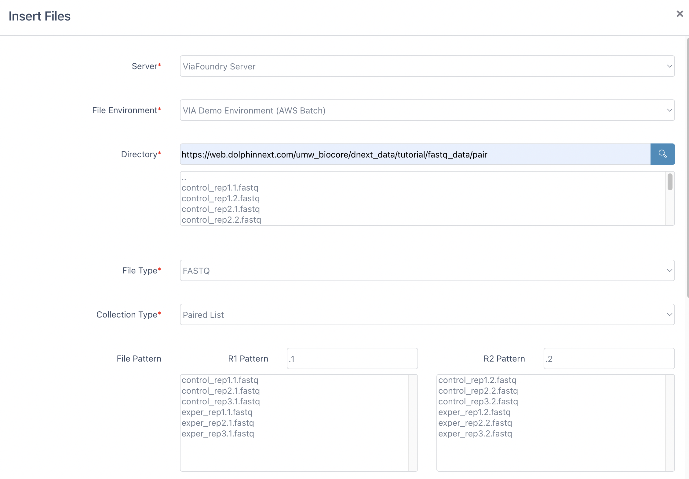

      - Click `All Files` button
      - Select the Sample1 (SA-1)
      - Click Save button.

      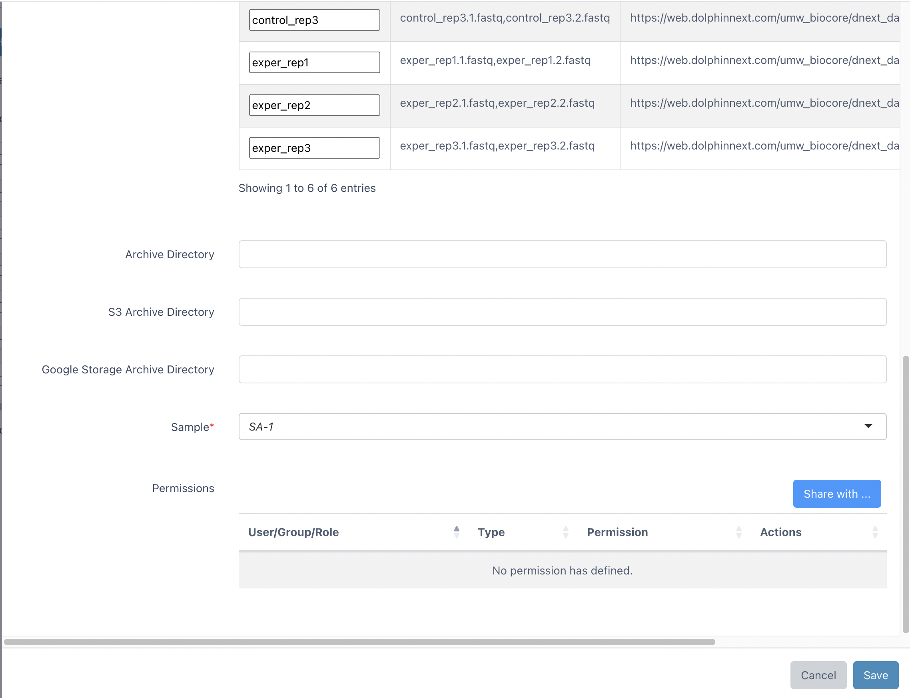

11. Here we have assocaited all of the files with Sample1 (SA-1). To edit these files, you can click `Edit in Spreadsheet` button as follows and click the `Save` button:

      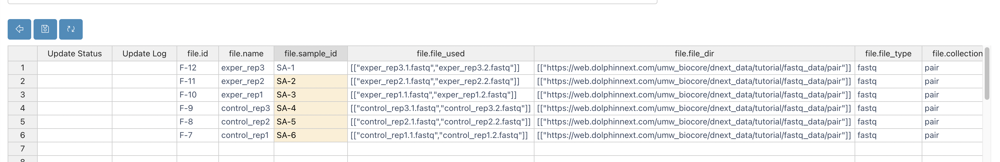


## Submitting a Foundry Run

1. You can use entered files in run submission. To simplify new run entry, we will create new Event in configuration section. While creating this event we will select only subset of Run Collection fields which will simplify the run submission process. To do that, click `Configure Metadata` button at the right. 

2. Click `All Events` tab and click `Insert` button. Enter `Event Name` as `New Run` and fill up the Event Form like following:

      - Collection: Runs
      - Field: Name
      - Field: Server
      - Field: Run Environment
      - Field: Template Run ID
      - Field: Project ID
      - Field: Inputs
      - Field: Outputs
      - Field: Run Url

       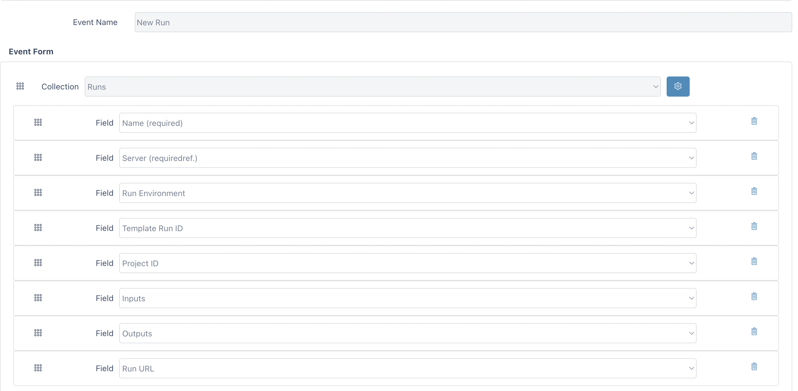

3. Click the `Save` Button to save new event. Now we're ready to submit a run. Click on the "Data View" Button, located right handside of the tabs menu. 

4. Under Events tab, select `New Run` option. Enter the following information:
      - Name: Your run name
      - Submission Type: Standard
      - Server: Viafoundry Server
      - Run Environment: Via Run Environment (AWS Batch)
      - Template run id: Enter your previous run id or enter 1 to use our demo run as template.
      - Inputs: Click `Select File` Button and use checkboxes to select your files.
      - You can change other input values according to your needs.

      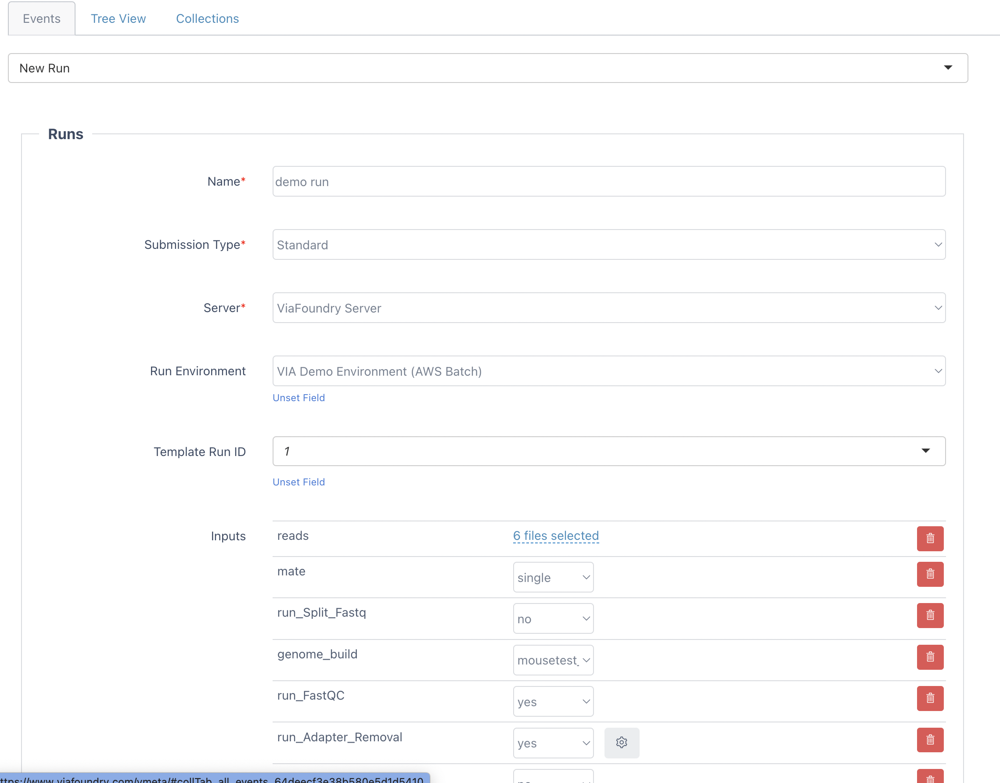


5. Click the `Save` button. This will submit your run. You can track your run status on the dashboard.

Congratulations! You have configured a metadata tracker for your project and submit a run into Foundry!


