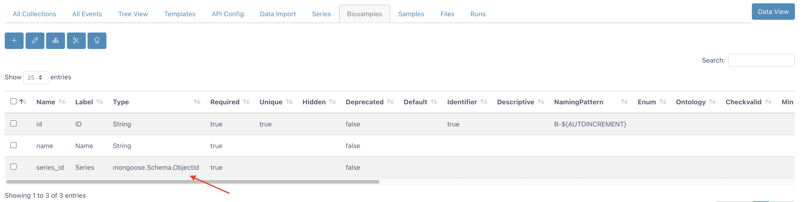
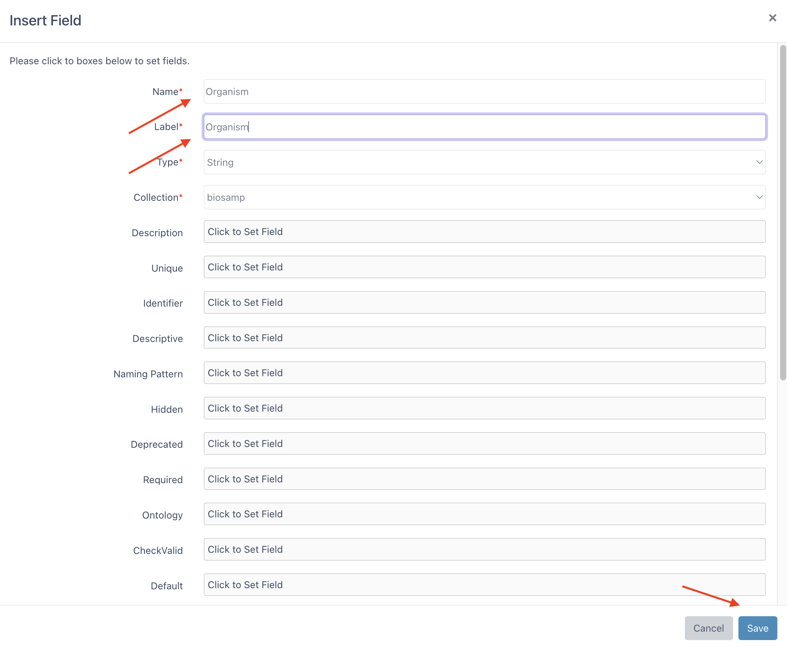
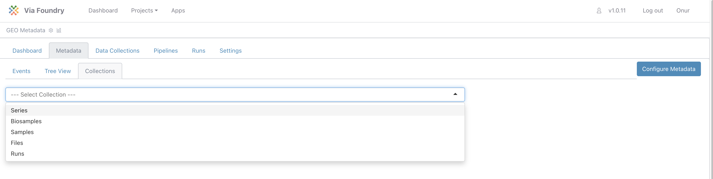

## Expected learning outcome

To understand the basics of Metadata Tracking System, and import sample GEO metadata.

## Before you start

Please go to https://www.viafoundry.com and login into your account. If you have an issue about login, please let us know about it (support@viascientific.com). We will set an account for you.

## Creating Project and Adding Metadata Tracker

Once logged in, click on the `Projects` section at the top menu and click `Add a New Project` button. Enter your project name and click OK. This is the place to configure your project. Click on the `Add Metadata Tracker` icon to add a new `Metadata` tab into your project. 

   

Click on the `Metadata` tab. This window is the `Data View` section of the Metadata tracker where you will insert your data. Before inserting new data, we need to configure the database structure. To start configuring click on the "Configure Metadata" button at the right. 

   

## Configuring Metadata Tracker

1. In this configuration window there are a couple of tabs available:

      - All Collections: List of project collections(tables).
      - All Events: List of events that are defined for Data view.
      - Tree View: Shows your project collections(tables) in tree visualization.
      - Templates: Predefined collections to import into your project

      


2. Please click the `Templates` tab to import predefined collections. Select all the collections by clicking checkboxes. After choosing them, click the `Import Collection` Button.

      

3. Now you can revisit `All Collections` and `Tree View` Tabs to see imported collections and their relationships.

      
      

4. If you click each `Series` tab, you will see the columns defined for the `Series` collection. The NamingPattern feature is defined for the id column to set a unique id for each inserted value. Since the pattern is `SE-${AUTOINCREMENT}`, new data will have the following ids: SE-1, SE-2, etc.

      

5. Now click on the `Biosamples` tab to see its columns. Type of the series_id column is `mongoose.Schema.ObjectId` which means that this value will be referencing data in another collection. If you scroll to the right, you will see the ref column is set to `{yourProjectID}_series`, therefore it is referencing data in series collection in this project. By using this referencing method, we don't need to enter series details each time we insert data into the `Biosamples` collection. Instead, we will reference the data in the `Series` collection.

      


6. Similarly `Samples` collection referencing data in `Biosamples` collection and `Files` collection referencing `Samples` collection. You can visualize their relationship in the `Tree View` tab.

      


7. Let's visit NCBI SRA Run Selector (https://www.ncbi.nlm.nih.gov/Traces/study/) to download sample project metadata. Enter `GSE196908` into the `Accession` field and click the search button.

      


8. Click on the `Metadata` button to download comma separated metadata files. 
   
      


9. To visualize the file in excel or another spreadsheet viewer, change the file extension to csv.

      ``` 
      SraRunTable.txt -> SraRunTable.csv
      ```

10. Open the file to check its content.

      


11. Lets distribute these column headers into 4 groups (series, biosamples, samples, file) to prevent repetition and save into our project.

      | series      | biosamples        | samples        |  files    |
      | :----:      |    :----:         |    :----:      |  :----:   |
      | BioProject  | BioSample         | Sample Name    |    Run    |
      |             | Organism          | Assay Type     |    |
      |             | source_name       | Library Name   |   |
      |             | TREATMENT         | LibraryLayout      |   |
      |             | weeks_treatment   | LibrarySelection      |    |
      |             |                   | LibrarySource     |    |
      |             |                   | Instrument     |    |
      |             |                   | Platform       |    |


12. Return back to Foundry Metadata tracker, and click the Series tab. Instead of auto increment values (SE-1, SE-2 etc,) using BioProject-ID for referencing would simplify our referencing strategy. While entering data, we will enter BioProject-ID into the name column and we want to save this entered value as `id`. Change the `NamingPattern` of `id` column as follows to save `name` value as `id`:

      | Column      | Field of change        | Old Value                 |  New Value            | 
      | :----:      |    :----:              |    :----:                 |   :----:              | 
      | id          | NamingPattern          | ```SE-${AUTOINCREMENT}``` | ```${series.name}```  |

    !!! note

        'series' is the name of the Series collection. Please check `All Collections` tab and Name and Label columns.


13. Similarly, to make `name` column a identifier for biosamples, click on Biosamples Tab and change the `NamingPattern` of `id` column as follows: 

      | Column      | Field of change        | Old Value        |  New Value        | 
      | :----:      |    :----:              |    :----:      |   :----:      | 
      | id          | NamingPattern          | ```B-${AUTOINCREMENT}```  | ```${biosamp.name}```    |  


    !!! note

        'biosamp' is the name of the Biosamples collection. All details listed in `All Collections` tab.

14. Insert new columns into Biosamples collection by clicking the plus button at the top left while in the Biosamples tab.

      | New Column Name      | New Column Label       | 
      | :----:      |    :----:              |    
      | Organism          | Organism          | 
      | source_name          | source_name          | 
      | TREATMENT          | TREATMENT          | 
      | weeks_treatment          | weeks_treatment          | 

      Enter new name and label values using the table above and click save button. You can see the example for the `Organism` column below.

      


      This should create the following database structure:

      


      ```
      * Note: the id column has been normalized to lower case.
      ```
        

15. Click Samples Tab and change the `NamingPattern` of `id` column as follows: 

      | Column      | Field of change        | Old Value        |  New Value        | 
      | :----:      |    :----:              |    :----:      |   :----:      | 
      | id          | NamingPattern          | ```SA-${AUTOINCREMENT}```  | ```${sample.name}```    |  

      ```
      * Note: 'sample' is the name of the Samples collection. 
      ```

16. Insert new columns into Samples collection by clicking the plus button at the top left. Enter new name and label values using the table below.

      | New Column Name      | New Column Label       | 
      | :----:      |    :----:              |    
      | Assay Type            | Assay Type            |
      | Library Name         | Library Name |
      | LibraryLayout          | LibraryLayout          | 
      | LibrarySelection          | LibrarySelection          | 
      | LibrarySource          | LibrarySource          | 
      | Instrument          | Instrument          | 
      | Platform          | Platform          | 

      Expected database structure of sample collection:

      


17. Click Files Tab and change the `NamingPattern` of `id` column as follows: 

      | Column      | Field of change        | Old Value        |  New Value        | 
      | :----:      |    :----:              |    :----:      |   :----:      | 
      | id          | NamingPattern          | ```F-${AUTOINCREMENT}```  | ```${file.name}```    | 


18. Now we're ready to insert metadata. Click on the "Data View" Button, Located right handside of the tabs menu. 

## Importing Metadata

1. Click the `Collections` Tab and select `Series` Collection from dropdown. 

      


2. Click on the `Insert` button to enter `PRJNA807693` into the name field using form. After that click the save button. 

      

3. Go to the collection dropdown and change its value to `Biosamples`. Since we will insert 99 Biosamples we will use excel import. Let's download the template excel file to facilitate import. Click the `Download Last Viewed Page as Excel file` button. You will see an empty excel sheet with table headers. If you like you can <a href="metadata_geo_files/Biosamples_template.xlsx?raw=true" download="Biosamples_template.xlsx">download the biosamples template here.</a>

      

      


4. Copy and paste the data in SraRunTable into this empty sheet as follows:

      


      ```
      Note: `BioSample` column in SraRunTable is copied to the `Name` column.
      ```

5. After saving this file, click on the `Import on Excel File` button. Drag and drop your Biosamples.xlsx file and click the `Load Table` button. If you prefer you can download and use <a href="metadata_geo_files/Biosamples.xlsx?raw=true" download="Biosamples.xlsx"> the pre-filled biosamples table here.</a>

      


6. It will show the rows that are going to be inserted/updated in yellow color. Click the Save button at the top left.

      


7. It will insert the rows as follows and the status of the operation will be shown at the left side.

      


8. Now you can return to table view by clicking the button below:

      


9. Switch to `Samples` collection by using collection dropdown. Similar to the biosamples collection, click the `Download Last Viewed Page as Excel file` button. Copy and paste the data in SraRunTable into this empty sheet as follows or you can download the samples template <a href="metadata_geo_files/Samples_template.xlsx?raw=true" download="Samples_template.xlsx">  here.</a>:

      


      ```
      Note: `Sample Name` column in SraRunTable is copied to the `Name` column.
      ```

10. After saving this file, click on the `Import on Excel File` button. If you prefer you can use samples table by <a href="metadata_geo_files/Samples.xlsx?raw=true" download="Samples.xlsx"> clicking here.</a> Drag and drop your Samples.xlsx file and click the `Load Table` button. Now you're ready to import sample data with the save button. Return back to the table view by clicking the `Show Table Format` button.

11. Go to the collection dropdown and change its value to `Files`. Click the `Download Last Viewed Page as Excel file` button or download <a href="metadata_geo_files/Files_template.xlsx?raw=true" download="Files_template.xlsx"> here </a> Copy and paste the data in SraRunTable into this empty sheet as follows or <a href="metadata_geo_files/Files.xlsx?raw=true" download="Files.xlsx"> download here </a>:

      


12. If you prefer you can use entered files in run submission. Select the `Runs` collection and click `Insert` button. 
      - Name: Your run name
      - Submission Type: Standard
      - Server: Viafoundry Server
      - Run Environment: Via Run Environment (AWS Batch)
      - Template run id: Enter your previous run id or enter 1 to use our demo run as template.
      - Inputs: Click `Select File` Button and use checkboxes to select your files.
      - You can change other input values according to your needs.

      


13. Click the save button. This will submit your run. You can track your run status on the dashboard.

Congratulations! You have configured a metadata tracker for your project and imported GEO data into Foundry!


