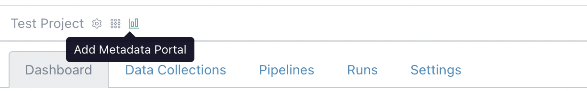
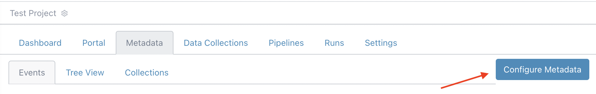
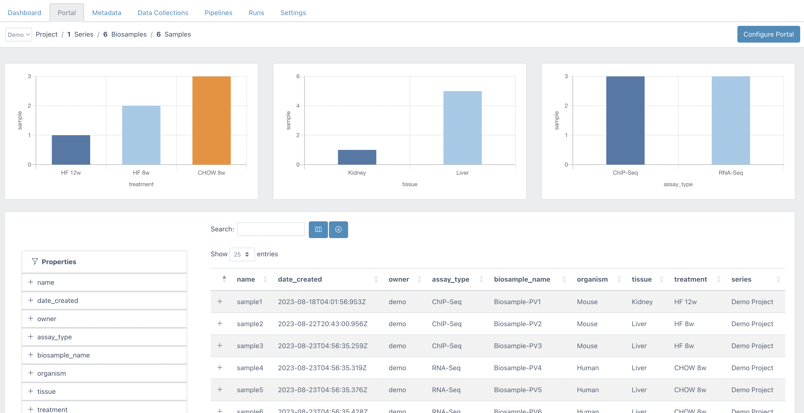
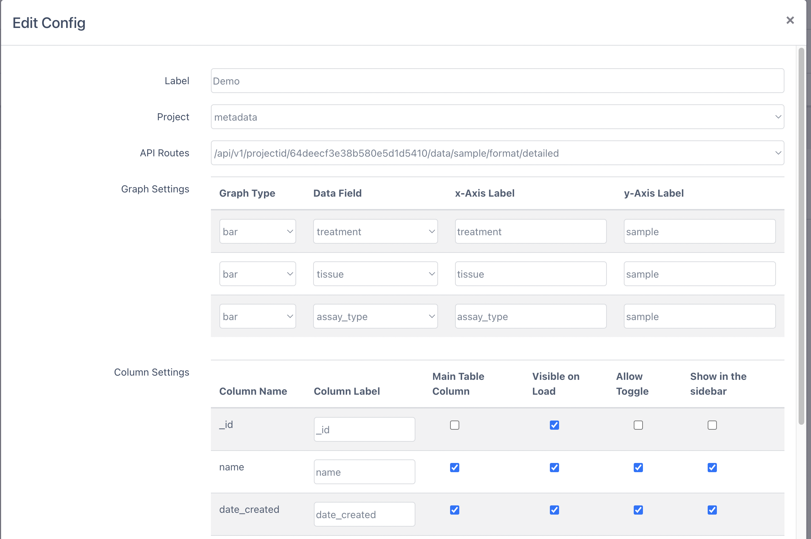

## Expected learning outcome

To understand the basics of Metadata Portal.

## Before you start

Please go to <https://www.viafoundry.com> and login into your account. If you have an issue about login, please let us know about it (support@viascientific.com). We will set an account for you.

## Adding Metadata Portal

Once logged in, first complete [Metadata Tracker - Basics Tutorial](demo_metadata-basics.md). After that Click on the `Add Metadata Portal` icon to add a new `Portal` tab into your project. 

   

To visualize Metadata information, we need to define two API routes in the Metadata Tracker Section. To start configuring API routes click on the `Metadata` tab and "Configure Metadata" button at the right. 

   

## Configuring Metadata Tracker

1. In this configuration section, click on `API Config` tab and Click Insert Button.
2. Add Samples Route and its Required Fields

      - **Target Collection:** sample
      - **Route Description:** detailed
      - **Config:** Click **New Collection Group**, Select ``Samples`` Collection and add the following required fields. You might choose to add other fields to visualize in Portal.

      **Collection: Samples**

      | Field      | Rename      | 
      | :----:      |    :----:              |    
      | _id  (required)          | _id            |
      | creationDate (required)            | date_created            |
      | Name  (required)          | name            |
      | owner            | owner            |
      | Assay Type          | assay_type            |

      - Click `New Collection Group`, Select ``Biosamples`` Collection and add the following fields.

      **Collection: Biosamples**

      | Field      | Rename      | 
      | :----:      |    :----:              |    
      | Name (required)           | biosample_name            |
      | Organism            | organism            |
      | Tissue            | tissue            |
      | Treatment         | treatment            |

      - Click `New Collection Group`, Select ``Series`` Collection and add the following fields.

      **Collection: Series**

      | Field      | Rename      | 
      | :----:      |    :----:              |    
      | Name (required)           | series            |

3. Click `Save API config` button to create ``/api/v1/projectid/${project_id}/data/sample/format/detailed`` API route.

4. Add File Route and it's Required Fields

      - **Target Collection:** file
      - **Route Description:** summary
      - **Config:** Click `New Collection Group` and select ``Files`` Collection and add the following required fields.

      **Collection: Files**

      | Field      | Rename      | 
      | :----:      |    :----:              |    
      | _id (required)           | _id            |
      | Name            | name            |
      | owner              | owner            |
      | Used Files               | file_used            |
      | Directory             | file_dir            |
      | Archive Directory             | archive_dir            |
      | S3 Archive Directory              | s3_archive_dir            |
      | Google Storage Archive Directory              | gs_archive_dir            |
      | Collection Type               | collection_type            |
      | File Type                | file_type            |
      | creationDate               | date_created            |

      - Click **New Collection Group**, Select ``Samples`` Collection and add the following fields.

      **Collection: Samples**

      | Field      | Rename      | 
      | :----:      |    :----:              |    
      | _id (required)           | sample_id            |

      Click **New Collection Group**, Select ``Series`` Collection and add the following fields.

      **Collection: Series**
      
      | Field      | Rename      | 
      | :----:      |    :----:              |    
      | Name           | collection_name  (required)           |
      | Name            | project_name (required)            |

5. Click `Save API config` button to create ``/api/v1/projectid/${project_id}/data/file/format/summary`` API route.

## Portal Configuration

To visualize the Metadata in Portal, you need to configure the retrieved API data from Metadata Tracker. 

   

1. Click the ``Configure Portal`` button at the top right and then click the ``Add Config`` button
2. **Choose a project**
3. **Choose Sample API route:** e.g. (``/api/v1/projectid/${project_id}/data/sample/format/detailed``)
4. **Graph Settings:** Choose three fields and labels that you want to visualize on the three bar graphs.
5. **Column Settings:**
   
      -  **Column Label:** You might rename the received data column name here. 
      -  **Main Table Column:** Check the checkbox if you want to show the data in the main Portal table.
      -  **Visible on Load:** Check the checkbox if you want to show column data on the initial load of the page.
      -  **Allow Toggle:** Add field into Toggle section so user might show/hide that column.
      -  **Show in the sidebar:** Show field in the left sidebar.

6. **Column Order:** You might change the Main Portal column order here by drag and drop.

   

Congratulations! You have configured a metadata portal for your project!

