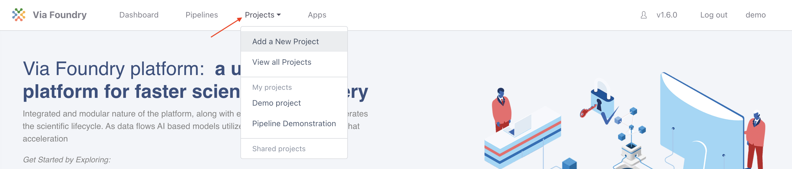
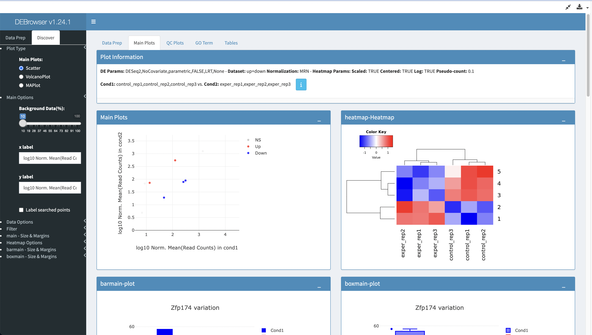

Expected learning outcome
========

To understand the basics of running a pipeline in Foundry by performing RNA-seq analysis on sample mouse data.

# Before you start

Please go to <https://www.viafoundry.com> and login into your account. If you have any issues logging in, please let us know (support@viascientific.com) and we will create an account for you.

Creating a Project
========
In Foundry, analysis is organized by project. Each run belongs to a project and a project can consist of multiple runs.

Once logged in, to create and configure a new project click on the `Projects` tab in the top menu and select `Add a New Project` button in the dropdown. In the pop-up, give the project a name (e.g. `RNA-seq Tutorial`) and click save.



Attaching Pipeline to Project
========
To help with organization, pipelines used in a project are attached to that project.

**Note:** The same pipeline can be attached to multiple projects.

 To attach a pipeline select the `Pipelines` tab and then click the `Add Pipeline` button. 


Locate the `RNA-seq Pipeline`, click on the `Add` button, and then close the window.


**Note:** For the purposes of this tutorial, be sure to add `RNA-seq Pipeline`, and **not** `RNA-seq Pipeline (NF-Core)`

Creating a Run
========
Once the project is created and a pipeline is attached, you are ready to create a run:

1. Click the `Run` button next to the `RNA-seq Pipeline` entry in the table to load the "Run Page"

    

2. On the run page, under "Run Environment" select `Via Demo Environment (AWS Batch)`
3. In the Inputs section, next to `reads`, click `Enter File`
4. In the files tab, click `Add File` button to enter new files.
5. Next to "1. File Location", enter:

	```
	s3://viascientific/run_data/test_data/fastq_mouse
	```

6. Click the magnifying glass icon. The box below will populate with files like so:

    

7. In the `3. Collection Type` dropdown, select `Paired List`
8. Under `4. File Pattern`, next to `Forward Pattern`, enter `.1`. Similarly, enter `.2` for `Reverse Pattern`.

    

9. Click `Add All Files` button. You should now see 6 entries below.

    

10. Next to `5. Collection Name`, enter `rna-seq mousetest paired`. The final three boxes can be left blank. Click `Save Files`
11. The "Select/Add Input File" screen will now have 6 entries. Click "Save".
12. For "mate", select `pair`
13. For "genome_build", select `mousetest_mm10`
14. Leave the rest of the inputs as defaults
15. Click `Run` in the top right and then select `Start`. For this dataset, the RNA-seq pipeline run typically takes several minutes to complete.
16. Navigate to the Log tab and click on log.txt to follow the progress of your run.
17. Once the status bar in the top right changes from a blue "Running" status to a green "Completed" status go to the Report tab to see the final reports.
18. Click on `Mulitiqc` to open the "MultiQC" section. Scroll down to find this plot, which shows aligned reads per library:

    

19. Open the `Overall Summary` section to check mapping rates:

    

20. Open the `RSEM Module` section. that has a "View Format" of "Table" to download a count table:

    

21. Open the `RSEM Module` section. that has a "View Format" of "App" and select the "DEBrowser App" and click "Launch App" to perform Differential Expression Analysis with DEBrowser.

    

**Note:** For the purposes of speeding up the runtime of this tutorial, the demo dataset has been downsampled to only include a few genes. Differential expression analysis graphs will look very sparse with this dataset.

Congratulations! You have run and tested a RNA-seq pipeline on Foundry!
