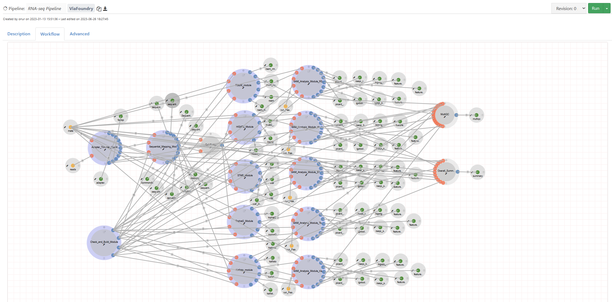
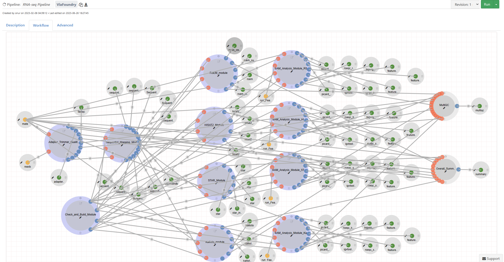
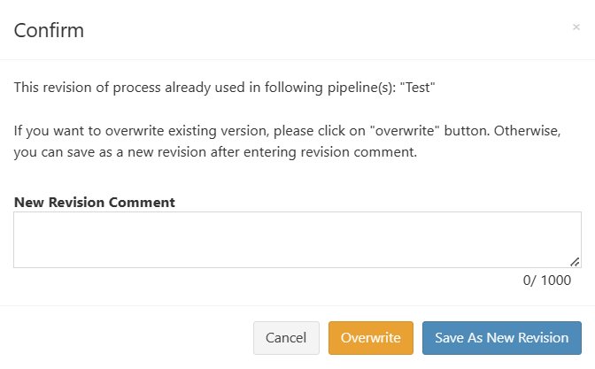
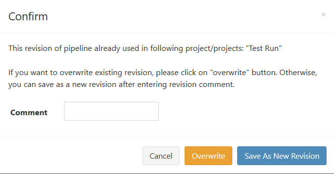
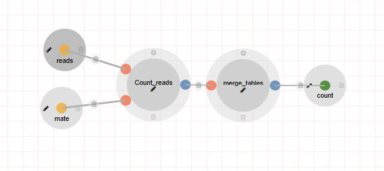
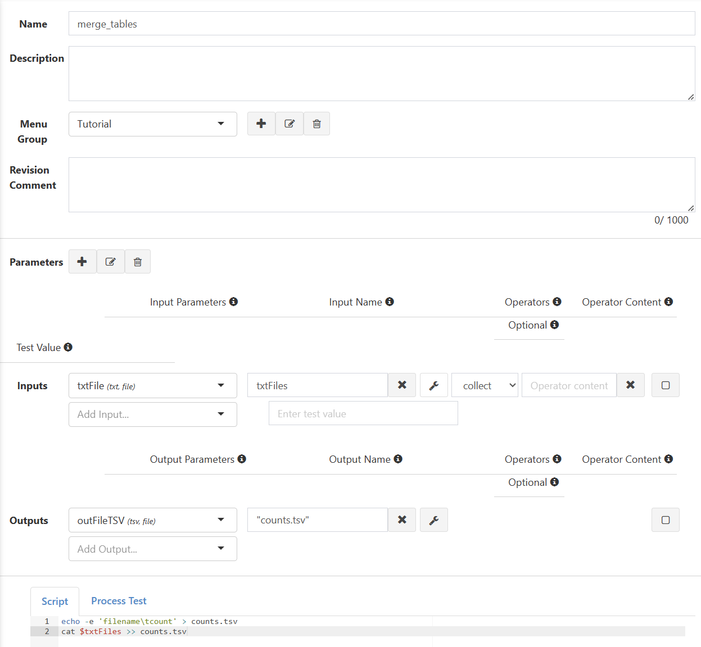
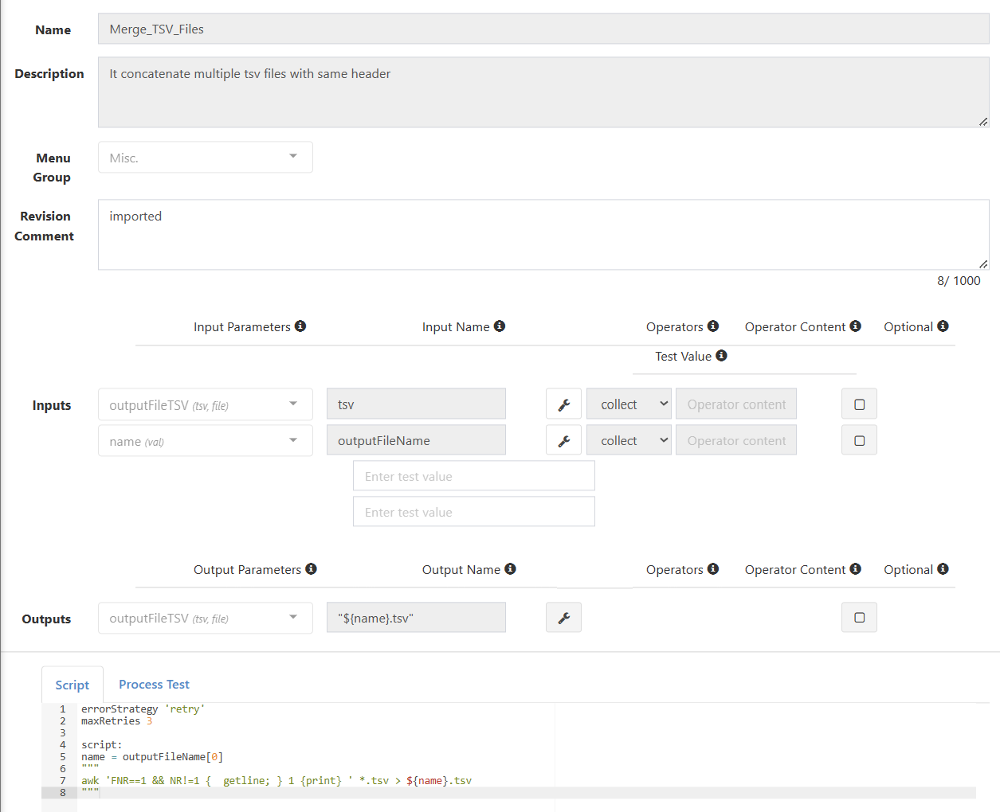

# Frequently Asked Questions By Developers

## Docker and Revision Control Basics

### How does Docker work?

As mentioned [here](app.md#dockerfile), Docker is an open-source platform that automates the deployment and management of applications within isolated containers. These containers provide lightweight and self-contained environments, bundling all the necessary software and dependencies required for Via Foundry bioinformatics projects. By leveraging Docker's powerful abstraction layer, you can eliminate the need to worry about software installation and operating system compatibility, saving valuable time and effort. With Docker, you can efficiently focus on your scientific analysis without the hassle of dealing with environment inconsistencies. Utilizing Docker in your Foundry projects ensures consistent software execution across different environments, minimizing user headaches and maximizing efficiency.


### How can I build a Docker container/image for my project?

You can build a Docker image for your project by creating a Dockerfile, a text file containing the set of instructions utilized in the image creation process. These instructions can include the declaration of a base image, the installation of various system libraries and software packages, and the setting of environment variables. Dockerfiles serve as blueprints for creating reproducible, self-contained environments encapsulating an application and its various software packages and dependencies.

To help you create Dockerfiles and understand their syntax, please reference [this link](https://docs.docker.com/engine/reference/builder/).

When you're creating a Dockerfile, it's best (and easiest) to only include the necessary components and dependencies required for your application. For instance, here's a Dockerfile containing all and only the requirements supporting Via Scientific's GSEA Explorer app, which provides potent support for the visualization of Gene Set Enrichment Analysis data:

```
FROM rocker/shiny:4.3.0
LABEL author="zach@viascientific.com" description="Docker image containing all requirements for the Via Scientific GSEA explorer App"

ENV LANG=C.UTF-8 LC_ALL=C.UTF-8

# Install System libraries
RUN apt-get update --fix-missing && \
    apt-get install -y gcc unzip curl make zlib1g-dev libglpk-dev libgmp3-dev libxml2-dev pandoc libicu-dev vim

# Install required R packages
RUN R -e 'install.packages(c("shiny", "BiocManager", "dplyr", "DT", "ggplot2", "shinydashboard", "shinydashboardPlus", "shinycssloaders", "igraph", "shinyjs"), \
    repos="https://packagemanager.posit.co/cran/__linux__/focal/2023-06-01")'
RUN R -e "BiocManager::install(version = '3.17')"
RUN R -e "BiocManager::install(c('fgsea', 'clusterProfiler', 'org.Hs.eg.db', 'org.Mm.eg.db'))"

# Copy app directory onto image
ADD gsea-explorer /gsea-explorer/

# Run the app when the container is started
CMD ["R", "-e", "shiny::runApp('/gsea-explorer')"]
```

Here, a minimal base image (rocker/shiny:4.3.0) is chosen, as it provides support for Shiny applications. Only the necessary system libraries and R packages are installed in the lines denoted by corresponding comments, after which point the entire app's directory (gsea-explorer) is copied onto the image. The last line contains a command to automatically start the app when the container is started.

[Posit's Package Manager](https://packagemanager.posit.co/client/#/repos/2/packages/A3) is a useful tool in determining which system libraries are necessary for each R package. Navigate to the `cran` or `bioconductor` package of interest and look for the "Install System Prerequisites" section. Select the distribution that matches your base image.

Additionally, when using `install.packages()`, setting the `repos` argument to use posit's package manager allows you to both download pre-built binaries (significantly speeding up Docker's build time) as well as freeze the version of each library to a specific date in time, eliminating any would-be issues with software version control.


### How does revision control work in Via Foundry?

When it comes to the creation and maintenance of pipelines and processes, Via Foundry has an intuitive and powerful version control system. After creating a pipeline or process, the state of that structure is preserved as Revision 0. Until a new revision is created, Revision 0 will be invoked by default when its pipeline or process is run. 

If and when you need to make changes to a pipeline or process, you have two options: overwriting the existing revision or saving the changes under a new revision. 

#### Overwriting Existing Revisions

Logically, overwriting the existing revision will wipe out its record; as such, if a given revision of a process used in some pipeline is overwritten, the pipeline will contain the revised version of the process, which could impact future runs. It's not typically advisable to overwrite in Via Foundry, as the overwritten revision is unrecoverable. Perhaps in a scenario wherein there's a fatal error produced by a typo in the script section of a process, overwriting the process might be prudent just to avoid superfluous revisions, but in general, best practice is to create new revisions.

#### Creating New Revisions

Clicking `Save As New Revision` after editing a process or pipeline commits the changes you've just made to a new revision, without impacting the structure of the prior revision. This allows users to dynamically update their pipelines and processes while retaining the options of referring to and using previous revisions. Additionally, when saving a new revision, users are required to write a comment describing the revision; these comments don't have to be detailed, but jotting down a brief summary of the changes made can be extremely beneficial down the road when deciding between different revisions.

To highlight this functionality, here are images of two revisions of the same RNA-Seq pipeline:




The specifics of the changes made here aren't relevant, but the key takeaway should be that creating new revisions of pipelines and processes does not erase the existence of previous revisions; this permits stress-free toggling between different revisions for reference.

**Note**: If you revise a process currently being used in a pipeline and attempt to save the changes, you'll get this pop-up:



Similarly, if you revise a pipeline currently being used in a project and attempt to save the changes, you'll get this pop-up:



Saving as a new revision in either of these cases will *not* impact the current revision already being used in whatever project(s)/pipeline(s) it is deployed in. 

In the former case, to revise the pipeline with the new process, go to the pipeline's page (either through the `Pipelines` tab or by following the `Go to (Pipeline)` link in the `Workflow` tab of the runpage). On the pipeline's page, navigate to the `Workflow` tab, from which you can select the appropriate process's `Settings` icon, then choose the proper revision in the dropdown menu in the top right and save the changes as a new revision to the pipeline.

In the latter, to update a project with a newly revised pipeline, you can go to the pipeline's page, then click `Run` and select the project within which you'd like to run the new revision. The existence of many revisions may seem conducive to unnecessary clutter, but the safeguards it provides, in addition to effortless reference access, render it invaluable within the Foundry platform.

## Creating and Optimizing Pipelines

### How can I create a pipeline from scratch?

For help creating pipelines, you can reference [this guide](pipeline_guide.md). If, while following along with that tutorial, you find you'd like help creating processes as well, simply follow [this link](process.md).

### How can I merge files from different processes?

| Input(s)                                              | Input Type                                     | Input Name(s)                              | Output(s)  | Output Name   | Script                                                         | Result                                                | Result Notes                                                     |
| ----------------------------------------------------- | ---------------------------------------------- | ------------------------------------------ | ---------- | ------------- | -------------------------------------------------------------- | ----------------------------------------------------- | ---------------------------------------------------------------- |
| Arbitrary FastQ file                                  | FastQ file                                     | read                                       | Text file  | counts.txt    | wc -l $read \| awk '{print $0/4}' > count.txt                   | Text file with the number of reads in the Fastq file   | N/A                                                              |
| Group of multiple single-end read files                | FastQ file                                     | read                                       | Text file  | counts.txt    | wc -l $read \| awk '{print $0/4}' > count.txt                   | Text file containing only the number of reads in the last input file | Previous files get overwritten with each successive cycle of the process |
| Group of multiple single-end read files                | Set of ["shortened filename string", filename in directory] | val(name), file(read)                                       | Text file  | \*.counts.txt | wc -l $read \| awk '{print $0/4}' > ${(input_name)}.count.txt   | Three separate text files, each containing the read count for one of the input files | Output files are named (input filename with extension).counts.txt   |
| Group of multiple single-end read files                | Set of ["shortened filename string", filename in directory] | val(name), file(read)                      | Text file  | \*{name}.txt  | wc -l $read \| awk '{print $0/4}' > ${name}.txt                 | Three separate text files, each containing the read count for one of the input files | Output files are named (input filename).txt                      |
| Group of multiple paired-end read files, additional mate input set to = pair | Set of ["shortened filename string", end 1 filename, end 2 filename] | val(name), file(read)                      | Text file  | \*{name}.txt  | wc -l $read \| awk '{print $0/4}' > ${name}.txt                 | Three separate text files, containing the read counts for each of a pair of input files | N/A                                                              |

Once you've created several files of the same extension, you can merge them by using an intermediate process and Nextflow's `collect` operator, which accumulates all the files given to it as input and returns them in an aggregated format. For instance, you could connect the process outlined in the bottom row of the table above to a process called "merge_tables", represented as such:

| Input(s)                                              | Input Type                                     | Input Name(s)                              | Output(s)  | Output Name   | Operator | Script                                                         | Result                                                | Result Notes                                                     |
| ----------------------------------------------------- | ---------------------------------------------- | ------------------------------------------ | ---------- | ------------- | -------- | -------------------------------------------------------------- | ----------------------------------------------------- | ---------------------------------------------------------------- |
| Text file (representing outputs of previous process)   | Text file                                      | txtFiles                                   | TSV file   | counts.tsv    | collect  | Line 1: echo -e 'filename\tcount' > counts.tsv \| \| Line 2: cat $txtFiles >> counts.tsv | Table containing filenames and read counts for all input files | N/A                                                              |


For a visual aid, look at these photos of a pipeline that merges the results of the count_reads process within merge_tables:




This cleanly merges the results into one table, counts.tsv. It's a simple example, so to reinforce the point, here's an example of a process used in the RNA-Seq pipeline, which reinforces the usefulness of merging with the `collect` operator. Merge_TSV_Files concatenates multiple TSV files containing the same header into one TSV file, as shown here:



**Important**: Make sure that, when you're using the `collect` operator, the output you wish to `collect` is in a file format; otherwise, the operator will not work properly.

### How can I parallelize processes for the files generated in one process?

To parallelize processes for the files generated in one process, you can use Nextflow's `flatten` or `flatMap` operators. The former transforms a nested channel containing multiple channels or a nested collection into a single-level (flat) collection of files, which lets Nextflow send the files to separate instances of a process, enabling parallel execution of those files. Not dissimilarly, the `flatMap` operator applies some function to every item emitted by a channel, returning the outputted items as a new flat channel, which can then be passed into separate instances of a process, permitting parallelization.

## Support

For any questions or help, please reach out to
<support@viascientific.com> with your name and question.


