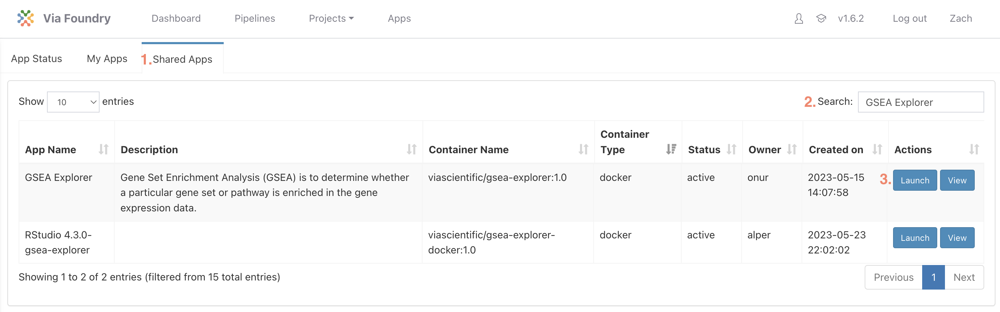
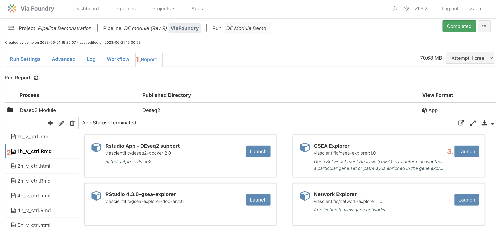

# GSEA Explorer Tutorial

The goal of Gene Set Enrichment Analysis (GSEA) is to determine whether a particular gene set or pathway is enriched in the gene expression data, indicating its potential biological relevance to the studied condition. It operates on the principle that biologically relevant gene sets or pathways are likely to exhibit coordinated changes in expression, rather than individual genes.

## Launching GSEA Explorer

The GSEA Explorer application can be launched either in stand-alone mode or after running Foundry's full RNA-sequencing pipeline or the Differential Expression module:

### Launching Stand-alone Mode

1. In the top banner click `Apps` and then the `Shared Apps` tab

2. Search for `GSEA Explorer` or find the app in the table

3. Click the `Launch` Button

### Launching from Report Tab

1. Navigate to the `Report` tab

2. Select any .Rmd file (It doesn't matter which one)

3. Click the `Launch` button in the GSEA Explorer card

## Inputs

On the right side in the inputs section, select the corresponding species. The DESeq results from the run and the GMT file loaded at runtime will be available in their respective dropdowns. If additional inputs are needed, they can be uploaded to either the Inputs or GMT directory in the GSEA explorer section of the Reports tab by clicking the + sign above the launch script.

### Advanced Options

#### Gene Set Size

The minimal and maximal number of genes allowed in a gene set can be set. Gene sets that are not within these bounds will not be run.

#### Fold Change Shrinkage

If fold change shrinkage was applied after DEseq was run, the use of the log2FoldChange and shrinked log2FoldChange can be toggled on/off. It is generally recommended to use shrunken log2FoldChanges in GSEA.

## Outputs

In the main panel, the results of GSEA will include for each gene set:

1. Name of gene set

2. Number of genes in the gene set

3. Normalized Enrichment Score

4. Adjusted p-value

Selecting a row will display the corresponding Enrichment plot on the right and leading edge genes on the bottom
