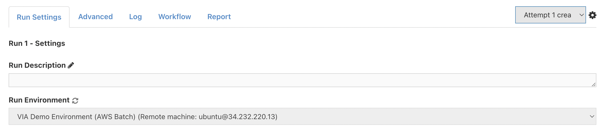
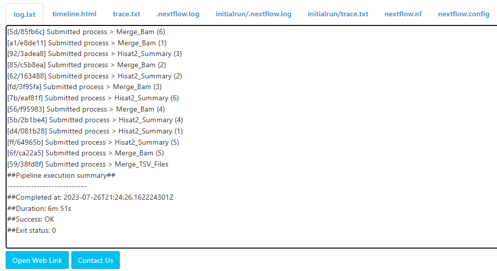

# Developer Tutorial - Advanced Pipeline Creation

Welcome to the second of Via Foundry's pipeline creation tutorials! If you missed the first one, you can go [right here](demo_developer_tutorial.md) to give yourself a crash course in pipeline creation in Foundry. This tutorial will be decidedly more complex than its predecessor, as we'll be going through the process of replicating our HISAT2 module, which maps next-generation sequencing reads against the general human population or a reference genome. Along the way, we'll address some frequently asked questions about Foundry pipelines, processes, and more as they come up. You'll see a more concise answer to each question on this page, but each question will be linked to a more elaborated-upon answer.

## Before you start

Go to the [Via Foundry homepage](https://viafoundry.com) and log into your account. If you don't have an account or otherwise experience issues logging in, please let us know about it at support@viascientific.com, and we'll be happy to set up an account for you.

## Set-up: Creating a new project and pipeline

Once you're logged in, click the `Projects` tab in the top menu and select `Add a New Project`. After entering whatever name you'd like, you'll be directed to the project's dashboard, which contains space for a description of the project, as well as its pending and completed runs, reports, and embedded apps. From here, you'll want to click on the `Pipelines` tab to the right of `Dashboard`. To access the pipeline builder page, just click the `Pipelines` tab and then click the `Create Pipeline` button. 


Now you can write a descripton about your pipeline using the `Description` tab, start developing your pipeline with the `Workflow` tab, and add extra files or set some extra parameters using the `Advanced` tab.


*A brief note on processes:*

If you're attempting this tutorial, you're likely already familiar with Foundry processes. However, if you're not (or if you'd simply like to reacquaint yourself), check [this link](demo_developer_tutorial.md#what-is-a-process) from our first developer tutorial to deepen your understanding of processes. Once you've done so, if you'd like, we can move on to actually creating the processes we'll need for the HISAT2 module. Before that, here's how you can use publicly available Foundry modules and processes.

#### FAQ: How can I use pre-existing, publicly available Foundry processes or modules in a pipeline?

With a few minor revisions, this entire exercise could be expedited and carried out in a few seconds. This is because we're replicating Foundry's Hisat2 module, which is ready-made and available for off-the-shelf use by Foundry users. It's quite simple to use the Hisat2 module in its entirety, or to use a process that's already been made (available): just click the appropriate **Pipelines** or **Processes** dropdown menu (or search a module/process by name) and drag the item you want into your workflow in the **Workflow** tab. Just like that, any process or module made for public use can be in your workflow. For more, check out [this FAQ](process_faq.md#how-can-i-use-existing-processes-or-modules).

## Exercise 1 - Creating processes

Throughout this tutorial, we'll be creating six processes: Check_Build_Hisat2_Index, Check_Hisat2_Files, Map_Hisat2, Merge_Bam, Hisat2_Summary, and Merge_TSV_Files. After entering the inputs, outputs, and scripts for each process, make sure to click `Save Changes`.

*Note*: Make sure you're in the **Description**, **Workflow**, or **Advanced** tab of your pipeline's page.

### **Check_Build_Hisat2_Index**

This process builds a HISAT2 index using a provided genome FASTA file and GTF file. It extracts splice sites and exons from the GTF file and creates the HISAT2 index in a designated directory. 

```
Name: Check_Build_Hisat2_Index
Menu Group: Tutorial (note: create this group if you haven't yet)

Inputs:
    Parameter: genome(fasta, file) Name: genome
    Parameter: gtfFilePath(gtf, file) Name: gtf

Outputs:
    Parameter: hisat2Index(index, file) Name: "$index"

Script:
    Language Mode: shell

    when:
    build_Hisat2_index == true && ((params.run_HISAT2 && (params.run_HISAT2 == "yes")) || !params.run_HISAT2)

    script:
    hisat2_build_parameters = "-p 5" //* @input @description:"Hisat2 build parameters"
    basename = genome.baseName
    basenameGTF = gtf.baseName
    index_dir = ""
    if (params.hisat2_index.indexOf('/') > -1 && params.hisat2_index.indexOf('s3://') < 0){
        index_dir  = file(params.hisat2_index).getParent()
    }
    index = "Hisat2Index" 

    extract_splice_sites = "hisat2_extract_splice_sites.py ${gtf} > ${basenameGTF}.hisat2_splice_sites.txt"
    extract_exons = "hisat2_extract_exons.py ${gtf}> ${basenameGTF}.hisat2_exons.txt"
    ss = "--ss ${basenameGTF}.hisat2_splice_sites.txt"
    exon = "--exon ${basenameGTF}.hisat2_exons.txt"

    """
    if [ ! -e "${index_dir}/${basename}.8.ht2" ] ; then
        echo "${index_dir}/${basename}.8.ht2 Hisat2 index not found"
        
        mkdir -p $index && mv $genome $gtf $index/. && cd $index
        $extract_splice_sites
        $extract_exons
        hisat2-build ${hisat2_build_parameters} $ss $exon ${genome} ${basename}
        cd ..
        if [ "${index_dir}" != "" ] ; then
            mkdir -p ${index_dir}
            cp -R -n $index  ${index_dir}
        fi
    else 
        ln -s ${index_dir} $index
    fi
    """

Header Script:
    build_Hisat2_index = false //* @checkbox @description:"If you're using custom genome and gtf please enable build_Hisat2_index option." 
    //* autofill
    if ($HOSTNAME == "default"){
        $CPU  = 5
        $MEMORY = 200
    }
    //* platform
    //* platform
    //* autofill

Footer Script:
    (N/A)

```

If everything has been entered correctly, your inputs and outputs should look like this:


Now that you've entered in all the appropriate values, it's a good time to discuss best practices for scope control in Foundry processes. 

#### FAQ: Which variables are global, and which are local, within a process?

Within the Check_Build_Hisat2_Index process, you'll see variables defined in the script's `script:` block (e.g. basename, basenameGTF, index_dir) that are then invoked in the section enclosed by triple quotes. This stands in contrast with the Header Script, in which the only variable declared (build_hisat2_index) defines and styles an input form on the runpage. These examples exemplify best practices for Foundry scope control, as the following properties are true of process variables:

- Defining variables in the Header Script or Footer script creates them in a global scope, meaning accidental overloading can later occur if a different variable of the same name is defined. For this reason, the only variables that should be defined in these sections are those that configure the appearance of input fields on the runpage; for instance, build_hisat2_index instantiates a checkbox field on the runpage, and is not used in any scripts.
- Defining variables in the **Script** section creates them within a local scope, meaning such variables only exist within their host processes, and you can have different variables of the same name in other processes. Define such variables under the `script:` header, as is done in this process. Here, "basename", "basenameGTF", and "index_dir" only exist in Check_Build_Hisat2_Index, so you're able to define other identically-named variables in other processes.
- Manipulating an existing input variable in the **Script** section overwrites its value. Take care to avoid doing so.

For more info on process scope, you can reference [this page](process_faq#what-variables-are-global-and-local-within-a-process).

### **Check_Hisat2_Files**

This process checks the conditions for executing the HISAT2 alignment and performs a validation of the availability of HISAT2 files based on the specified index path (hisat2_index). The pathChecker function is used to obtain a command (cmd) for running the HISAT2 alignment.

```
Name: Check_Hisat2_Files
Menu Group: Tutorial

Inputs: 
    Parameter: hisat2Index(index, file) Name: hisat2 Optional: Yes

Outputs: 
    Parameter: hisat2Index(index, file) Name: "*/${hisat2new}" Optional: Yes

Script:
    Language Mode: shell

    when:
    (params.run_HISAT2 && (params.run_HISAT2 == "yes")) || !params.run_HISAT2

    script:
    (cmd, hisat2new) = pathChecker(hisat2, params.hisat2_index, "folder")
    """
    $cmd
    """

Header Script:
    (N/A)

Footer Script:
    (N/A)
```

Upon entering in your input and output parameters, they should look like this:


Check_Hisat2_Files demonstrates both the use of optional input parameters and entire optional processes. Here's more information about both of those topics:

#### FAQ: How can I define optional input parameters?

After defining an input parameter, you'll notice an "Optional" checkbox next to its operator content. Selecting the checkbox will make the parameter optional, allowing the process to be executed even if the parameter isn't defined. Often, though not in this process, if you have an optional "file" input parameter, you may want to define a variable instantiated with a 'NO_FILE' prefix so that the script will run even in the absence of a provided file. For more, read [this](process_faq.md#how-can-i-define-optional-input-parameters).

#### FAQ: How can I make an *entire* process optional?

Within the context of a pipeline, making a process optional is contingent on its input(s) and output(s) being of the same type; that way, if the process doesn't run, the pipeline advances to the next process in the workflow, which still receives input of the type it would have had the optional process run. With that out of the way, most of Foundry's processes have a `when:` block in the script section that dictates the conditions under which a process can run. This process runs when the "run_HISAT2" parameter is set to "yes". Now, most the entire HISAT2 module has this condition, so when run_HISAT2 is set to "no", the entire module won't run, so the example isn't necessarily applicable to this instance. However, within the context of your pipelines, you can have a process that takes in, operates on, and outputs an index file (for instance), but that only runs when a condition is met. If that condition isn't met, the process will be skipped and the pipeline will continue. If, however, the process takes in an index file and outputs a BAM file, having an unfulfilled `when:` condition will crash the pipeline, so be aware of what processes you attempt to make optional. For more detail, you can reference [this page](process_faq.md#how-can-i-make-an-entire-process-optional).

### **Map_Hisat2**

Now that we've made processes that check and build our HISAT2 index, we can actually start mapping our reads. 

```
Name: Map_Hisat2
Menu Group: Tutorial

Inputs:
    Parameter: mate(val) Name: mate
    Parameter: reads(fastq, set) Name: val(name), file(reads)
    Parameter: hisat2Index(index, file) Name: hisat2index

Outputs:
    Parameter: mapped_reads(bam, set) Name: val(name), file("${newName}.bam")
    Parameter: outputFileTxt(txt, set) Name: val(name), file("${newName}.align_summary.txt")
    Parameter: outputFileOut(out, set) Name: val(name), file("${newName}.flagstat.txt")

Script:
    Language Mode: groovy

    when:
    (params.run_HISAT2 && (params.run_HISAT2 == "yes")) || !params.run_HISAT2

    script:
    HISAT2_parameters = "-p 4" //* @input @description:"Specify HISAT2 parameters"
    nameAll = reads.toString()
    nameArray = nameAll.split(' ')
    file2 = ""

    if (nameAll.contains('.gz')) {
        newName =  nameArray[0] - ~/(\.fastq.gz)?(\.fq.gz)?$/
        file1 =  nameArray[0] - '.gz' 
        if (mate == "pair") {file2 =  nameArray[1] - '.gz'}
        runGzip = "ls *.gz | xargs -i echo gzip -df {} | sh"
    } else {
        newName =  nameArray[0] - ~/(\.fastq)?(\.fq)?$/
        file1 =  nameArray[0]
        if (mate == "pair") {file2 =  nameArray[1]}
        runGzip = ''
    }

    """
    basename=\$(basename ${hisat2index}/*.8.ht2 | cut -d. -f1)
    $runGzip
    if [ "${mate}" == "pair" ]; then
        hisat2 ${HISAT2_parameters} -x ${hisat2index}/\${basename} -1 ${file1} -2 ${file2} -S ${newName}.sam &> ${newName}.align_summary.txt
    else
        hisat2 ${HISAT2_parameters} -x ${hisat2index}/\${basename} -U ${file1} -S ${newName}.sam &> ${newName}.align_summary.txt
    fi
    samtools view -bS ${newName}.sam > ${newName}.bam
    samtools flagstat ${newName}.bam > ${newName}.flagstat.txt
    """

Header Script:
    params.hisat2_index = "" //* @input


    //* autofill
    if ($HOSTNAME == "default"){
        $CPU  = 4
        $MEMORY = 32
    }
    //* platform
    //* platform
    //* autofill

Footer Script:
    (N/A)
```

The inputs and outputs should look like this once you've entered them in:


Map_Hisat2 is a great example of Foundry's `val`, `file`, and `set` qualifiers, since its inputs employ each of them. Here's a brief overview of each of them:

#### FAQ: When should I use the val, file, and set qualifiers?

Via Foundry offers five main types of qualifiers to specify the type of an input, with three commonly used: `val`, `file`, and `set`.

**Val**: Use for atomic types (integer or string). Enables calling values by their names. Ideal for single values, like minimum read counts or specifying "single" or "pair" for read files.

**File**: Used for passing one file as a parameter value. Commonly used for output parameters containing relevant information for the next process or report files.

**Set**: The most versatile qualifier, acting as a tuple that groups two qualifiers together. Useful for handling multiple files together, like datasets with names and filepaths.

Understanding the distinctions between these qualifiers is crucial for effectively managing inputs and outputs in your processes. The `set` qualifier, in particular, provides powerful functionality for handling groups of files in a highly generalizable manner.

For more detail, you can read up on the qualifiers [here](process_faq.md#when-should-i-use-the-val-file-and-set-qualifiers).

If you look closely, you'll also see conditionals related to the value of the input parameter "mate". This logic is crucial for many Foundry pipelines to support paired- and single-end reads.

#### FAQ: How can I support single- and paired-end reads?

As outlined on [this page](process_faq.md#how-can-i-support-single--and-paired-end-reads), if you want your pipeline/process to support both single- and paired-end reads, you'll want it to have a "mate" input parameter with the `val` qualifier. You'll also want a "reads" input parameter with the `set` qualifier. From there, the general structure of how to embed support for both types of reads in a process is as follows:

```
// Concatenate all read names, then split by spaces
nameAll = reads.toString()
nameArray = nameAll.split(' ')
file2 = ""

// Initialize one read file, initialize a second if paired-end reads have been selected
file1 = nameArray[0]
if (mate == "pair") {file2 = nameArray[1]}

...

"""
If ["${mate}" == "pair"]; then
    *Send file 1 and file 2 through some other process/analysis*
else
    *Only iterate over file 1*
"""
```

This simple but powerful logic will be a key component of many of your Foundry pipelines. Now let's move on to the next process.

### **Merge_Bam**

This process merges multiple BAM files into a single file using samtools merge. If there are multiple input BAM files, it additionally performs sorting and indexing on the merged BAM file using samtools sort and samtools index. If there is only one input BAM file, it performs sorting and indexing directly on that file.

```
Name: Merge_Bam
Menu Group: Tutorial

Inputs:
    Parameter: mapped_reads(bam, set) Name: val(oldname), file(bamfiles) Operator: groupTuple

Outputs:
    Parameter: bam_index(bai, set) Name: val(oldname), file("*_sorted.bam.bai")
    Parameter: sorted_bam(bam, set) Name: val(oldname), file("*_sorted.bam")

Script:
    Language Mode: shell

    shell:
    '''
    num=$(echo "!{bamfiles.join(" ")}" | awk -F" " '{print NF-1}')
    if [ "${num}" -gt 0 ]; then
        samtools merge !{oldname}.bam !{bamfiles.join(" ")} && samtools sort -o !{oldname}_sorted.bam !{oldname}.bam && samtools index !{oldname}_sorted.bam
    else
        mv !{bamfiles.join(" ")} !{oldname}.bam 2>/dev/null || true
        samtools sort  -o !{oldname}_sorted.bam !{oldname}.bam && samtools index !{oldname}_sorted.bam
    fi
    '''

Header Script:
    (N/A)

Footer Script:
    (N/A)
```

Your inputs and outputs should look like this:


Merge_Bam is the first (and only) process in the HISAT2 module that leverages globbing to publish files to multiple output directories, a vital nugget of functionality that many users ask about.

#### FAQ: How can I publish files into multiple directories within one process?

In order to publish files from a process to multiple directories, you can use "globbing" to filter files based on their extensions or names. Globbing involves using an asterisk as a wildcard character to match sequences of characters in filenames.

- To filter files into directories based on their extension, use patterns like file("reads/*.gz") for gzip files or "*.{fastx, trimmomatic}_quality.log" for log files.
- If multiple patterns in Output Name match a file, it will be directed to the first matching output directory specified. It won't be sent to multiple locations within the same process.

Globbing is helpful for organizing outputs efficiently, but if a file meets the criteria for multiple output directories, it will only be published to the first matching directory specified. In such cases, you might need to create a new process to achieve the desired output organization.

In the example of the Merge_Bam process, globbing is used to direct BAI (Bam Index) files and BAM files to different directories. The process takes multiple BAM files as input and merges them into a single BAM file. Additionally, it generates BAI files (Bam Index files) for each input BAM file.

To handle these different types of output files, the Output Name field in the process is configured using globbing patterns. The BAM files are directed to one output directory, while the BAI files are sent to another output directory.

If you want to learn more about this topic, check out [this page](process_faq.md#how-can-i-publish-files-into-multiple-directories-within-one-process).

### **Hisat2_Summary**

Now that we have all the HISAT2 output files we need, we must merge them into one table for concise analysis.

Here are the inputs, outputs, and script you should use:

```
Name: Hisat2_Summary
Menu Group: Tutorial

Inputs:
    Parameter: outputFileTxt(txt, set) Name: val(name), file(alignSum) Operator: groupTuple

Outputs:
    Parameter: outputFile(tsv, file) Name: "*.tsv"
    Parameter: name(val) Name: "hisat2_alignment_sum"

Script:
    Language Mode: perl

    shell:
    '''
    #!/usr/bin/env perl
    use List::Util qw[min max];
    use strict;
    use File::Basename;
    use Getopt::Long;
    use Pod::Usage; 
    use Data::Dumper;

    my %tsv;
    my @headers = ();
    my $name = "!{name}";


    alteredAligned();

    my @keys = keys %tsv;
    my $summary = "$name"."_hisat_sum.tsv";
    my $header_string = join("\\t", @headers);
    `echo "$header_string" > $summary`;
    foreach my $key (@keys){
        my $values = join("\\t", @{ $tsv{$key} });
        `echo "$values" >> $summary`;
    }


    sub alteredAligned
    {
        my @files = qw(!{alignSum});
        my $multimappedSum;
        my $alignedSum;
        my $inputCountSum;
        push(@headers, "Sample");
        push(@headers, "Total Reads");
        push(@headers, "Multimapped Reads Aligned (HISAT2)");
        push(@headers, "Unique Reads Aligned (HISAT2)");
        foreach my $file (@files){
            my $multimapped;
            my $aligned;
            my $inputCount;
            chomp($inputCount = `cat $file | grep 'reads; of these:' | awk '{sum+=\\$1} END {print sum}'`);
            chomp($aligned = `cat $file | grep 'aligned.*exactly 1 time' | awk '{sum+=\\$1} END {print sum}'`);
            chomp($multimapped = `cat $file | grep 'aligned.*>1 times' | awk '{sum+=\\$1} END {print sum}'`);
            $multimappedSum += int($multimapped);
            $alignedSum += int($aligned);
            $inputCountSum += int($inputCount);
        }
        $tsv{$name} = [$name, $inputCountSum];
        push(@{$tsv{$name}}, $multimappedSum);
        push(@{$tsv{$name}}, $alignedSum);
    }
    '''

Header Script:
    (N/A)

Footer Script:
    (N/A)

```

Your input and output parameters should be configured as such. Make sure they're exactly as shown in this image before continuing with the tutorial.


There's not much more to say on the topic of this process, so let's move on to the last process we'll be creating before manipulating our workflow.

### **Merge_TSV_Files**

This process, while rather elementary, is an integral component of many Foundry pipelines and modules; it merges multiple TSV files into one easily readable table for downstream analysis. Its values are as follows:

```
Name: Merge_TSV_Files
Menu Group: Tutorial

Inputs:
    Parameter: outputFileTSV(tsv, file) Name: tsv Operator: collect
    Parameter: name(val) Name: outputFileName Operator: collect

Outputs:
    Parameter: outputFileTSV(tsv, file) Name: "${name}.tsv"

Script:
    Language Mode: shell

    errorStrategy 'retry'
    maxRetries 3

    script:
    name = outputFileName[0]
    """    
    awk 'FNR==1 && NR!=1 {  getline; } 1 {print} ' *.tsv > ${name}.tsv
    """

Header Script:
    (N/A)

Footer Script:
    (N/A)
```

Here's an image with which you can reference the inputs and outputs you entered:


#### FAQ: How can I collect the outputs of a process?

Merge_TSV_Files is a prime example of a process that uses the `collect` operator, a powerful and widely used Nextflow operator that condenses all the outputs (with the same given extension) of a previous process into one input. If there are multiple HISAT2 files given to the pipeline we're about to make, multiple TSV files will be produced by Hisat2_Summary. To avoid extraneous tables being created and to consolidate the analysis viewing experience, the `collect` operator aggregates all the TSV files into one, which is then operated upon within Merge_TSV_Files. 

*Note*: When using `collect`, it's important to note that you can only "collect" outputs of a `file` type, not `val` or `set`.

For more information, click [here](process_faq.md#how-can-i-collect-the-outputs-of-a-process).


Now you've created all the processes that will be used in the HISAT2 pipeline, it's time to create the pipeline itself.

## Exercise 2 - Building the Pipeline

As in the previous tutorial, make sure that you have all the processes you've just created in the Tutorial menu before proceeding.


### **Naming Your Pipeline**

At the top of your pipeline's page, you'll see a blank box next to the word "Pipeline:". Here, enter a name for your pipeline; for instance, "My HISAT2 Pipeline", as shown here.


### **Dragging and Dropping Processes**

From here, just drag and drop all six processes you just made from the Tutorial menu into your workflow, which should then look something like this:


### **Creating Input Parameters**

Now, drag and drop four Input Parameters, found at the top of the left sidebar, into the workflow. Name them "genome", "gtf", "reads", and "mate", respectively, and connect them to processes as shown here.

{.align-center width="30.0%"}


For all the parameters except "mate", naming them is sufficient. For "mate", however, you'll want to check the "Dropdown Options" checkbox and enter "single,pair" in the newly open field; likewise, select the "Description" checkbox and write "Single-End or Paired-End Data". Mate's **Change Name** window should now look like this:

{.align-center width="70.0%"}

You'll soon see why we did this, but for now, let's finish setting up the workflow.

### **Creating Output Parameters & Connecting Processes**

Drag and drop four output parameters, also found in the left sidebar menu, into your workflow. Name them "index", "bai", "bam", and "summary", respectively. In "summary"'s **Change Name** window, select `Publish to Web Directory`, then choose "DataTables" from the dropdown menu.


From there, attach all the output parameters to processes, as shown here. Additionally, you'll want to connect the outputs of several processes to the inputs of others, also shown in this image.


Now that the workflow has been completed, you're almost ready to execute the pipeline. Before that, though, go to the `Advanced` tab and enter the following (in language mode groovy) in the Pipeline Header Script:

```
params.genome_build = "" //* @dropdown @options:"human_hg19, mouse_mm10, mousetest_mm10, custom"
params.run_HISAT2 = "yes" //* @dropdown @options:"yes","no"

def pathChecker(input, path, pathType){
	def recursiveParam = (pathType == "folder") ? "--recursive" : ""
	def cmd = "mkdir -p out && mv ${input} out/. "
	if (!input || input.empty()){
		input = file(path).getName().toString()
		cmd = "mkdir -p out && cd out && ln -s ${path} ${input} && cd .."
		if (path.indexOf('s3:') > -1 || path.indexOf('S3:') >-1){
			cmd = "mkdir -p out && cd out && aws s3 cp ${recursiveParam} ${path} ${workDir}/${input} && ln -s ${workDir}/${input} . && cd .."
		} else if (path.indexOf('/') == -1){
			cmd = ""
		}
}
	return [cmd,input]
}


def _species;
def _build;
def _share;
//* autofill
if (params.genome_build == "mousetest_mm10"){
    _species = "mousetest"
    _build = "mm10"
} else if (params.genome_build == "human_hg19"){
    _species = "human"
    _build = "hg19"
} else if (params.genome_build == "mouse_mm10"){
    _species = "mouse"
    _build = "mm10"
}

if (params.genome_build && $HOSTNAME){
    params.genomeDir ="${_share}/${_species}/${_build}/"
    params.genome ="${_share}/${_species}/${_build}/${_build}.fa"
    params.bed_file_genome ="${_share}/${_species}/${_build}/${_build}.bed"
    params.ref_flat ="${_share}/${_species}/${_build}/ref_flat"
    params.genomeIndexPath ="${_share}/${_species}/${_build}/${_build}"
    params.genomeSizePath ="${_share}/${_species}/${_build}/${_build}.chrom.sizes"
}
if ($HOSTNAME){
	params.trimmomatic_path = "/usr/local/bin/dolphin-bin/trimmomatic-0.32.jar"
    params.fastx_trimmer_path = "/usr/local/bin/dolphin-bin/fastx_trimmer"
    params.hisat2_path = "/usr/local/bin/dolphin-bin/hisat2/hisat2"
    params.igvtools_path = "/usr/local/bin/dolphin-bin/IGVTools/igvtools.jar"
    params.picard_path = "/usr/local/bin/dolphin-bin/picard-tools-1.131/picard.jar"
    params.pdfbox_path = "/usr/local/bin/dolphin-bin/pdfbox-app-2.0.0-RC2.jar"
    params.genomeCoverageBed_path = "/usr/local/bin/dolphin-bin/genomeCoverageBed"
    params.wigToBigWig_path = "/usr/local/bin/dolphin-bin/wigToBigWig"
    params.bowtie2_path = "/usr/local/bin/dolphin-bin/bowtie2"
    params.samtools_path = "/usr/local/bin/dolphin-bin/samtools-1.2/samtools"
}
//*
```

There's a lot to digest here, but you don't need to trouble yourself with all the details. The salient details relate to variable scope, autofilling executor and pipeline properties, and creating pipeline inputs (more on the latter later).

#### FAQ: What variables are global and local within a pipeline?

As with [processes](hisat_dev_tutorial.md#faq-which-variables-are-global-and-which-are-local-within-a-process), any variables defined within the **Pipeline Header Script** section are global in scope; as such, best practice is to only use variables there for style purposes, just as params.genome_build and params.run_HISAT2 only create input fields on the runpage. Additionally, for those variables, instantiating them in the `params` scope means that (in theory) you could define variables called "genome_build" and "run_HISAT2" without the `params` scope elsewhere in the pipeline and not have to confront overloading issues.

In the header script, you can also define functions that can be used within processes. Here, we define a pathChecker function to ensure that the right index is given for the HISAT2 files in this pipeline.

For more information on pipeline variable scope, feel free to reference [this guide](process_faq.md#what-variables-are-global-and-local-in-a-pipeline).

#### FAQ: How can I configure the autofill section of my pipeline?

For your pipeline and for individual processes, Foundry allows you to automatically fill input and executor property values based on conditions like the hostname of the run environment or parameter values. Within the header script of a pipeline or a process, you can fill said properties with this syntax:

```
//* autofill
if $HOSTNAME == "..." {
    (fill properties)
}

// OR

if ${example_parameter} == "..." {
    (fill properties)
}
//* autofill
```

For much more detail on autofilling pipeline inputs, check out [this link](pipeline_guide.md#autofill-feature-for-pipeline-inputs), and if you'd like to find out how you can autofill pipeline executor properties, go [here](pipeline_guide.md#autofill-feature-for-pipeline-properties).

## Exercise 3 - Executing the Pipeline

Once a pipeline has been created, you'll see a green `Run` button at the top right of the page.

{: width="20%"}


This button opens a new window, where you can select your project by clicking on its name. At this point, you'll be prompted to enter a name for your run, which will catalog the run in your project. From here, clicking `Save run` will automatically redirect you to the run page, where you can initiate your run.


Here, please choose your `Run Environment` as "Via Demo Environment(AWS Batch)"
  


### Configuring Advanced Settings

Then, click on the `Advanced` tab at the top of the page. Under the `Run Container` header, click `Use Docker Image` and enter the `Image Path` below;
  
```
Run Container:
Use Docker Image: Checked
Image Path: public.ecr.aws/t4w5x8f2/viascientific/rnaseq:3.0
``` 

#### FAQ: How can I manually allocate resources to my processes? 

Below the Docker settings you just filled out, you'll see a table underneath a checkbox described as **Executor Settings for Each Process**. Here, you can manually configure the resources allocated to each process in a pipeline, as such:


Alternatively, you could check **Executor Settings for All Processes** and establish settings that will apply to all the processes in your pipeline.

If you want to learn more about how you should configure your executor settings, click [this link](faq.md#how-should-i-configure-my-executor-settings).


### Entering Run Inputs

Now that all the advanced settings have been finalized, go back to the `Run Settings` tab. You'll notice seven inputs on the runpage:


Where did these inputs come from?

#### FAQ: What are some different ways I can create pipeline inputs?

Four of the inputs on the runpage are "reads", "mate", "gtf", and "genome", all of which are the names of input parameters you dragged and dropped into your pipeline's workflow. All of them but "mate" prompt you to "Enter File" or "Enter Value", but "mate" has a dropdown menu:


Going back to the [creation of input parameters](hisat_dev_tutorial.md#creating-input-parameters), remember that you changed the **Dropdown Menu** and **Description** fields of "mate", and now on the runpage, the "mate" input parameter is configured just as it was specified then. As such, you can define how inputs will appear on the runpage when creating them.

The other inputs come from header scripts, both those of processes and the pipeline itself. genome_build and run_HISAT2 are both defined in the Pipeline Header Script, whereas hisat2_index is defined in Map_Hisat2. Notice that these variables have interesting syntax after their values are defined; this syntax is integral to how inputs appear on the runpage, and can be read up on [here](process.md#process-options).


Now it's time to enter in input values.

- **reads**: Click `Enter File`, then `Add File`. Enter the following:

```
File Location: https://web.dolphinnext.com/umw_biocore/dnext_data/tutorial/fastq_data/single
Collection Type: Single/List
File Pattern: Click "Add All Files" (there should be 6)
Collection Name: HISAT2 Run (this is arbitrary and can be whatever you want)
```

Now click `Save Files`, then `Save`.

- **mate**: Select `single`.

- **gtf**: Click `Enter File`, then `Manually`. In File Path, enter:
```
s3://viascientific/run_data/genome_data/mousetest/mm10/refseq_170804/genes/genes.gtf
```
Click `Save`.

- **genome_build**: Select `mousetest_mm10`.

- **run_HISAT2**: Select `yes`.

- **hisat2_index**: Click `Enter Value`. In Value, enter:
```
s3://viascientific/run_data/genome_data/mousetest/mm10/refseq_170804/Hisat2Index
```

Now, click `Save Value`.

- **genome** (found under System Inputs): Click the pencil icon, then under File Path, enter:
```
s3://viascientific/run_data/genome_data/mousetest/mm10/main/genome.fa
```

Click `Save Value`.

At this point, you've entered in all the inputs you'll need, and the runpage should look like this:


### Running Pipeline

Simply click the green `Run` button at the top right of the runpage, then select `Start`.

You'll have to wait a few minutes, but once the run has completed, here's how some important files in the Log and Report section will look:

**log.txt**: This file tracks the submission and execution of the pipeline's processes, as well as any warnings and errors that occur.
    

**timeline.html**: This file provides a graphical representation of which processes were executed at what time, for how long, and with how much memory.
    

**hisat2_alignment_sum.tsv**: Found in the `Report` section, this file contains information about the total reads, multimapped reads aligned, and unique reads aligned from the input reads files.
    


## Conclusion

And that's it! You've built and run a complex pipeline from scratch, and should now be much more familiar with the intricacies of Via Foundry. As always, if you have any questions, feel free to reach out to support@viascientific.com.


