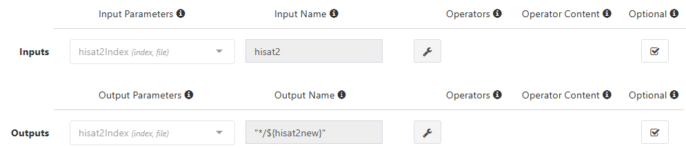
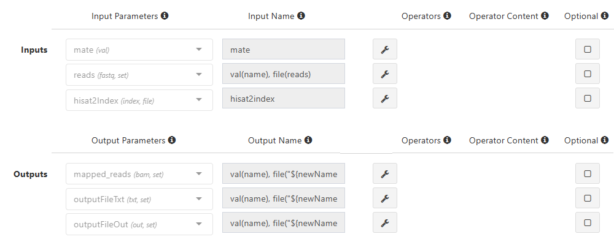

# Hisat2 Module Scripts

If you're looking for process scripts to accompany Foundry's [second developer tutorial](hisat_dev_tutorial.md), you've come to the right place. To quickly find the process you're looking for, just click on its name in the navigation sidebar on the right hand side of the screen. For each process, you'll find input and output parameters and names, the process script itself, as well as the header and/or footer scripts (if applicable). Finally, below all the scripts, there'll be a link to take you back to where you left off in the tutorial.

## Check_Build_Hisat2_Index

This process builds a HISAT2 index using a provided genome FASTA file and GTF file. It extracts splice sites and exons from the GTF file and creates the HISAT2 index in a designated directory. 


```
Name: Check_Build_Hisat2_Index
Menu Group: Tutorial (note: create this group if you haven't yet)

Inputs:
    Parameter: genome(fasta, file) Name: genome
    Parameter: gtfFilePath(gtf, file) Name: gtf

Outputs:
    Parameter: hisat2Index(index, file) Name: "$index"

Script:
    Language Mode: shell

    when:
    build_Hisat2_index == true && ((params.run_HISAT2 && (params.run_HISAT2 == "yes")) || !params.run_HISAT2)

    script:
    hisat2_build_parameters = "-p 5" //* @input @description:"Hisat2 build parameters"
    basename = genome.baseName
    basenameGTF = gtf.baseName
    index_dir = ""
    if (params.hisat2_index.indexOf('/') > -1 && params.hisat2_index.indexOf('s3://') < 0){
        index_dir  = file(params.hisat2_index).getParent()
    }
    index = "Hisat2Index" 

    extract_splice_sites = "hisat2_extract_splice_sites.py ${gtf} > ${basenameGTF}.hisat2_splice_sites.txt"
    extract_exons = "hisat2_extract_exons.py ${gtf}> ${basenameGTF}.hisat2_exons.txt"
    ss = "--ss ${basenameGTF}.hisat2_splice_sites.txt"
    exon = "--exon ${basenameGTF}.hisat2_exons.txt"

    """
    if [ ! -e "${index_dir}/${basename}.8.ht2" ] ; then
        echo "${index_dir}/${basename}.8.ht2 Hisat2 index not found"
        
        mkdir -p $index && mv $genome $gtf $index/. && cd $index
        $extract_splice_sites
        $extract_exons
        hisat2-build ${hisat2_build_parameters} $ss $exon ${genome} ${basename}
        cd ..
        if [ "${index_dir}" != "" ] ; then
            mkdir -p ${index_dir}
            cp -R -n $index  ${index_dir}
        fi
    else 
        ln -s ${index_dir} $index
    fi
    """

Header Script:
    build_Hisat2_index = false //* @checkbox @description:"If you're using custom genome and gtf please enable build_Hisat2_index option." 
    //* autofill
    if ($HOSTNAME == "default"){
        $CPU  = 5
        $MEMORY = 200
    }
    //* platform
    //* platform
    //* autofill

Footer Script:
    (N/A)

```

If everything has been entered correctly, your inputs and outputs should look like this:


Once you've entered all the above information, go [back to the tutorial](hisat_dev_tutorial.md#check_build_hisat2_index).

## Check_Hisat2_Files

This process checks the conditions for executing the HISAT2 alignment and performs a validation of the availability of HISAT2 files based on the specified index path (hisat2_index). The pathChecker function is used to obtain a command (cmd) for running the HISAT2 alignment.

```
Name: Check_Hisat2_Files
Menu Group: Tutorial

Inputs: 
    Parameter: hisat2Index(index, file) Name: hisat2 Optional: Yes

Outputs: 
    Parameter: hisat2Index(index, file) Name: "*/${hisat2new}" Optional: Yes

Script:
    Language Mode: shell

    when:
    (params.run_HISAT2 && (params.run_HISAT2 == "yes")) || !params.run_HISAT2

    script:
    (cmd, hisat2new) = pathChecker(hisat2, params.hisat2_index, "folder")
    """
    $cmd
    """

Header Script:
    (N/A)

Footer Script:
    (N/A)
```

Upon entering in your input and output parameters, they should look like this:



Once you've entered all the above information, you can go [back to the tutorial](hisat_dev_tutorial.md#check_hisat2_files).

## Map_Hisat2

This process actually maps the input reads.

```
Name: Map_Hisat2
Menu Group: Tutorial

Inputs:
    Parameter: mate(val) Name: mate
    Parameter: reads(fastq, set) Name: val(name), file(reads)
    Parameter: hisat2Index(index, file) Name: hisat2index

Outputs:
    Parameter: mapped_reads(bam, set) Name: val(name), file("${newName}.bam")
    Parameter: outputFileTxt(txt, set) Name: val(name), file("${newName}.align_summary.txt")
    Parameter: outputFileOut(out, set) Name: val(name), file("${newName}.flagstat.txt")

Script:
    Language Mode: groovy

    when:
    (params.run_HISAT2 && (params.run_HISAT2 == "yes")) || !params.run_HISAT2

    script:
    HISAT2_parameters = "-p 4" //* @input @description:"Specify HISAT2 parameters"
    nameAll = reads.toString()
    nameArray = nameAll.split(' ')
    file2 = ""

    if (nameAll.contains('.gz')) {
        newName =  nameArray[0] - ~/(\.fastq.gz)?(\.fq.gz)?$/
        file1 =  nameArray[0] - '.gz' 
        if (mate == "pair") {file2 =  nameArray[1] - '.gz'}
        runGzip = "ls *.gz | xargs -i echo gzip -df {} | sh"
    } else {
        newName =  nameArray[0] - ~/(\.fastq)?(\.fq)?$/
        file1 =  nameArray[0]
        if (mate == "pair") {file2 =  nameArray[1]}
        runGzip = ''
    }

    """
    basename=\$(basename ${hisat2index}/*.8.ht2 | cut -d. -f1)
    $runGzip
    if [ "${mate}" == "pair" ]; then
        hisat2 ${HISAT2_parameters} -x ${hisat2index}/\${basename} -1 ${file1} -2 ${file2} -S ${newName}.sam &> ${newName}.align_summary.txt
    else
        hisat2 ${HISAT2_parameters} -x ${hisat2index}/\${basename} -U ${file1} -S ${newName}.sam &> ${newName}.align_summary.txt
    fi
    samtools view -bS ${newName}.sam > ${newName}.bam
    samtools flagstat ${newName}.bam > ${newName}.flagstat.txt
    """

Header Script:
    params.hisat2_index = "" //* @input


    //* autofill
    if ($HOSTNAME == "default"){
        $CPU  = 4
        $MEMORY = 32
    }
    //* platform
    //* platform
    //* autofill

Footer Script:
    (N/A)
```

The inputs and outputs should look like this once you've entered them in:



Then, after you've entered in all the needed values, you can go back to the tutorial by clicking [this link](hisat_dev_tutorial.md#map_hisat2).

## Merge_Bam

This process merges multiple BAM files into a single file using samtools merge. If there are multiple input BAM files, it additionally performs sorting and indexing on the merged BAM file using samtools sort and samtools index. If there is only one input BAM file, it performs sorting and indexing directly on that file.

```
Name: Merge_Bam
Menu Group: Tutorial

Inputs:
    Parameter: mapped_reads(bam, set) Name: val(oldname), file(bamfiles) Operator: groupTuple

Outputs:
    Parameter: bam_index(bai, set) Name: val(oldname), file("*_sorted.bam.bai")
    Parameter: sorted_bam(bam, set) Name: val(oldname), file("*_sorted.bam")

Script:
    Language Mode: shell

    shell:
    '''
    num=$(echo "!{bamfiles.join(" ")}" | awk -F" " '{print NF-1}')
    if [ "${num}" -gt 0 ]; then
        samtools merge !{oldname}.bam !{bamfiles.join(" ")} && samtools sort -o !{oldname}_sorted.bam !{oldname}.bam && samtools index !{oldname}_sorted.bam
    else
        mv !{bamfiles.join(" ")} !{oldname}.bam 2>/dev/null || true
        samtools sort  -o !{oldname}_sorted.bam !{oldname}.bam && samtools index !{oldname}_sorted.bam
    fi
    '''

Header Script:
    (N/A)

Footer Script:
    (N/A)
```

The inputs and outputs should look like this:


Once you've entered everything into the process, go [back to the tutorial](hisat_dev_tutorial.md#merge_bam).
