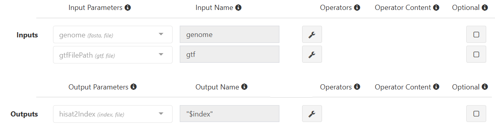

# Hisat2 Module Scripts

If you're looking for process scripts to accompany Foundry's [second developer tutorial](hisat_dev_tutorial.md), you've come to the right place. To quickly find the process you're looking for, just click on its name in the navigation sidebar on the right hand side of the screen. For each process, you'll find input and output parameters and names, the process script itself, as well as the header and/or footer scripts (if applicable). Finally, below all the scripts, there'll be a link to take you back to where you left off in the tutorial.

## Check_Build_Hisat2_Index

This process builds a HISAT2 index using a provided genome FASTA file and GTF file. It extracts splice sites and exons from the GTF file and creates the HISAT2 index in a designated directory. 


```
Name: Check_Build_Hisat2_Index
Menu Group: Tutorial (note: create this group if you haven't yet)

Inputs:
    genome(fasta, file) name: genome
    gtfFilePath(gtf, file) name: gtf

Outputs:
    hisat2Index(index, file) name: "$index"

Script:
    Language Mode: shell

    when:
    build_Hisat2_index == true && ((params.run_HISAT2 && (params.run_HISAT2 == "yes")) || !params.run_HISAT2)

    script:
    hisat2_build_parameters = "-p 5" //* @input @description:"Hisat2 build parameters"
    basename = genome.baseName
    basenameGTF = gtf.baseName
    index_dir = ""
    if (params.hisat2_index.indexOf('/') > -1 && params.hisat2_index.indexOf('s3://') < 0){
        index_dir  = file(params.hisat2_index).getParent()
    }
    index = "Hisat2Index" 

    extract_splice_sites = "hisat2_extract_splice_sites.py ${gtf} > ${basenameGTF}.hisat2_splice_sites.txt"
    extract_exons = "hisat2_extract_exons.py ${gtf}> ${basenameGTF}.hisat2_exons.txt"
    ss = "--ss ${basenameGTF}.hisat2_splice_sites.txt"
    exon = "--exon ${basenameGTF}.hisat2_exons.txt"

    """
    if [ ! -e "${index_dir}/${basename}.8.ht2" ] ; then
        echo "${index_dir}/${basename}.8.ht2 Hisat2 index not found"
        
        mkdir -p $index && mv $genome $gtf $index/. && cd $index
        $extract_splice_sites
        $extract_exons
        hisat2-build ${hisat2_build_parameters} $ss $exon ${genome} ${basename}
        cd ..
        if [ "${index_dir}" != "" ] ; then
            mkdir -p ${index_dir}
            cp -R -n $index  ${index_dir}
        fi
    else 
        ln -s ${index_dir} $index
    fi
    """

Header Script:
    build_Hisat2_index = false //* @checkbox @description:"If you're using custom genome and gtf please enable build_Hisat2_index option." 
    //* autofill
    if ($HOSTNAME == "default"){
        $CPU  = 5
        $MEMORY = 200
    }
    //* platform
    //* platform
    //* autofill

Footer Script:
    (N/A)

```

If everything has been entered correctly, your inputs and outputs should look like this:



Once you've entered all the above information, go [back to the tutorial](hisat_dev_tutorial.md#check_build_hisat2_index).

