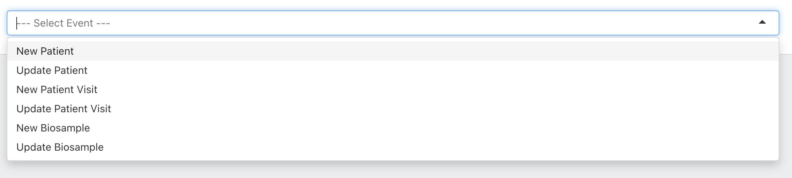
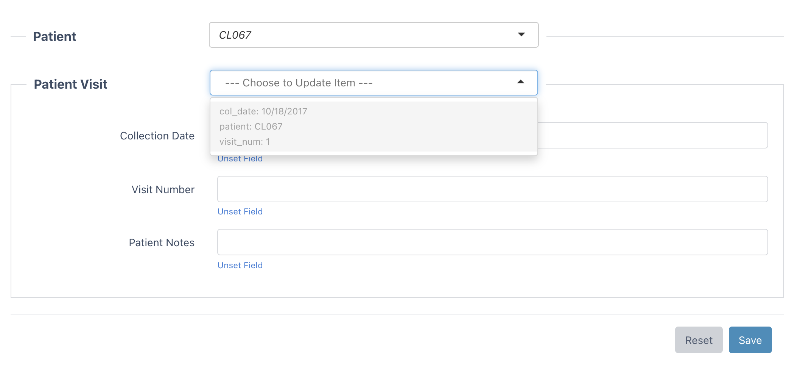
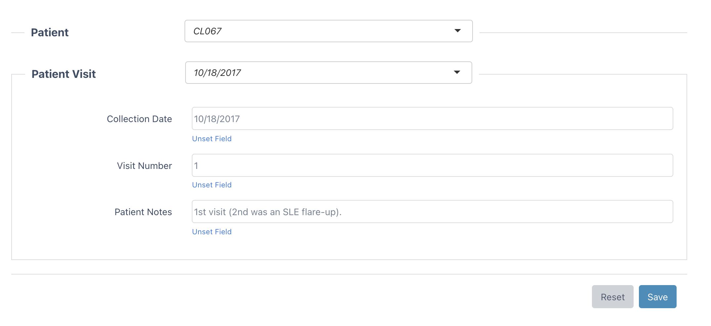
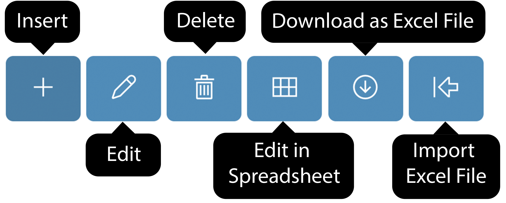
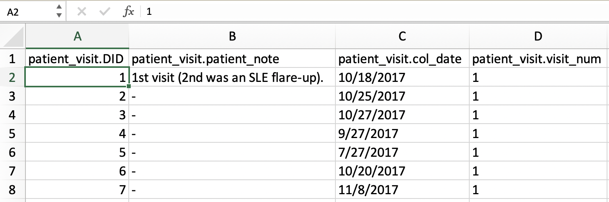
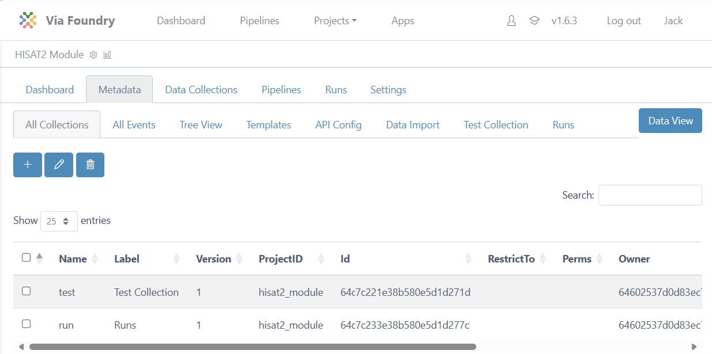
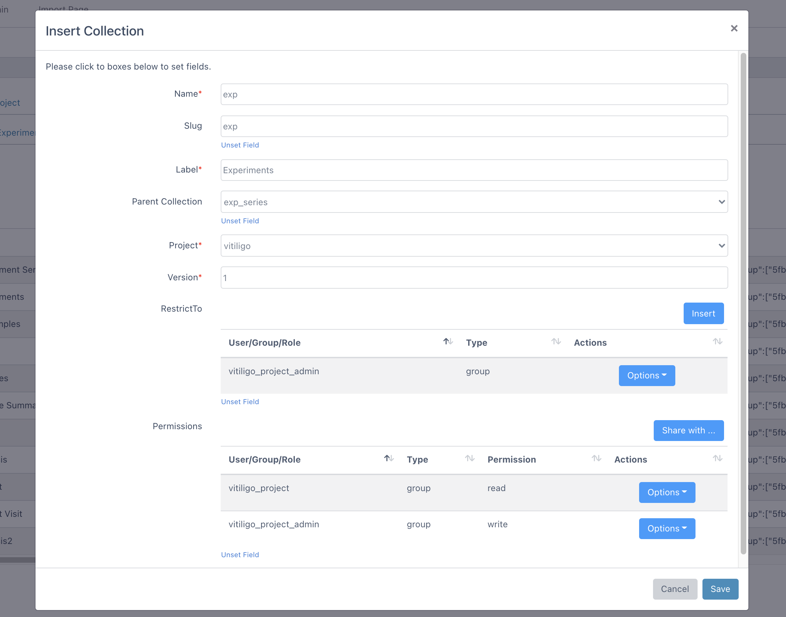
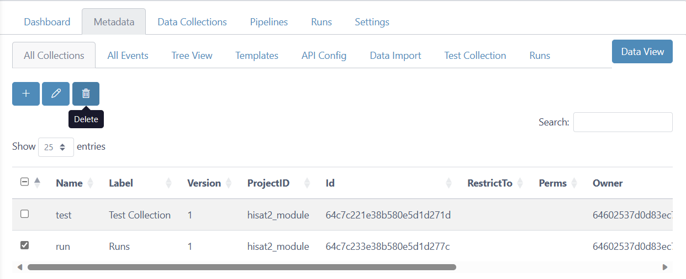
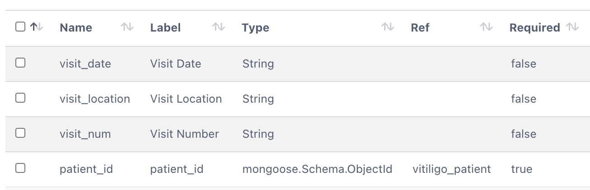
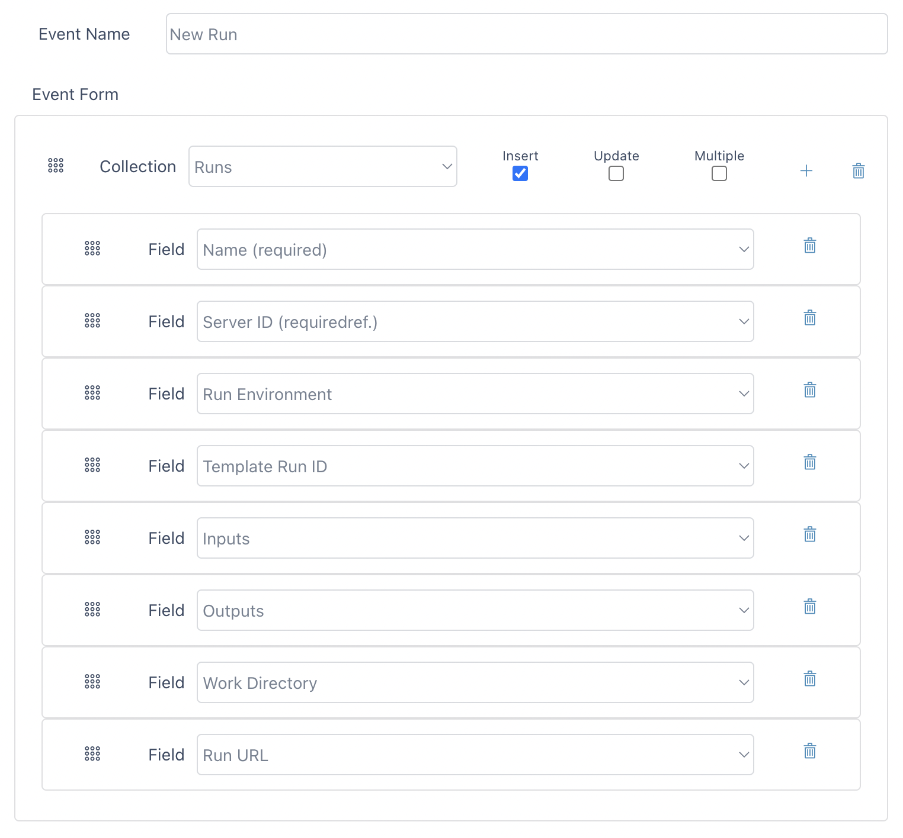

# Metadata Tracker Guide

Welcome to metadata tracking system designed to support a wide range of use cases, from basic to complex, for multi-organization and lab-based projects. Metadata Tracker seamlessly integrates automated data processing pipelines, data analysis, and visualization modules, making it a powerful tool for managing and organizing your project's metadata. This guide will take you through all you need to know about Metadata Tracker and its integration with Via Foundry, including a comprehensive overview of Metadata Tracker projects, collections, fields, and events.

(For information about Metadata Tracker's API, we invite you to reference [this document](api.md)).

## **Brief Overview**

### Benefits of Metadata Tracker's Design

- **Flexible Design:** Define project collection and fields flexibly
  with a software architecture developed by the MongoDB data management system. MongoDB supports a flexible data field schema where users can efficiently update the data fields of any entry or the information of the associated metadata.
- **Web APIs:** Metadata Tracker also incorporates extensive and secure
  token-based Web APIs to make the metadata and processed data
  available to its users in accordance with FAIR standards.
- **Event-based Management:** Events are specific types of insertion,
  deletion and edit operations defined by the project
  administrators to allow internal users to manage multiple specifically permitted fields and collections in an organized manner.
- **Validation with Ontology Servers:** Data fields are linked to ontology servers or user admin-specified dictionaries, which allows the standardized collection of information from each user.
- **Share:** Each project, collection, field, and document in Metadata Tracker
  has dynamic permission controls, enabling project admins to update or submit operations to, and limit the access of specified groups or users.

### **Who is Metadata Tracker for?**

Metadata Tracker is designed for a wide variety of users, from bench biologists to expert bioinformaticians.

- **Data submission** requires no programming knowledge whatsoever. We've created an intuitive event-based process to simplify and streamline this process.
- **Metadata setup** only requires basic database knowledge and
  familiarity with MongoDB to effectively use its operators. You
  don't need to learn all of MongoDB's syntax; instead, you can
  easily focus on the field settings. The rest (e.g. creating parent-child relationships with collections,
  delivering data from ontology servers, etc.) is handled by Metadata Tracker.

## **Data Guide**

In this section, we will investigate Metadata Tracker's data tables and how data can be inserted to, updated in, and deleted from collections.

### **Basics**

At the top of Metadata Tracker's dashboard, you will notice the **Collections** and **Events** tabs. You can insert/update/delete data from collections
using the **All Collections** tab, whereas the **All Events** tab is used
for inserting new or updating existing data in a simplified and
structured way.

### **All Events**

In the `Events` tab of a given project, all pre-made events are listed in the initial dropdown menu. Please see the example
below, which depicts a project containing clinical data on patients and patient visits:

{.align-center width="99.0%"}

From this dropdown, you can simply select the action you want to perform. As an
example, **Update Patient Visit** is selected, which loads the pre-defined form fields as below:

{.align-center width="99.0%"}

You can either scroll through the dropdown menu to find the data you'd like, or type the name of the data point and select it that way. In this example, you can either scroll to and manually choose the patient in question or type their name before selecting them.

{.align-center width="99.0%"}

If you have fields dependent on/subordinate to others, as **Patient Visit** is to **Patient** in this example, once the superordinate field has been defined, only the data with the given value for the superordinate field appear in the dropdown menu for the subordinate field. In plainer English, since Patient CL067 is selected here, only Patient CL067's Patient Visits are available in the **Patient Visit** dropdown.

{.align-center width="99.0%"}

As soon as a patient visit is selected, form fields are loaded with
selected visit data. After making changes, you can click the save button
to submit changes.

Once you've made a selection, the blank form fields will be automatically filled with the values associated with that selection. You can make whatever edits you wish, then click `Save` to store your changes.

{.align-center width="99.0%"}

Here, a Patient Visit event has been updated. You'll find that much more is possible with Metadata Tracker events, so for more information on how to create and customize events, check out [this section](#all-events).

### **All Collections**

All collections are listed in the initial dropdown menu of the Metadata Tracker `Collections` tab. From this dropdown menu, you can simply
select the collection you want to view. For example, the **Biosamples**
collection for some arbitrary project is selected:

{.align-center width="99.0%"}

At the top of this table, you'll find six action buttons: `Insert`, `Edit`, `Delete`, `Edit in Spreadsheet`, `Download as Excel File`, and `Import Excel File`. For a visual aid, here are all the icons with their corresponding names.

{.align-center width="50.0%"}

#### Insert

You can insert data into a collection by using the `Insert` button, which
will open an `Insert <Collection Name>` window, in which you can instantiate the data fields associated with your collection. Please check the example
below, in which a Biosample is being inserted, with associated values for such dimensions as Clinical Phenotype, Skin, Biosample Type, and Patient Visit ID.

{.align-center width="90.0%"}

#### Edit

After clicking one of the checkboxes, you can start editing your collection member by clicking
the `Edit` button. If you
check off multiple items at the same time, Metadata Tracker lets you update
only certain fields of the selected data, leaving other fields unique and untouched for all the checked-off items.

##### Single Data Edit

In this image, only one biosample has been selected, so its data can be edited at will.

{.align-center width="99.0%"}

##### Multiple Data Edit

Take a look at this image, in which multiple biosamples have been selected. The **Clinical Phenotype** has been set to "Lupus Erythermatosus" for both of the samples, but all of the other fields are untouched; they will keep their original values.

{.align-center width="99.0%"}

#### Delete

In order to remove data from a collection, you can check off one or multiple
items and click the `Delete` button.

#### Edit in Spreadsheet

Another way to edit multiple items is by using spreadsheet view. After
clicking the `Edit in Spreadsheet` button, you'll see your collection data in a spreadsheet format, as opposed to the default table format.

Table View:

{.align-center width="70.0%"}

Spreadsheet View:

{.align-center width="99.0%"}

Now, you can copy and paste into multiple fields as in the Excel file.
As an example, the **1st visit** value is filled into four cells by copy
and paste below. Updated cells are highlighted.

{.align-center width="99.0%"}

After clicking the **Save Changes** button at the top, the highlighted cells are
synchronized with Metadata Tracker's database, and the update's status is tracked:

{.align-center width="99.0%"}

Table view:

{.align-center width="71.0%"}

#### Download as Excel File

You can download all collection data by clicking the **Download as Excel
File** button.

{.align-center width="71.0%"}

#### Import Excel File

After you edit your data in Excel, you can import your changes by clicking
the **Import Excel File** button.

{.align-center width="99.0%"}

## **Collection Guide**

This guide explains how to create, edit, and delete collections in Metadata Tracker.

Collections are tables used to store and organize data. Metadata Tracker enables you to establish parent-child relationships between collections through referencing techniques. Let's explore the basics of managing collections.

First, navigate to a project in Via Foundry. At the top of the `Metadata` tab interface, click `Configure Metadata`. You'll find yourself on the `All Collections` page, where you will find three action buttons to handle collections: **`Insert`**, **`Edit`**, and **`Delete`**.



### **Inserting Collections**

In order to insert a new collection, you need to click on the `Insert`
button, which will open the `Insert Collection` window, as shown below. Here, you can fill in the
following fields:

- **Name (required):** Name of your collection. This will _not_ appear in Metadata Tracker's dropdown menus, but is simply for back-end storage purposes.
- **Label (required):** Long version of your collection name. This _will_ be displayed as your collection's "name" in Metadata Tracker.
- **Project (required):** Choose the project you'd like the collection to go into.
- **Version (required):** Version of the collection.
- **RestrictTo:** Select users or groups who are allowed to
  **Insert new data into collection**. You can grant this permission to new users/groups
  by clicking the `Insert` button. If you later want to remove that
  permission, just click **options -\> delete**.
- **Permissions:** User or groups are selected who are allowed to
  **view or edit the collection**. You may add new user/groups by
  clicking `Share` button. Afterwards, please choose user/group and
  read/write permission and click `Save`. If you want to
  edit/remove the permission, please click **options** button.
- **Other fields**: If you've configured your collection to have additional fields, you'll be able to fill them in in this window as well.

{.align-center width="99.0%"}

### **Editing Collections**

If you'd like to edit a collection, simply click the checkbox next to its name, then click the `Edit` button at the top of the window.


You'll see an `Edit Collection` window, wherein you can manipulate any of the previously set fields.

{.align-center width="70.0%"}

### **Deleting Collections**

If you'd like to remove a collection, you can click the checkbox next to its name, then the `Delete` button.



You'll be prompted to confirm your intents, at which point you can click `Remove`. NOTE: Collection deletion is irrevocable, so make sure you absolutely want to delete a collection before doing so.

## **Fields Guide**

This guide will walk you through the details of Metadata Tracker's fields, which are a fundamental aspect of the Via Foundry platform that allow you to define how different types of data are represented behind the scenes. In other words, they enable you to specify the structure and characteristics of various data classes, making it easier to organize and manage your data effectively.

When you work with Via Foundry, you'll often encounter various types of data, such as runs, biosamples, experiments, and more. Each of these data types has specific attributes and properties that need to be captured and stored. This is where Metadata Tracker fields come into play.

Let's say you have a run, which represents the execution of a bioinformatics pipeline. For such runs, you can create fields to capture important information, such as the Run Environment, Work Directory, Status, and Run ID. These fields will allow you to keep track of where the run is executed, its status (e.g., running, completed), and unique identifiers to differentiate between different runs.

Similarly, if you're dealing with biosamples, you can define fields like Organism, Aliquot, and Clinical Phenotype. These fields will help you record relevant details about each biosample, such as the organism it belongs to, its aliquot information, and any relevant clinical phenotypes associated with it.

Basically, Metadata Tracker fields are the building blocks that enable you to customize and organize your data in a structured manner. By defining these fields for different data classes, you can ensure that your data is well-organized and easy to access.

In Metadata Tracker, all metadata is stored as key-value pairs in the MongoDB database. When creating a collection, it's essential to specify its fields, which determine the type of data to be stored behind the scenes. Fields also facilitate the establishment of parent-child relationships between collections. Since fields are integral to the creation of events, developing an understanding of fields will be incredibly useful moving forward in your Metadata Tracker and overall Via Foundry experience.

Let's explore the basics of working with fields in Metadata Tracker. You'll want to navigate to the `Configure Metadata` view of the `Metadata` tab in Via Foundry, then to the tab of the collection whose fields you'd like to work with. At the top of the interface, you will find three action buttons to manage fields: `Insert`, `Edit`, and `Delete`.

### **Inserting Fields**

To insert a new field in Metadata Tracker, follow these steps:

1. Click on the **Insert** button, which will open a new form to add a field.
2. Enter the following details for the field:

   - **Name (required):** Name of the field.
   - **Label (required):** Long version of the field name.
   - **Type (required):** The main configuration parameter for MongoDB fields, with the following available options:
     - **String:** To declare a field as a string.
     - **Number:** To declare a field as a number.
     - **Boolean:** To declare a field as a boolean.
     - **Array:** To declare a field as an array. They implicitly have a default value of an empty array (`[]`).
     - **Date:** To declare a field as a date.
     - **Mixed:** Anything goes into this field.
     - **ObjectId:** An ObjectId is a special type typically used when child reference is defined.
   - **Collection:** Choose the target collection in which to insert the field.
   - **Description:** Description of the field, shown in the form when inserting new data.
   - **Unique:** A boolean value to define a unique index on this field.
   - **Hidden:** A boolean value to determine whether to show this field to users.
   - **Required:** A boolean (e.g., `true`) or an array (e.g., `[true, "Patient must have a name."]`) to specify if the field is mandatory. When an array is used, a warning message is defined at the second index of the array to show a message when the field is not entered.
   - **Ontology:** This option shows dropdown options from an ontology API or entered Keyword Array. It is configured with the following parameters:
     - **url:** URL of the ontology API used to query available options.
     - **authorization:** Optional authorization header of the API request. Typically, a token could be entered for authorization.
     - **filter:** Additional query parameters to filter out retrieved data. For example, to only retrieve specific (EFO) ontology data, you can use "&ontologies=EFO".
     - **field:** Describes the location of the keyword in the result of the API. Commonly, APIs return an array of objects. By using dot notation, the location of the keyword (e.g., `collection.prefLabel`) can be described for the following example:

```
JSON
{
    "status": "success",
    "data": {
        "data": [
            {
                "_id": "5fdb8820d6330eb80d503a31",
                "collection": {
                                "prefLabel": "Lupus",
                                "obsolete": false
                               }
            },
            {
                "_id": "5fdb8820d6330eb80d503a31",
                "collection": {
                                "prefLabel": "Vitiligo",
                                "obsolete": false
                               }
            }
        ]
    }
}
```

- **include:** Declare possible options for the dropdown.
- **exclude:** Exclude certain options from the dropdown.
- **create:** Declare if users are allowed to insert new options into this field (other than specified **include** keywords or API results). If this option is set to true, new options will be saved into the **include** array.

  **API example:** **Experiment Type** options can be delivered
  from the ontology server (NCBO -- Experimental Factor Ontology) by
  using the following configuration:

  ```
  JSON
  {
      "url":"http://data.bioontology.org/search/?q=",
      "authorization":"apikey token=39a74770-b709-4c1c-a69d-45d8e117e87a",
      "include":["ChIP-seq"],
      "field":"collection.prefLabel",
      "create":true,
      "filter":"&ontologies=EFO&suggest=true"
  }
  ```

  **Keyword Array example:** **Clinical Phenotype** options can also
  be delivered from the **include** array:

  ```
  JSON
  {
      "create":true,
      "include":["GVHD","Healthy Control","Lichen Planus","Lupus","Vitiligo"],
      "exclude":["Control"]

  }
  ```

- **CheckValid:** A function or an array that adds a validator function for this property. When an array is used, a warning message is defined at the second index of the array to show a message when the entered value is not valid. You can use validators from third-party libraries ([see
  examples here](https://www.npmjs.com/package/validator)) inside these
  functions. Some examples of CheckValid include:

  - `["(function(v){ return validator.isEmail(v) })", "It is not a valid E-mail"]`
  - `["(function(v){ return validator.isAlphanumeric(v) })", "Only letters and numbers."]`
  - `["(function(v){ return validator.isURL(v) })", "It is not a valid URL"]`
  - `["(function(v){ return v.length  2 })", "Field must be longer than 2 characters"]`
  - `["(function(v){ return !v.search(/^[a-zA-Z0-9-_/]+$/)})","The field must not contain any whitespace or special characters"]`

- **Default:** Sets a default value for the field. You can specify a default value, which will be used when a new record is created and no value is provided for this field.

- **Ref:** `${ProjectName}_${CollectionName}`. This field is used for child referencing.

Consider the following hierarchy of collections:

{.align-center width="25.0%"}

In this example, **Patient Visit** is the child collection of the
**Patient** collection. Therefore, each **Patient Visit** datum will have
a reference to the superordinate **Patient** collection. In order to achive this
hierarchy, the following `patient_id` field could be added in the **Patient
Visit** collection:

{.align-center width="90.0%"}

- **Enum:** An array that creates a validator to check if the value is in the given array.

- **Min:** A number that creates a validator to check if the value is greater than or equal to the given minimum.

- **Max:** A number that creates a validator to check if the value is less than or equal to the given maximum.

- **Lowercase:** A boolean to determine whether to save the value with lowercase characters.

- **Uppercase:** A boolean to determine whether to save the value with uppercase characters.

- **Trim:** A boolean to determine whether to save the value after removing white spaces.

- **Header:** A boolean to show this field at the top of the dropdown options. This feature is used when this collection is referenced within other collections.

- **Minlength:** A number that creates a validator to check if the value length is not less than the given number.

- **Maxlength:** A number that creates a validator to check if the value length is not greater than the given number.

- **Permissions:** Specifies the users or groups allowed to view or edit the field. You can add new users/groups by clicking the **Share** button, choose the user/group, set read/write permissions, and then click **Save**. To edit/remove permissions, click the **Options** button.

{.align-center width="99.0%"}

### **Editing Fields**

As with many of the other Metadata Tracker features, after clicking a field's checkbox, you can start editing it by clicking
the `Edit` button, and a window similar to this one will open, enabling you to edit whatever fields you wish.

{.align-center width="99.0%"}

### **Deleting Fields**

In order to remove a field, you can check off one or multiple items and click the `Delete` button.

## **Events Guide**

Metadata Tracker Events in Via Foundry provide a powerful framework for performing various actions, such as uploading data or initiating runs, within your projects. Events are like neatly packaged scaffoldings that allow you to interact with your data and collections seamlessly. This guide will walk you through the details of creating events and how to utilize them effectively.

### **Creating Events**

After defining Metadata Tracker fields to specify the structure of your data, you can proceed to create event forms that enable you to insert or update fields across multiple collections. Let's explore the basic steps to create events:

1. Using the **Projects** dropdown menu at the top of Foundry, click on the project in which you'd like to create an event.
2. Navigate to the `Metadata -> Configure Metadata -> All Events` tab specific to your project.
3. Click the `Insert` button to start creating a new event, and provide a meaningful `Event Name`.
4. Choose the target collection from the dropdown list and define the behavior of the form. You can choose between `Insert`, `Update`, or `Multiple` (for Multiple Insert) options.
5. Select the specific fields that should be associated with the chosen collection.
6. To add additional fields to the event form, click the "Plus" button and choose from the available fields.
7. If you want to include data from another collection, you can use the `Insert Group` button to add more collections.
8. The permissions for the form can be adjusted using the `Permissions` section at the bottom.

{.align-center width="99.0%"}

### **Creating "New Run" Event**

One particularly useful event is the "New Run" event, which simplifies the process of submitting runs within Foundry. Here are the key details for creating this event:

- **Event Name:** New Run
- **Collection:** Runs

  ***

  - **Fields**

    - Name (required)

    - Server ID (requiredref.)

    - Run Environment

    - Template Run ID

    - Inputs

    - Outputs

    - Work Directory

    - Run URL

  ***

For reference, here's what a newly created `New Run` event would look like in the Metadata Tracker user interface:



With Metadata Tracker Events, you can streamline data uploads, perform complex actions, and initiate runs with ease. These events offer a structured and efficient way to interact with your data, empowering you to make the most of Via Foundry. Whether you are uploading new data or orchestrating complex workflows, Metadata Tracker Events provide the flexibility and organization you need to handle your projects effectively.
