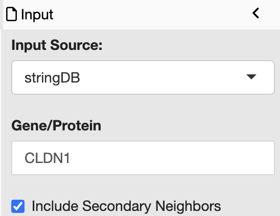
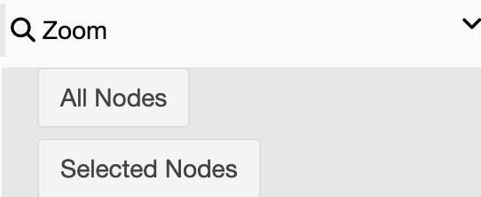

# Network Explorer Tutorial

## Launching Network Explorer

### Launching in Stand-alone Mode

To launch the Network Explorer app in stand-alone mode:

1. In Foundry's top banner, click `Apps`
2. Open the `Shared Apps` tab
3. Search for `Network Explorer` or find the app in the table
4. Click `Launch`

### Launching from Report Tab

The Network Explorer app can also be launched with pre-loaded data following a completed Foundry run. To do so:

1. After opening the completed run, select the `Report` tab
2. Select any file with an .Rmd extension (it doesn't matter which one)
3. Click `Launch` in the Network Explorer box

## Network Input

Network information can be taken from multiple locations:

### STRING

All annotated protein-protein interactions in the STRING database for a specified protein can be extracted by selecting stringDB as the input source and providing the desired gene or protein of interest.

The "Include Secondary Neighbors" toggle will add all annotated interactions that are two degrees away from the specified protein.

### User Defined

Users can upload a network of interactions directly with a tab separated input file of edges. The minimal file consists of at least two columns:

1. source
2. target

where an interaction exists from the source to the target. Addition columns may be present.

**Note: The uploaded file must contain columns that are exactly "source" and "target"**

## Node Options

Additional metadata for nodes can be uploaded in the metadata section which can be used to customize node appearance. If launched from the report tab, the corresponding metadata will be pre-loaded if possible. One can still upload additional metadata by setting the `Metadata Source` to 'Manual'

The minimal metadata file consists of a column called exactly "gene". The values in this column correspond to the id of the nodes.

The node color and size can be controlled by metadata information and calculated values (node centrality) by selecting a column. Only columns with underlying numeric data will be available.

## Layout

The network layout can be changed by selecting the desired layout from the drop down in the layout panel.

## Centrality

Centrality will be calculated for every node depending. The centrality algoritm can be selected in the drop-down in the centrality panel. 

Available algorithms are:

* [Betweenness](https://igraph.org/r/doc/betweenness.html)
* [Closeness](https://igraph.org/r/doc/closeness.html)
* [Degree](https://igraph.org/r/doc/degree.html)

Depending on the algorithm, other parameters may be necessary.

## Zoom

The network can automatically be zoomed to fit all or the currently selected nodes in the zoom panel.

## Node Selection

Nodes can be selected by clicking on their corresponding circle on the graph. Holding shift or control will allow for the selection of multiple nodes. Alternatively, specific nodes can be selected in the box, and then selected with the "select" button.

Nodes can be unselected by clicking on a selected node or all nodes can be unselected at once with the 'unselect all button'.

The "get neighboring nodes" button will select all nodes that neighbor the currently selected node(s)

## Node Metadata

The node data can be found by selecting the "Node Properties" tab above the graph. This will contain internally calculated values as well as any uploaded metadata.

