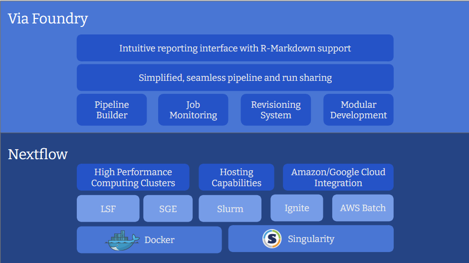

# Short Overview

## What is Via Foundry?

[Via Foundry](https://www.viafoundry.com//) is the web interface of an
intuitive and powerful bioinformatics platform designed to simplify
pipeline design, development and maintenance, enabling analysis and
management of mass quantities of samples on High Performance Computing
(HPC) environments, cloud services (AWS, Google Cloud etc.), or personal workstations. It
automatically builds [Nextflow](https://www.nextflow.io/) pipelines by
assembling components such as processes and modules, enabling seamless
implementation of complex bioinformatics workflows. Moreover, we offer assistance for nf-core or customized nextflow pipelines, allowing easy integration of these pipelines directly from Github or Bitbucket repositories.

## Benefits of Via Foundry's Design

-   **Build:** Via Foundry's drag-and-drop interface allows for
    effortless creation of new pipelines, without the need to write
    commands from scratch. Existing processes/modules can be reused to
    create new pipelines, which can then be exported as Nextflow files
    or readily run within Via Foundry.
-   **Run:** Pipelines can be executed in any host environment with
    different executors, such as SGE, LSF, SLURM, Ignite, and more. Via
    Foundry also seamlessly integrates with Amazon/Google Cloud,
    allowing for easy creation of a cluster in the cloud, execution of
    the pipeline, and transfer of results to a cloud storage service
    (Amazon Storage, S3 or Google Storage, GS).
-   **Resume:** Via Foundry's continuous checkpoint mechanism keeps
    track of each step of the running pipeline, enabling partially
    completed pipelines to be resumed at any stage, even after parameter
    changes.
-   **Analyze:** Via Foundry's report section provides a concise summary of 
each executed step, facilitating efficient data analysis. It also allows 
for seamless exploration of reported files through interactive applications 
like Shiny App, R-Studio (R-Markdown), Jupyter Notebook, or any other containerized app.

-   **Improve:** Via Foundry's revisioning system keeps track of
    pipeline and process versions, as well as their parameters. This
    allows for easy editing, improvement, and customization of shared
    pipelines according to your needs.
-   **Share:** Via Foundry allows for easy sharing of pipelines across
    different platforms, with the ability to isolate pipeline-specific
    dependencies in a container and easily replicate methods in other
    environments (clusters, clouds etc.).

## What is Nextflow?

[Nextflow](https://www.nextflow.io/) is an incredibly potent and
versatile framework. Based on the dataflow programming model, it is used
for building parallelized, scalable and reproducible workflows using
software containers, which provides an abstraction layer between the
execution and the logic of the pipeline, which means that the same
pipeline code can be executed on multiple platforms.

## Who is Via Foundry for?

Via Foundry is designed for a wide variety of users, from bench
biologists to expert bioinformaticians.

Executing pipelines in Via Foundry requires no programming knowledge. We
aim to provide comprehensive explanations to guide users before they
execute their pipelines. After a run completes, we provide an overall
execution summary of each step, gathering all of the samples in simple
tables or interactive apps/plots for ultimate comparison.

Building pipelines in Via Foundry requires basic scripting knowledge and
familiarization with Nextflow to effectively use its operators. You
don't need to learn all of the Nextflow syntax; instead, you can easily
focus on the processes where basic input and output nodes are defined.
The rest, such as creating and linking the channels, is handled by Via
Foundry.

## Why not just write a Nextflow pipeline?

In many cases, building a static Nextflow pipeline is sufficient for
achieving our goals. However, it can be difficult to maintain process
and module revisions using simple text editors. With the help of Via
Foundry's user interface, you can easily **track the evolution of each
process and module** by accessing their previous revisions. When
upgrading existing pipelines, it's much easier to update each process
because all of the process-related scripts are isolated in a process
circle, and you don't need to deal with other parameters or channel
operations that are defined in other parts of the Nextflow script. This
**modular structure** gives us more flexibility and dynamism to create
very complex pipelines with little effort.

Furthermore, Via Foundry has a built-in **form creator** that
dynamically updates the run page according to the parameters defined in
the process. This tool becomes especially powerful when creating complex
pipelines with hundreds of optional parameters. As seen in the example
below, you can easily isolate process-related parameters in their
specific windows.

Please feel free to reference this image, which outlines the features of
Via Foundry and Nextflow, to better understand the ethos of Via Foundry.

## Public Pipelines

Attached is a brief list of Via Foundry's current public pipelines,
along with some important sub-modules, all of which are ready to execute
in your environment.

-   RNA-Seq Pipelines (RSEM, HISAT, STAR, Salmon, Kallisto, FeatureCounts)

-   ATAC-Seq Pipeline (MACS2)

-   ChIP Seq Pipeline (MACS2)

-   Single Cell Pipelines (10X Genomics, Indrop)

-   piRNA Pipelines (piPipes ChIP-Seq, Degradome/RAGE/CAGE, smallRNA)

-   

    Sub-Modules:

    -   Trimmer
    -   Adapter Removal
    -   Quality Filtering
    -   Common RNA Filtering
    -   ESAT
    -   FastQC,
    -   MultiQC
    -   RSeQC
    -   Picard
    -   IGV and UCSC genome browser file conversion
