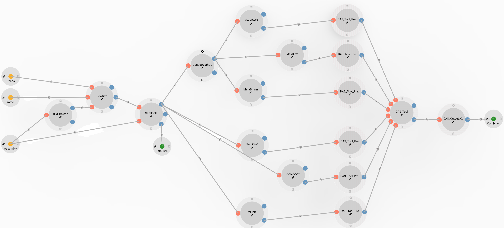

# Meta-CAMP: Metagenome Assembly Binning Module

## Overview

The **CAMP - Metagenome Assembly Binning module** serves as both a standalone [MAG binning pipeline](https://github.com/MetaSUB-CAMP/camp_binning) and a component of the broader [CAMP metagenome analysis pipeline](https://github.com/Meta-CAMP). This module is designed to be self-contained, providing comprehensive setup instructions, and is fully compatible with other CAMP modules through standardized input and output configuration files.

The module aims to replicate the functionality of [MetaWRAP](https://github.com/bxlab/metaWRAP), a prominent ensemble method, enhancing it with:

1. Superior dependency conflict management.
2. Improved integration with new binning algorithms.

The current binning algorithms included are: `MetaBAT2`, `CONCOCT`, `SemiBin2`, `MaxBin2`, `MetaBinner`, and `VAMB`, along with the bin refinement tool `DAS Tool`.

## Inputs

### Required Inputs

- **Reads**
    - **Description:** Error-corrected read files. Either BayesHammer (SPAdes) or Tadpole (BBMap) can be used for correction.

- **Assembly File**
    - **Description:** `.fasta` (or `.fasta.gz`) files generated from the assembly module or user-created assembly files.

### Optional Inputs

- **Binning Tool**
    - **Description:** Users can select from multiple binning tools, which operate in parallel without affecting execution time.

## Outputs

### Published Outputs

- **Refined Bin Files**
    - **Description:** Output files containing refined bins, named according to the binning tool used, with a `.fa` extension.

### Intermediate Outputs

- **BAM-BAI Folder**
    - **Description:** Contains `.bam` and `.bai` files for alignment file binary compression using samtools.

### Temporary Outputs

- **Bowtie2-Build Log File (`*.log`)**
    - **Description:** Log of terminal messages for the Bowtie2 aligner index builder.

- **Bowtie2 Log File (`*.bow`)**
    - **Description:** Log of terminal messages for Bowtie2 alignment.

- **Bowtie2 Unaligned Files (`*.fastq`)**
    - **Description:** Forward and reverse read files not aligned to the reference index.

- **Samtools Log File (`*.log`)**
    - **Description:** Log of terminal messages for samtools.

- **ContigDepthCalculator Log File (`*_depth.log`)**
    - **Description:** Log of terminal outputs for coverage calculation of assembly contigs.

- **Binning Algorithm Log Files (`*.log`)**
    - **Description:** Logs for each binning algorithm process, including MetaBAT2, MaxBin2, MetaBinner, SemiBin2, CONCOCT, and VAMB.

- **DAS Tool Preparation Directories**
    - **Description:** Directories created for input preparation for the DAS Tool bin refinement process.

- **DAS Tool Log File (`*.log`)**
    - **Description:** Log of terminal outputs from the DAS Tool bin refinement process.

- **Bin Output Collector**
    - **Description:** Directory for binned file outputs for each sample.

## Usage Guidelines

This pipeline can be executed with or without additional components of the Meta-CAMP workflow. The following recommendations should enhance your experience:

### Input Recommendations

- **Read Quality**: Verify that the read quality meets these thresholds:
    - **Phred Quality Scores**: Ensure a percentage of bases have Phred scores ≥ Q30 (indicating high-quality bases).
    - **Per Base Sequence Quality**: Review the distribution of quality scores across the read lengths.
    - **Sequence Length Distribution**: Confirm uniformity or acceptable variability in read lengths.

- **Employ Multiple Binning Tools**: Utilizing various binning tools ensures diverse contig clusters as different parameters and methods might result in varying bin files. Running all available bin tools is advisable since DAS Tool refines multiple bin files.

- **Bin Threshold**: Users should determine length thresholds for contigs based on their clustering preferences. The default minimum contig length for optimal clustering is set to 2500 base pairs.

### Scalability

For resource requirements, please refer to the Meta-CAMP GitHub repository for default specifications.
