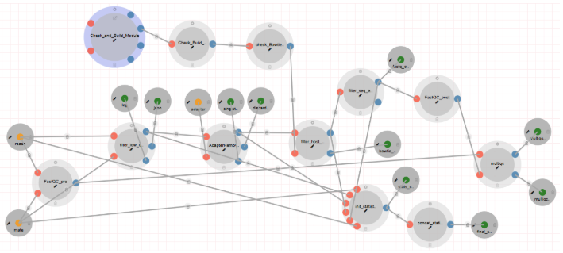

# CAMP Short-Read Quality Control Module Overview

The CAMP Short-Read Quality Control Module is designed to assess the quality of short-read sequencing, ensuring high-confidence data suitable for downstream analyses. This module operates both as a standalone MAG short-read quality control pipeline and as part of the broader CAMP metagenome analysis pipeline. 

The key operations performed by the module include:

- Removal of low-quality sequences based on criteria such as Phred scores, read length, presence of ambiguous bases (Ns), adapter sequences, and polyG/X stretches.
- Host read removal and sequencing error correction.

To facilitate comprehensive quality assessment, the module generates summary statistics and reports using MultiQC.

## Features

- Support for paired-end FastQ files.
- Modular filtering for low-quality sequences, adapters, host reads, and sequencing errors.
- Generation of detailed quality control summaries via FastQC and MultiQC.

## Input/Output Specification

### Inputs

#### Required
- **reads**  
  Description: A collection of paired-end FastQ read files.

- **adapter**  
  Description: Sequences of adapters used in library preparation.

### Outputs

#### Published Outputs
- **Final_read_stats.csv**  
  Description: A summary output that includes detailed statistics about reads following preprocessing steps.  
  Visualization App: Table

- **Pre MultiQC Report**  
  Description: An aggregated summary consolidating quality metrics from the raw FastQ files.  
  Visualization App: HTML

- **Post MultiQC Report**  
  Description: An aggregated summary consolidating quality metrics following preprocessing steps.  
  Visualization App: HTML

#### Intermediate Outputs
- **Filtered reads (.fastq.gz)**  
  Description: FastQ files that are error-corrected and have host reads removed.

## Usage Guidelines

### Input Recommendations

To ensure optimal read quality, confirm that the following thresholds are met:

- **Phred Quality Scores:** Ensure that the percentage of bases with Phred scores ≥ Q30 is high (indicative of high-quality bases).
- **Per Base Sequence Quality:** Evaluate the distribution of quality scores across the length of the reads.
- **Sequence Length Distribution:** Check for uniformity in read lengths or expected variability.
