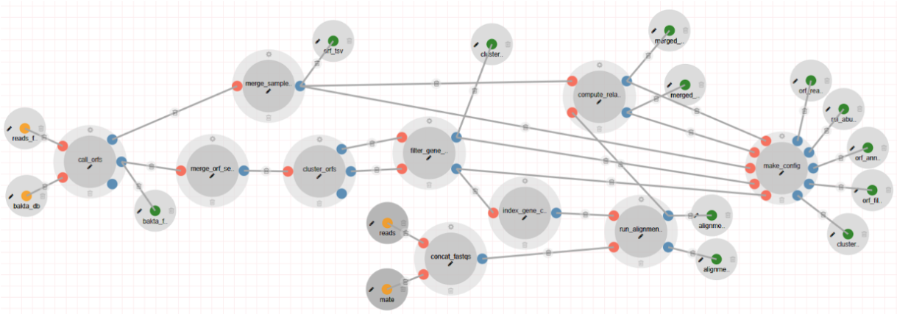

# CAMP Gene Cataloguing Module

The CAMP Gene Cataloguing Module generates and functionally annotates a gene catalog derived from assembled contigs. It processes assembled FASTA files along with error-corrected, host-removed, paired-end reads as input.

## Overview

The CAMP Gene Cataloguing pipeline orchestrates the identification and functional annotation of genes from assembled contigs.

## Features

- **Branching Pipelines:** Utilize containerization via Docker for managing environments and dependencies.
- **Scalability:** Supports concurrent execution for multiple samples.

## Input/Output Specifications

### Inputs

#### Required

- **`reads_fasta`**  
  **Description:** Assembled FASTA files provided as a collection.

- **`reads`**  
  **Description:** Processed paired-end FASTQ reads.

- **`bakta_db`**  
  **Description:** Path to the database folder utilized by Bakta for Open Reading Frame (ORF) annotation.

### Outputs

#### Published Outputs

- **`bakta_faa`**  
  **Description:** FASTA files containing predicted Open Reading Frames (ORFs) for each sample.  
  **Visualization App:** DataTables.

- **`orf_annotations.tsv`**  
  **Description:** A consolidated annotation file detailing ORFs across all samples.  
  **Visualization App:** DataTables.

- **`orf_read_cts.tsv`**  
  **Description:** A TSV file summarizing total read counts aligned to ORFs for all samples.  
  **Visualization App:** DataTables.

- **`orf_abundances.tsv`**  
  **Description:** A TSV file containing the relative abundances of ORFs across all samples.  
  **Visualization App:** DataTables.

- **`orf_filt_seq.fasta`**  
  **Description:** A FASTA file with representative sequences of filtered ORF clusters.  
  **Visualization App:** DataTables.

- **`orf_cluster_sizes.csv`**  
  **Description:** A CSV file reporting the sizes of ORF clusters.  
  **Visualization App:** DataTables.

- **`diamond/{sample}.tsv`**  
  **Description:** A TSV file summarizing the alignment of reads against the filtered ORF database.  
  **Visualization App:** DataTables.

## Workflow

1. Identify Open Reading Frames (ORFs) in the de novo assembly using Bakta.
2. Cluster identified ORFs based on sequence similarity via MMSeqs.
3. Execute filtering of ORFs based on user-defined criteria.
4. Create a DIAMOND database from the filtered ORF sequences.
5. Align ORFs to the DIAMOND database to obtain the functional profile of the sample.
6. Calculate the relative abundance of each identified ORF across all samples.
