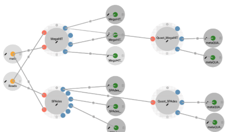

# Meta-CAMP - Short Read Assembly Module

## Overview

The **CAMP - Short Read Assembly Module** is designed for the assembly of error-corrected paired-end reads. This module functions as both a standalone [short-read assembly pipeline](https://github.com/MetaSUB-CAMP/camp_short-read-assembly) and as part of the larger [CAMP metagenome analysis pipeline](https://github.com/MetaSUB-CAMP), ensuring seamless compatibility with other CAMP modules.

Users have the option to utilize either `MetaSPAdes` or `MegaHIT` for the assembly process. Both assembly tools can be selected individually or together.

Short read assembly is a key step in bioinformatics where short DNA sequences, typically produced by high-throughput sequencing technologies such as Illumina, are reconstructed to form the original genome. The assembly process involves aligning and merging short reads, generally ranging from 50 to 300 base pairs, based on overlapping regions to create longer contiguous sequences, known as contigs. This process is crucial for various applications, including genome sequencing, metagenomics, and transcriptomics.

However, the assembly of short reads poses challenges due to repetitive sequences, sequencing errors, and the large volume of data. The error-corrected reads are provided as input to the pipeline. The assembly methods differ: `MegaHIT` employs a succinct de Bruijn graph algorithm, while `SPAdes` utilizes A-Bruijn graphs with paired assembly graphs.

To guarantee the quality of these assemblies, tools such as assembly checkers are utilized. `metaQUAST`, an extension of `QUAST` (Quality Assessment Tool for Genome Assemblies), is specifically designed for metagenomic data. It assesses the completeness, contiguity, and accuracy of assembled genomes, comparing them to reference genomes and other metrics. `metaQUAST` generates comprehensive reports and visualizations, aiding researchers in identifying potential issues and refining their assembly strategies.

## Features

- **Support for Multiple Assemblers:** Choose from SPAdes and MegaHIT for short read assembly. The assembler option is presented to the user at the start of the pipeline.

- **Branching Pipelines:** Environments and dependencies are containerized using Docker, Singularity, and Conda.

- **Scalability:** The Short Read Assembly Module can process multiple samples concurrently.

## Input/Output Specification

### Inputs

#### Required Inputs

- **Reads - .fastq.gz**
  - **Description:** Error-corrected paired-end read files. Either BayesHammer (SPAdes) or Tadpole (BBMap) can be used for read correction.

- **Assembly Tool - User Choice**
  - **Description:** Choose either SPAdes, MegaHIT, or both (note that selecting both will double the analysis time).

### Outputs

#### Published Outputs

- **Assembly file(s) (*.fasta.gz)**
  - **Description:** Assembly contig file (.fasta.gz) for each sample.
  - **Visualization:** Text.

- **Assembly Statistics (Optional) (Contig Statistics)**
  - **Description:** Contig sequence properties file (.csv) of the determined assembly.
  - **Visualization:** Table.

- **Assembly Statistics (Optional) (Contig Lengths)**
  - **Description:** Table of contig lengths (.csv) associated with the assembly.
  - **Visualization:** Table.

- **Assembly Quality Report (*.html)**
  - **Description:** metaQUAST assembly quality report (icarus.html).
  - **Visualization:** HTML.

- **Assembly Quality Report (*.csv)**
  - **Description:** metaQUAST assembly quality reports in table format.
  - **Visualization:** Table.

#### Temporary Outputs

- **SPAdes Log Files (*.log)**
  - **Description:** Log file containing messages from the SPAdes process.

- **MegaHIT Log Files (*.log)**
  - **Description:** Log file containing messages from the MegaHIT process.

- **QUAST Log Files (*.log)**
  - **Description:** Log file containing messages from the QUAST process.

- **SPAdes Assembly Graph (assembly_graph_with_scaffolds.gfa)**
  - **Description:** Assembly graph created by SPAdes.

- **SPAdes Assembly Scaffolds (scaffolds.fasta)**
  - **Description:** Assembly scaffolds produced by SPAdes prior to merging into contigs.

## Usage Guidelines

The pipeline can be executed both independently and as part of the broader CAMP workflow. Below are some important guidelines to consider.

### Input Recommendations

- Ensure Read Quality adheres to the following thresholds:
  - **Phred Quality Scores:** Percentage of bases with Phred scores ≥ Q30 (high-quality bases).
  - **Per Base Sequence Quality:** Distribution of quality scores along the length of reads.
  - **Sequence Length Distribution:** Ensure uniform read lengths or expected variability.

- The chosen error correction method influences the assembly method:
  - **MegaHIT:** Typically uses the Tadpole error correction method.
  - **SPAdes:** Employs the bayesHammer error correction method integrated within SPAdes.

### Scalability

- Default resource requirements can be found on the Meta-CAMP GitHub repository.
