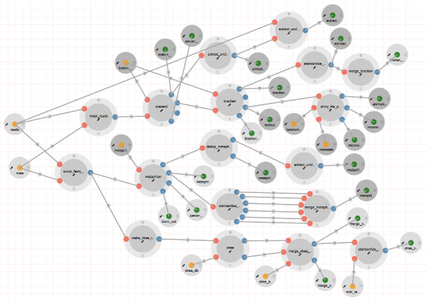
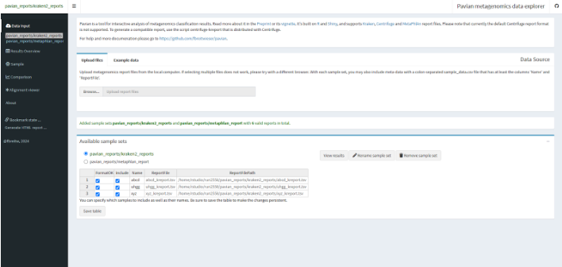
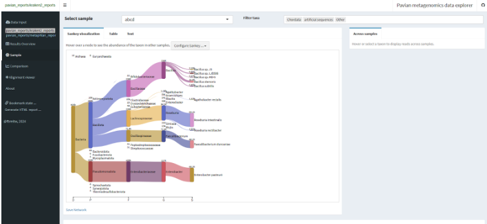
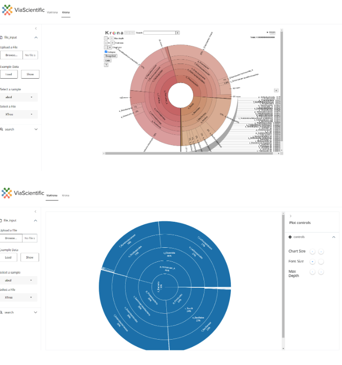

# CAMP Short-Read Taxonomy Module

## Overview

The CAMP Short Read Taxonomy module is designed for taxonomic classification of short-read sequencing data. It accepts processed paired-end FASTQ files as input and performs classification using MetaPhlAn4, Kraken2 (combined with Bracken for relative abundance estimation), and XTree (formerly known as UTree). 

For taxonomic abundance estimation, MetaPhlAn4 calculates marker gene coverage; Bracken utilizes k-mer uniqueness-based scaling; and XTree estimates from unique k-mer proportions. Given the diversity of output formats, the raw reports from each algorithm are standardized to facilitate easier downstream comparisons.

Additionally, a suite of R-shiny applications is available for detailed analysis and visualization of the results, enhancing user understanding.

## Workflow

### General Workflow Steps

1. The input FASTQ files are masked using the `bbmask` tool, generating masked FASTQ files.

### MetaPhlAn4 Workflow

- Scrub FASTQ captions to prepare files for MetaPhlAn4 analysis.
- Analyze scrubbed FASTQ files with MetaPhlAn4 to classify the microbial community, producing a report file and a SAM file.
- Standardize the MetaPhlAn4 report into CSV files for each taxonomic rank: species, genus, family, order, class, and phylum.
- Merge the standardized MetaPhlAn CSV files across all samples into a final report for each taxonomic rank.
- Deduplicate the SAM files generated by MetaPhlAn4 to remove redundant entries.
- Extract unclassified reads from the deduplicated SAM files and save them in separate FASTQ files.

### Kraken2 and Bracken Workflow

- Process the masked reads with Kraken2 to classify the sequences, resulting in a Kraken report and Kreport file.
- Analyze the Kreport file using Bracken to estimate relative abundance at various taxonomic ranks.
- Standardize the Bracken results into CSV files for different taxonomic ranks.
- Merge the standardized Bracken CSV files across all samples into a final report for each taxonomic rank.
- Extract names of unclassified sequences from the Kraken output.
- Retrieve unclassified reads corresponding to these names from the original FASTQ files.

### XTree Workflow

- Combine processed FASTQ files to create an input file for XTree.
- Use XTree to classify sequences based on different databases, producing reference and coverage files.
- Merge and process the coverage files generated by XTree to create a relative abundance table for diverse taxonomic groups.
- Standardize the merged XTree output into CSV files for various taxonomic ranks, including species, genus, family, order, class, and phylum.

## Features

- **Support for Multiple Taxonomic Classifiers:** Includes MetaPhlAn4, Kraken2 (with Bracken for relative abundance estimation), and XTree (formerly UTree).
- **Branching Pipelines:** Environments and dependencies are containerized via Docker.
- **Scalability:** The module can process multiple samples concurrently.
- **Visualization Support:** A range of shiny applications are available for result visualization.

## Input/Output Specifications

### Inputs

#### Required Inputs

- **reads**  
  *Description:* Error-corrected, host-read-removed paired-end FASTQ files (outputs from the short-read quality control module can be used).

- **Kraken db**  
  *Description:* Database files for Kraken classification. The pipeline provides default DB files, but the `kraken2-build` command can be used to build additional databases.

- **metaphlan db**  
  *Description:* MetaPhlAn4 database files for the analysis process. The pipeline offers default DB files, with the option to build databases using the `metaphlan --install --bowtie2db /path/to/database_dir` command.

- **xtree db**  
  *Description:* Database files for the XTree process. Default DB files are provided.

- **xtree_all_db_mapping**  
  *Description:* Mapping reference linking sequence identifiers to their corresponding taxonomic labels or annotations. A default mapping file is provided.

- **ncbi_taxid**  
  *Description:* A `.dmp` file from the NCBI Taxonomy database, mapping taxonomic identifiers (TaxIDs) to their associated names.

#### Optional Inputs

- **metadata**  
  *Description:* Metadata for samples used in the microViz and animalcules apps. Row names should represent sample names, with columns including any sample-related information (e.g., age, sex, disease). Required for using these apps.

- **taxonomy_db**  
  *Description:* NCBI taxonomy database file comprising a data frame with columns: taxID, parent_taxID, rank, and name. Default parameters are provided.

### Outputs

#### Published Outputs

- **Kraken2_report**:  
  *Description:* Read counts of taxonomic classifications.  
  *Visualization Apps:* Pavian, DataTables.

- **metaphlan_report**:  
  *Description:* Relative abundances of taxa across various hierarchical levels.  
  *Visualization Apps:* Pavian, DataTables.

- **metaphlan_final_report**:  
  *Description:* Merged MetaPhlAn report incorporating all samples.  
  *Visualization Apps:* DataTables.

- **xtree_csv**:  
  *Description:* Merged XTree abundances data.  
  *Visualization Apps:* DataTables.

- **merge_xtree_csv**:  
  *Description:* Merged relative abundance data produced by XTree.  
  *Visualization Apps:* Krona, DataTables.

- **animalcules_out**:  
  *Description:* Merged relative abundance data produced by XTree.  
  *Visualization Apps:* animalcules, DataTables.

- **pavian_report**:  
  *Description:* Pavian shiny app for interactive analysis of Kraken and MetaPhlAn reports.  
  *Visualization Apps:* Pavian, DataTables.

- **kraken_bracken_merge_csv**:  
  *Description:* CSV file containing merged standardized Bracken outputs across all samples.

- **xtree_csv**:  
  *Description:* Standardized XTree output with relative abundance data.

#### Intermediate Outputs

- **extract_kraken_tsv**:  
  *Description:* TSV file containing extracted names of unclassified reads from Kraken output.

- **bracken_tsv**:  
  *Description:* TSV file with relative abundance at various taxonomic ranks.

- **bracken_report**:  
  *Description:* File reporting the number of reads at different taxonomic ranks.

- **extract_kraken_fq**:  
  *Description:* FASTQ file containing extracted unclassified reads from the input files.

- **standardize_bracken_tsv**:  
  *Description:* TSV file containing Bracken output in a standardized format.

- **extract_unclassified_metaphlan**:  
  *Description:* FASTQ file containing unclassified reads extracted from BAM files.

- **extract_unclassified_kraken**:  
  *Description:* FASTQ file containing unclassified reads extracted from the input files.

- **biom_out**:  
  *Description:* .biom file with relative abundance data produced by MetaPhlAn.

## Shiny Applications

### Pavian

Pavian is an interactive browser application for analyzing and visualizing classification results from classifiers, including Kraken, KrakenUniq, Kraken 2, Centrifuge, and MetaPhlAn. For more information, refer to the publication available at [https://doi.org/10.1093/bioinformatics/btz715](https://doi.org/10.1093/bioinformatics/btz715).

### Krona App

Krona provides a means to explore hierarchical data through zoomable, multi-layered pie charts. Users can select samples and display files generated by either XTree or MetaPhlAn4.

### MicroViz

The MicroViz shiny app serves as an interactive environment for exploring microbiota data, combining ordination plots with abundance bar charts. Users can delve into ordination plots, select samples, and analyze their taxonomic compositions on a customizable stacked bar chart with a clear color scheme.
