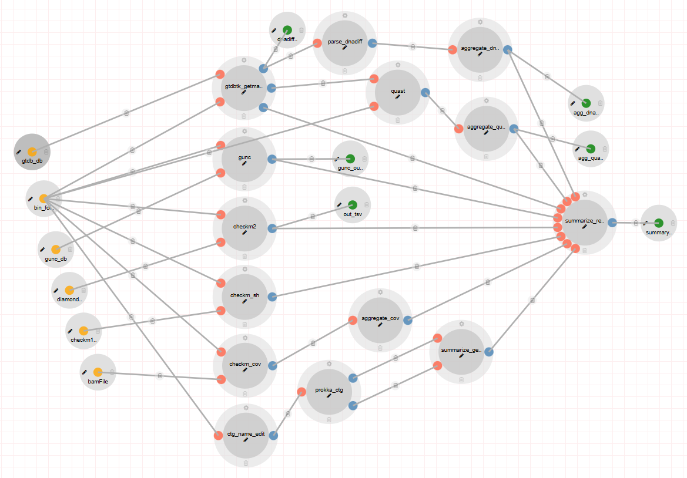

# CAMP MAG Quality-Checking Module 



## Overview

The CAMP MAG quality-checking pipeline integrates several tools, including CheckM, gunc, GTDB-Tk, DNADiff, QUAST, and CMSeq, to evaluate the overall quality of the Metagenome-Assembled Genome (MAG) binning process.

### Workflow

The quality assessment of consensus refined MAGs involves the following parameters and steps:

- **Contamination and Completeness Assessment:** 
  - CheckM calculates completeness based on the number of lineage-specific marker gene sets present in a MAG, while contamination is determined by the number of over-represented multiple copies of a marker gene within the MAG.
  - The gunc tool provides additional assessment of MAG quality.

- **Mapping Reads to MAGs:** 
  - Bowtie2 is used for mapping reads to MAGs, followed by sorting alignments with samtools and indexing the resulting BAM file.

- **MAG Annotation:** 
  - Prokka is utilized for annotating MAGs.

- **Detection of Polymorphic Sites:** 
  - CMSeq analyzes the MAGs to detect polymorphic site rates.

- **MAG Classification:** 
  - GTDB-Tk classifies MAGs by estimating average nucleotide identity (ANI) against a database of reference genomes.

- **Reference Genome Comparison:**
  - For MAGs with a definitive species classification, QUAST calculates genome-based completion, misassembly, and non-alignment statistics by comparing the contig content to the reference genome.

## Features

- **Support for Multiple Tools:**  
  This module incorporates CheckM, gunc, GTDB-Tk, DNADiff, QUAST, and CMSeq.

- **Branching Pipelines:**  
  The pipeline environments and dependencies are containerized using Docker, facilitating streamlined operations.

- **Scalability:**  
  The CAMP MAG quality-checking module allows concurrent execution for multiple samples.

## Input/Output Specification

### Inputs

#### Required

- **bin_folders**  
  *Description:* Folders containing FASTA files (including contigs or scaffolds) organized by sample name. Folder structure must be as follows:

  ```
  bin_folders: /path/to/bins/
  ├── sample1
  │   ├── bin.0.fa
  │   ├── bin.1.fa
  │   ├── bin.2.fa
  │   ├── bin.3.fa
  │   └── bin.unbinned.fa
  └── sample2
      ├── bin.0.fa
      ├── bin.1.fa
      ├── bin.2.fa
      ├── bin.3.fa
      └── bin.unbinned.fa
  ```

- **diamond_db**  
  *Description:* Diamond database file.

- **checkm1_db**  
  *Description:* Directory containing the CheckM database.

- **gunc_db**  
  *Description:* Xtree database for the gunc process. The pipeline includes default database files.

- **gtdb_db**  
  *Description:* Genome Taxonomy Database (GTDB) utilized by GTDB-Tk.

- **bamFile**  
  *Description:* Folder containing BAM files and their respective index (.bai) files. Each folder must be named after the corresponding sample and should include only one BAM file and one BAI file.

- **extension**  
  *Description:* File extension for bin files. The default value is "fa".

### Outputs

#### Published Outputs

- **summary_report**  
  *Description:* Provides a comprehensive view of all quality and annotation data for each sample.  
  *Visualization App:* DataTables

- **agg_quast_tsv**  
  *Description:* Aggregated quality assessment data across all bins within a sample from QUAST.  
  *Visualization App:* DataTables

- **agg_dnadiff_tsv**  
  *Description:* Aggregated difference data across all bins within a sample from DNADiff.  
  *Visualization App:* DataTables

- **gunc_out_tsv**  
  *Description:* Summarizes quality (contamination) and taxonomic consistency of bins in TSV format.  
  *Visualization App:* DataTables

- **checkm2_out_tsv**  
  *Description:* Summarizes the quality and completeness of bins using the CheckM2 tool in TSV format.  
  *Visualization App:* DataTables