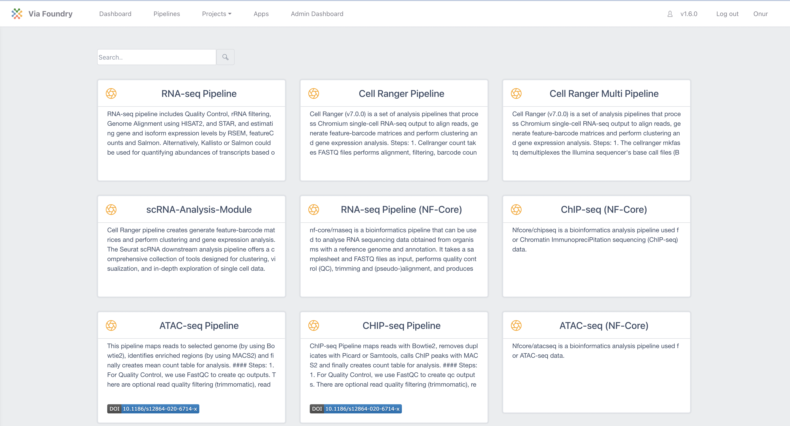

# Pipeline Examples

There are numerous publicly available pipelines and processes available
on the Via Foundry website. Please note that this document only contains
a small sampling of the pipelines Via Foundry offers. For the full list
of pipelines and to explore each pipeline in detail, please visit the
[Via Foundry Pipeline page](https://www.viafoundry.com/pipeline).

Once you navigate to the Pipelines tab, simply click on the respective pipeline's box to access a comprehensive overview. This summary provides detailed information regarding the pipeline, such as its usage instructions and example output/report sections.

## RNA-Seq Pipeline

The RNA-seq pipeline publicly available in Via Foundry includes several
key steps for processing RNA-seq data:

1.  Quality Control: FastQC is used to generate quality control (QC)
    outputs. Optional processes such as read quality filtering
    (trimmomatic), read quality trimming (trimmomatic), and adapter
    removal (cutadapt) are available.
2.  rRNA Filtering and Genome Alignment: Bowtie2, Bowtie, and STAR are
    utilized for counting or filtering out and estimating the abundance
    of both standard and predefined sets of genomic loci, such as rRNAs,
    miRNAs, tRNAs, piRNAs, snoRNAs, and ERCC.
3.  Gene and Isoform Expression Estimation: RSEM is employed to align
    RNA-seq reads to reference transcripts and estimate gene and isoform
    expression levels.
4.  Genome Alignment: HISAT2, STAR, Kallisto or Salmon are employed to align
    RNA-seq reads to the genome. Optional estimation of gene and isoform
    expression levels can be performed using featureCounts and Salmon.
5.  Quality Metrics and Reports: If the user opts to perform genomic
    alignments, the pipeline generates overall quality metrics,
    including coverage and the number of mapped reads to different
    genomic and transcriptomic regions. These reports rely on Picard's
    CollectRNASeqMetrics program (Broad Institute, n.d.) and the RSeQC
    program (Wang, Wang, and Li 2012).
6.  Visualization: Optional generation of Integrative Genomics Viewer
    (IGV) and Genome Browser Files (TDF and Bigwig) is available.
7.  Quantification Matrix and Analysis: The RNA-seq pipeline provides a
    quantification matrix that includes estimated counts and transcript
    per million (TPM) values for each gene and annotated isoform. These
    matrices serve as input for differential gene expression analysis
    and can be directly uploaded to an embedded instance of DEBrowser
    software for interactive exploration of the resulting data
    (Kucukural et al. 2019).

Presented here is the example report tab for the RNA-Seq Run. Each section within the report consists of its own set of files, allowing you to thoroughly investigate and visualize the data within each respective section.

Below is a screenshot showcasing the interactive analysis of differential expression analysis using the Shiny app called DEbrowser.

## ATAC-Seq and ChIP-Seq pipelines

Via Foundry offers comprehensive pipelines for the processing of
ChIP-Seq and ATAC-Seq data, which are widely used in genomic research.
Although these pipelines share many common processes, they exhibit
specific differences at certain stages. Moreover, they rely on identical
data preparation steps employed in the RNA-Seq pipeline, including read
filtering, read quality reporting, and alignment to desired genomic
locations.

The key steps involved in the ChIP-Seq and ATAC-Seq pipelines are as
follows:

1.  Quality Control: The pipelines utilize FastQC to assess the quality
    of the sequencing reads and generate quality control outputs.
    Additionally, optional processes such as read quality filtering
    (trimmomatic), read quality trimming (trimmomatic), and adapter
    removal (cutadapt) can be employed to further refine the data.
2.  Counting and Filtering: To estimate the abundance of both standard
    and predefined sets of genomic loci (e.g., rRNAs, miRNAs, tRNAs,
    piRNAs, snoRNAs, ERCC), the pipelines employ tools like
    Bowtie2/Bowtie/STAR. These tools facilitate read counting or
    filtering to obtain valuable insights into the genomic regions of
    interest.
3.  Read Alignment: The short-read aligner Bowtie2 is employed to align
    the sequencing reads to a reference genome (Langmead and Salzberg
    2012). In cases where the input files are large, such as those
    obtained from ATAC-Seq experiments, the pipeline optimizes alignment
    speed by splitting the files into smaller chunks and performing
    parallel alignments.
4.  PCR Duplicate Removal: The pipelines incorporate the Picard mark
    duplicates function (Broad Institute, n.d.) and Samtools (H. Li et
    al. 2009) to estimate and remove PCR duplicates. By employing merged
    alignments, the duplicate reads can be efficiently identified and
    eliminated, ensuring accurate downstream analysis.
5.  ATAC-Seq-specific Analysis: In the case of ATAC-Seq data, the
    pipeline performs additional steps. It identifies accessible
    chromatin regions by estimating the Tn5 transposase cut sites. This
    estimation involves positioning on the 9th base upstream of the 5'
    read end and extending by 29 bases downstream. This extension
    process is based on studies (Donnard et al. 2018; Buenrostro et
    al. 2013) that have shown it to more accurately reflect the exact
    positions accessible to the transposase. Subsequently, peaks are
    called using MACS2 (Zhang et al. 2008) in both the ChIP-Seq and
    ATAC-Seq pipelines.
6.  Consensus Peak Calling and Quantification: When processing multiple
    samples together, the ATAC-Seq and ChIP-Seq pipelines offer the
    option of generating consensus peak calls. This is achieved by
    merging all peaks individually called in each sample using Bedtools
    (Quinlan and Hall 2010). Furthermore, the pipelines quantify the
    number of reads in each peak location using Bedtools' coverage
    function, facilitating comprehensive analysis of the data.
7.  Data Analysis: As a result, both the ATAC-Seq and ChIP-Seq pipelines
    generate a matrix containing count values for each peak region and
    sample. This matrix can be directly uploaded to the embedded version
    of DEBrowser (Kucukural et al. 2019) for performing differential
    analysis. Alternatively, the matrix can be downloaded for further
    analysis using other tools or methods.

## How To Cite Us

If you use Via Foundry (formerly DolphinNext) in your research, please
cite:

Yukselen, O., Turkyilmaz, O., Ozturk, A.R. et al. DolphinNext: a
distributed data processing platform for high throughput genomics. BMC
Genomics 21, 310 (2020). <https://doi.org/10.1186/s12864-020-6714-x>

## Support

For any questions or help, please reach out to
<support@viascientific.com> with your name and question.
