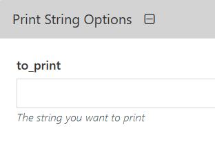
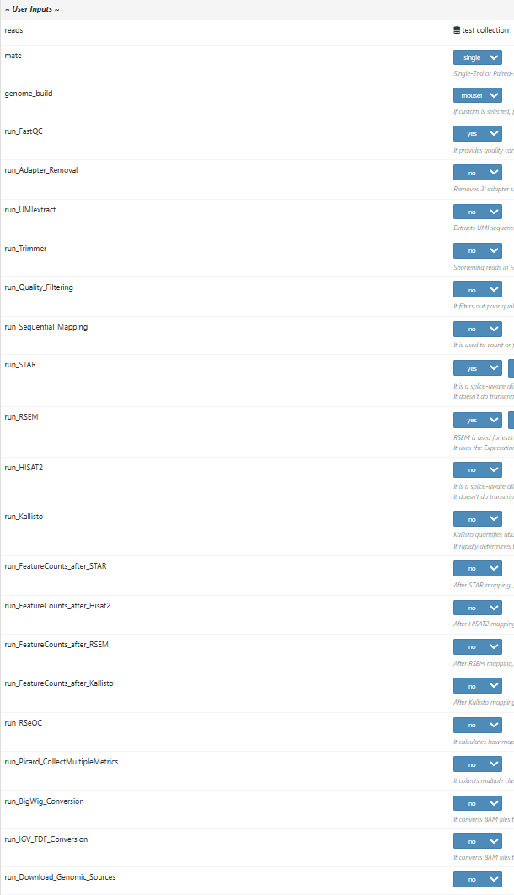

# Pipeline FAQs

This guide will walk you through some frequently asked questions pertaining to the creation and manipulation of pipelines in Via Foundry. If you don't see your question here, make sure to check out our [Pipeline Creation Guide](pipeline_guide.md), and as always, if you have any questions, please don't hesitate to reach out to support@viascientific.com. 

## **Configuring Inputs**

### What are some different ways I can create pipeline inputs?

Once you have your pipeline processes and workflow structured just the way you want, there are a couple different ways you can structure how the inputs appear on the runpage. 

#### Editing Input Parameters

Once you've added an input parameter to your workflow, you can edit it by pressing the pencil icon on the left of the input circle. Once in this editing menu, you'll see options for **Define Default Value**,** **Dropdown Options**,** **Show Settings**,** **Label**, and **Description**. Filling in these values corresponds to certain features in the **Inputs** section on the runpage. Take the STAR module in Foundry's RNA-Seq pipeline, for instance.


See the "mate" parameter on the left side of that image? Here's a look at how that parameter is filled.

{.align-center width="50.0%"}

Note that its **Dropdown Options** are "single" and "pair", separated by a comma; and that its **Description** is "Single-End or Paired-End Data". Now, let's take a look at the runpage for RNA-Seq.


You'll see that the dropdown menu for "mate" has "single" and "pair" as options, and (though this is obscured by the dropdown menu in the screenshot) its description is "Single-End or Paired-End Data", just as specified in the "Change Name" window for the "mate" input parameter. Additionally, since no **Default Value** was specified, the parameter is initially filled with a **Choose Value** dummy. If the **Default Value** had been set to "single", for instance, every runpage would be instantiated with "mate" set to "single". For such parameters as "mate", it's a good idea to edit the runpage configuration from the input parameter itself. However, there are more advisable methods for different parameters.

#### Arranging and Defining Input Parameters in Process Scripts

In addition to being able to define and specify how a given input parameter appears on the runpage from within the parameter's `Change Name`, Foundry users can also configure input forms while editing or creating a process. Essentially, in the **Script** or **Process Header** section of the process editing window, you can create forms, which the user will interact with to enter inputs on the runpage, with this syntax:
```
variableName = defaultValue //* @formType @description:"..." @tooltip:"..." @options:"..."
```
In short (and we do recommend reading up on the nuances of this syntax [here](process.md#process-options)), users are able to specify the name and default value (if any) of a given input, in addition to various aspects of how that input is presented on the runpage (e.g. entered via dropdown menu vs. text box vs. checkbox). For a rather simple example, take this line entered into the **Script** section of a dummy process called "print_string":
```
to_print = "" //* @input @description:"The string you want to print"
```

Now look at how this displays on the runpage.



Do note, though, that such parameters defined within processes appear below the regular **Inputs** section of the runpage, so be cognizant of how you'd like your pipeline inputs to be displayed. On the note of changing how inputs are displayed on the runpage, there's another method by which users can dictate the arrangement of their inputs.

*Important*: For more detailed information on how to write form scripts, as mentioned above, please reference the [Process Options](process.md#process-options) section of our Process Creation Guide.

#### Manipulating the Order of Inputs with nextflow.config

Foundry allows users to control which inputs appear in which order with the assistance of a nextflow.config file, which can be found in the `Advanced` tab of a pipeline's page. Complete details of this file are beyond the scope of this FAQ page, but there are certainly salient details to be aware of. Using the same script and syntax as discussed in the [previous question](pipeline_faq.md#arranging-and-defining-input-parameters-in-process-scripts), users can define inputs to their heart's content, and the order in which said inputs are specified corresponds to the order in which they are displayed on the runpage. For a visual aid, take this snippet of the nextflow.config file for our RNA-Seq pipeline:


When defining input parameters within a nextflow.config file, it's important to preface each name with "params.", as shown in the image. Once you've defined all your parameters, along with their runpage forms, they'll appear in the same order on the runpage, as they do here:



Here, we've presented three different ways to create pipeline inputs. Feel free to choose any combination of the three that best suits your needs and desires when creating and using pipelines on Via Foundry.

### How can I configure the autofill section of my pipeline?

To save users a lot of hassle on the back end, Via Foundry possesses a powerful autofill feature, wherein one can automatically fill input and executor property values, thus streamlining the pipeline execution process, based on simple conditions, such as whether the execution environment has a specific hostname and whether a given parameter has value *x*. Essentially, when writing scripts that automatically fill input values or executor properties, you simply want to enclose all your conditionals in "//* autofill" flags. For example: 

```
//* autofill
if $HOSTNAME == "..." {
    (fill parameters)
}
//* autofill
``` 

For much more detail on autofilling pipeline inputs, check out [this link](pipeline_guide.md#autofill-feature-for-pipeline-inputs), and if you'd like to find out how you can autofill pipeline executor properties, go [here](pipeline_guide.md#autofill-feature-for-pipeline-properties).

## **Support**

For any questions or help, please reach out to
<support@viascientific.com> with your name and question.