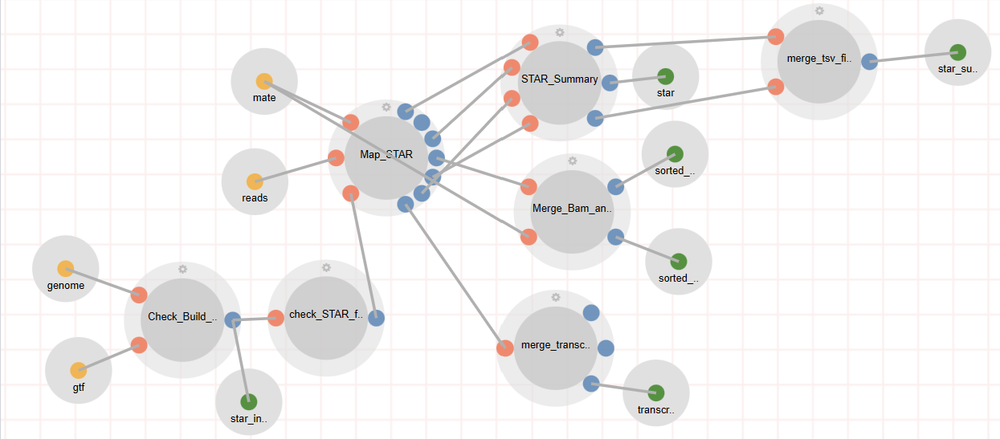

# Pipeline FAQs

This guide will walk you through some frequently asked questions pertaining to the creation and manipulation of pipelines in Via Foundry. If you don't see your question here, make sure to check out our [Pipeline Creation Guide](pipeline_guide.md), and as always, if you have any questions, please don't hesitate to reach out to support@viascientific.com. 

## **Configuring Inputs**

### What are some different ways I can create pipeline inputs?

Once you have your pipeline processes and workflow structured just the way you want, there are a couple different ways you can structure how the inputs appear on the runpage. 

#### Editing Input Parameters

Once you've added an input parameter to your workflow, you can edit it by pressing the pencil icon on the left of the input circle. Once in this editing menu, you'll see options for **Define Default Value**,** **Dropdown Options**,** **Show Settings**,** **Label**, and **Description**. Filling in these values corresponds to certain features in the **Inputs** section on the runpage. Take the STAR module in Foundry's RNA-Seq pipeline, for instance.



See the "mate" parameter on the left side of that image? Here's a look at how that parameter is filled.


Note that its **Dropdown Options** are "single" and "pair", separated by a comma; and that its **Description** is "Single-End or Paired-End Data". Now, let's take a look at the runpage for RNA-Seq.


You'll see that the dropdown menu for "mate" has "single" and "pair" as options, and (though this is obscured by the dropdown menu in the screenshot) its description is "Single-End or Paired-End Data", just as specified in the "Change Name" window for the "mate" input parameter. Additionally, since no **Default Value** was specified, the parameter is initially filled with a **Choose Value** dummy. If the **Default Value** had been set to "single", for instance, every runpage would be instantiated with "mate" set to "single". For such parameters as "mate", it's a good idea to edit the runpage configuration from the input parameter itself. However, there are more advisable methods for different parameters.

### How can I configure the autofill section of my pipeline?

To save users a lot of hassle on the back end, Via Foundry possesses a powerful autofill feature, wherein one can automatically fill input and executor property values, thus streamlining the pipeline execution process, based on simple conditions, such as whether the execution environment has a specific hostname and whether a given parameter has value *x*. Essentially, when writing scripts that automatically fill input values or executor properties, you simply want to enclose all your conditionals (for example:) 
```
if $HOSTNAME == "..." {(fill parameters)}
``` 
in "//* autofill" flags. For much more detail on autofilling pipeline inputs, check out [this link](pipeline_guide.md#autofill-feature-for-pipeline-inputs), and if you'd like to find out how you can autofill pipeline executor properties, go [here](pipeline_guide.md#autofill-feature-for-pipeline-properties).