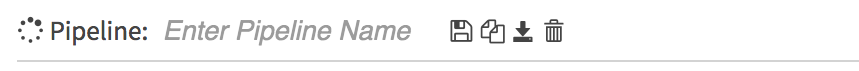
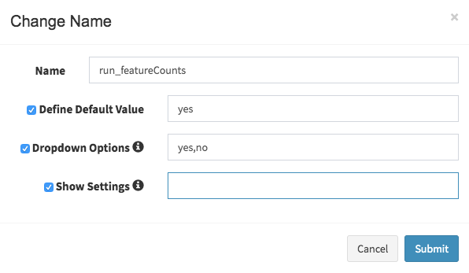
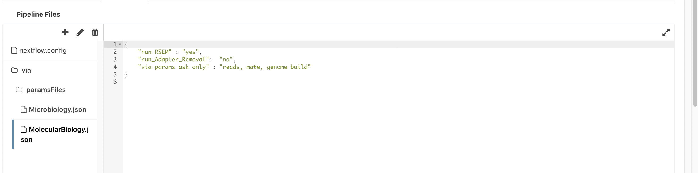
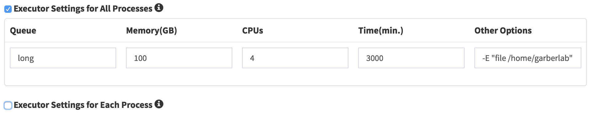

# Pipeline Guide

This guide will walk you through how to create, edit, delete and share
pipelines on the Via Foundry platform.

## Basics

After logging into your Via Foundry account, click on the "Pipeline"
button located at the top left of the screen. This will take you to the
pipeline section of Via Foundry, where you'll be able to see all the
currently available public pipelines, in addition to those you've
created.

There are currently two different ways to create an editable pipeline.
First, you can duplicate an existing pipeline by navigating to its page
and clicking the `Duplicate Pipeline` button, represented by an icon of
two folded pieces of paper, to the right of the pipeline's name.


This will create a copy of the pipeline, which you can then manipulate
as your own.

Alternatively, you can create a new pipeline by clicking the
`New pipeline` button, shown as a circle of circles, located in the left
sidebar menu of any pipeline (you'll need to navigate to any
pipeline's page first to see this menu).


Regardless of which method you choose to create your pipeline, upon
creation, you will see an "Enter Pipeline Name" box at the top of the
new pipeline page. Enter a name for your pipeline in this box.



As you type the pipeline name and craft its workflow, you will notice
`Saving...` and `All changes saved` notifications appear to the right of
the pipeline name box and buttons. Via Foundry has an autosaving feature
enabled, which automatically saves your pipeline as you work on it.
Additionally, you can use the `Save Pipeline` button at any time to
manually save your pipeline.

**Note:** Via Foundry provides additional options for managing your
pipelines. If you wish to delete a pipeline, you can do so by clicking
the `Delete Pipeline` button. Furthermore, while creating your pipeline,
you can always check the generated Nextflow script by clicking the
`Download Pipeline` button.

## Processes

You can access Via Foundry's suite of available processes from the
"Processes" section of the left sidebar menu in any pipeline's page.
Processes are grouped according to the categories they fall within; for
instance, within the "Summary" process menu you'll find all processes
underlying how various data are packaged and summarized in a given run.
To better visualize, and be able to edit, a process, simply click on the
`Workflow` tab of the pipeline page and drag and drop the desired
process into the workspace area. Once you've done this, you'll see the
process circle, a figure shown here:


When working with a process in Via Foundry, you will come across several
icons on the process circle. Here's what each icon represents:

  -   **Settings Icon**: This icon is located at the top of the process
      circle. When clicked, it opens the "Select Process Revision"
      window. In this window, you can examine the current state of the
      process, view its details, and navigate between different
      revisions of the process. You can also replace the selected
      revisions on the workplace with the chosen revision from this
      window.
  -   **Pencil Icon**: The pencil icon is located at the center of the
      process circle. Clicking on this icon allows you to edit the
      process name. The process name is the name that will be used in
      the generated Nextflow file as the process identifier. It is
      important to ensure that process names are unique within the
      overall pipeline. If there are duplicate process names, a warning will be displayed at the bottom of the workflow page to alert you about this issue.
  -   **Bin Icon**: The bin icon is located at the bottom of the process
      circle. Clicking on this icon will delete the current process from
      the pipeline, so exercise caution when deleting a process.

## Input Parameters

To add input files or values that will be used in the process, you can
use the "Input parameters" circle located above the Pipelines and
Processes sections in a pipeline's left sidebar menu.
Just like adding processes, you can use the drag and drop feature to add
input parameters to your pipeline. Once you drag an input parameter, you
will see a smaller orange circle representing the input parameter in the
workplace, as shown in the figure below:


By using the **Pencil** icon located at the left side of the circle, you
can edit the name of the input parameter and define additional settings
for it. Here are the options you can configure:

  -   **Name:** This represents the name of the input parameter, which
      will be used to reference the process in the Nextflow file. It's
      important to choose unique names for each input parameter within
      your pipeline to avoid redundancies, which can yield unwanted
      errors.
  -   **Default value:** You can specify a default value for the input
      parameter, which will be autofilled in the run page. This is
      useful when you have a commonly used value that can serve as a
      default for most runs.
  -   **Dropdown options:** If you want the input parameter to be
      presented as a dropdown menu on the run page, you can define the
      dropdown options. Simply enter the options in a comma-separated
      format. For example, if you have a yes/no parameter, you can enter
      "yes, no" as the dropdown options.
  -   **Show Settings:** By clicking the checkbox for this option, you
      can enable the display of settings for the connected process as a
      wrench button on the run page. This allows users to access and
      modify specific settings for that process. If you want to specify
      alternative processes for the wrench button, you can enter their
      process names in this field. For example, you can enter
      "map_STAR, map_RSEM" to show the settings for either the STAR or
      RSEM mapping process.



Here's an example of what an input row will look like on the run page:


## Output Parameters

Newly created files that are defined in the
[Outputs](process.md#outputs) section are represented by the **Output
Parameter** circle. You can find the **Output Parameters** section
located just below the **Input Parameters** section in the left sidebar
menu. To add an output parameter to your workspace, simply drag and drop
it from the **Output Parameters** section.

The name of the **Output Parameters** circle corresponds to the name of
the published directory for the associated files. You can edit this name
by clicking on the pencil icon next to the circle. This allows you to
customize the name of the directory where the output files will be
transferred.

In the example provided, there are two separate green circles
representing the aligned and unaligned reads. Each circle corresponds to
a specific output parameter, and the associated files will be
transferred to separate directories named "aligned" and "unaligned"
respectively.

By defining and configuring output parameters, you can manage the
generated files and their respective directories within your pipeline.


**Tip:** If you don't want to keep certain output files, you can simply
leave the output nodes unconnected in your pipeline. By doing so, only
the files that are selected as output parameters will be transferred to
the published directory. This allows you to control which files are
included as outputs. Additionally, If you want to transfer multiple
outputs into the same directory, you can use the same name for the
output parameters associated with those files. When the pipeline runs,
the files from different output nodes with the same output parameter
name will be transferred to the same directory.

## Edges

There are three main reasons for creating edges:

  1.  Establishing connections: Edges are used to connect the inputs and
      outputs of multiple processes. This allows the data to flow from
      one process to another, enabling the sequential execution of the
      pipeline.
  2.  Defining input files or values: By creating edges, you can specify
      the input files or values that will be used as inputs for the
      processes. This ensures that the required data is provided to each
      process for its execution.
  3.  Selecting published outputs: Edges are also used to select the
      outputs that will be published in the output directory. By
      connecting specific output nodes to the edge, you indicate that
      those files should be included in the final output of the
      pipeline.

When creating edges, the pipeline creation tool, such as Via Foundry,
typically shows the available nodes that can be connected. This makes it
easier to establish the desired connections between processes. The
figure below shows an example of this feature in action: since the mouse
is hovering over the output node, `genome_index` of the **Build_index**
process, Via Foundry shows the available node on the **Map_tophat2**
process by highlighting it.

**Important:** The filtering of available nodes for connection is often
based on factors such as file types for set and file parameters, and the
name for val parameters. This ensures that the connections are made
between compatible input and output nodes.

This feature of showing available nodes for connection is also
applicable when connecting input parameters to multiple processes,
providing further flexibility in the pipeline creation process.


## ETL pipelines and Setting Pipeline Defaults

An ETL (Extract, Transform, Load) pipeline refers to a systematic process of extracting data from various sources, transforming it into a suitable format, and loading it into a target database for further analysis and interpretation. To simplify this process, Via Foundry intruduces using `paramsFiles` feature.

In order to restrict user modifications, you can utilize `paramsFiles` to define specific defaults for your pipeline. These paramsFiles are JSON files that outline the default values of the pipeline. By default, these values are disabled for users to modify. This approach provides you with a clear understanding of the default values used in the pipeline when specified parameters are employed.

To enable this feature, First, click on the "Advanced" tab and enable the "Use paramsFiles" option. The next step is to create two folders in the pipeline repository: first, create a folder named "via," and then within the "via" folder, create another folder named "paramsFiles."  You can use `advanced tab` -> `pipeline files` section to create these folders. Each file added to  `via/paramsFiles` folder will be an option to user to select. Lets check example below:

* MolecularBiology option (Simple Settings):


* Microbiology option (Advanced Settings):


    ```
    {
        "run_RSEM" : "yes",
        "run_Adapter_Removal":  "yes",
        "Adapter_Trimmer_Quality_Module_Adapter_Removal": {"min_length" : 11, "Adapter_Sequence":"AGATCGGAAGAGC"},
        "via_groups" : "microbiology",
        "via_params_ask_only" : "reads, mate, genome_build, MultiQC.multiqc_parameters"
        "via_params_show" : "run_Adapter_Removal"
    }
    ```


In the `via/paramsFiles` folder, two JSON files named `MolecularBiology.json` and `Microbiology.json` have been added. Let's focus on the `MolecularBiology.json` file. In this file, specific values have been set for `run_RSEM` and `run_Adapter_Removal`. Instead of including all the parameters in this JSON file, you can use the `via_params_ask_only` keyword to disable all other parameters. In this example, the only parameters that can be edited are `reads`, `mate`, and `genome_build`. This allows users to focus on modifying these particular parameters while leaving the rest unchanged.

In the `Microbiology.json` file, the process variables `min_length` and `Adapter_Sequence` for the `Adapter_Trimmer_Quality_Module_Adapter_Removal` step have been set. These variables define specific values for the minimum length and adapter sequence used in the adapter trimming process. In addition, the `via_groups` parameter is used to restrict the visibility of this parameter set on the user's run page. This means that only certain users or user groups will be able to view and modify these parameters during the pipeline execution, while others will not have access to them.


* **paramsFiles Configuration**:

    * **via_groups:** This parameter is used to restrict the visibility of a parameter set on the user's run page. It allows you to specify certain user groups who will be able to see that particular parameter set, while others will not have access to it.

    * **via_params_ask_only:** When using this parameter, you can specify a comma-separated list of values. Only the parameters included in this list will be **editable** by the user on the run page. The rest of the parameters will be disabled and hidden (under `system inputs` section) from the user, preventing any modifications.

    * **via_params_show:** By default, only the parameters defined in via_params_ask_only will be displayed to the user on the run page. All other parameters will be hidden under the "system inputs" section. However, if you want to change this behavior, you can provide a comma-separated string with via_params_show. This will move the specified parameters from the "system inputs" section to the user interface, allowing them to be visible by the user.


Here are the example run pages of the RNA-Seq pipeline:

* MolecularBiology option is selected:


* Microbiology option is selected:


## Exporting Pipeline Parameters

To facilitate the exporting of used parameters in a pipeline, we have implemented a process called `publish_params_as_JSON`. This process can be found by using the search bar on the pipeline page. To enable this capability in a specific pipeline, you can simply drag and drop the `publish_params_as_JSON` process into the desired location.

Once you have added the process to the pipeline, please drag and drop the `output parameter` to the workflow and rename it as `logs`. The following example workflow demonstrates this process:


After the run completes, a file named `run_params.json` will be generated under the "logs" folder, containing the exported parameters.

```
[
    {
        "Adapter_Removal": {
            "min_length" : 11, 
            "Adapter_Sequence":"AGATCGGAAGAGC"
        },
        "bed": "s3://viafoundry/genome_data/mouse/mm10/refseq/genes/genes.bed", 
        "hisat2Index": "s3://viafoundry/genome_data/mouse/mm10/refseq/Hisat2Index", 
        "outdir": "s3://viafoundry/runs/report159"
    }
]
```

## Pipeline Header Script

This section, located in the `Advanced` tab of a pipeline's page,
provides the capability to add additional inputs, scripts, or comments
before the pipeline starts. This section is useful for defining common
functions or variables that need to be used in multiple processes within
the pipeline.

By adding inputs, scripts, or comments in this section, you can ensure
that they are available and accessible throughout the pipeline's
execution. This allows you to define reusable code or parameters that
can be referenced multiple times in different processes


## Adding Pipeline Inputs by Pipeline Header Script

You can use the **pipeline header script** field in the `Advanced` tab
of a pipeline's page to add pipeline inputs, similar to adding dropdown
options for process parameters. To create inputs in the pipeline header
script, you need to use the following syntax:

    params.variableName = defaultValue //* @dropdown @options:"..."

It's important to note that you need to use `params.` at the beginning
of `variableName` to define the input parameter. The `defaultValue` can
be specified with single or double quotes (for strings) or without any
quotes (for numbers).

On the run page, these input parameters will be displayed separately in
the **Inputs** section. Users will be prompted to provide values for
these parameters based on the defined options. Here's an example:

    params.genome_build = "" //* @dropdown @options:"human_hg19, mouse_mm10, custom"
    params.run_Tophat = "no" //* @dropdown @options:"yes","no"


## Autofill Feature for Pipeline Inputs

**A. Based on Hostname:**

In Via Foundry, you can use the autofill feature to specify input
parameters based on the hostname of the execution environment. The
syntax for autofilling input parameters based on hostname is as follows:

    //* autofill
    if ($HOSTNAME == "ghpcc06.umassrc.org"){
    <input parameters>
    }
    //* autofill

In this example, `$HOSTNAME` is a Via Foundry-specific variable that
represents the hostname of the execution environment. You can replace
"hostname" with the actual hostname on which you want the autofilled
inputs to apply. Within the if statement, you can define the
`<input parameters>` that should be automatically filled when the
pipeline is executed on the specified hostname. In this example,
`<input parameters>` will be filled if the pipeline runs on
**ghpcc06.umassrc.org**.

Here's an example that demonstrates how to autofill the TrimPath
parameter for a specific hostname:

    //* autofill
    if ($HOSTNAME == "garberwiki.umassmed.edu"){
        params.TrimPath ="/project/Trimmomatic/trimmomatic-0.32.jar"
        } 
    //* autofill


**B. Based on Selected Input:**

In Via Foundry, you can also use the autofill feature based on the
selected parameters on the run page. This allows you to dynamically
change the value of an input parameter based on the selection made by
the user.

Here's an example that demonstrates how to autofill the path of a
program based on the selected pipeline parameter `method`:

    params.method = "" //* @dropdown @options:"trimmomatic, fastqx"
    //* autofill
    if (params.method == "trimmomatic"){
        params.TrimPath ="/project/Trimmomatic/trimmomatic-0.32.jar"
    }
    else if (params.method == "fastqx"){
        params.TrimPath ="/project/fastqx/fastqx"
    }
    //* autofill


**C. Dynamic Autofill:**

To autofill parameters that follow a specific pattern based on
conditions, you can use the dynamic autofill feature in Via Foundry.
This allows you to define variable parts of the pattern - using
underscores; for example, `_species` or `_build` - and assign values to
them based on the fulfillment of if conditions. You can then activate
the autofill feature by checking the existence of your host. Here's an
example of how to use dynamic autofill with proper syntax:

    if (params.variableName && $HOSTNAME){
        <input parameters>
    }

    or 

    if ($HOSTNAME){
        <input parameters>
    }

For further clarification, reference the example below where the
`params.genome` and `params.genomeIndexPath` parameters are filled
according to selected parameters of `params.genome_build` and
`$HOSTNAME`:

    params.genome_build = "" //* @dropdown @options:"human_hg19, mouse_mm10"
    def _species;
    def _build;
    def _share;
    //* autofill
    if (params.genome_build == "human_hg19"){
        _species = "human"
        _build = "hg19"
    } else if (params.genome_build == "mouse_mm10"){
        _species = "mouse"
        _build = "mm10"
    }

    if ($HOSTNAME == "garberwiki.umassmed.edu"){
        _share = "/share/dolphin_data/genome_data"
    } else if ($HOSTNAME == "ghpcc06.umassrc.org"){
        _share = "/project/data/genome_data"
    }
    if (params.genome_build && $HOSTNAME){
        params.genome ="${_share}/${_species}/${_build}/${_build}.fa"
        params.genomeIndexPath ="${_share}/${_species}/${_build}/${_build}"
    }
    if ($HOSTNAME){
        params.TrimPath ="${_share}/Trimmomatic/trimmomatic-0.32.jar"
    }
    //* autofill


## Autofill Feature for Pipeline Properties

To automate the filling of executor properties in Via Foundry, you can
utilize the autofill feature. There are two types of autofill options
available: hostname-independent autofill and hostname-dependent
autofill.

**Hostname-Independent Autofill:**

To define executor properties that will be automatically filled
regardless of the hostname, you can use the following syntax:

    //* autofill
    <executor properties>
    //* autofill

**Hostname-Dependent Autofill:**

If you need to overwrite the default executor properties based on
specific hostnames, you can use hostname-dependent executor properties.
Here's the syntax:

    //* autofill
    <executor properties>
    if ($HOSTNAME == "ghpcc06.umassrc.org"){
    <hostname dependent executor properties>
    }
    //* autofill

In this example, the `<executor properties>` section will be filled for
all hostnames. However, if the hostname is "ghpcc06.umassrc.org", the
`<hostname dependent executor properties>` section will be additionally
filled.

The `$HOSTNAME` variable in Via Foundry represents the selected hostname
in the run environment. By using this variable, you can apply specific
executor properties based on the hostname.

**Executor Properties:**

There are five types of executor properties available to autofill
**Executor Settings for All Processes**: `$TIME`, `$CPU`, `$MEMORY`,
`$QUEUE`, `$EXEC_OPTIONS` which respectively define the Time, CPU,
Memory, Queue/Partition and Other Options fields in the executor
settings. You can set pipeline defaults by using the
`$HOSTNAME == "default"` condition. Reference the example below:

    //* autofill
    if ($HOSTNAME == "default"){
        $MEMORY = 32
        $CPU  = 1
    }
    if ($HOSTNAME == "ghpcc06.umassrc.org"){
        $TIME = 3000
        $CPU  = 4
        $MEMORY = 100
        $QUEUE = "long"
        $EXEC_OPTIONS = '-E "file /home/garberlab"'
    }
    //* autofill



**Singularity/Docker Images:** There are four types of image properties
able to be autofilled: `$DOCKER_IMAGE`, `$DOCKER_OPTIONS`,
`$SINGULARITY_IMAGE`, `$SINGULARITY_OPTIONS`, which automatically fill
the `image path` and `RunOptions` fields of Docker and Singularity. See
the example below for the appropriate syntax of autofilling Docker image
properties:

    //* autofill
    if ($HOSTNAME == "ghpcc06.umassrc.org"){
        $DOCKER_IMAGE = "docker://UMMS-Biocore/docker"
        $DOCKER_OPTIONS = "-v /export:/export"
    }
    //* autofill


Likewise, here's the syntax needed when autofilling Singularity image
properties:

    //* autofill
    if ($HOSTNAME == "ghpcc06.umassrc.org"){
        $SINGULARITY_IMAGE = "shub://UMMS-Biocore/singularity"
        $SINGULARITY_OPTIONS = "--bind /project"
    }
    //* autofill


When you want to define both Singularity and Docker images, you can set
the `$DEFAULT_IMAGE` tag to either `"docker"` or `"singularity"`,
depending on your desired use. In this example, a Docker image is set by
default, but if the user's hostname is "<ghpcc06@umassrc.org>," a
Singularity image will be set:

    //* autofill
    if ($HOSTNAME == "default"){
        $DEFAULT_IMAGE = "docker"
        $DOCKER_IMAGE = "dolphinnext/rnaseq:1.0"
        $SINGULARITY_IMAGE = "https://galaxyweb.umassmed.edu/pub/dnext_data/singularity/UMMS-Biocore-rna-seq-1.0.img"
    }
    if ($HOSTNAME == "ghpcc06.umassrc.org"){
        $DEFAULT_IMAGE = "singularity"
        $DOCKER_IMAGE = "dolphinnext/rnaseq:1.0"
        $SINGULARITY_IMAGE = "https://galaxyweb.umassmed.edu/pub/dnext_data/singularity/UMMS-Biocore-rna-seq-1.0.img"
    }
    //* autofill

Please note that Google Cloud accounts will overwrite the
`$DEFAULT_IMAGE` tag, since Google Cloud accounts only support the use
of Docker images.

**Platform Tag:**

To isolate platform-dependent parameters in Via Foundry, you can use the
**platform** tag. This allows you to exclude platform-specific
parameters from the exported pipeline, and when the pipeline is
imported, existing platform-dependent parameters will not be
overwritten. Here's an example of how to use the platform tag:

    //* autofill
    if ($HOSTNAME == "default"){
        $MEMORY = 32
        $CPU  = 1
    }
    //* platform
    if ($HOSTNAME == "ghpcc06.umassrc.org"){
        $TIME = 3000
        $CPU  = 4
        $MEMORY = 100
        $QUEUE = "long"
        $EXEC_OPTIONS = '-E "file /home/garberlab"'
    }
    //* platform
    //* autofill

In this example, since the run environment is set as
"ghpcc06.umassrc.org", the autofill feature overwrote the default
`$TIME` value (1000) with a value of 3000.

## Pipeline Details

This section summarizes all processes used
by the pipeline to give you an overarching perspective on the
pipeline's architecture.


## Permissions and Groups

By default, all new pipelines are only seen by their owner. You have the option to share your pipeline with a specific group that you have created in the profile's "Groups" tab. To do this, choose "Only my group" and select the name of the desired group. Members of that group will then be able to view the run on their run status page.

Alternatively, you can set the permissions to "Everyone". With this setting, the pipeline will only be visible to users who know the specific run link. The selected pipeline will not appear on their pipelines page, but they will be able to access it if they have the link.

When collaborating with multiple individuals on a shared pipeline, you have the option to grant write permission to a group by utilizing the "Group Permission to Write" dropdown. This allows you to specify a group and authorize them to make changes and modifications to the pipeline.


## Copying and Revisions

To make changes, new trials, improvements on your or other people's
pipelines, you can create a duplicate of a pipeline in Via Foundry by
clicking the `Duplicate Pipeline` button within a pipeline's page. When
your pipeline has been set to public or used/edited by other group
members, you're not allowed to make changes that alter that same
revision of the pipeline. As such, duplicating a pipeline allows you to
make changes and improvements without affecting the original pipeline or
other users' work. It's a convenient way to experiment and iterate on
pipelines while keeping the original version intact.

## How to Import Pipelines

To import nf-core pipelines or similar standard Nextflow pipelines, follow these steps:

1. Visit the "Pipelines" tab and select any pipeline. Click the "Import Pipeline" button.

    

2. Click the "Remote Repository" button and choose the source of your repository: Repository Type (Public or Private).

    

    1. **Public Repository:**
        1. If your pipeline is publicly accessible, choose "Public."
        2. Enter the Repository URL and provide the tag/branch if available.
        3. Click the "Pull Pipeline" button.

    2. **Private Repository:**
        1. If your pipeline is private, choose "Private."
        2. Choose the repository credentials that you have set up in the Profile -> Repositories section. For more information, refer to the [repository connections page](../profile/#repository-connections).
        3. Enter the Repo URL and provide the tag/branch if available.
        4. Click the "Pull Pipeline" button.

3. Importable Pipeline Standards:

    1. **Pipeline Inputs Schema (nextflow_schema.json):**

        To define the inputs for the pipeline, refer to the example inputs provided in the following link: [Example Inputs](https://github.com/nf-core/rnaseq/blob/3.13.2/nextflow_schema.json).

        If you do not have the `nextflow_schema.json` file, you can create one using the [Pipeline Schema Builder Tool](https://nf-co.re/pipeline_schema_builder). Ensure that all inputs are organized within a group section. To create a group, click the "Add Group" button.


        ```
        {
            "$schema": "http://json-schema.org/draft-07/schema",
            "$id": "https://raw.githubusercontent.com/YOUR_PIPELINE/master/nextflow_schema.json",
            "title": "Nextflow pipeline parameters",
            "description": "This pipeline uses Nextflow and processes some kind of data. The JSON Schema was built using the nf-core pipeline schema builder.",
            "type": "object",
            "definitions": {
                "new_group_1": {
                    "title": "New Group 1",
                    "type": "object",
                    "description": "",
                    "default": "",
                    "properties": {
                        "new_param_1": {
                            "type": "string"
                        },
                        "new_param_2": {
                            "type": "string"
                        }
                    }
                }
            },
            "allOf": [
                {
                    "$ref": "#/definitions/new_group_1"
                }
            ]
        } 
        ```

    2. Pipeline publish direcory should be set as `params.outdir`.

```
Note: To import Via Pipelines, you need admin permission. Contact <support@viascientific.com> for more details.
```

## Support

For any questions or help, please reach out to
<support@viascientific.com> with your name and question.
