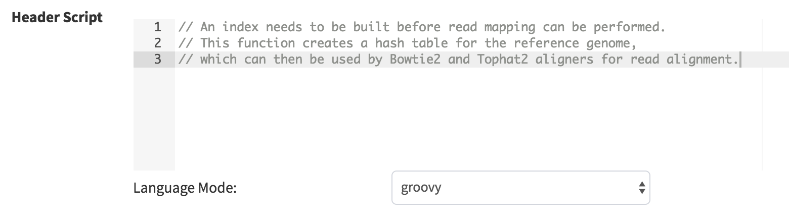
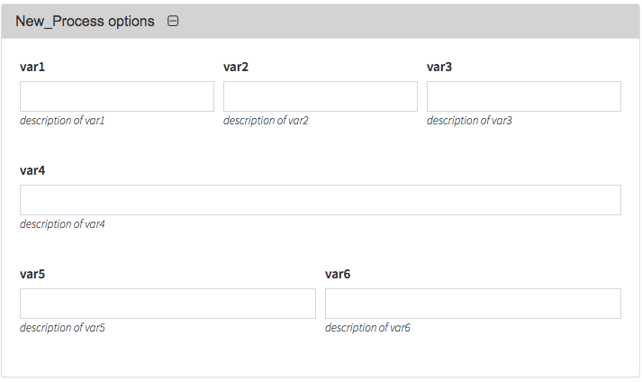
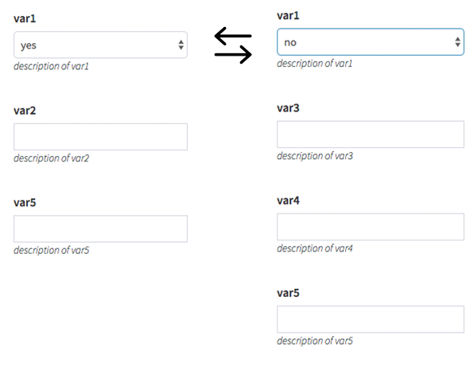

# Process Guide

This guide will walk you through the creation of Via Foundry processes.

## Process Window

Once you've logged into your Via Foundry account, enter the page of a
pipeline you'd like to add a new process to by clicking on the
`Pipeline` tab in the top left of the screen, then on the name of the
desired pipeline. You'll notice several buttons on the left sidebar's
menu. For our purposes now, the most important one is the button
containing the image of an unbroken circle, second from the left. This
is the `New Process` button, which enables you to create new processes.


## Basics

Once you click the `New Process` button, a new window will appear for
you to define the components of your new process.

-   **Name:** Enter the name of your process in this field. After
    creating the process, its name will appear in the pipeline's left
    sidebar menu under the selected *menu group*.
-   **Description:** Provide a brief explanation of how the process
    works in this field.
-   **Menu group:** Select a menu group so that the process can be
    properly categorized within the left sidebar menu. If necessary, you
    can add new menu groups by clicking the `Add Menu Group` button. You
    can also edit or delete these new groups by using the
    `Edit Menu Group` or `Delete Menu Group` buttons.

## Parameters

This section is for you to create parameters for your process, which
will be used while defining *inputs* and *outputs*. You can create new
parameters via the `Add Parameter` button.


-   **Identifier:** The identifier is simply the parameter name, and
    once created, you'll be allowed to call the same parameters in
    other processes.

-   

    **Qualifier:** Five main types of qualifiers (`file`, `set/tuple`, `each`, `env` and `val`) exist in Via Foundry:

    **File:** This qualifier is used when the following
        qualifier represents the name of a file. Example usage in a
        Nextflow file:

            file genome

    **Set/Tuple:** This qualifier enables you to handle a group of
        input values with other qualifiers. Example usage:

            set val(name), file(genome) 

    **Val:** With this qualifier, you can access the received
        input value by its name in the process script. Example
        usage:

            val script_path

    **Each:** This qualifier enables the execution of the
        process for each entry in the input collection. Example
        usage:

            each bed_list

-   **File type:** If the qualifier is set to `file` or `set`, a "File
    Type" option will appear. This option is used to filter available
    nodes when generating pipelines.

**Tip:** For example, you may create `genome` parameter by entering the
identifier as "genome", qualifier as "file," and file type as
"fasta". Similarly, to create the "script_path" parameter you can
define the identifier as "script_path" and the qualifier as "val".

**Note:** When the qualifier is set to `val`, the **identifier** is used
to filter available nodes when connecting each node. If `file` or `set`
is selected as the qualifier, the **file type** is used to filter
available nodes. When the qualifier is set to `each`, you can enter both
the **file type** (if connecting with file nodes) and the **identifier**
(if connecting to val nodes).

## Inputs

This section is where you enter all your process's input nodes.
Clicking the `Add input...` dropdown will show a list of all existing
inputs, from which you can select those you wish to use. After adding a
selected parameter as a input node, you'll see an `Input Name` box, in
addition to `Add/Remove Operator` (wrench icon) and `Optional` buttons.


The `Input Name` box is used to define Nextflow variables that will be
used in the [Scripts](process.md#scripts) section. For example, if you
enter the input name as "genome," you can call this variable as
`${genome}` in the Script field. Here are some other examples:

|  Qualifier  | Input name               | How to Reference in the Script | 
|  ---------- | ------------------------ | ------------------------------ |
|  val        | script_path              | ${script_path}                 |
|  each       | bed_list                 | ${bed_list}                    |
|  file       | genome                   | ${genome}                      |
|  set        | val(name), file(genome)  | ${genome}                      |
|  set        | val(name), file(genome)  | ${name}                        |

Additionally, if you need to transform values emitted by a channel, you
can click the `Add/Remove Operator` button, then select operators from
the `Operators` dropdown menu that appears. For more detailed
information, refer to the [Operators](process.md#id5) section.

-   **Optional Inputs:**

If you want to use an optional input parameter, you can check the
`Optional` checkbox. This feature provides flexibility to the user while
defining their process, as the process will still be executed even if
the input parameter is not provided. Here's an example use case:


Here, the `filter` parameter will be defined with the `NO_FILE` prefix
in case the input parameter `genome` is empty. When the `genome`
parameter is found, though, the `filter` parameter will be defined as
`---filter ${genome}"`.

    filter = genome.name.startsWith('NO_FILE') ? "" : "--filter ${genome}"

## Outputs

All the output nodes for a new process are defined in this section. In a
process similar to that of adding inputs, you can click the
`Add output...` dropdown menu to select from a list of output
parameters. Once an output has been chosen, you'll see an `Output Name`
box, as well as an `Add/Remove Operator` button (wrench icon) and an
`Operators` button.


You can select output files created by the process by using the
`Output Name` box. Entering a pattern of output files will highlight and
grab all files starting with that pattern; for instance, entering
"genome.index*" in this field will grab all the files whose names
begin with "genome.index." You can also use Nextflow variables, which
are defined in the Inputs and Scripts sections. Here are some examples
of input and output qualifiers and names:

  | Input Qualifier | Input name                | Output Qualifier | Output name                  |
  | --------------- | ------------------------- | ---------------- | ---------------------------- |
  | file            | genome                    | file             | "${genome}_out.txt"          |
  | set             | val(name), file(reads)    | set              | val(name), file("${name}.unmap*.fq") |
  | set             | val(name), file(reads)    | file             | "${name}.bam"                |
  | set             | val(name), file(genome)   | file             | "genome.index*"              |


Additionally, if you need to transform values emitted by a channel, you
can click the `Add/Remove Operator` button, then select operators from
the `Operators` dropdown menu that appears. For more detailed
information, refer to the [Operators](process.md#operators) section.

-   **A Note on Optional Outputs:**

If your process doesn't generate some outputs in some circumstances,
you can check the `Optional` checkbox, which tells Nextflow not to fail
and exit the process if the given output is not created.

## Scripts

All scripts for the process are defined in this region. Nextflow
supports three different modes: Script, Shell, and Exec. These modes
define how the command gets executed by the process.

**A. Script:**

For simplicity, Via Foundry uses the *script* format by default. This
means that defined commands will be executed as a BASH script in the
host machine, which is the same as using three double quotes `"""` at
the start and the end of the command block. If you use three double
quotes on separated lines, Via Foundry will interpret the area between
those lines as a command block. As such, both of the following two
blocks will be executed the same way:

    script:
    """ 
    tophat2 -o . ${indexPath} ${reads} 
    """

    OR 

    tophat2 -o . ${indexPath} ${reads}

The script block can contain any command or script that is typically
used in a terminal shell or BASH script.


Let's analyze a more complicated version of the script block. Here, the
Nextflow variable `name` is defined in between the `script:` keyword and
three opening double quotes `"""`:

    script:
    name =  reads.toString() - '.fastq'  // local scope for nextflow variables

    """ 
    newPath="/mypath"   ## inside of """ block is used to define bash variables in local scope
    STAR -o . \${newPath} ${name}  
    """

**Note:**

   -   The `newPath` variable is defined in the bash script and used in
        the STAR command as `\${newPath}`. (Note that bash variables
        need to be escaped by backslashes in script block)
   -   The `name` variable is defined in Groovy's scope as a Nextflow
        variable, and used in the STAR command as `${name}`.


-   **Conditional Scripts:**

Conditional scripts can be used with control statements such as "if"
and "switch." To use this feature, you need to start the code block
with the keyword "script:". This tells the interpreter to evaluate all
the subsequent statements as one code block and identifies the script
string to be executed. Here's an example to illustrate this:

    script:
    name =  reads.toString() - '.fastq'

    // This block runs if the mate variable is initialized with the value "pair"
    if (mate == "pair") {
        """
        bowtie2 -x genome.index -1 ${reads.join(' -2 ')} -S ${name}_alignment.sam --un-conc ${name}_unalignedreads
        """
    }

    // This block runs if the mate variable is initialized with value "single"
    else if (mate == "single") {
        """
        bowtie2 -x genome.index -U $reads -S ${name}_alignment.sam --un ${name}_unalignedreads
        """
    }

**Tip:** As shown in the example above, you can run Bowtie based on the
mate status of the reads. In order to enable this capability, you must
add the `mate` parameter as an input. When you are running the pipeline,
you can choose `single` or `pair` based on your needs.

**B. Shell:**

Alternatively, you can use the `shell` block, wherein Nextflow variables
are declared with an exclamation mark `!`. This feature allows you to
use both Nextflow and BASH variables in the same code without using an
escape character. In order to use the shell mode, add `shell:` at the
beginning of your code, and three single quotes (`'''`) at the start and
the end of the command block, like so:

    shell:
    '''
    echo $PATH and !{new_path}
    '''

Here is an example use case of a Perl script block with correct syntax:

    shell:
    name =  reads.toString() - '.fastq'  //local scope for nextflow variables

    ''' 
    #!/usr/bin/env perl // inside of ''' block you can define perl (or other language) variables in local scope
    $newPath="/mypath";
    system("STAR -o . ${newPath} !{name}");
    '''

**Note:**

   -   The `$newPath` variable is defined in the Perl script, and used
        in the Tophat command as `${newPath}`. (Note that variables
        don't need to be escaped by backslash if the `shell:` keyword
        is used.)
-   The `name` variable is defined in Groovy's scope as a Nextflow
        variable, and used in the Tophat command as `!{name}`.

**C. Exec:**

Nextflow processes allows you to execute native code other than just
system commands. This lets you easily follow local Nextflow variables.
To initialize exec mode, you can add an `exec:` block at the beginning
of the script, like this:

    exec:
    println "${genome}"

## Operators

If you need to transform values emitted by a channel, you can click the
`Operators` button and select operators from the dropdown menu. This
allows you to apply various operations or modifications to the emitted
values. Optionally, you can specify the operator content to customize
its behavior according to your requirements. Additionally, you can add
multiple operators by enclosing them within parentheses `( )`.

Here are some examples of operators and their usage:

| Operator         | Operator Content | Usage                                                                                                   |
| ---------------- | ---------------- | ------------------------------------------------------------------------------------------------------- |
| flatMap          | ().buffer(size:3)                 | Groups 3 emitted items into one new channel.                                                            |
| mode flatten     |                  | To emit each output file as a sole item.                                                                 |
| groupTuple       |                  | Collects tuples (or lists) of values emitted and groups them based on their key value.                  |
| |                  |                                                                                                         |


**Tip:** To get more information about operators, check out [this
link](https://www.nextflow.io/docs/latest/operator.html) to Nextflow's
documentation.

## Foundry Variables

*Foundry Variables* are provided by the Foundry platform and are intended to enhance the flexibility and adaptability of your workflows. These variables (e.g. ``FOUNDRY_RUN_ID``, ``FOUNDRY_PIPELINE_VERSION``, etc.) can be used in your process scripts or configuration files.

| Variable                  | Description                                                                                                                     |
|---------------------------|---------------------------------------------------------------------------------------------------------------------------------|
| {{FOUNDRY_PIPELINE_ID}}        | The identifier assigned to each pipeline.    |
| {{FOUNDRY_PIPELINE_URL}}        | The URL assigned to each pipeline.    |
| {{FOUNDRY_PIPELINE_VERSION}}    | The version assigned to each pipeline.    |
| {{FOUNDRY_RUN_ID}}        | The unique identifier assigned to each run.    |
| {{FOUNDRY_RUN_URL}}       | The URL that links to the detailed information and logs for the current run.                            |
| {{FOUNDRY_WEB_REPORT_DIR}}| The URL where run reports are located.                                                |
| {{FOUNDRY_WEB_RUN_DIR}}   | The URL where run logs are located.|
| {{FOUNDRY_PUBLISH_DIR}}   | The directory path where all reported files are located.                                     |
| {{FOUNDRY_LAB}}           | The lab associated with the Foundry account under which the current run is running.                    |
| {{FOUNDRY_USERNAME}}      | The username associated with the Foundry account under which the current run is running.                    |
| {{FOUNDRY_EMAIL}}         | The email address associated with the Foundry account under which the run is running.               |


**Usage**: 
When scripting within the Foundry platform, you can directly reference these variables by enclosing them in double curly braces. For example:

```
echo "Current Run ID: {{FOUNDRY_RUN_ID}}"
```


## Header Script

This section, found within the `Advanced Options` menu, allows you to
add additional scripts or comments before the beginning of the process
block. This allows you to re-call the same function several times in the
Script section.



## Process Options

Via Foundry contains functionality supporting seamless separation of
main process inputs and optional user-manipulable parameters, the latter
being controllable with the **Process Options** feature. This section
will go over how to configure process options, but before that, here is
how the results of the commands entered in the **Process Options** are
displayed; note that all process options are located below the
**Inputs** section of the run page, and can be edited by the user
depending on their needs.


In order to create these forms, you need to use the following syntax in
the **Script** or **Process Header** section of the `Add New Process` or
`Edit/Delete Process` page for your process (shown below the syntax):

    variableName = defaultValue //* @formType @description:"..." @tooltip:"..." @options:"..."


Note that when defining a defaultValue for a variable in Via Foundry,
you can use single or double quotes for strings, or no quotes for
numbers. If you want to define an array of default values for a variable
using the @style tag, you can use the following format:
`variableName = ["defaultValue1", "defaultValue2"]`. This allows you to
set multiple default values for the variable.

### @formtype

In Via Foundry's **Process Options** section, you can use four
different commands to specify the type of form that will be displayed
for a given parameter: `@input`, `@textbox`, `@checkbox`, and
`@dropdown`. Here are brief descriptions of each, accompanied by images
highlighting what they look like on the run page:

**@input**: Creates a single-line text field. Here is an example usage,
along with the form field these commands create on the run page:

    readsPerFile = 5000000 //* @input @description:"The number of reads per file"
        params_tophat = "-N 4" //* @input @description:"Tophat parameters" @tooltip:"parameters for Tophat2 version 2.6"


**@textbox**: Creates a multi-line text field. Example usage:

    Adapter_Sequence = "" //* @textbox @description:"You can enter a single sequence or multiple sequences in different lines." 


**@checkbox**: Creates a checkbox field with options `true` or `false`
by default. Example usage:

    run_rRNA_Mapping = "false" //* @checkbox @description:"Check the box to activate rRNA mapping."
    rRNA_filtering = "true" //* @checkbox @description:"Check the box to filter rRNA reads."


**@dropdown**: Creates a dropdown menu, whose options can be specified
with the `@options` feature. Example usage:

    genomeType = "" //* @dropdown @description:"Genome type for pipeline" @options:"hg19","mm10", "custom"


### Non-Form Type Specifiers

**@description**: Provide brief, informative descriptions of inputs
with the `@description` tag. For example, in the **@dropdown** example
above, "Genome type for pipeline" is provided as the value of
`@description`, so in the run page, the blurb beneath the dropdown menu
says "Genome type for pipeline".

**@tooltip**: Provide more detailed descriptions of inputs and/or
supplement your `@description` with the `@tooltip` tag. See the example
below for possible usage:

    params_tophat = "-N 4" //* @input @tooltip:"parameters for Tophat2 version 2.6" @description:"Tophat parameters"

**@title**: You can create a header on top of a variable by using the
`@title` tag. This allows you to organize complex form structures more
easily. Here's an example:

    params_tophat = "-N 4" //* @input @title:"Alignment Section" @description:"Tophat parameters"

In this example, the `params_tophat` variable is grouped under the
"Alignment Section" header in the form, making it easier to
distinguish and organize related variables.

**@optional**: When defining an input, you can designate it as optional
by using the `@optional` tag. This gives users the freedom to leave
certain inputs empty if they so desire. See the example below:

    params.tsv_input = "" //* @input @optional @description:"TSV input for process"
    params.csv_input = "" //* @input @optional @description:"CSV input for process"

**@file**: You can specify the type of window that will appear for a
selected input. By default, a `value modal` is used. However, if you add
the @file tag, the `file modal` will be displayed. This allows users to
upload files and use them as a parameter. Here's an example:

    params.tsv_input = "" //* @input @file @description:"TSV file path for process"

Explanation: In this example, the `params.tsv_input` parameter is
defined as a file input. When the user selects this input in the run
page, a file modal will be displayed, allowing them to upload a TSV file
to be used as the parameter value.

**@options**: When you define a dropdown form field using the
`@dropdown` formType, you should also specify the available options
using the `@options` tag. Here's a simple example:

    genomeType = "" //* @dropdown @options:"hg19","mm10","custom"

Here, the `genomeType` parameter is defined as a dropdown field. The
available options for selection are "hg19," "mm10," and "custom."
When the user selects this input in the run page, a dropdown menu will
be displayed with these options to choose from. The selected option will
be used as the parameter value.

### Conditional Options - Version 1 (Advanced Usage):

Since the same process can be viewed differently based on the pipeline
being used, in order to control the visibility of dropdown options in
different pipelines, you can define variables in the pipeline header
starting with an underscore. For example:

    _nucleicAcidType = "rna" //In RNA-seq pipeline header
    _nucleicAcidType = "dna" //In ChIP-seq pipeline header

You can then use these variables to control which options will be
visible in the dropdown fields of different pipelines using the
following format:

    param = "" //* @dropdown @options:{_nucleicAcidType="rna","rRNA","miRNA","snRNA"},{_nucleicAcidType="dna", "ercc","rmsk"}

Now, the `param` dropdown will have three options ("rRNA", "miRNA",
"snRNA") in the RNA-seq pipeline and two options ("ercc", "rmsk")
in the ChIP-seq pipeline. You can also define default options by not
assigning any value, as shown in the example below:

    param = "" //* @dropdown @options:{"rRNA","miRNA","snRNA"},{_nucleicAcidType="dna","ercc","rmsk"}

In this case, by default, the three options ("rRNA", "miRNA",
"snRNA") will be visible unless the pipeline header defines
`_nucleicAcidType="dna"`.

### Conditional Options - Version 2 (Advanced Usage):

To control the visibility of dropdown options based on the selected
parameter in another dropdown, you can use the following syntax. In this
example, the dropdown called `sequence` controls the visible options of
the `dropdown` aligner:

    aligner = "" //* @dropdown @options:{sequence=("rRNA","miRNA","snRNA"),"bowtie","bowtie2"},{sequence="genome", "star"}

When `sequence` is selected as one of the options "rRNA", "miRNA",
or "snRNA", the `aligner` dropdown will display options "bowtie" and
"bowtie2". Similarly, when `sequence` is selected as "genome", the
`aligner` dropdown will display the "star" option.

This allows you to dynamically control the available options in a
dropdown based on the selected value of another dropdown parameter.

## Styles for Process Options

Via Foundry supports the use of additional tags to shape the layouts of
form fields: `@multicolumn`, `@array`, and `condition`.

### @multicolumn

The `@multicolumn` form type enables you to group variables on the same
line as one another for more coherent visualizations.

Example usage:

    var1 = "" //* @input @description:"description of var1"
    var2 = "" //* @input @description:"description of var2"
    var3 = "" //* @input @description:"description of var3"
    var4 = "" //* @input @description:"description of var4"
    var5 = "" //* @input @description:"description of var5"
    var6 = "" //* @input @description:"description of var6"
    //* @style @multicolumn:{var1, var2, var3}, {var5, var6}

Here, var1, var2, and var3 will be displayed on the same row, as they
are grouped in the same list in the @multicolumn value. Similarly, var5
and var6 will share a row, and since var4 isn't listed in the
@multicolumn argument, it will fill a single row by default. See the
image below:



### @array

The `@array` form type lets you group variables together and link them
with add/remove buttons. Here's an example usage:

    var1 = "" //* @input @description:"description of var1" @title:"Step 1"
    var2 = "" //* @input @description:"description of var2"
    var3 = "" //* @input @description:"description of var3"
    var4 = "" //* @input @description:"description of var4" @title:"Step 2"
    //* @style @array:{var1, var2}, {var4} 

In this example, var1 and var2 are grouped together and linked to
add/remove buttons. Clicking the add button will create new var1 and
var2 fields just below the existing ones. Similarly, the remove button
will remove the generated copies of form fields. The same features apply
to var4 as well. The below image demonstrates this nicely.


A helpful tip: You can combine multiple style options on the same
variables. For example,
`//* @style @array:{var1, var2}, {var4} @multicolumn:{var1, var2}` will
combine both the multicolumn and array features for var1 and var2, as
seen in this image.


You can also define multiple default values by using the following
syntax:

    var1 = ["defVal1", "defVal2"] //* @input @description:"description of var1" 

With this line, on the run page, two rows will be displayed for var1,
and their default values will be "defVal1" and "defVal2".

### @condition

The `@condition` tag allows you to bind the value of one form field to
the visibility of other form fields. Here's an example:

    var1 = "" //* @dropdown @description:"description of var1" @options:"yes", "no" @title:"Step 1"
    var2 = "" //* @input @description:"description of var2"
    var3 = "" //* @input @description:"description of var3"
    var4 = "" //* @input @description:"description of var4"
    var5 = "" //* @input @description:"description of var5" @title:"Step 2"
    //* @style @condition:{var1="yes", var2}, {var1="no", var3, var4}

In this example, the value of var1 is linked to other form fields. When
var1 is selected as "yes", the field for var2 will be shown. On the
other hand, when var1 is changed to "no", the var2 field will
disappear, and the fields for var3 and var4 will appear. Since var5 is
not defined in the @condition tag, it will always be visible regardless
of changes in other fields. Feel free to check this image for
clarification:



You can combine multiple style options on the same variable, including
@condition. For example,
`//* @style @condition:{var1="yes", var2}, {var1="no", var3, var4} @array:{var1, var2, var3, var4} @multicolumn:{var1, var2, var3, var4}`
will combine all the features just discussed.


## Autofill Feature for Process

To automate the filling of executor properties in Via Foundry, you can
utilize the autofill feature. There are two types of autofill options
available: hostname-independent autofill and hostname-dependent
autofill.

**Hostname-Independent Autofill:**

To define executor properties that will be automatically filled
regardless of the hostname, you can use the following syntax:

    //* autofill
    <executor properties>
    //* autofill

**Hostname-Dependent Autofill:**

If you need to overwrite the default executor properties based on
specific hostnames, you can use hostname-dependent executor properties.
Here's the syntax:

    //* autofill
    <executor properties>
    if ($HOSTNAME == "ghpcc06.umassrc.org"){
    <hostname dependent executor properties>
    }
    //* autofill

In this example, the `<executor properties>` section will be filled for
all hostnames. However, if the hostname is "ghpcc06.umassrc.org", the
`<hostname dependent executor properties>` section will be additionally
filled.

The `$HOSTNAME` variable in Via Foundry represents the selected hostname
in the run environment. By using this variable, you can apply specific
executor properties based on the hostname.

### Executor Properties:

There are five types of executor properties available to autofill
**Executor Settings for All Processes**: `$TIME`, `$CPU`, `$MEMORY`,
`$QUEUE`, `$EXEC_OPTIONS` which respectively define the Time, CPU,
Memory, Queue/Partition and Other Options fields in the executor
settings. See the example below:

    //* autofill
    $TIME = 1000
    if ($HOSTNAME == "ghpcc06.umassrc.org"){
        $TIME = 3000
        $CPU  = 4
        $MEMORY = 100
        $QUEUE = "long"
        $EXEC_OPTIONS = '-E "file /home/garberlab"'
    }
    //* autofill


In this example, since the run environment is set as
"ghpcc06.umassrc.org", the autofill feature overwrote the default
`$TIME` value (1000) with a value of 3000.

### Platform Tag:

To isolate platform-dependent parameters in Via Foundry, you can use the
**platform** tag. This allows you to exclude platform-specific
parameters from the exported process, and when the process is imported,
existing platform-dependent parameters will not be overwritten. Here's
an example of how to use the platform tag:

    //* autofill
    $MEMORY = 32
    $CPU  = 1
        //* platform
        if ($HOSTNAME == "ghpcc06.umassrc.org"){
            $TIME = 3000
            $CPU  = 4
            $MEMORY = 100
            $QUEUE = "long"
            $EXEC_OPTIONS = '-E "file /home/garberlab"'
        }
        //* platform
    //* autofill

## Permissions, Groups and Publish

By default, all new processes are only seen by their owner. You have the option to share your process with a specific group that you have created in the profile's "Groups" tab. To do this, choose "Only my group" and select the name of the desired group. Members of that group will then be able to view the process on their pipeline page.

When collaborating with multiple individuals on a shared pipeline, you have the option to grant write permission to a group by utilizing the "Group Permission to Write" dropdown. This allows you to specify a group and authorize them to make changes and modifications to the process.


## Copying and Revisions

You can easily create a copy of your process by clicking the `Settings`
button, identifiable by an image of three dots and located at the top
right corner of the process window, and then selecting "Copy Process"
from the dropdown menu. This allows you to create a duplicate of the
process while retaining the original one.

It's important to note that once your process becomes public or is
being used by other group members, you are not allowed to make changes
to the same revision directly. Instead, a new revision of the process
will be created, and any modifications or updates can be made to this
new revision. This ensures that the original process remains intact and
unchanged, while allowing you to iterate and improve upon a separate
copy.


## How To Cite Us

If you use Via Foundry (formerly DolphinNext) in your research, please
cite:

Yukselen, O., Turkyilmaz, O., Ozturk, A.R. et al. DolphinNext: a
distributed data processing platform for high throughput genomics. BMC
Genomics 21, 310 (2020). <https://doi.org/10.1186/s12864-020-6714-x>

## Support

For any questions or help, please reach out to
<support@viascientific.com> with your name and question.
