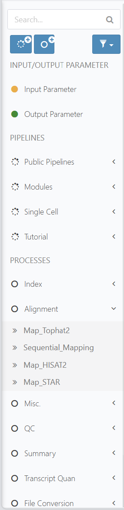
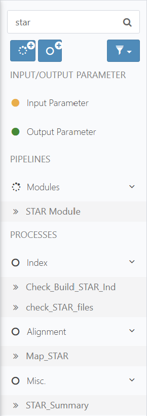
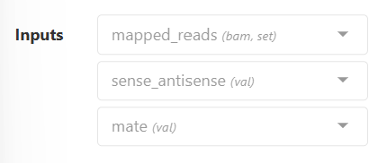
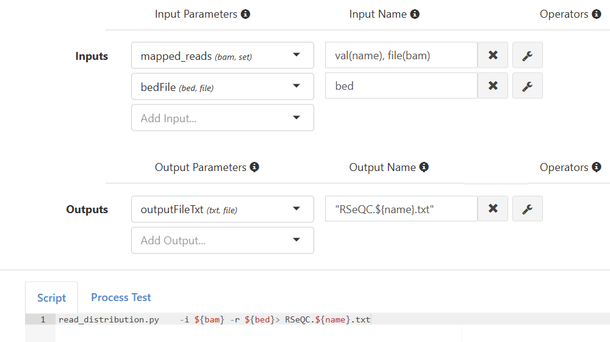
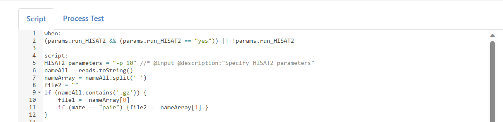
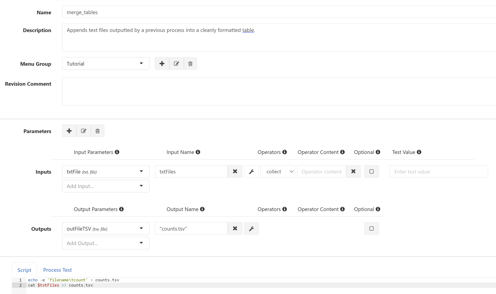
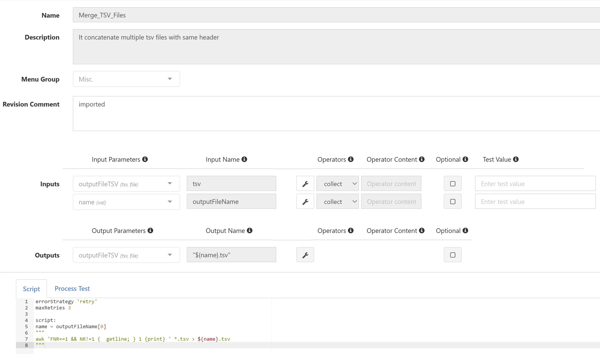
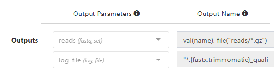
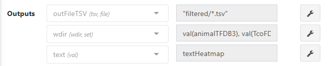
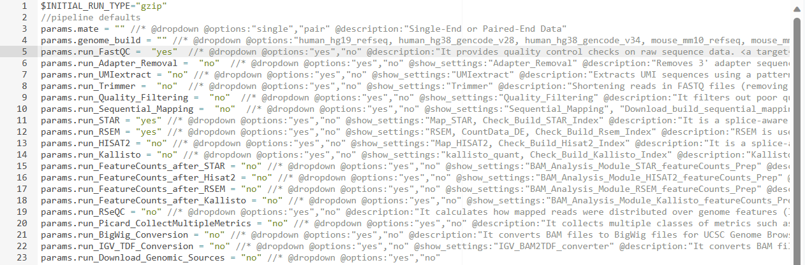

# Process FAQs

This guide will walk you through some frequently asked questions pertaining to the creation and manipulation of processes in Via Foundry. If you don't see your question here, make sure to check out our [Process Creation Guide](process.md), and as always, if you have any questions, please don't hesitate to reach out to support@viascientific.com. 

## **Revision Control and Usage**

Foundry boasts a utility-packed revision control system, granting users effortlessly controllable project autonomy. Here you'll find answers to some frequently asked questions related to this system.

### How can I use existing processes or modules?

Throughout the pipeline creation and execution process, users can simply drag and drop any of Foundry's numerous publicly available processes and modules. In a pipeline's sidebar menu, you can just click on any of the pre-configured process or module menus (for instance, Alignment) and drag the process(es) you want into your workflow.

{.align-center width="20.0%"}

You can also use the sidebar's `Search` bar to query a process, pipeline, or module by name if you don't know which menu it's under. Just type in a keyword and you'll see all the processes containing that keyword, which you can of course drag and drop into your workflow. See the image below for an example of querying all processes and modules containing "STAR":

{.align-center width="20.0%"}

### How can I create a new process revision and use it in a pipeline?

The brief answer is this: Make your desired edits to the process, then save the changes as a new revision, enter the process's page within the pipeline in which it is used, use the dropdown menu to switch revisions, then save changes as a new pipeline revision. For more detail on new revisions and revision control in general, see [How does revision control work in Via Foundry?](developer_faq.md#how-does-revision-control-work-in-via-foundry)

## **Configuring Inputs**

Via Foundry supports a vast breadth of functionality when it comes to defining and fine-tuning your process inputs. Here are some helpful tips to demystify the process.

### When should I use the val, file, and set qualifiers?

As detailed in the [Process Creation Guide](process.md#parameters), Via Foundry has five main types of qualifiers (essentially ways to specify the type of an input), of which three are chiefly used: `val`, `file`, and `set`. You can set a parameter's qualifier while creating the parameter, but if you're using a pre-made parameter, its qualifier will be shown next to its name as the last parenthesized value in the `Add/Edit/Delete Process` page (seen below). Understanding the distinction between these qualifiers will greatly streamline your process and pipeline creation.



Here, you'll see the `set` qualifier is used for the "mapped_reads" parameter, whereas `val` is used for both "sense_antisense" and "mate".

#### `val`
The `val` qualifier, as you may have surmised, should be used when an input or output is of an atomic type: either an integer or a string. Behind the scenes, it enables the value to be called by reference to its name. This qualifier should be used when you want to just pass in one value to or obtain one value from a process, like the minimum number of counts for a read to be processed, or a string with value "single" or "pair" to distinguish whether single- or paired-end read files are being used.


#### `file`
Using the `file` qualifier for a given parameter allows one file to be passed in as the value for that parameter. Though you may encounter scenarios in which you'd like to pass in one file as an input (such as specifying a genome), this is more commonly used to qualify an output parameter, which is often a file containing some necessary/relevant information for the next process or a report file. It's important to understand the distinction between `file` and `set`, because while they are similar (and frequently overlap), they are decidedly not identical.

#### `set`
The most versatile of the qualifiers, `set` acts as a tuple, grouping two different qualifiers together. For instance, in the RSeQC process below, a set of "mapped_reads", expressed as a tuple of [val(name), file(bam)] is taken in. This means that each read ingested has a string representing its name (val(name)), as well as a filepath representing its contents (file(bam)).



As you can imagine, `set` can be incredibly useful when grouping multiple files together (think a whole dataset's worth of read files), which you'll find is a highly generalizable piece of functionality.


### How can I support single- and paired-end reads?

When analyzing mass quantities of omics data, it's important to be able to group paired-end read files together; else, they might be interpreted as unique single-end files, which would disrupt the analysis. To avert such issues, in any process that takes in reads as input, create and attach a "mate" input parameter with the `val` qualifier. You should also have some form of "reads" input parameter, expressed as a `set` (likely a tuple of a string filename and the file's path itself). From here, the precise way to configure your script depends on what you want to achieve with the process, but the general structure of how to account for single- and paired-end reads is as follows:
```
// Concatenate all read names, then split by spaces
nameAll = reads.toString()
nameArray = nameAll.split(' ')
file2 = ""

// Initialize one read file, initialize a second if paired-end reads have been selected
file1 = nameArray[0]
if (mate == "pair") {file2 = nameArray[1]}

...

"""
If ["${mate}" == "pair"]; then
    *Send file 1 and file 2 through some other process/analysis*
else
    *Only iterate over file 1*
"""
```

Once you realize how to integrate these capabilities, they're not at all daunting, and will accelerate your development process.

### How can I define optional input parameters?

Sometimes, you may find it helpful to be able to control whether or not an input parameter is necessary. Foundry easily supports the use of optional input parameters straight from the `Add/Edit/Delete Process` page. Note the "Optional" checkbox in this image:


Checking this box ensures that the process will still be executed even in the absence of that input parameter being defined. Take this process, for example:


Since the `genome` parameter is optional, we define a `filter` parameter with the "NO_FILE" prefix; with this safeguard, the script will still run if no value is entered for `genome`. Moreover, if there is a non-empty value for `genome`, the `filter` parameter will be redefined as `"--filter ${genome}"`, running the script with the specified genome. 

### How can I make an *entire* process optional?

It's slightly more difficult to make a whole process optional than it is to simply check a box to make an input parameter optional, but the procedure is not strenuous. To check whether a process can be run or not, you can and should put a `when` condition in the **Script** section, checking if the parameter in question has been initialized to a desired value. For instance, take this image of the beginning of a Hisat2 process:



Here, the `when` section evaluates to "True", triggering the `script` section, when the "run_HISAT2" parameter is set to "yes". This ensures that the process runs only when it has been requested. Use this logic in your own processes to safeguard against superfluous process execution. 

This functionality does come with a caveat, though; if the `when` condition is not met and the script does not run, the pipeline will exit *if* the process does not have inputs and outputs of the same type and qualifier. As such, true skipping of a process chiefly occurs when the process does some sort of fine-tuning or editing to an input that isn't wholly necessary; in such a case, if the process is skipped, since the output is of the same type as the input, the command flow will simply skip to the next process. If, though, for instance, a `when` condition fails in a process that takes in a BAM file and outputs a .txt file, the process will not run, and the pipeline will exit. Be careful with what processes you make optional to avoid pipelines exiting during runs when you don't wish them to.

## **Configuring Outputs**

There's a myriad of ways in which developers can easily handle input-output relationships that are not 1:1 (i.e. you can send files from different processes, or multiple files from one process, to the input of one process). Here are some solutions to common issues faced.

### How can I collect the outputs of a process?

While creating and running workflows in Via Foundry, you'll frequently find that you want to combine multiple files created by one or more processes into input readable by a different process. Here's how you can do so (note that the files must be of the same extension):

#### Solution
Once you've created several files of the same extension, you can merge them by using an intermediate process and Nextflow's `collect` operator, which accumulates all the files given to it as input and returns them in an aggregated format. For instance, you could connect a process that operates on a list of Fastq files to a process called "merge_tables", represented as such:

#### Sample Solution Process

|                  |                  |
| ---------------- | ---------------- |
| **Process Input**   | **Input Parameter**: txtFile (*txt, file*)<br> **Parameter Name**: txtFiles <br> **Parameter Operator**: collect <br> *Note*: This input represents the .txt output of a previous process |
| **Process Output**   | **Output Parameter**: outFileTSV (*tsv, file*) <br> **Parameter Name**: "counts.tsv"   |
| **Script**           | echo -e 'filename\tcount' > counts.tsv <br> cat $txtFiles >> counts.tsv |
| **Result**           | TSV-formatted table containing filenames and read counts for all input files |


#### More Info
For a visual aid, look at these photos of a pipeline that merges the results of the count_reads process within merge_tables:




This cleanly merges the results into one table, counts.tsv. It's a simple example, so to reinforce the point, here's an example of a process used in the RNA-Seq pipeline, which reinforces the usefulness of merging with the `collect` operator. Merge_TSV_Files concatenates multiple TSV files containing the same header into one TSV file, as shown here:



**Important**: Make sure that, when you're using the `collect` operator, the output you wish to `collect` is in a file format; otherwise, the operator will not work properly.


### How can I parallelize the outputs of a process?

Within Foundry, you may have a process that produces multiple files; if you wish to parallelize those outputs so they're handled independently (and simultaneously), you can use Nextflow's `flatten` or `flatMap` operators. The former transforms a nested channel containing multiple channels or a nested collection into a single-level (flat) collection of files, which lets Nextflow send the files to separate instances of a process, enabling parallel execution of those files. Not dissimilarly, the `flatMap` operator applies some function to every item emitted by a channel, returning the outputted items as a new flat channel, which can then be passed into separate instances of a process, permitting parallelization. In fact, you can parallelize in a rather similar fashion to merging; just replace the `collect` operator with `flatten` like so.

#### Sample Solution Process
|                  |                  |
| ---------------- | ---------------- |
| **Process Input**    | **Input Parameter**: txtFile (*txt, file*) <br> **Parameter Name**: txtFiles <br> **Parameter Operator**: flatten <br> *Note*: This input represents the output of a previous process, parallelized by Nextflow's *flatten* operator |
| **Process Output**        | **Output Parameter**: outFileTSV (*tsv, file*) <br> **Parameter Name**: "counts.tsv"    |
| **Script**           | echo -e 'filename\tcount' > counts.tsv <br> Line 2: cat $txtFiles >> counts.tsv |
| **Result**           | Table containing filenames and read counts for all input files |

Again, this is a rather rudimentary process to illustrate the functionality of `flatten`; you'll likely be using it for more complex purposes, so it's best to be able to understand at the ground level first.

### How can I publish files into multiple directories within one process?

Due to the complex nature of the workflows you'll likely be running, you'll frequently find yourself wanting to send files from one process to multiple directories, either for downstream processing or analysis. Here, you'll find explanations of Foundry's behavior in these contexts.

#### **My process creates files of different extensions. How do I send the files to directories matching each extension?**

If this applies to you, you can use a technique called "globbing" to filter your output files into directories based on their extension and/or name. Globbing, a cousin of Regular Expressions, entails using an asterisk as a wildcard character to match any sequence of characters in a filename. Say, for example, you have a process that filters read files using Trimmomatic, and that outputs gzip files and log files. In the **Output Name** field of each output parameter, you'd want to enter values like `file("reads/*.gz")` or `"*.{fastx, trimmomatic}_quality.log"`, respectively.



Here, the asterisks allow any file whose name contains the sequence of characters following each asterisk to be funneled into the given output (directory). As such, all gzip files produced in the process will be sent to the reads directory, whereas all files produced by Trimmomatic will be created and logged with the name specified by **Output Name**.

In this example, a process takes a TSV file as input and outputs a TSV file to a globbing-specified directory, a set of directories for downstream processing, and a heatmap for data visualization. Note that different types of outputs are created, but using globbing, only TSV files produced will be sent to an actual output directory. This can be a very helpful tool for filtering only a select group of outputs to a directory.



#### **What happens if the patterns in **Output Name** don't match?**

Say some process has two output parameters; one looking for an HTML file and one looking for reads files. For a given output file, behind the scenes, Foundry goes one by one, output parameter by output parameter, and checks the file's extension against that of each input. If the file is compatible with the first output parameter, it is directed to whatever location is specified by that parameter. If not, the process is repeated with the second parameter, and so on. However, as soon as a file is allocated to some output directory, it cannot also be sent to another location within that same process. 

This isn't a problem for our initial example, wherein one output wants an HTML file and the other a reads file. However, in the case wherein an output document matches the criteria for more than one output directory, the document will only be published to the first of its compatible directories. Be cognizant of cases like this, where you might expect one document to publish to multiple directories; however, Foundry does not behave that way as of yet, so you may need to create a new process to direct the file as desired.

## **Defining Process Settings/Resources**

Foundry processes vary in how computationally intensive they are to execute. Users have a fine-grained level of control over how to configure process settings, in addition to how many resources are allocated to a process's execution.

### How can I define process settings/options?

Click [here](process.md#process-options).

### How can I manually allocate resources to my processes?

In the `Advanced` tab of the runpage, you can specify exactly how all processes or individual processes will be queued, along with how much memory, how many CPUs, and how long they will take. By clicking the **Executor Settings for Each Process** button, you can then customize the resources allocated to each process by clicking on a process's checkbox and manipulating the desired values. For more of a brute-force approach, you can check off **Executor Settings for All Processes**, which will let you configure a group of settings that will apply to every process in the pipeline. For more information, click [here](faq.md#how-should-i-configure-my-executor-settings).


## **Integrating Different Scripting Languages**

Via Foundry is proudly compute-agnostic; we support a wide variety of scripting languages and environments. Process scripts can be made with any combination of Bash, Groovy, Perl, Python, and R, with support for the importation of many more languages. In this section, you'll find answers to some common questions about how to navigate Foundry's scripting environment.

### How can I use my own Python or R script in a process?

Oftentimes, users may want to use scripts they've already created while making and running Foundry pipelines. In processes whose scripts are in Bash, Python, or R, here's the code required to import preexisting scripts:
```
import subprocess as sp

# Here, "my_functions.py" represents the function(s) you'd like to import; replace the name with those of your functions
functions_py_path = sp.getoutput("my_functions.py")

# This line copies your script(s) to the current working folder
# The "shell = True" environment allows this command to be executed in a shell environment
sp.call("cp " + functions_py_path + " .", shell = True)
```

### How can I convert a Groovy array into a Python or R array?

Sometimes, over the course of running a Foundry pipeline, Nextflow will feed a set/array of values into a process. Since Nextflow is built on Groovy, those values will be in Groovy; if your process is in Python or R, you need some way to convert the array before running your script. For the sake of example, let's say you have an input set of multiple reads files called "reads", produced by a previous process and intended to be filtered or analyzed in the current process. Above the ```script:``` block, you should use the following command:
```
newreads = "[" + reads.collect{ '"' + it + '"'} + "]"
```
This will convert all the read names to a string enclosed by square brackets, which is the desired format. Then, in the ```script:``` section of your process, converting to R or Python is as simple as running:
```
reads_array = ${newreads}
```

## **Understanding Scope in Foundry**

Given the breadth of locations in which one can write scripts and functions in Foundry, it's only natural to have questions, like "If I define a variable in *x* section, can I use it in *y* section or not?" about the scope of scope, so to speak. This section is aimed at elucidating best practices for what goes where (and why) in Foundry.

### What variables are global and local in a pipeline?

As you're likely familiar, the **Advanced** section of a pipeline's page contains all the files and scripts necessary to run that pipeline. From top to bottom, it displays various configuration files (base.config, test.config, nextflow.config), then the Pipeline Header Script and Footer Script. Within this architecture, the nextflow.config file is superordinate to everything else in the pipeline, meaning that if you define and instantiate a variable `example` within it, you will not be able to overwrite the value of `example` anywhere else in the pipeline or its constituent processes, and attempting to do so will create unforeseen errors in your run. For this reason, it's best practice to use the `params` scope when defining variables in the nextflow.config file (e.g. instead of naming a parameter `reads`, you'd name it `params.reads`). Using the `params` scope allows you to create different variables with the same non-prefixed by `params` name; following from the previous example, defining `params.reads` in nextflow.config enables future creation of variables called `reads`, adhering to the conventions described throughout this section.



The header script is rather more flexible in the sense that variables defined within are not global in scope; if you define a variable `run_STAR` in the **Pipeline Header Script** section, then define another variable `run_STAR` within some process, you'll almost certainly encounter thorny overloading issues. To preempt any such issues, it's advisable to 1) use the `params` scope within the header script (to help avoid overloading) and 2) create unique variable names.

Also of note: within the header script, you can define functions to be invoked by processes. For instance, in several of our pipelines, we define a pathChecker function in the **Pipeline Header Script** to safeguard against improper indices being given, calling it from within processes whenever we build an index in the pipeline's pre-processing stage.

### What variables are global and local within a process?

Scope is somewhat less binary within Foundry processes than it is within pipelines, though such minutiae are beyond the breadth of this guide. The points which should be impressed upon users are as follows:

- Declaring a variable in the header or footer script defines it in a global scope, exposing it for future unwanted manipulation. As such, while it is objectively possible to create a variable in the header or footer script, it is somewhat unnecessary. Instead, it's recommended that header scripts (footer scripts are infrequently used) be utilized for style purposes, like configuring the appearance of input fields on the runpage; or for property-dependent autofill of [computing resources](pipeline_guide.md#autofill-feature-for-pipeline-properties) or [pipeline inputs](pipeline_guide.md#autofill-feature-for-pipeline-inputs). To illustrate this point, here's the header script for an index-checking process:
```
build_STAR_index = false //* @checkbox @description:"If you're using custom genome and gtf please enable build_STAR_index option." 

//* autofill
if ($HOSTNAME == "default"){
    $CPU  = 5
    $MEMORY = 150
}
//* platform
if ($HOSTNAME == "ghpcc06.umassrc.org"){
    $TIME = 1000
    $CPU  = 5
    $MEMORY = 50
    $QUEUE = "long"
}
//* platform
//* autofill
```

    You'll see that the only variables it creates are for entering inputs on the runpage and for autofilling executor properties, as it is risky and ill-advised to declare variables of operational salience here.

    *Note*: Similar to the header script in pipelines, you can also define functions in process header scripts, which will be usable by other processes.

- Defining variables in the process's **Script** section itself creates them within a local scope, meaning that in theory, you can define a variable of the same name in the scripts of as many processes as you'd like, and they won't interfere with each other. It's best practice to define such variables under the `script:` header (as opposed to between `when:` and `script:`) but before the segment enclosed in triple quotes, as shown here:
```
when:
(params.run_STAR && (params.run_STAR == "yes")) || !params.run_STAR

script:
params_STAR = "--runThreadN 10" //* @input @description:"Specify STAR input parameters"
sense_antisense = "no" //* @dropdown @options:"yes","no"  @description:"Export sense/antisense bam files"

"""
(mapping STAR; details unimportant)
"""
```

    In this example, `params_star` and `sense_antisense` are defined locally; their existence is null outside the process. Modeling your processes and variable declarations after this structure will prove potent in staving off any potential headache that could occur from variable overloading.


- If you manipulate an input variable, you overwrite its value. If a process fails due to this and attempts to retry, it will "remember" the most recent value of that variable, which is the incorrect one; this issue will compound and likely cause the pipeline to exit. **Don't overwrite input variables inside the *script* section**. 

## **Support**

For any questions or help, please reach out to
<support@viascientific.com> with your name and question.


