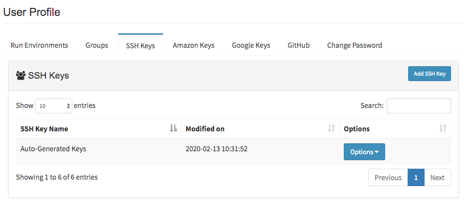
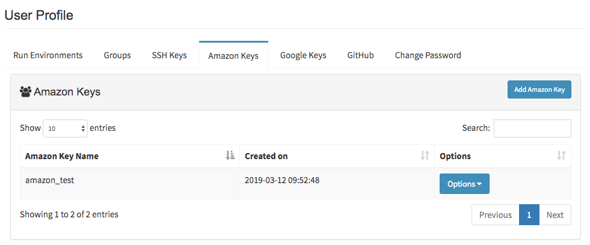
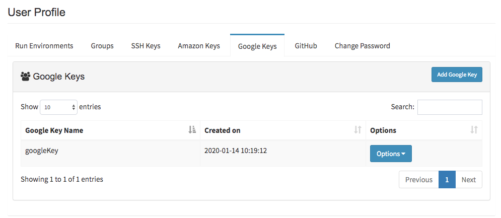
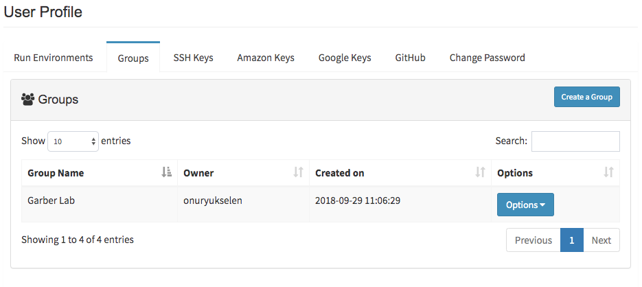
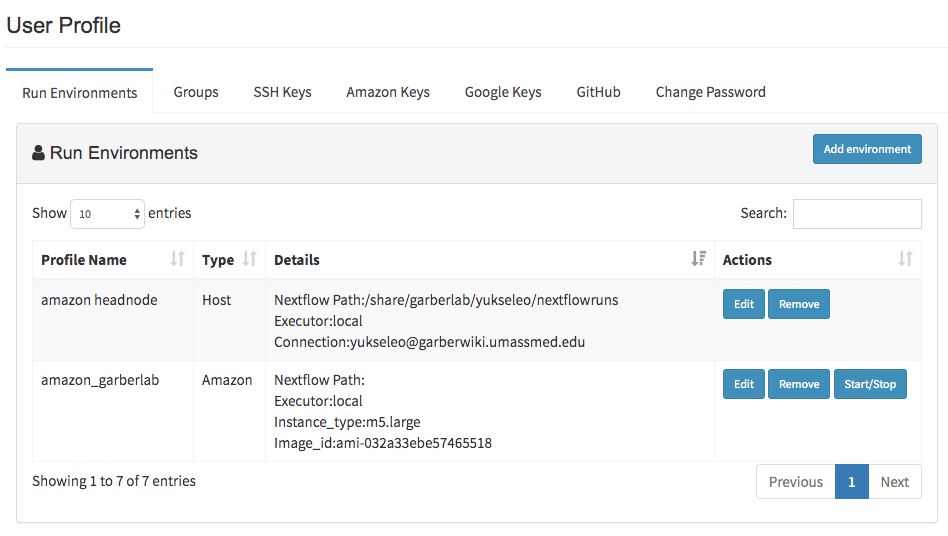
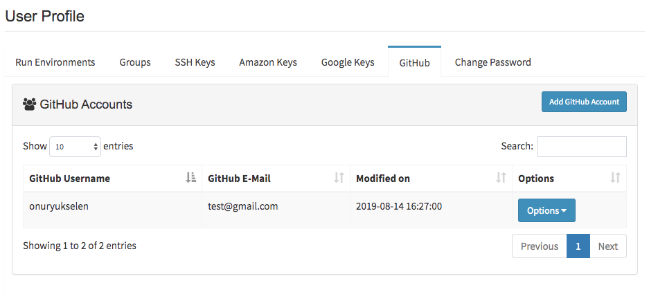
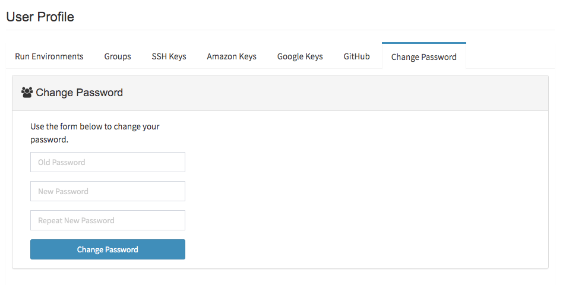

# Profile Guide

In this guide, you'll discover all the available options you can
explore on your Via Foundry Profile page.

## Profile Page

After logging in, simply click on the "Profile" tab located at the
top-right corner of your screen. You'll see a number of different tabs
on your profile page that you can click through and explore.

The platform offers several options for creating connection profiles and
managing your credentials.

-   First up is the **Run Environments** tab, which is your main hub for
    creating connection profiles.
-   Next, you can use the **Groups** tab to create a group and add
    members to it, allowing you to share your runs or pipelines with
    others.
-   To manage your SSH keys, you'll need to head over to the **Run
    Environments** tab, where you can create new keys or enter existing
    SSH key pairs in the `Edit` section to establish connections with
    hosts.
-   You can also add your **Amazon Keys** or **Google Keys** in order to
    execute your runs in the cloud.
-   Under the **Repositories** tab (formerly called **GitHub**), you can
    enter your security credentials to push your pipeline information to
    your Github or Bitbuckets account.
-   If you're not using Google sign-in, you can change your password
    within the **Change Password** section.
-   Lastly, in the **Notification** tab, you can opt into receiving
    emails about completed or failed runs.

It's important to note that before creating a run environment, you'll
need to create SSH keys in the Run Environments tab. And if you plan on
executing runs in the cloud, you'll need to add your Amazon or Google
keys as well.

## SSH Keys

To create or enter existing SSH key pairs, navigate to the **SSH Keys**
tab and click on the `Add SSH Key` button in the top right corner.

Next, you'll need to choose between two methods:

-   **A. Use your own keys:** If you choose this option, you'll need to
    provide your private and public key pairs. You can find these keys
    on your computer at the default location: '~/.ssh/id_rsa 'for the
    private key and '~/.ssh/id_rsa.pub' for the public key. Simply
    copy and paste these keys into the appropriate fields in your
    browser. If these files don't exist or you want to create new ones,
    check out this 
    [link](../faq/faq.md#how-can-i-create-ssh-keys-in-my-computer)
    for guidance.
-   **B. Create new keys:** To generate a new pair of SSH keys, simply
    click the "Generate Keys" button.

After you've saved your key, your information will be encrypted and
kept secure. To establish a connection, you'll need to add your public
key to the '~/.ssh/authorized_keys' file on the host machine. For
help with this step, feel free to contact us at
<support@viascientific.com>.

## Amazon Keys

To enter your AWS security credentials (access key, secret key, and
default region), head over to the **Amazon Keys** tab and click on the
`Add Amazon Key` button. Rest assured that your information will be
encrypted and kept secure, and only you will have full access to view
and modify your key information.

**Note:** Once you've saved your key, it won't be visible for security purposes.
However, you can always overwrite it with a new key or delete it if
needed.

## Google Keys

To enter your Project ID and Service Account Key in the Google keys tab,
start by clicking the `Add Google Key` button.

-   For your **Project ID**, head over to the Google Cloud Console and
    navigate to the Dashboard section. From there, check the Project
    info box to find your Project ID, which should look something like
    "viafoundry-193616".
-   To input your **Service Account Key**, also head over to the Google
    Cloud Console and navigate to **APIs & Services** → **Credentials**.
    From there, click on the `Create Credentials` drop-down and select
    `Service Account Key`. On the following page, choose an existing
    service account or create a new one if needed, then select JSON as
    the "Key Type". Finally, click the Create button and download the
    JSON file with a name of your choice (e.g., creds.json).

Remember that, after saving your key, you won't be able to view your
Service Account Key for security reasons. However, you can always
overwrite it with a new key or delete it if necessary.

## Groups

In the **Groups** tab, you can create groups by selecting the
`Create a Group` button. Once you have created a group, you can add
members by clicking the `Options > Edit Group Members` button. This
interactive platform allows you to share your process, pipeline, or
projects with your group members. To view the current members of the
group, select the `Options > View Group Members` button. Additionally,
you have the option to delete your group by selecting the
`Options > Delete Group` button, or to edit its name with
`Options > Edit Group Name`.

## Run Environments

## Software Dependencies

In order to execute our pipelines, you have to install and validate
certain software dependencies into your host machine.

To enable proper pipeline execution, Nextflow should be installed into
your host environment. Since most of our pipelines isolate their
dependencies within their Docker, please
install Docker or Podman into your machine by following the guidelines
below. If your platform doesn't support the installation of Docker, you
can still use our pipelines with just Singularity.

> -   Installing
>     [Nextflow](https://www.nextflow.io/docs/latest/getstarted.html)
> -   Installing
>     [Docker](https://docs.docker.com/engine/install/)
> -   Installing [Singularity (Version
>     3)](https://docs.sylabs.io/guides/3.0/user-guide/installation.html)
>
> **How to Add Software to Your $PATH Environment:**
>
> -   **JAVA Command (optional):** If JAVA is not added to the $PATH
>     environment, you can run the command (`module load java/8.0`) to
>     manipulate your $PATH environment and gain access to JAVA.
> -   **Nextflow Path or Command (optional):** If Nextflow is not added
>     to the $PATH environment, you can either enter the path of the
>     nextflow (eg. `/project/bin`), or run the command
>     (`module load nextflow`) to manipulate your $PATH environment and
>     gain access to new software.
> -   **Docker/Singularity Command (optional):** You can run a command
>     (eg. `module load docker/1.0.0` or
>     `module load singularity/3.0.0`) to manipulate your $PATH
>     environment in order to gain access to new software.

You can set general run settings by following the **Run Environments**
section:

> -   **Executor of Nextflow:** Nextflow itself is initiated with this
>     method, which will be only used for running Nextflow itself.
> -   **Executor of Nextflow Jobs:** This setting will be used as the
>     default setting for submitted jobs by Nextflow.
> -   **Download Directory:** Used to download shared pipeline files
>     such as genome indexes. If your platform already has an allocated
>     path for such files, please enter that path. Otherwise, you can
>     set any path that you have permission to write. e.g.
>     `/share/viafoundry/downloads`

Once you complete these steps, you're now able to start using publicly
available pipelines.

This section is used for defining connection profiles by clicking on the
`Add Environment` button. You can choose from three options: Host,
Amazon or Google.

-   **Host**: This option is for users who have access to High
    Performance Computing (HPC) environments or personal workstations.
-   **Amazon**: This option is for users who have an Amazon Web Services
    (AWS) account or plan to create an EC2 instance to run jobs in the
    cloud.
-   **Google**: This option is for users who want to use their Google
    Cloud account to run jobs in the cloud.

### A. Defining Host Profiles:

-   **Username/Hostname:** To connect to a remote host, you need to
    provide your username and the hostname of the remote host in the
    format "<yourusername@yourhostname>". For instance, for the
    username "us2r" and hostname "ghpcc06.umassrc.org", you should
    enter "<us2r@ghpcc06.umassrc.org>".

-   **SSH Port (optional):** By default, Via Foundry uses TCP port 22
    for SSH connections. However, you can specify a different port
    number if needed.

-   **SSH Keys:** Via Foundry stores your SSH keys in the SSH keys tab
    and uses them to authenticate your SSH connections.

-   **Run Command (optional):** You can specify a command or a series of
    commands to run before starting the Nextflow job. Separate multiple
    commands using "&&". For example:

        source /etc/bashrc && module load java/1.8.0_77 && module load
        singularity/singularity-3.4.0

-   **Nextflow Path (optional):** If the Nextflow executable is not in
    your $PATH, you can specify the path to the executable in this
    block. For example:

        /project/umw_biocore/bin

-   **Singularity Cache Folder:** Via Foundry uses a local directory to
    store Singularity images downloaded from remote hosts. By default,
    this directory is located in your home directory. However, if you
    are using a computing cluster, you need to specify a shared
    directory that is accessible from all computing nodes.

-   **Profile Variables:** To facilitate the use of genome reference and
    index files in your pipelines, you can specify a download directory
    in which these files are stored. If multiple users are using Via
    Foundry, it is recommended to use a shared path in your cluster. For
    example:

        params.DOWNDIR="/share/dolphinnext/downloads"

-   **Environment Variables:** You can set BASH environmental variables
    here. Note: don't use spaces to separate multiple variables; use
    newlines instead.

-   **Executor Settings:** In Via Foundry, there are four different
    sections to control executor settings: the first two are defined in
    **Profile** -> **Run Environment**, and the remaining two are
    adjusted in the **Advanced** tab of the run page. If you select an
    executor other than "Local" or "Ignite", Via Foundry prompts you
    to enter additional settings, such as the queue/partition, memory,
    CPU, and time.

    > **1. Executor of Nextflow (navigate to Profile -> Run
    > Environments)**:
    >
    > > This setting controls how Via Foundry initiates Nextflow.
    > > Currently, Via Foundry supports the Local, SGE, SLURM, and LSF
    > > executors to initiate Nextflow. For the SGE, SLURM, and LSF
    > > executors, Via Foundry only uses them to run Nextflow itself, so
    > > the time limit should be long enough to execute all processes in
    > > the pipeline. For local execution, DolphinNext limits the total
    > > amount of memory and CPU that can be used, so these values
    > > should be close to the maximum capacity of your computer.
    > >
    > > -   Suggested parameters for SGE/SLURM/LSF: long (queue) 8 (GB
    > >     Memory) 1 (CPU) 5000-8000 (min, Time)
    > > -   Suggested parameters for Local: 100 (GB Memory) 8 (CPU)
    >
    > **2. Executor of Nextflow Jobs (navigate to Profile -> Run
    > Environments)**:
    >
    > > This setting will be used as the default setting for submitted
    > > jobs by Nextflow if you don't set any parameters in the
    > > **Advanced** section of your run page.
    > >
    > > -   Suggested parameters for SGE/SLURM/LSF: short (queue) 20 (GB
    > >     Memory) 1 (CPU) 240 (min, Time)
    > > -   Suggested parameters for Local: 20 (GB Memory) 1 (CPU)
    >
    > **3. Executor Settings for All Processes (in the advanced tab of
    > run page)**:
    >
    > > These settings will overwrite those in **Executor of Nextflow
    > > Jobs** and set default parameters for all Nextflow Jobs.
    > >
    > > -   Suggested parameters for SGE/SLURM/LSF: short (queue) 20 (GB
    > >     Memory) 1 (CPU) 240 (min, Time)
    > > -   Suggested parameters for Local: 20 (GB Memory) 1 (CPU)
    >
    > **4. Executor Settings for Each Process (in the advanced tab of
    > run page)**:
    >
    > > If a particular process requires different parameters than the
    > > defaults (which are defined in the **Executor Settings for All
    > > Processes** or **Executor of Nextflow Jobs** sections), you can
    > > overwrite the general settings by clicking the checkbox of the
    > > process that you want to change. This will only affect the
    > > settings of the selected process and keep the original settings
    > > for the rest of the processes.
    > >
    > > -   Suggested parameters for SGE/SLURM/LSF: long (queue) 20 (GB
    > >     Memory) 4 (CPU) 1000-5000 (min, Time)
    > > -   Suggested parameters for Local: 20 (GB Memory) 4 (CPU)
    >
    > **Note:** If non-standard resources or settings are required for the
    > executor, then you can specify these parameters by using **Other
    > Options** box. For instance, to submit an SGE job with 3 CPU using
    > parallel environments, you can enter `-pe orte 3` (to use MPI for
    > distributed-memory machines) or `-pe smp 3` (to use OpenMP for
    > shared-memory machines) in the **Other Options** box, leaving the
    > CPU box empty.
    > :::

### B. Defining AWS Batch Profiles:

Please choose type of the run environment as "Host" and enter
following information.

-   **Username/Hostname:** To connect to a remote host, you need to
    provide your username and the hostname of the remote host in the
    format "<yourusername@yourhostname>". For instance, for the
    username "us2r" and hostname "ghpcc06.umassrc.org", you should
    enter "<us2r@ghpcc06.umassrc.org>".

-   **SSH Port (optional):** By default, Via Foundry uses TCP port 22
    for SSH connections. However, you can specify a different port
    number if needed.

-   **SSH Keys:** Via Foundry stores your SSH keys in the SSH keys tab
    and uses them to authenticate your SSH connections.

-   **Run Command (optional):** You can specify a command or a series of
    commands to run before starting the Nextflow job. Separate multiple
    commands using "&&". For example:

        source /etc/bashrc && module load java/1.8.0_77 && module load
        singularity/singularity-3.4.0

-   **Nextflow Path (optional):** If the Nextflow executable is not in
    your $PATH, you can specify the path to the executable in this
    block. For example:

        /project/umw_biocore/bin

-   **Singularity Cache Folder:** Via Foundry uses a local directory to
    store Singularity images downloaded from remote hosts. By default,
    this directory is located in your home directory. However, if you
    are using a computing cluster, you need to specify a shared
    directory that is accessible from all computing nodes.

-   **Profile Variables:** You can set commonly used pipeline variables
    here. For instance,`params.DOWNDIR` is used in most of our public
    pipelines to save all genome related files (fasta, index etc.), so
    you can set this variable like this:
    `params.DOWNDIR = "/share/dnext_data"` Also, you can enter multiple
    variables by separating them with newlines.

-   **Environment Variables:** You can set BASH environmental variables
    here. Note: don't use spaces to separate multiple variables; use
    newlines instead.

-   **Executor of Nextflow:** Please select the `Local` Nextflow
    executor.

-   **Executor Settings for Nextflow:** Please enter 10GB in the
    **Memory** field and 1 in the **CPU** field.

-   **Executor of Nextflow Jobs:** Please select `AWS Batch` for
    Nextflow jobs.

-   **Queue, Memory, CPU, and other options:** Please enter the queue
    name and set the default memory and CPU you'll allocate for each
    job (e.g. 10GB memory and 1CPU). These settings can be adjusted in
    the run page.

-   **Amazon Keys:** AWS credentials that are saved in the **Amazon
    Keys** tab will allow you to submit jobs to AWS Batch.

-   **Default Working Directory:** Default directory in the host machine
    where runs will be executed. (eg. `/data/dnext`)

-   **Default Bucket Location for Publishing:** Default bucket location
    where dolphinnext reports will be published. (e.g.
    `s3://bucket/dnext`)

### C. Defining Non-Batch Amazon Web Services Profiles:

**SSH Keys:** These are saved in the **SSH Keys** tab and will be used
when connecting to a host. SSH keys are a secure way to authenticate and
encrypt connections between servers. It's recommended to generate a new
key pair for each instance you plan to connect to. * **Amazon Keys:**
These AWS credentials are saved in the **Amazon Keys** tab and allow you
to start/stop Amazon EC2 instances. These credentials consist of an
access key and a secret access key. * **Instance Type:** This refers to
the type of [_Amazon EC2
instance](https://aws.amazon.com/ec2/instance-types) that you will use.
Instance types comprise varying combinations of CPU, memory, storage,
and networking capacity. For example, "m3.xlarge" is an instance type
that provides a balance of CPU and memory resources. * **Image ID:**
This is the virtual machine ID (VM ID) that you will use to launch the
instance. The image ID is specific to the region and operating system
that you are using. For example, "ami-032a33ebe57465518" is a sample
image ID for an Amazon Machine Image (AMI) that is based on the Ubuntu
operating system.

> If you want to create your own image, please install the following programs:
>
>    -   [Singularity](http://singularity.lbl.gov)
>    -   [Docker engine](https://www.docker.com/) (version 1.11 or
>         higher)
>    -   Apache Ignite with Cloud-init package
>    -   [Nextflow](https://www.nextflow.io/)
>    -   [AWS
>         CLI](https://docs.aws.amazon.com/cli/latest/userguide/cli-chap-install.html)

-   **Subnet ID/Security Group/Shared Storage ID/Shared Storage Mount:**

    > The filesystem needs to be created at <https://console.aws.amazon.com/efs/>, and this information will be obtained upon the creation of a shared file system.
    >
    >    -   *Subnet ID:* Identifier of the VPC subnet to be applied,
    >         e.g., subnet-05222a43.
    >    -   *Security Group:* Identifier of the security group to be
    >         applied, e.g., sg-df72b9ba, which is used by default.
    >    -   *Shared Storage ID:* Identifier of the shared file system
    >         instance, e.g., fs-1803efd1.
    >    -   *Shared Storage Mount:* Mount path of the shared file
    >         system, e.g., /mnt/efs.

    >
    >
    >
    > Please make sure the following criteria are satisfied:
    >
    >    1.  The image used must have the directory to mount this
    >         storage.
    >    2.  The output directory must be under this mount location.
    >    3.  The storage system must be created in the selected region,
    >         and necessary rights need to be given in the console.
    >    4.  The EC2FullAccess and S3FullAccess permissions have been
    >         added.
    >
    > **Warning:** Both the EFS and images should be located in the same location.

-   **Default Working Directory:** This is the default directory in the
    host machine where runs will be executed. It is an optional
    parameter for AWS. For example, you can set it to "/data/dnext".

-   **Default Bucket Location for Publishing:** This is the default
    bucket location where Via Foundry reports will be published. It is
    also an optional parameter for AWS. For example, you can set it to
    `s3://bucket/dnext`.

-   **Run Command (optional):** You may specify a command or multiple
    commands to be run before the Nextflow job starts. Separate multiple
    commands with the && sign. For example, you could use the following
    command to load modules before running the job:
    `source /etc/bashrc && module load java/1.8.0_31 && module load bowtie2/2.3.2`.

-   **Nextflow Path (optional):** If the Nextflow path is not added to
    the $PATH environment variable, you can define the path in this
    block. For example, you could set it to `/project/umw_biocore/bin`.

-   **Singularity Cache Folder:** This is the directory where remote
    Singularity images are stored. By default, the home directory is
    used. Note that when using a computing cluster, it must be a shared
    folder that is accessible from all computing nodes.

-   **Profile Variables:** You can set commonly used pipeline variables
    here. For instance,`params.DOWNDIR` is used in most of our public
    pipelines to save all genome related files (fasta, index etc.), so
    you can set this variable like this:
    `params.DOWNDIR = "/share/dnext_data"` You can also enter multiple
    variables by separating them with newlines.

-   **Executor of Nextflow/Executor of Nextflow Jobs:** Amazon instances
    are automatically configured to use the Ignite executors. As such,
    when defining an Amazon profile, you should select `Local` for
    **Executor of Nextflow** and `Ignite` for **Executor of Nextflow
    Jobs.**

### D. Defining Google Profiles:

-   **SSH Keys:** are saved in SSH keys tab and will be used while
    connecting to host.

-   **Google Keys:** Google credentials that are saved in Google keys
    tab and will allow to start/stop Google Cloud instances.

-   **Zone:** The Google zone where the computation is executed.(eg.
    us-east1-b)

-   **Instance Type:** [Google Cloud machine
    types](https://cloud.google.com/compute/docs/machine-types) that
    comprise varying combinations of CPU, memory, storage, and
    networking capacity (eg. `n1-standard-4`).

-   **Image ID:** Virtual machine ID (eg.
    `dolphinnext-193616/global/images/dolphinnext-images-v1`).

    > If you want to create your own image, please install following programs:
    >
    >    -   [Singularity](http://singularity.lbl.gov)
    >    -   [Docker engine](https://www.docker.com/) (version 1.11 or
    >         higher)
    >    -   Apache Ignite with Cloud-init package
    >    -   [Nextflow](https://www.nextflow.io/)
    >    -   [gcloud](https://cloud.google.com/sdk/install)

-   **Default Working Directory:** This is the default directory in the
    host machine where runs will be executed. It is mandatory for Google
    Cloud profiles. (e.g., /data/dnext)

-   **Default Bucket Location for Publishing:** This is the default
    bucket location where Via Foundry reports will be published. It is
    mandatory for Google Cloud profiles, and you can always edit this
    path in the run page. For example, you could set it to
    `gs://bucket/dnext`.

-   **Run Command (optional):** You may specify a command or multiple
    commands to be run before the Nextflow job starts. Separate multiple
    commands with the && sign. For example, you could use the following
    command to load modules before running the job:
    `source /etc/bashrc && module load java/1.8.0_31 && module load bowtie2/2.3.2`.

-   **Nextflow Path (optional):** If the Nextflow path is not added to
    the $PATH environment variable, you can define the path in this
    block. For example, you could set it to `/project/umw_biocore/bin`.

-   **Singularity Cache Folder:** This is the directory where remote
    Singularity images are stored. By default, the home directory is
    used. Note that when using a computing cluster, it must be a shared
    folder that is accessible from all computing nodes.

-   **Profile Variables:** You can set commonly used pipeline variables
    here. For instance,`params.DOWNDIR` is used in most of our public
    pipelines to save all genome related files (fasta, index etc.), so
    you can set this variable like this:
    `params.DOWNDIR = "/share/dnext_data"` You can also enter multiple
    variables by separating them with newlines.

-   **Executor of Nextflow/Executor of Nextflow Jobs:** Google instances
    are automatically configured to use the Ignite executors. As such,
    when defining a Google profile, you can select `Local` for
    **Executor of Nextflow** and `Ignite` for **Executor of Nextflow
    Jobs.**

## GitHub Connection

You can enter your GitHub or Bitbucket security credentials (Username,
E-mail, Password) by clicking on the `Add Account` button in the
**Repositories** tab. Your information will be encrypted and kept
secure. By adding a Github or Bitbucket account, you'll be able to push
your pipeline information into a public account, where you can then
share it with others.

## Change Password

If you're not using a Google sign-in, you can change your Via Foundry
password by using this section.

## Support

For any questions or help, please reach out to
<support@viascientific.com> with your name and question.
