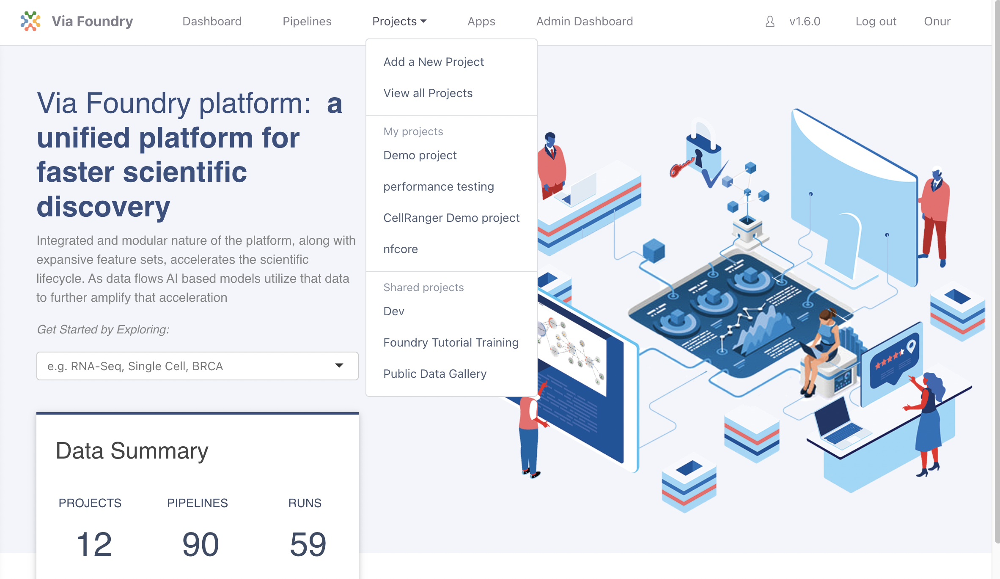

# Project Guide

This guide will walk you through creating a project using the Via
Foundry platform, and how to insert pipelines and files into it.

## Creating Projects and Adding Pipelines

Projects are platforms to categorize all of your runs and files. To run
a pipeline, you must add it into your project. There are two ways to
create a new project and add pipelines to it:

> -   A.  First, click the "Projects" button in the top of the screen.
>         From the dropdown menu, you can create a new project by
>         clicking `Add a New Project`. After saving the name of the
>         project, it will be added to your Projects table, which is
>         accessible from the dropdown menu, as shown in the image
>         below:
>
> 

> **Note:** You can always edit or remove your projects by clicking on the project
> name from the dropdown menu, navigating to the `Settings` tab, and
> clicking the `Edit` or `Delete Project` icon.
> :::
>
> Now you are able to enter the project page by clicking the name of the project from the `Projects` dropdown menu. You will notice five tabs in the project page:
>
>    -   **Dashboard:** Your project's homepage. The dashboard
>         contains the `Description` box, where you can write down
>         information about the project; and the `Analysis` section,
>         which will contain reports on the project and its runs.
>    -   **Data Collections:** The hub of whatever data you need to add
>         in order to run your desired pipelines. Add data by clicking
>         the `Add Collection` button.
>    -   **Pipelines:** The pipeline(s) you want available for your
>         project. Click `Create Pipeline` or `Add Pipeline` to
>         customize your project's pipeline environment.
>    -   **Runs:** Table containing information about all the runs
>         conducted in your current project (see image below). You can
>         enter a specific run's page by clicking on the name of the
>         run.
>    -   **Settings:** Information about your project: name, creator,
>         and date/time created. From this tab, you can edit or delete a
>         given project, as mentioned above.
>
>     
>
> -   B.  You can also create a project by clicking the `Pipelines`
>         button on the top left of the page. Select the pipeline you
>         want to run by clicking on it. At the top right of the new
>         pipeline page, you'll see a `Run` button; press this to
>         initiate a run.
>
> 
>
> The `Run` button opens a new window where you can create a new project
> by clicking `Create a Project`. After entering and saving the project
> name, it will be added to your project list. From here, you can select
> your project by clicking on it, as shown in the image below.
>
> 
>
> You can proceed by entering the run name, which will subsequently be
> added to your project's run list. Clicking `Save Run` will redirect
> you to the "Run Page", where you can initiate your run.

## Support

For any questions or help, please reach out to
<support@viascientific.com> with your name and question.
