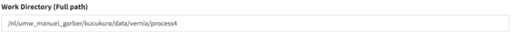
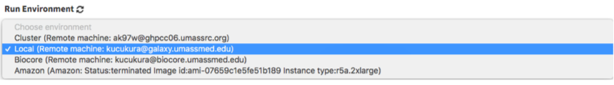

# Quick Start Guide

## Signing Up

This guide will walk you through how to start using Via Foundry
(formerly DolphinNext) pipelines. First off, you need to navigate to the
Via Foundry web page at <https://www.viafoundry.com> and click the
`Log in` button. You will be asked to enter your institute's log-in
information. An email will be sent to you once your information has been
verified.

## Creating Profile

For information on how to set up and customize your Via Foundry profile
to your specifications, please reference our [Profile
Guide](../profile/profile.md).

## Software Dependencies

In order to execute our pipelines, you have to install and validate
certain software dependencies into your host machine.

To enable proper pipeline execution, Nextflow should be installed into
your host environment. Since most of our pipelines isolate their
dependencies within their Docker or Singularity containers, please
install these softwares into your machine by following the guidelines
below. If your platform doesn't support the installation of Docker, you
can still use our pipelines with just Singularity.

> -   Installing
>     [Nextflow](https://github.com/UMMS-Biocore/dolphinnext/blob/master/docs/dolphinNext/faq.md#id6)
> -   Installing [Singularity (Version
>     3)](https://github.com/UMMS-Biocore/dolphinnext/blob/master/docs/dolphinNext/faq.md#id4)
> -   Installing
>     [Docker](https://github.com/UMMS-Biocore/dolphinnext/blob/master/docs/dolphinNext/faq.md#id5)
>
> **How to Add Software to Your $PATH Environment:**
>
> -   **JAVA Command (optional):** If JAVA is not added to the $PATH
>     environment, you can run the command (`module load java/8.0`) to
>     manipulate your $PATH environment and gain access to JAVA.
> -   **Nextflow Path or Command (optional):** If Nextflow is not added
>     to the $PATH environment, you can either enter the path of the
>     nextflow (eg. `/project/bin`), or run the command
>     (`module load nextflow`) to manipulate your $PATH environment and
>     gain access to new software.
> -   **Docker/Singularity Command (optional):** You can run a command
>     (eg. `module load docker/1.0.0` or
>     `module load singularity/3.0.0`) to manipulate your $PATH
>     environment in order to gain access to new software.

You can set general run settings by following the **Run Environments**
section:

> -   **Executor of Nextflow:** Nextflow itself is initiated with this
>     method, which will be only used for running Nextflow itself.
> -   **Executor of Nextflow Jobs:** This setting will be used as the
>     default setting for submitted jobs by Nextflow.
> -   **Download Directory:** Used to download shared pipeline files
>     such as genome indexes. If your platform already has an allocated
>     path for such files, please enter that path. Otherwise, you can
>     set any path that you have permission to write. e.g.
>     `/share/viafoundry/downloads`

Once you complete these steps, you're now able to start using publicly
available pipelines.

## Running Pipelines

1.  The easiest way to run a pipeline is from the main page, by clicking
    the `Pipelines` button at the top left of the screen. From here, you
    can investigate publicly available pipelines as shown below and
    select the pipeline you want to run by clicking on it.

    > 

2.  Once the pipeline is loaded, you will notice a `Run` button at the
    right top of the page.

    > 

3.  Pressing this button opens a new window, where you can create a new
    project by clicking `Create a Project`. After you enter and save the
    name of the project, it will be added to your project list. Now you
    can select your project by clicking on it, as shown in the figure
    below.

    > 

4.  After clicking `Select Project`, you may proceed with entering your
    desired run name, which will be added to your project's run list.
    Clicking `Save Run` will redirect you to the "Run Page".

5.  Initially, in the header of the run page, an orange `Waiting` button
    will be shown. In order to initiate a run, the following data need
    to be entered:

    > 
    >
    > A.  **Work Directory:** Full path of the directory from whence
    >     Nextflow runs will be executed.
    >
    
    >
    > B.  **Run Environment:** The environment, discussed in the
    >     [Profile](../profile/profile.md) page, within which you'd like to
    >     conduct your run. If an [Amazon
    >     profile](../profile/profile.md#b-defining-aws-batch-profiles) or a [Google
    >     profile](../profile/profile.md#c-defining-google-profiles) is selected,
    >     then the status of the profile should be "**Running**".
    >
    
    >
    > C.  **Inputs:** Various values and filepaths, specifying what data
    >     will be processed and how, need to be entered. For additional
    >     information, please check the [Adding Files
    >     section.](../quick/quick.md#adding-files)
    >
    

6.  Once all requirements are satisfied, the `Waiting` button will turn
    into a green `Run` button as shown below. You can initiate your run
    by clicking the `Run` button. Please go through the [Run
    Guide](../run/run.md) for detailed explanation about each module is used.

    > 

## Adding Files

### Remote Files

You can reach your remote files by entering:

> -   Full path of a directory: eg.
>     `/share/data/umw_biocore/genome_data/mousetest/mm10/gz`
> -   Web link: eg.
>     `https://galaxyweb.umassmed.edu/pub/dnext_data/test/reads`
> -   Amazon (S3) Bucket: eg. `s3://biocore/fastq`
> -   Google (GS) Bucket: eg. `gs://biocore/fastq`

### Geo Files

If you want to download and use NCBI (GEO data) in the pipeline, you can
simply use the `GEO Files` tab. Here are the few examples for GEO ID:
`GSM1331276`, `GSE55190`, `SRR10095965`

### Upload Files

If you need to upload your local files and transfer into **Target
Directory in the Host**, you can use the `Upload Files` tab.

## How To Cite Us

If you use Via Foundry (formerly DolphinNext) in your research, please
cite:

Yukselen, O., Turkyilmaz, O., Ozturk, A.R. et al. DolphinNext: a
distributed data processing platform for high throughput genomics. BMC
Genomics 21, 310 (2020). <https://doi.org/10.1186/s12864-020-6714-x>

## Support

For any questions or help, please reach out to
<support@viascientific.com> with your name and question.
