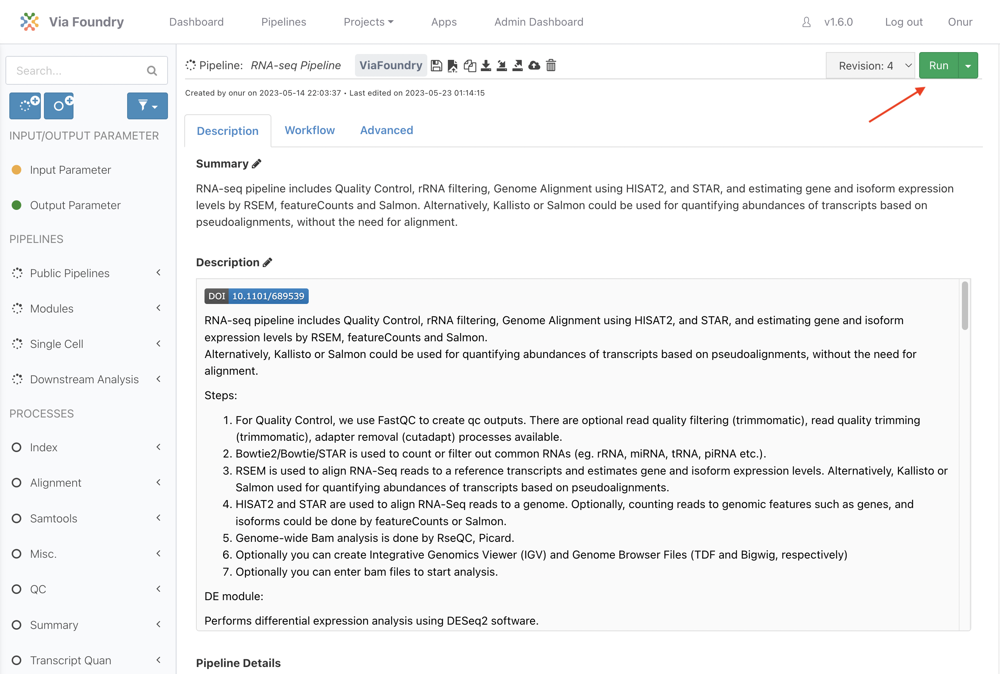

# Quick Start Guide

## Signing Up

This guide will walk you through how to start using Via Foundry
(formerly DolphinNext) pipelines. First off, you need to navigate to the
Via Foundry web page at <https://www.viafoundry.com> and click the
`Log in` button. You will be asked to enter your institute's log-in
information. If you don't have an account, please let us know about it 
<support@viascientific.com>. We will set an account for you.

{: width="50%" .center}

## Run Environments

To access your run environment, simply click on the Profile icon located at the top right corner and navigate to the Run Environment tab. In most cases, we automatically set up the run environment for you. However, if you require additional information on setting up and customizing your profile, please refer to our comprehensive [Profile Guide](profile.md).

## Running Pipelines

1.  The easiest way to run a pipeline is from the main page, by clicking
    the `Pipelines` button at the top left of the screen. From here, you
    can investigate publicly available pipelines as shown below and
    select the pipeline you want to run by clicking on it.

    > 

2.  Once the pipeline is loaded, you will notice a `Run` button at the
    right top of the page.

    > 

3.  Pressing this button opens a new window, where you can create a new
    project by clicking `Create a Project`. After you enter and save the
    name of the project, it will be added to your project list. Now you
    can select your project by clicking on it, as shown in the figure
    below.

    > 

4.  After clicking `Select Project`, you may proceed with entering your
    desired run name, which will be added to your project's run list.
    Clicking `Save Run` will redirect you to the "Run Page".

5.  At first, in the header of the run page, you will see an orange "Waiting" button. To start a run, you need to enter/select the following:

    

    A.  **Run Environment:** The environment, discussed in the [Profile](profile.md) page, within which you'd like to conduct your run.
    
    
    
    B. **Work Directory:** The work directory refers to the complete path of the directory from which the execution of Nextflow runs will take place. The path may be automatically filled in if a default value is provided in your run environment.
    
    

    
    C. **Inputs:** In this section, you are required to enter various values and files that define the data to be processed and the corresponding processing instructions. For additional information, please check the [Adding Files section.](../quick/#adding-files)
    
    

6.  Once all requirements are satisfied, the `Waiting` button will turn
    into a green `Run` button as shown below. You can initiate your run
    by clicking the `Run` button. Please go through the [Run
    Guide](run.md) for detailed explanation about each module is used.

    > 

## Adding Files

### Remote Files

You can reach your remote files by entering:

> -   Full path of a directory: e.g.
>     `/share/data/umw_biocore/genome_data/mousetest/mm10/gz`
> -   Web link: e.g.
>     `https://web.dolphinnext.com/umw_biocore/dnext_data/tutorial/fastq_data/pair`
> -   Amazon (S3) Bucket: e.g. `s3://viafoundry/fastq`
> -   Google (GS) Bucket: e.g. `gs://viafoundry/fastq`

### Geo Files

If you want to download and use NCBI (GEO data) in the pipeline, you can
simply use the `GEO Files` tab. Here are the few examples for GEO ID:
`GSM1331276`, `GSE55190`, `SRR10095965`

## How To Cite Us

If you use Via Foundry (formerly DolphinNext) in your research, please
cite:

Yukselen, O., Turkyilmaz, O., Ozturk, A.R. et al. DolphinNext: a
distributed data processing platform for high throughput genomics. BMC
Genomics 21, 310 (2020). <https://doi.org/10.1186/s12864-020-6714-x>

## Support

For any questions or help, please reach out to
<support@viascientific.com> with your name and question.
