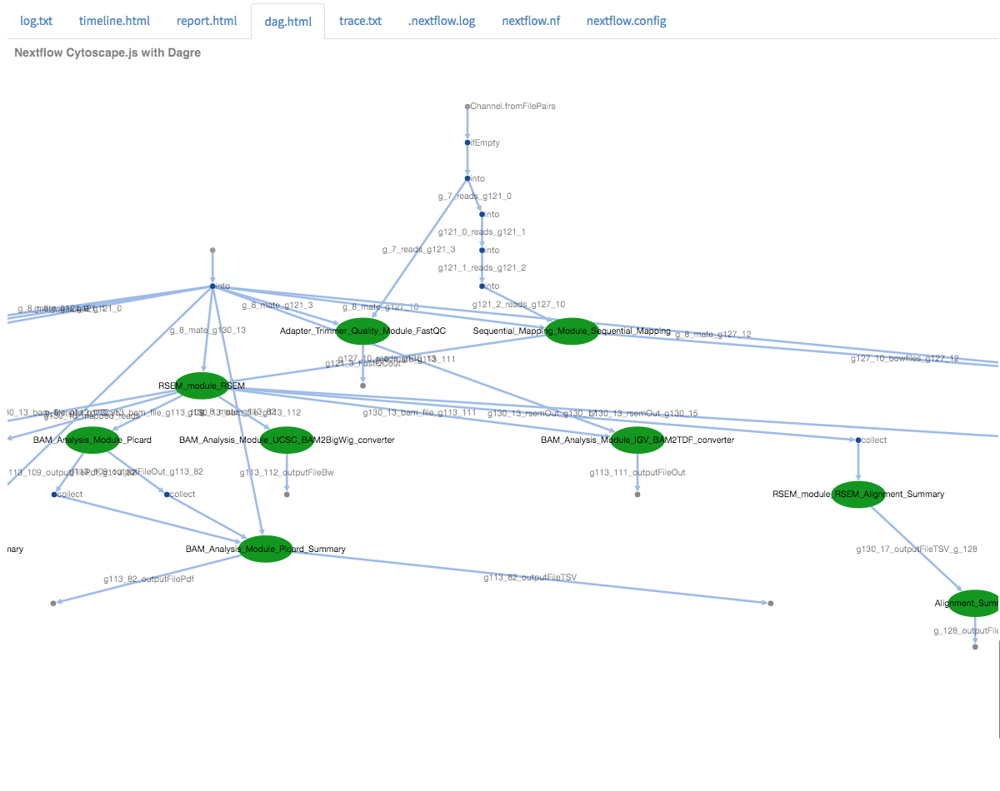
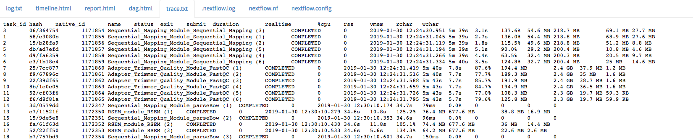
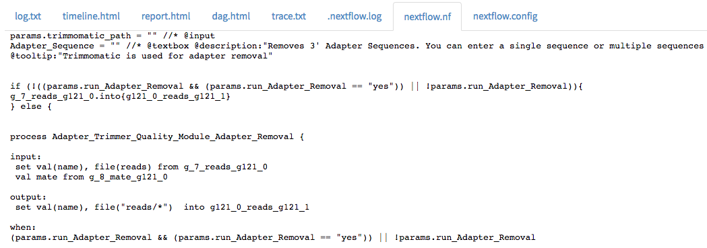
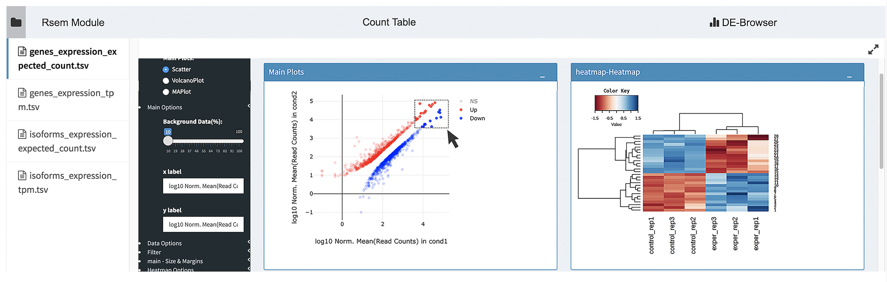
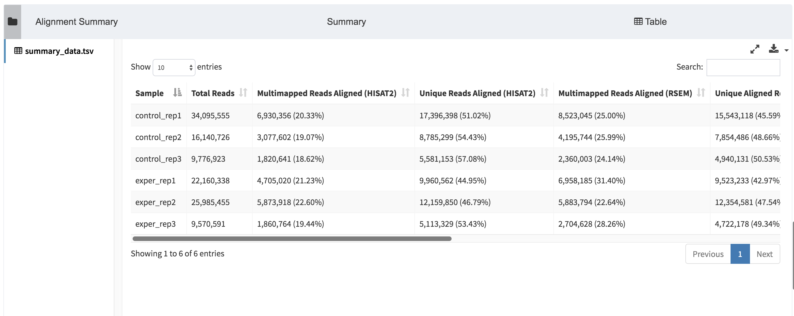
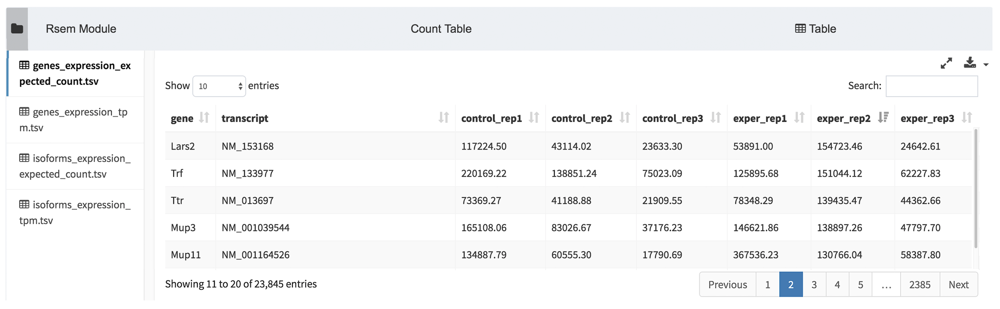

# Run Guide

In the previous tutorial ([Project Guide](project.md)), we went through
the process of creating a project within the Via Foundry (formerly
DolphinNext) platform and adding pipelines to it. In this guide, we will
look through all the relevant run settings needed to initiate a new run.

## Brief Refresher

To access a run page, navigate to the project the run is housed within
by clicking on the appropriate project name in the `Project` dropdown
menu. On the `Dashboard` page, under the `Analysis` section, click the
name of your run.

## Basics

On the run page's header, you can see the names of the current project,
pipeline being used, and run in progress. Ensure that you're in the
right project and running the correct pipeline before proceeding.

As you can see, `Save Run`, `Download Pipeline`, and `Delete Run` icons
are conveniently placed next to the information mentioned above in the
run page's header. Additionally, you can find `Delete Run`,
`Duplicate Run`, and `Move Run` options by clicking on the three dots
next to the status indicator.

## Run Settings and Status

The status of your current run is displayed at the far right of the run
page's header. Initially, you'll see an orange `Waiting` button. In
order to initiate a run, the following data need to be entered:

> 1.  **Run Environment:** The environment, discussed in the
>     [profile](profile.md) page, within which you'd like to conduct
>     your run.
> 2.  **Work Directory:** Full path of the directory where Nextflow runs
>     will be executed. (e.g. ``/home/newuser/workdir``)
> 3.  **Inputs:** Various values and files, specifying which data
>     will be processed and how (i.e. whether single-end vs. paired-end
>     data are being used), need to be entered in the **Run Settings**
>     page. For additional information, please check the [Adding Files
>     ](../quick/#adding-files) section.

All possible status messages are listed here:

| Status      | Meaning                                                                               |
| --------    |----------                                                                             |
| Waiting     | Waiting for inputs, output directory and selection of active run environment          |
| Ready       | Ready to initiate run                                                                 |
| Connecting  | Sending SSH queries to selected host system                                           |
| Initializing| Job is submitted, waiting for run execution                                           |
| Running     | Nextflow has executed and is running the jobs.                                        |
| Completed   | The job is completed.                                                                 |
| Run Error   | Error occurred before submitting the jobs or while executing the jobs.                |
| Terminated  | User terminated the run by using the `Terminate Run` button.                          |

## Advanced Options

-   **Publish Directory:** The Work Directory also serves as the default
    directory to which output files are sent for Via Foundry runs. If
    you want to change the path to a different directory, just enter the
    full path of your desired Publish Directory in this box. Local paths
    (e.g. `/home/user/test`), Amazon S3 paths (e.g.
    `s3://yourbucket/test`) or Google Storage paths (e.g.
    `gs://yourbucket/test`) are all accepted.

-   **Use Docker Image:** Nextflow supports the use of Docker
    containers, which allow you to create fully reproducible pipelines.
    Docker images can contain whatever software you might need to
    execute your pipeline. It works transparently, and it creates output
    files in the host system without requiring any additional steps. The
    only requirement is that you [install
    Docker](https://docs.docker.com/install/) first. To use Docker for a
    Via Foundry run, just click the `Use Docker Image` checkbox
    (selected by default) and enter the following information:

    > 1.  **Image:** Docker image name. Example:
    >
    >         public.ecr.aws/t4w5x8f2/viascientific/rnaseq:4.0
    >
    > 2.  **RunOptions (optional):** You can enter any command line
    >     arguments supported by the Docker run command. Please click
    >     [this Docker
    >     link](https://docs.docker.com/engine/reference/commandline/cli/)
    >     for details on how you can configure this section.

-   **Use Singularity Image:** Instead of Docker, you can activate a
    Singularity image if you wish by clicking the
    `Use Singularity Image` checkbox and entering the relevant
    information, expounded upon below. In order to use a Singularity
    image, you must first [install
    Singularity](http://singularity.lbl.gov/docs-installation/).

    > 1.  **Image:** Path to your desired Singularity image. For example:

            shub://UMMS-biocore/singularitysc
            /project/umw_biocore/singularity/UMMS-Biocore-singularity-master.simg
    >
    > 2.  **RunOptions (optional):** You can enter any command line
    >     options supported by the `Singularity exec`. For instance, you
    >     can mount directories by using `--bind command`. See below for
    >     an example of the bind command, and please click this
    >     [link](http://singularity.lbl.gov/docs-usage/) for more
    >     details about the command line arguments Singularity supports.

            > --bind /project:/project --bind /nl:/nl --bind
            > /share:/share
    >
    >
    > **Tip:** Mounting directories in Singularity requires you to create the
    > directories in the image beforehand.

-   **Executor Settings:** A series of parameters governing the
    execution of your run, including what packages to run and how much
    processing power to allocate to each package.

    > **1. Executor Settings for Nextflow (navigate to Profile --> Run
    > Environments --> Edit Run Environment)**: You can determine the
    > system where Nextflow itself is initiated. Currently, Via Foundry
    > supports the initiation of Nextflow via Local, SGE, SLURM and LSF
    > executors, which will be only used for running Nextflow itself.
    > Suggested parameters: long 8GB 1CPU 5000-8000min
    >
    > **2. Executor of Nextflow Jobs (navigate to Profile --> Run
    > Environments --> Edit Run Environment)**: This setting will be
    > used if you don't manually set any parameters in the **Advanced**
    > section of your run page. If any option other than Local is
    > selected, you'll be prompted to input values for `Queue`,
    > `Memory(GB)`, `CPU` and `Time(min.)`. You can adjust these
    > parameters as you wish. Suggested parameters: short 20GB 1CPU
    > 240min
    >
    > 
 
    >
    > **3. Executor Settings for All Processes (in ``Advanced`` tab
    > of run page)**: This setting will overwrite the parameters entered
    > in "Executor of Nextflow Jobs". Suggested parameters: short 20GB
    > 1CPU 240min
    >
    > **4. Executor Settings for Each Process (in ``Advanced`` tab
    > of run page)**: If a particular process needs special parameters
    > other than **Executor settings for all processes**, you can
    > override the default parameters by clicking on the checkbox
    > corresponding to the process that you want to change. This will
    > only affect the settings of the selected process while retaining
    > the original settings for all other processes. Suggested
    > parameters: long 20GB 4CPU 1000-5000min

-   **Delete intermediate files after run:** By default, Via Foundry
    deletes any non-output files created during a run, only retaining
    the necessary output files in the Work/Publish Directories. This
    setting is aimed at minimizing the storage required for a project,
    but you can uncheck the box to keep all intermediate files.

-   **Permissions and Groups:** By default, all new runs can only be
    seen by their owner. However, you can share your run with a group by
    changing permissions to "Only my group" and choose the group you
    want to share with from the `Group Selection` dropdown.

## Workflow

To provide a visualization of the current run's architecture, the
selected pipeline and its modules are showed on this page. To see more
information about the pipeline's settings, click the **Go to Pipeline**
link at the top of this page.

## Run Logs

This section keeps track of each run. You can monitor each stage of the
run both before and after Nextflow execution, as shown here:

You can view various log files, such as timeline.html, dag.html,
trace.txt, .nextflow.log, nextflow.nf, nextflow.config, as shown here:

- timeline.html:

- dag.html:

- trace.txt:

- .nextflow.log:

- nextflow.nf:

- nextflow.config:

If an error occurred at any point during the run, a detailed explanation
about the error will be displayed here, and the status of the run will
change to `Run Error`.

## Report

This tab will appear in the run page upon run initialization. You can
view the output files in various modules such as R-Markdown, Datatables,
Highcharts, HTML or PDF Viewer. For reference, check the example Report
section of an RSEM pipeline at below.

Each report row corresponds to an output parameter in the pipeline's
workflow, and you can easily see a row's content by clicking on it. All
these sections have `Download`, `Full Screen`, and `Open in New Window`
icons to help you best analyze each report.

**Note:** If you want to integrate your own visualization tool into Via Foundry,
please let us know about it at <support@viascientific.com>, and we'd be
happy to add it for you.

-   **DEBrowser:**

DEBrowser is an R library which provides an easy way to perform and
visualize DE (Differential Expression) analysis. This module takes count
matrices as input and allows interactive exploration of the resulting
data. You can find their documentation
[here](https://bioconductor.org/packages/release/bioc/vignettes/debrowser/inst/doc/DEBrowser.html).

-   **R-Markdown:**

The R-Markdown feature enables interactive analysis of the
newly-produced data from a run. We have prepared a series of R-Markdown
reports, which will allow you to reach your report in an HTML or PDF
format as soon as your run completes. Within an R-Markdown (.rmd) file,
R code chunks can be embedded with the native Markdown syntax for fenced
code regions. For example, the following code chunk computes a data
histogram and renders a bar plot as a PNG image:

For more information about R-Markdown, click [rmarkdown
link](https://rmarkdown.rstudio.com/).

At the top of the R-Markdown module, you can find various icons that
will help you edit your .rmd file, save it as a new file, and download
it in various formats such as RMD, PDF or HTML. In order to facilitate
the review process, you can click "full screen" icon to fit the
application in your screen. You can also adjust the **Auto Updating
Output** and **Autosave** features, explained below, by clicking the
`Settings` icon.

> -   **Auto Updating Output:** If enabled, the preview panel updates
>     automatically as you code. If disabled, use the `Run Script`
>     button to update the preview panel.
> -   **Autosave:** If enabled, Via Foundry will automatically save the
>     file's content every 30 seconds.

-   **Datatables:**

This module, powered by [Datatables](https://datatables.net//), allows
you to view, sort, and search the table's content. The following two
examples depict alignment and RSEM summaries within Datatables.

> -   Alignment Summary:
>
> 
>
> -   RSEM Summary:
>
> 

You can fit the entire table in your screen by clicking the
`Full screen` icon at the top of the module.

-   **HTML Viewer:**

You can easily embed HTML content in our **Report** section by using
HTML Viewer. Reference this image, which shows MultiQC output, for an
example:

-   **PDF Viewer:**

Similar to HTML Viewer, PDF files can be embedded in the **Report**
section. You can see the piPipes report as an example here:

## Support

For any questions or help, please reach out to
<support@viascientific.com> with your name and question.
