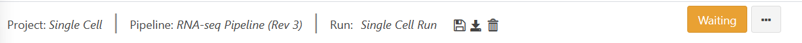
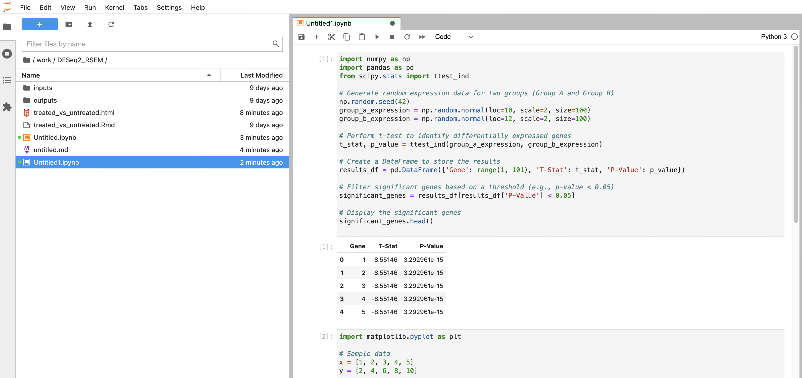

# Run Guide

In the previous tutorial ([Project Guide](project.md)), we went through
the process of creating a project within the Via Foundry (formerly
DolphinNext) platform and adding pipelines to it. In this guide, we will
look through all the relevant run settings needed to initiate a new run.

## Brief Refresher

To access a run page, navigate to the project the run is housed within
by clicking on the appropriate project name in the `Project` dropdown
menu. On the `Dashboard` page, under the `Analysis` section, click the
name of your run.

## Basics

On the run page's header, you can see the names of the current project,
pipeline being used, and run in progress. Ensure that you're in the
right project and running the correct pipeline before proceeding.

As you can see, `Save Run`, `Download Pipeline`, and `Delete Run` icons
are conveniently placed next to the information mentioned above in the
run page's header. Additionally, you can find `Delete Run`,
`Duplicate Run`, and `Move Run` options by clicking on the three dots
next to the status indicator.

## Run Settings and Status

The status of your current run is displayed at the far right of the run
page's header. Initially, you'll see an orange `Waiting` button. In
order to initiate a run, the following data need to be entered:

> 1.  **Run Environment:** The environment, discussed in the
>     [profile](profile.md) page, within which you'd like to conduct
>     your run.
> 2.  **Work Directory:** Full path of the directory where Nextflow runs
>     will be executed. (e.g. ``/home/newuser/workdir``)
> 3.  **Inputs:** Various values and files, specifying which data
>     will be processed and how (i.e. whether single-end vs. paired-end
>     data are being used), need to be entered in the **Run Settings**
>     page. For additional information, please check the [Adding Files
>     ](../quick/#adding-files) section.

All possible status messages are listed here:

| Status      | Meaning                                                                               |
| --------    |----------                                                                             |
| Waiting     | Waiting for inputs, output directory and selection of active run environment          |
| Ready       | Ready to initiate run                                                                 |
| Connecting  | Sending SSH queries to selected host system                                           |
| Initializing| Job is submitted, waiting for run execution                                           |
| Running     | Nextflow has executed and is running the jobs.                                        |
| Completed   | The job is completed.                                                                 |
| Run Error   | Error occurred before submitting the jobs or while executing the jobs.                |
| Terminated  | User terminated the run by using the `Terminate Run` button.                          |

## Advanced Options

-   **Run Sharing (Permissions to View):** By default, all runs are only visible to their owners. However, you have the option to share your run with a specific group that you have created in the profile's "Groups" tab. To do this, choose "Only my group" and select the name of the desired group. Members of that group will then be able to view the run on their run status page.

    Alternatively, you can set the permissions to "Everyone". With this setting, the run will only be visible to users who know the specific run link. The selected run will not appear on their run status page, but they will be able to access it if they have the link.

-   **Publish Directory:** The Work Directory also serves as the default
    directory to which output files are sent for Via Foundry runs. If
    you want to change the path to a different directory, just enter the
    full path of your desired Publish Directory in this box. Local paths
    (e.g. `/home/user/test`), Amazon S3 paths (e.g.
    `s3://yourbucket/test`) or Google Storage paths (e.g.
    `gs://yourbucket/test`) are all accepted.

-   **Run Container:** During the pipeline creation process, we specified the containers to be used for each process. Consequently, when you select the run environment, the corresponding run container (either Docker or Singularity) checkbox will be automatically selected, and the defined container will be populated in the image field.

-   **A. Use Docker Image:**  

    > 1.  **Image:** Docker image name. Example:
    >
    >         viascientific/rnaseq:4.0
    >
    > 2.  **RunOptions (optional):** 
Foundry has the ability to autodetect all the paths used and automounts all the required files to the container before the run starts. Moreover, you have the flexibility to enter any command line arguments supported by the Docker run command. Please click
    >     [this Docker
    >     link](https://docs.docker.com/engine/reference/commandline/cli/)
    >     for details on how you can configure this section.

-   **Use Singularity Image:** Instead of Docker, you can activate a
    Singularity image if you wish by clicking the
    `Use Singularity Image` checkbox and entering the relevant
    information, expounded upon below. In order to use a Singularity
    image, you must first [install
    Singularity](http://singularity.lbl.gov/docs-installation/).

    > 1.  **Image:** Path to your desired Singularity image. For example:
    >
    >           docker://viascientific/rnaseq:4.0
    >           shub://UMMS-biocore/singularitysc
    >           /project/umw_biocore/singularity/UMMS-Biocore-singularity-master.simg
    >
    > 2.  **RunOptions (optional):** Foundry automatically detects and mounts all the necessary files to the container by detecting the used paths. When using Singularity, you have the option to enter command line options supported by the Singularity exec command. One example of such an option is --bind, which allows you to mount directories. For more information about the command line arguments supported by Singularity, please refer to this
    >     [link](http://singularity.lbl.gov/docs-usage/).

            --bind /project:/project --bind /nl:/nl 

-   **Executor Settings:** A series of parameters governing the
    execution of your run, including what packages to run and how much
    processing power to allocate to each package.

    > **1. Executor Settings for Nextflow:** (navigate to Profile → Run Environments → Edit Run Environment): Here, you can specify the system on which Nextflow is initiated. Via Foundry currently supports various executors for running Nextflow itself, including Local, SGE, SLURM, and LSF. These executors are exclusively used for running Nextflow.

    > Suggested parameters for the executor settings are as follows: long, 8GB memory, 1 CPU, and a time range of 5000-8000 minutes.
    >
    > **2. Executor of Nextflow Jobs**: (navigate to Profile --> Run
    > Environments --> Edit Run Environment) This setting will be
    > used if you don't manually set any parameters in the **Advanced**
    > section of your run page. If any option other than Local is
    > selected, you'll be prompted to input values for `Queue`,
    > `Memory(GB)`, `CPU` and `Time(min.)`. These parameters can be adjusted according to your needs. 
    >
    > Suggested parameters for this configuration are as follows: short, 20GB memory, 1 CPU, and 240 minutes of execution time.
    >
    > 
 
    >
    > **3. Executor Settings for All Processes (in ``Advanced`` tab
    > of run page)**: This setting will override the parameters specified in the `Executor of Nextflow Jobs` section. It allows you to define the executor settings for all processes in your run.
    >
    > Suggested parameters for this configuration are as follows: short, 20GB memory, 1 CPU, and 240 minutes of execution time.
    >
    > **4. Executor Settings for Each Process (in ``Advanced`` tab
    > of run page)**: If a particular process needs special parameters
    > other than **Executor settings for all processes**, you can
    > override the default parameters by clicking on the checkbox
    > corresponding to the process that you want to change. This will
    > only affect the settings of the selected process while retaining
    > the original settings for all other processes. Suggested
    > parameters: long 20GB 4CPU 1000-5000min

-   **Delete intermediate files after run:** By default, Via Foundry
    deletes any intermediate files created during a run, only retaining
    the necessary files in report folder. This
    setting is aimed at minimizing the storage required for a project,
    but you can uncheck the box to keep all intermediate files.

## Workflow

To provide a visualization of the current run's architecture, the
selected pipeline and its modules are showed on this page. To see more
information about the pipeline's settings, click the **Go to Pipeline**
link at the top of this page.

## Run Logs

This section keeps track of each run. You can monitor each stage of the
run both before and after Nextflow execution, as shown here:

You can view various log files, such as timeline.html, dag.html,
trace.txt, .nextflow.log, nextflow.nf, nextflow.config, as shown here:

- timeline.html:

- dag.html:

- trace.txt:

- .nextflow.log:

- nextflow.nf:

- nextflow.config:

If an error occurred at any point during the run, a detailed explanation
about the error will be displayed here, and the status of the run will
change to `Run Error`.

## Report

This tab will appear in the run page upon run initialization. You can
view the output files in various modules such as R-Markdown, Datatables,
Highcharts, HTML or PDF Viewer. For reference, check the example Report
section of an RNA-Seq pipeline at below.

Each report row corresponds to an output parameter in the pipeline's
workflow, and you can easily see a row's content by clicking on it. All
these sections have `Download`, `Full Screen`, and `Open in New Window`
icons to help you best analyze each report.

**Note:** If you want to integrate your own visualization tool into Via Foundry,
please let us know about it at <support@viascientific.com>, and we'd be
happy to add it for you.

## -   **Shiny App - DEBrowser**

DEBrowser is an R library which provides an easy way to perform and
visualize DE (Differential Expression) analysis. This module takes count
matrices as input and allows interactive exploration of the resulting
data. You can find their documentation
[here](https://bioconductor.org/packages/release/bioc/vignettes/debrowser/inst/doc/DEBrowser.html).

## -   **R-Studio - R-Markdown**

The R-Studio launcher facilitates interactive analysis of the data generated from a run. We have prepared a set of R-Markdown reports that provide access to your report in HTML or PDF format immediately after the run is completed.

For instance, the code below performs differential expression analysis for each comparison listed in the compare file. It generates volcano and MA plots for differentially expressed genes in each comparison:

## -   **Jupyter Notebook**

The Jupyter Notebook app, due to its interactive and flexible nature, it allows bioinformatics researchers to combine code, visualizations, and explanatory text in a single document. Bioinformaticians can write and execute code snippets in real-time, visualize data using various plotting libraries, and document their analyses step-by-step.

## -   **Shiny App - GSEA Explorer**

GSEA Explorer is an R library that offers a convenient method for conducting and visualizing Gene Set Enrichment Analysis (GSEA). GSEA aims to assess whether a specific gene set or pathway is enriched in gene expression data, indicating its potential biological significance in the studied condition. The GSEA Explorer application can be accessed after executing Foundry's complete RNA-sequencing pipeline or the standalone Differential Expression module. By leveraging GSEA Explorer, researchers can gain valuable insights into the functional implications of gene sets and pathways, aiding in the interpretation of RNA-seq results and facilitating a deeper understanding of biological mechanisms.

## -   **Shiny App - Network Explorer**

The Network Explorer allows bioinformaticians to explore and analyze these complex networks, helping them uncover hidden patterns, identify key players, and understand the underlying biological mechanisms. The Network Explorer application can be launched after running Foundry's full RNA-sequencing pipeline or the stand-alone Differential Expression module.

## -   **Datatables**

This module, powered by [Datatables](https://datatables.net//), allows
you to view, sort, and search the table's content. The following two
examples depict alignment and RSEM summaries within Datatables.

> -   Alignment Summary:
>
> 
>
> -   RSEM Summary:
>
> 

You can fit the entire table in your screen by clicking the
`Full screen` icon at the top of the module.

## -   **HTML/PDF Viewer:**

You can easily embed HTML/PDF content in our **Report** section by using
HTML/PDF Viewer. Reference this image, which shows MultiQC output, for an
example:

## Support

For any questions or help, please reach out to
<support@viascientific.com> with your name and question.
