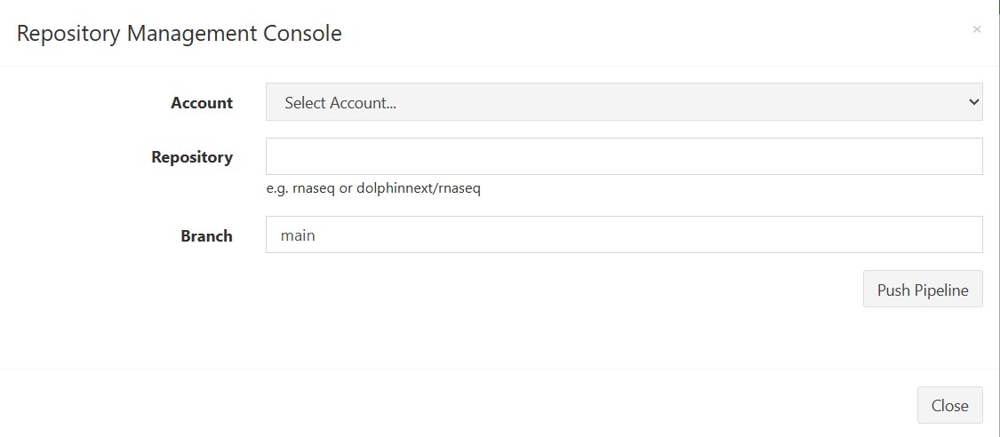

# Third Party FAQs

This document will walk you through some common questions related to integrating the functionality of various third-party services (e.g. Docker, GitHub, travis.io) into your Via Foundry pipelines and runs.

## **Docker**

### How can I build a Docker container/image for my project?

Like [this](developer_faq#how-can-i-build-a-docker-containerimage-for-my-project)!

### How can I install a specific process to a pre-existing Docker container?

## **GitHub**

Via Foundry enables effortless integration with GitHub, the world's leading open-source development platform. To link your GitHub account, navigate to the **Repositories** section of your Foundry profile, then click `Add Account`. From here, select "GitHub" from the **Account Type** dropdown menu, then enter in your username and e-mail in the appropriate fields. You'll have to enter an access token, which you can obtain by following the directions at [this link](https://docs.github.com/en/free-pro-team@latest/github/authenticating-to-github/creating-a-personal-access-token). Once you've gotten the access token, enter it in, press `Submit`, and voila - your account has been linked! From here, you can enjoy access to GitHub from within your Foundry account.

### How can I push a pipeline to GitHub?

If you'd like to add a pipeline you've created to GitHub, the process is quite simple. Navigate to your pipeline's page. In the top bar, next to your pipeline's name, you'll see a series of icons. Click the `Repository Management` button, represented by a cloud with an upward arrow, and you'll be taken to this screen:

Select your GitHub account from the **Account** dropdown menu, then enter in your repository and the appropriate branch, and hit `Push Pipeline`. Refresh your GitHub repository, and you should see the pipeline with all its dependencies and source files.