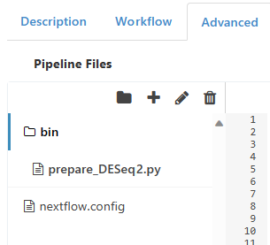

# Third Party Software FAQs

This document will walk you through some common questions related to integrating the functionality of various third-party services (e.g. Docker, GitHub, travis.io) into your Via Foundry pipelines and runs.

## **Docker**

### How can I build a Docker container/image for my project?

Like [this](developer_faq#how-can-i-build-a-docker-containerimage-for-my-project)!

### How can I create my own Dockerfile and embed it in a pipeline?

To read up more on syntax and best practices for Dockerfiles, we recommend you reference [this link](developer_faq#how-can-i-build-a-docker-containerimage-for-my-project). Once you've done so, the process of adding a Dockerfile to a pipeline in Foundry is exquisitely simple. Under the `Advanced` header of your pipeline's dashboard, you'll want to create two files by clicking the `Add File` icon (represented by a plus sign) in the top left of the **Pipeline Files** screen. Name the files Dockerfile and environment.yml, respectively. The Dockerfile, which you can read up on [here](app.md#dockerfile), contains all (and, ideally, only) the necessary components and dependencies your pipeline and its applications need. Here, you'll find a template for how to structure your Dockerfile:

```
# Set the base image to Ubuntu version 22.04
FROM ubuntu:22.04

# Define metadata labels for the image
LABEL author="onur@viascientific.com" description="Docker image containing all requirements via pipeline"

# Set environment variables for character encoding and PATH
ENV LANG=C.UTF-8 LC_ALL=C.UTF-8
ENV PATH /opt/conda/bin:$PATH

# Update the package list and install various packages using apt-get
RUN apt-get update --fix-missing && \
    apt-get install -y vim wget bzip2 unzip ca-certificates curl git libtbb-dev gcc g++ libcairo2-dev pandoc libhdf5-dev cmake

# Download and install Miniconda for package management
RUN wget --quiet https://repo.anaconda.com/miniconda/Miniconda3-latest-Linux-x86_64.sh -O ~/miniconda.sh && \
    /bin/bash ~/miniconda.sh -b -p /opt/conda && \
    rm ~/miniconda.sh && \
    ln -s /opt/conda/etc/profile.d/conda.sh /etc/profile.d/conda.sh && \
    echo ". /opt/conda/etc/profile.d/conda.sh" >> ~/.bashrc && \
    echo "conda activate base" >> ~/.bashrc

# Update the package list, download AWS CLI, and install it
RUN apt-get update && \
    curl "https://awscli.amazonaws.com/awscli-exe-linux-x86_64-2.0.30.zip" -o "awscliv2.zip" && \
    unzip awscliv2.zip && ./aws/install && aws --version

# Copy the environment definition file and create a Conda environment
COPY environment.yml /
RUN . /opt/conda/etc/profile.d/conda.sh && \ 
    conda activate base && \
    conda update conda && \
    conda install -c conda-forge mamba && \
    mamba env create -f /environment.yml && \
    mamba clean -a

# Create directories for project and various paths, and update PATH
RUN mkdir -p /project /nl /mnt /share /pi
ENV PATH /opt/conda/envs/via/bin:$PATH
```

As you can see, this Dockerfile has a block beginning with "`COPY environment.yml`". This is a crucial inclusion that will enable you to add all your desired packages to your run environment. `COPY environment.yml` wraps everything contained within your environment.yml file into the Dockerfile. Knowing that, navigate to the environment.yml file you just created. Here's a simple template we recommend you use and build upon according to your specifications:

```
# You can use this file to create a conda environment for this pipeline:
#   conda env create -f environment.yml
name: via
channels:
  - conda-forge
  - bioconda
  - defaults
dependencies:
  - rseqc=4.0.0
  - samtools
```

The `channels` section here, which you can of course iterate upon, specifies the Conda channels from whence packages will be sourced as the "via" Conda environment is created. The `dependencies` section, as you might imagine, imports the dependencies you'll be able to use in your pipeline (naturally, contingent on the inclusion of "`COPY environment.yml`" in your Dockerfile). Employing this strategy naturally grants you an infinitely generalizable way to craft individualized Dockerfiles for any Foundry project you wish.


### How can I install a specific script to a pre-existing Docker container?

There are two main strategies you can utilize to integrate a third-party script into your run environment: importing it into a **bin** folder and adding the path to your Dockerfile. Below, we'll expound upon both of these tactics:

#### **Importing into a bin folder**

For a slightly easier experience importing your own scripts into a run, navigate to the **Advanced** tab of the pipeline in which you'd like to include the scripts. If a folder called **bin** does not already exist in the **Pipeline Files** field, create one by clicking on the folder icon, then naming the newly created folder "**bin**". From there, simply import your scripts by clicking the plus sign in the top left to create as many files as you have scripts, then pasting each script into its own file. Make sure to drag all your newly created files into the **bin** folder, as this creates a shortcut to the files behind the scenes. To actually invoke a script, all you need to do is type its name into the portion of a process script that's enclosed by triple quotes. For instance, say you have a Python script called run_GSEA.py that runs GSEA analysis. You'd create a **bin** folder in the relevant pipeline, then add a file called run_GSEA.py with the script's contents to that folder. Within the process in which you'd like to call the script, you'd use the following syntax:
```
when:
// Conditions that must be met to run the script

script:
// Define whatever variables you need to

"""
run_GSEA.py
// Add any additional flags required by run_GSEA.py
"""
```

This will call your script by referencing its name, and since it is located in the **bin** folder, its contents are made accessible by the process, rendering it usable within your pipeline.

To visually demonstrate what placing script files into a **bin** folder looks like, here's an image of the **Advanced** tab in a pipeline containing a script called prepare_DESeq2.py:



#### **Adding to a Dockerfile**

To achieve the same results as outlined above, you can also add the directory containing your script(s) to your pipeline's Dockerfile. For example's sake, let's say you have a directory of RMarkdown scripts, called RMD_scripts, for interactive data analysis. You'd navigate to your Dockerfile, then add the line ```ADD RMD_scripts /RMD_scripts/```. This copies the full directory into the container, enabling access to its contents in the pipeline. Alternatively, if you'd like to only add one script in this fashion, you can include only the path to that one script (instead of its entire parent directory). Either way, now that you have the location of your script stored in the pipeline's container, you need to invoke it in a process script. The overall structure of such a script is similar to that of the [previous example](third_party_faq.md#importing-into-a-bin-folder), but instead of just calling the name of a script, you need to call its entire path so Foundry knows where to look:

```
when:
// Conditions that must be met to run the script

script:
// Define whatever variables you need to

"""
// Script filepath
C:\Users\12345\Documents\RMD_scripts\run_GSEA_explorer.Rmd

// Add any additional flags required by run_GSEA_explorer.Rmd
"""
```

Overall, the two techniques outlined above are fairly similar, so choosing between them is a matter of preference (and, to a lesser degree, familiarity with [Dockerfiles](developer_faq.md#how-can-i-build-a-docker-containerimage-for-my-project)).

## **GitHub**

Via Foundry enables effortless integration with GitHub, the world's leading open-source development platform. To link your GitHub account, navigate to the **Repositories** section of your Foundry profile, then click `Add Account`. From here, select "GitHub" from the **Account Type** dropdown menu, then enter in your username and e-mail in the appropriate fields. You'll have to enter an access token, which you can obtain by following the directions at [this link](https://docs.github.com/en/free-pro-team@latest/github/authenticating-to-github/creating-a-personal-access-token). Once you've gotten the access token, enter it in, press `Submit`, and voila - your account has been linked! From here, you can enjoy access to GitHub from within your Foundry account.

### How can I push a pipeline to GitHub?

If you'd like to add a pipeline you've created to GitHub, the process is quite simple. Navigate to your pipeline's page. In the top bar, next to your pipeline's name, you'll see a series of icons. Click the `Repository Management` button, represented by a cloud with an upward arrow, and you'll be taken to this screen:


Select your GitHub account from the **Account** dropdown menu, then enter in your repository and the appropriate branch, and hit `Push Pipeline`. Refresh your GitHub repository, and you should see the pipeline with all its dependencies and source files.

## **Support**

For any questions or help, please reach out to
<support@viascientific.com> with your name and question.