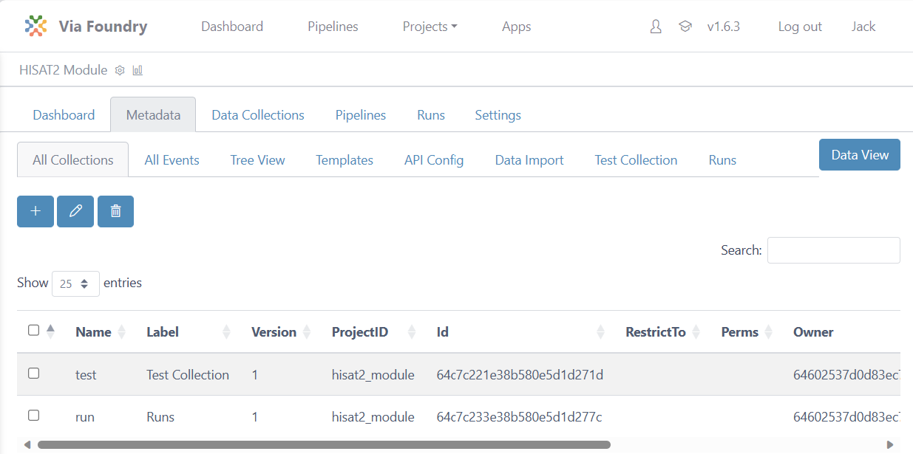
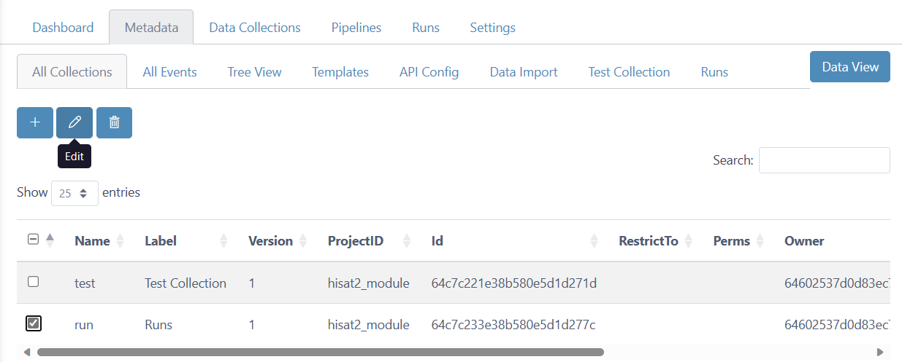
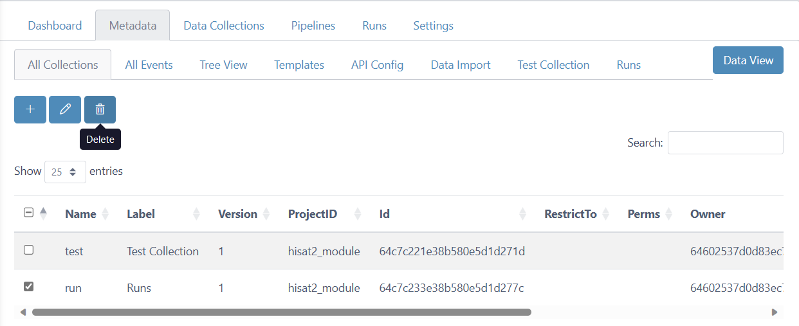

# Collection Guide

This guide explains how to create, edit, and delete collections in V-Meta.

Collections are tables used to store and organize data. V-Meta enables you to establish parent-child relationships between collections through referencing techniques. Let's explore the basics of managing collections.

First, navigate to a project in Via Foundry. At the top of the `Metadata` tab interface, click `Configure Metadata`. You'll find yourself on the `All Collections` page, where you will find three action buttons to handle collections: **`Insert`**, **`Edit`**, and **`Delete`**.

## Insert Collections

In order to insert a new collection, you need to click on the `Insert`
button, which will open the `Insert Collection` window, as shown below. Here, you can fill in the
following fields:

-   **Name (required):** Name of your collection. This will *not* appear in V-Meta's dropdown menus, but is simply for back-end storage purposes.
-   **Label (required):** Long version of your collection name. This *will* be displayed as your collection's "name" in V-Meta.
-   **Project (required):** Choose the project you'd like the collection to go into.
-   **Version (required):** Version of the collection.
-   **RestrictTo:** Select users or groups who are allowed to
    **Insert new data into collection**. You can grant this permission to new users/groups
    by clicking the `Insert` button. If you later want to remove that
    permission, just click **options -\> delete**.
-   **Permissions:** User or groups are selected who are allowed to
    **view or edit the collection**. You may add new user/groups by
    clicking `Share` button. Afterwards, please choose user/group and
    read/write permission and click `Save`. If you want to
    edit/remove the permission, please click **options** button.
-   **Other fields**: If you've configured your collection to have additional fields, you'll be able to fill them in in this window as well.

{.align-center width="99.0%"}

## Edit Collection

If you'd like to edit a collection, simply click the checkbox next to its name, then click the `Edit` button at the top of the window. 

You'll see an `Edit Collection` window, wherein you can manipulate any of the previously set fields.

{.align-center width="70.0%"}

## Delete Collection

If you'd like to remove a collection, you can click the checkbox next to its name, then the `Delete` button. 

You'll be prompted to confirm your intents, at which point you can click `Remove`. NOTE: Collection deletion is irrevocable, so make sure you absolutely want to delete a collection before doing so.
