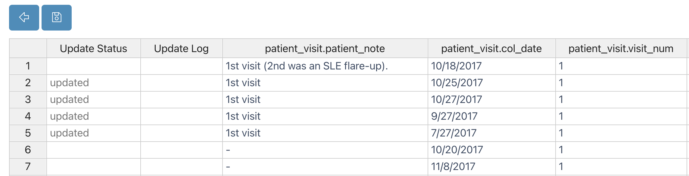

# Data Guide

In this section, we will investigate V-Meta's data tables and how data can be inserted to, updated in, and deleted from collections.

## Basics

At the top of V-Meta's dashboard, you will notice the **Collections** and **Events** tabs. You can insert/update/delete data from collections
using the **All Collections** tab, whereas the **All Events** tab is used
for inserting new or updating existing data in a simplified and
structured way.

## All Events

In the `Events` tab of a given project, all pre-made events are listed in the initial dropdown menu. Please see the example
below, which depicts a project containing clinical data on patients and patient visits:

{.align-center width="99.0%"}

From this dropdown, you can simply select the action you want to perform. As an
example, **Update Patient Visit** is selected, which loads the pre-defined form fields as below:

{.align-center width="99.0%"}

You can either scroll through the dropdown menu to find the data you'd like, or type the name of the data point and select it that way. In this example, you can either scroll to and manually choose the patient in question or type their name before selecting them.

{.align-center width="99.0%"}

If you have fields dependent on/subordinate to others, as **Patient Visit** is to **Patient** in this example, once the superordinate field has been defined, only the data with the given value for the superordinate field appear in the dropdown menu for the subordinate field. In plainer English, since Patient CL067 is selected here, only Patient CL067's Patient Visits are available in the **Patient Visit** dropdown.

{.align-center width="99.0%"}

As soon as a patient visit is selected, form fields are loaded with
selected visit data. After making changes, you can click the save button
to submit changes.

Once you've made a selection, the blank form fields will be automatically filled with the values associated with that selection. You can make whatever edits you wish, then click `Save` to store your changes.

{.align-center width="99.0%"}

Here, a Patient Visit event has been updated. You'll find that much more is possible with V-Meta events, so for more information on how to create and customize events, check out [this guide](vmeta_events.md). 

## All Collections

All collections are listed in the initial dropdown menu of the V-Meta `Collections` tab. From this dropdown menu, you can simply
select the collection you want to view. For example, the **Biosamples**
collection for some arbitrary project is selected:

{.align-center width="99.0%"}

At the top of this table, you'll find six action buttons: `Insert`, `Edit`, `Delete`, `Edit in Spreadsheet`, `Download as Excel File`, and `Import Excel File`. For a visual aid, here are all the icons with their corresponding names.

{.align-center width="50.0%"}

### Insert

You can insert data into a collection by using the `Insert` button, which
will open an `Insert <Collection Name>` window, in which you can instantiate the data fields associated with your collection. Please check the example
below, in which a Biosample is being inserted, with associated values for such dimensions as Clinical Phenotype, Skin, Biosample Type, and Patient Visit ID.

{.align-center width="90.0%"}

### Edit

After clicking one of the checkboxes, you can start editing your collection member by clicking
the `Edit` button. If you
check off multiple items at the same time, V-Meta lets you update
only certain fields of the selected data, leaving other fields unique and untouched for all the checked-off items. 

#### Single Data Edit

In this image, only one biosample has been selected, so its data can be edited at will.

{.align-center width="99.0%"}

#### Multiple Data Edit

Take a look at this image, in which multiple biosamples have been selected. The **Clinical Phenotype** has been set to "Lupus Erythermatosus" for both of the samples, but all of the other fields are untouched; they will keep their original values.

{.align-center width="99.0%"}

### Delete

In order to remove data from a collection, you can check off one or multiple
items and click the `Delete` button.

### Edit in Spreadsheet

Another way to edit multiple items is by using spreadsheet view. After
clicking the `Edit in Spreadsheet` button, you'll see your collection data in a spreadsheet format, as opposed to the default table format.

Table View:

{.align-center width="70.0%"}

Spreadsheet View:

{.align-center width="99.0%"}

Now, you can copy and paste into multiple fields as in the Excel file.
As an example, the **1st visit** value is filled into four cells by copy
and paste below. Updated cells are highlighted.

{.align-center width="99.0%"}

After clicking the **Save Changes** button at the top, the highlighted cells are
synchronized with V-Meta's database, and the update's status is tracked:

{.align-center width="99.0%"}
 
Table view:

{.align-center width="71.0%"}

### Download as Excel File

You can download all collection data by clicking the **Download as Excel
File** button.

{.align-center width="71.0%"}

### Import Excel File

After you edit your data in Excel, you can import your changes by clicking
the **Import Excel File** button.

{.align-center width="99.0%"}
