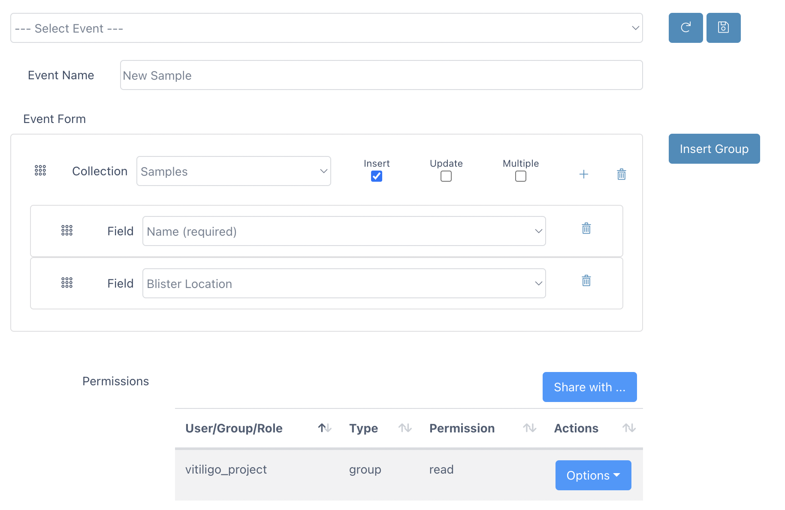

# V-Meta Events Guide

V-Meta Events in Via Foundry provide a powerful framework for performing various actions, such as uploading data or initiating runs, within your projects. Events are like neatly packaged scaffoldings that allow you to interact with your data and collections seamlessly. This guide will walk you through the details of creating events and how to utilize them effectively.

## Creating Events

After defining V-Meta fields to specify the structure of your data, you can proceed to create event forms that enable you to insert or update fields across multiple collections. Let's explore the basic steps to create events:

1. Using the **Projects** dropdown menu at the top of Foundry, click on the project in which you'd like to create an event.
2. Navigate to the `Metadata -> Configure Metadata -> All Events` tab specific to your project.
3. Click the `Insert` button to start creating a new event, and provide a meaningful `Event Name`.
4. Choose the target collection from the dropdown list and define the behavior of the form. You can choose between `Insert`, `Update`, or `Multiple` (for Multiple Insert) options.
5. Select the specific fields that should be associated with the chosen collection.
6. To add additional fields to the event form, click the "Plus" button and choose from the available fields.
7. If you want to include data from another collection, you can use the `Insert Group` button to add more collections.
8. The permissions for the form can be adjusted using the `Permissions` section at the bottom.

{.align-center width="99.0%"}

## Creating "New Run" Event

One particularly useful event is the "New Run" event, which simplifies the process of submitting runs within Foundry. Here are the key details for creating this event:

- **Event Name:** New Run
- **Collection:** Runs

  -----------------------------------------------------------------------
  - **Fields**
    - Name (required)

    - Server ID (requiredref.)

    - Run Environment

    - Template Run ID

    - Inputs

    - Outputs

    - Work Directory

    - Run URL
  -----------------------------------------------------------------------

For reference, here's what a newly created `New Run` event would look like in the V-Meta user interface:

With V-Meta Events, you can streamline data uploads, perform complex actions, and initiate runs with ease. These events offer a structured and efficient way to interact with your data, empowering you to make the most of Via Foundry. Whether you are uploading new data or orchestrating complex workflows, V-Meta Events provide the flexibility and organization you need to handle your projects effectively.
