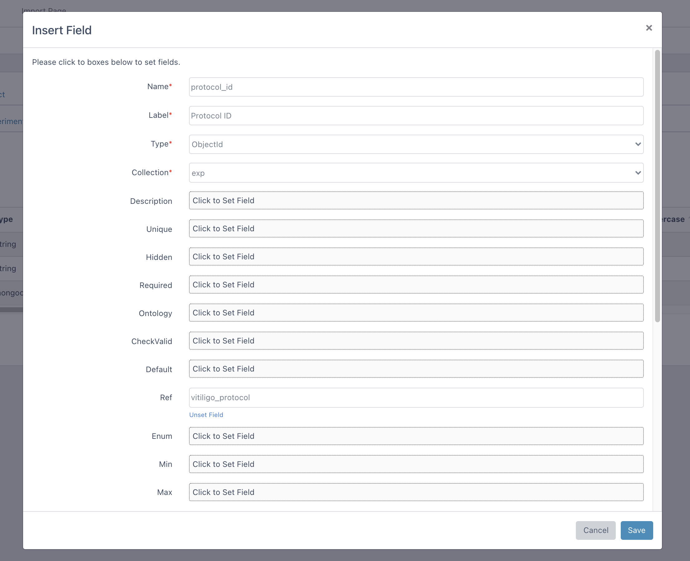
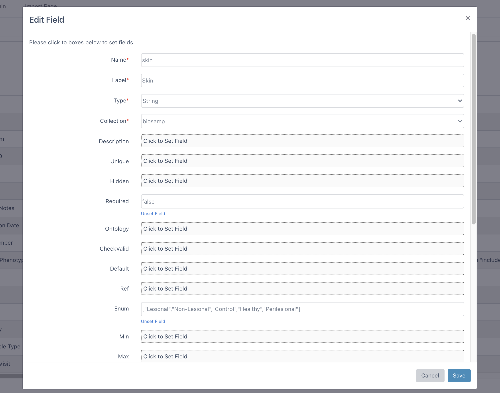

# Fields Guide

This guide will walk you through the details of V-Meta's fields, which are a fundamental aspect of the Via Foundry platform that allow you to define how different types of data are represented behind the scenes. In other words, they enable you to specify the structure and characteristics of various data classes, making it easier to organize and manage your data effectively.

When you work with Via Foundry, you'll often encounter various types of data, such as runs, biosamples, experiments, and more. Each of these data types has specific attributes and properties that need to be captured and stored. This is where V-Meta fields come into play.

Let's say you have a run, which represents the execution of a bioinformatics pipeline. For such runs, you can create fields to capture important information, such as the Run Environment, Work Directory, Status, and Run ID. These fields will allow you to keep track of where the run is executed, its status (e.g., running, completed), and unique identifiers to differentiate between different runs.

Similarly, if you're dealing with biosamples, you can define fields like Organism, Aliquot, and Clinical Phenotype. These fields will help you record relevant details about each biosample, such as the organism it belongs to, its aliquot information, and any relevant clinical phenotypes associated with it.

Basically, V-Meta fields are the building blocks that enable you to customize and organize your data in a structured manner. By defining these fields for different data classes, you can ensure that your data is well-organized and easy to access.

In V-Meta, all metadata is stored as key-value pairs in the MongoDB database. When creating a collection, it's essential to specify its fields, which determine the type of data to be stored behind the scenes. Fields also facilitate the establishment of parent-child relationships between collections. Since fields are integral to the creation of events, developing an understanding of fields will be incredibly useful moving forward in your V-Meta and overall Via Foundry experience. 

Let's explore the basics of working with fields in V-Meta. You'll want to navigate to the `Configure Metadata` view of the `Metadata` tab in Via Foundry, then to the tab of the collection whose fields you'd like to work with. At the top of the interface, you will find three action buttons to manage fields: `Insert`, `Edit`, and `Delete`.

## Inserting Fields

To insert a new field in V-Meta, follow these steps:

1. Click on the **Insert** button, which will open a new form to add a field.
2. Enter the following details for the field:

    - **Name (required):** Name of the field.
    - **Label (required):** Long version of the field name.
    - **Type (required):** The main configuration parameter for MongoDB fields, with the following available options:
        - **String:** To declare a field as a string.
        - **Number:** To declare a field as a number.
        - **Boolean:** To declare a field as a boolean.
        - **Array:** To declare a field as an array. They implicitly have a default value of an empty array (`[]`).
        - **Date:** To declare a field as a date.
        - **Mixed:** Anything goes into this field.
        - **ObjectId:** An ObjectId is a special type typically used when child reference is defined.
   - **Collection:** Choose the target collection in which to insert the field.
   - **Description:** Description of the field, shown in the form when inserting new data.
   - **Unique:** A boolean value to define a unique index on this field.
   - **Hidden:** A boolean value to determine whether to show this field to users.
   - **Required:** A boolean (e.g., `true`) or an array (e.g., `[true, "Patient must have a name."]`) to specify if the field is mandatory. When an array is used, a warning message is defined at the second index of the array to show a message when the field is not entered.
   - **Ontology:** This option shows dropdown options from an ontology API or entered Keyword Array. It is configured with the following parameters:
       - **url:** URL of the ontology API used to query available options.
       - **authorization:** Optional authorization header of the API request. Typically, a token could be entered for authorization.
       - **filter:** Additional query parameters to filter out retrieved data. For example, to only retrieve specific (EFO) ontology data, you can use "&ontologies=EFO".
       - **field:** Describes the location of the keyword in the result of the API. Commonly, APIs return an array of objects. By using dot notation, the location of the keyword (e.g., `collection.prefLabel`) can be described for the following example:

```
JSON
{
    "status": "success",
    "data": {
        "data": [
            {
                "_id": "5fdb8820d6330eb80d503a31",
                "collection": {
                                "prefLabel": "Lupus",
                                "obsolete": false
                               }
            },
            {
                "_id": "5fdb8820d6330eb80d503a31",
                "collection": {
                                "prefLabel": "Vitiligo",
                                "obsolete": false
                               }
            }
        ]
    }
}
```
    
- **include:** Declare possible options for the dropdown.
- **exclude:** Exclude certain options from the dropdown.
- **create:** Declare if users are allowed to insert new options into this field (other than specified **include** keywords or API results). If this option is set to true, new options will be saved into the **include** array.

    
      
    
     **API example:** **Experiment Type** options can be delivered
     from the ontology server (NCBO -- Experimental Factor Ontology) by
     using the following configuration:
    
     ``` 
     JSON
     {
         "url":"http://data.bioontology.org/search/?q=",
         "authorization":"apikey token=39a74770-b709-4c1c-a69d-45d8e117e87a",
         "include":["ChIP-seq"],
         "field":"collection.prefLabel",
         "create":true,
         "filter":"&ontologies=EFO&suggest=true"
     }
     ```
    
     **Keyword Array example:** **Clinical Phenotype** options can also
     be delivered from the **include** array:
    
     ``` 
     JSON
     {   
         "create":true,
         "include":["GVHD","Healthy Control","Lichen Planus","Lupus","Vitiligo"],
         "exclude":["Control"]
    
     }
     ```

-   **CheckValid:** A function or an array that adds a validator function for this property. When an array is used, a warning message is defined at the second index of the array to show a message when the entered value is not valid. You can use validators from third-party libraries ([see
    examples here](https://www.npmjs.com/package/validator)) inside these
    functions. Some examples of CheckValid include:

     -   `["(function(v){ return validator.isEmail(v) })", "It is not a valid E-mail"]`
     -   `["(function(v){ return validator.isAlphanumeric(v) })", "Only letters and numbers."]`
     -   `["(function(v){ return validator.isURL(v) })", "It is not a valid URL"]`
     -   `["(function(v){ return v.length  2 })", "Field must be longer than 2 characters"]`
     -   `["(function(v){ return !v.search(/^[a-zA-Z0-9-_/]+$/)})","The field must not contain any whitespace or special characters"]`

- **Default:** Sets a default value for the field. You can specify a default value, which will be used when a new record is created and no value is provided for this field.

- **Ref:** `${ProjectName}_${CollectionName}`. This field is used for child referencing.


Consider the following hierarchy of collections:

{.align-center width="25.0%"}

In this example, **Patient Visit** is the child collection of the
**Patient** collection. Therefore, each **Patient Visit** datum will have
a reference to the superordinate **Patient** collection. In order to achive this
hierarchy, the following `patient_id` field could be added in the **Patient
Visit** collection:

{.align-center width="90.0%"}

- **Enum:** An array that creates a validator to check if the value is in the given array.

- **Min:** A number that creates a validator to check if the value is greater than or equal to the given minimum.

- **Max:** A number that creates a validator to check if the value is less than or equal to the given maximum.

- **Lowercase:** A boolean to determine whether to save the value with lowercase characters.

- **Uppercase:** A boolean to determine whether to save the value with uppercase characters.

- **Trim:** A boolean to determine whether to save the value after removing white spaces.

- **Header:** A boolean to show this field at the top of the dropdown options. This feature is used when this collection is referenced within other collections.

- **Minlength:** A number that creates a validator to check if the value length is not less than the given number.

- **Maxlength:** A number that creates a validator to check if the value length is not greater than the given number.

- **Permissions:** Specifies the users or groups allowed to view or edit the field. You can add new users/groups by clicking the **Share** button, choose the user/group, set read/write permissions, and then click **Save**. To edit/remove permissions, click the **Options** button.

{.align-center width="99.0%"}

## Editing Fields

As with many of the other V-Meta features, after clicking a field's checkbox, you can start editing it by clicking
the `Edit` button, and a window similar to this one will open, enabling you to edit whatever fields you wish.

{.align-center width="99.0%"}

## Deleting Fields

In order to remove a field, you can check off one or multiple items and click the `Delete` button.
