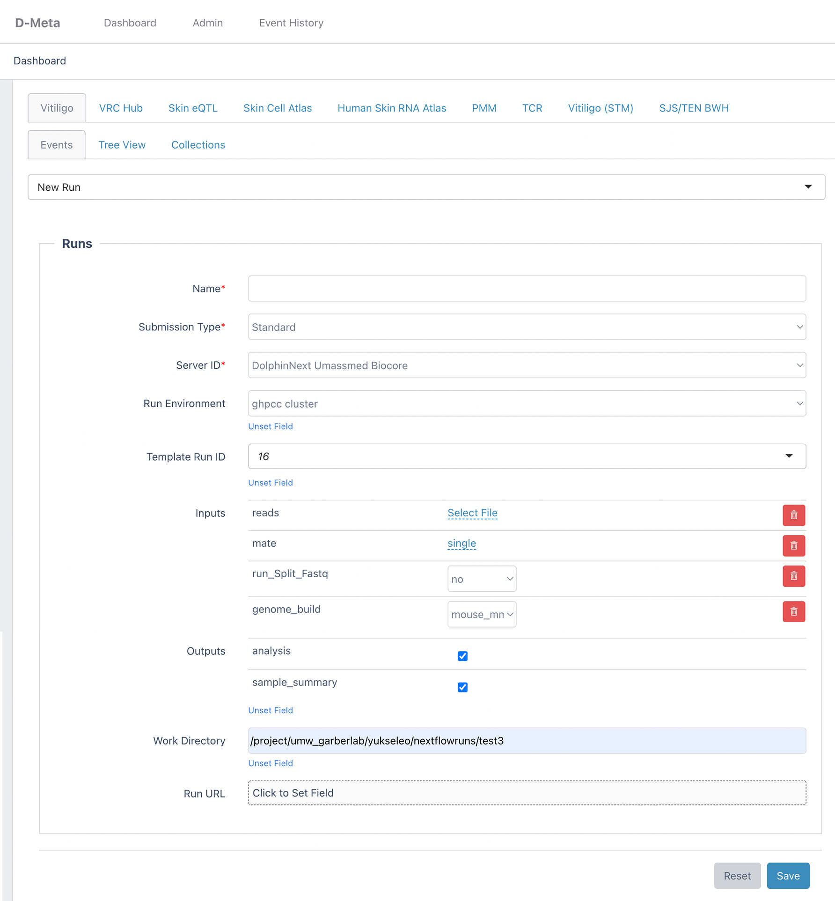
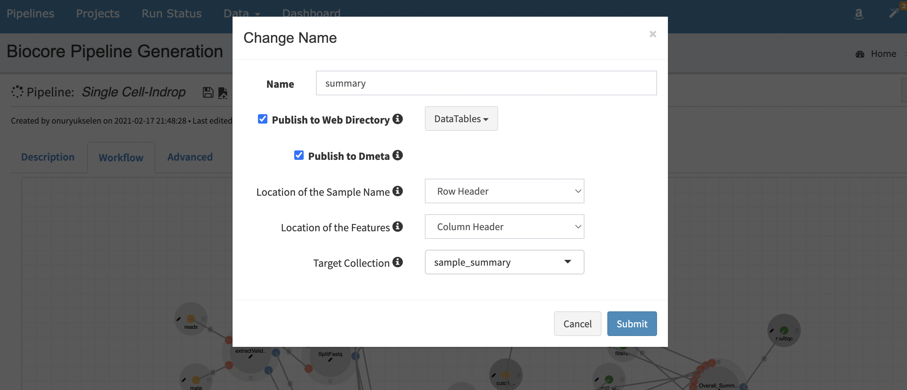
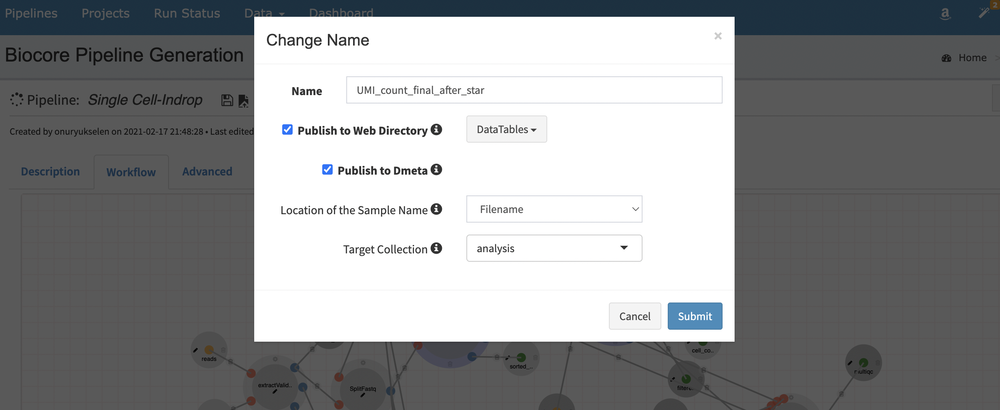

# Via Foundry Integration Guide

This guide will walk you through the details of starting a Via Foundry run through V-Meta and shuttling the pipeline results back to V-Meta.

Via Foundry is an intuitive web interface designed to analyze and manage
large numbers of biological samples in various run environments. Simply by entering
data to a file collection in V-Meta, it's ready to use in
Via Foundry pipelines. In order to configure a Foundry run within V-Meta, navigate to the `Events` tab of your project's dashboard. From the `Select Event` dropdown menu, click the `New Run` event or select the `Run`
collection and click the `Insert` button. To create `New Run` event
please [check here.](vmeta_events.md#insert-new-run-event) The following page will appear to submit your run:

{.align-center width="99.0%"}

-   **Name:** Run name. If you select the `batch` submission type, you
    can append sample names using the `${name}` variable. e.g.
    `${name}_scRNA_Analysis`

-   **Submission Type:**

    > a.  Standard: Default submission type. All selected files are used
    >     in a single run.
    > b.  Batch: Each file is submitted into a separate run. You can use
    >     sample names in the work directory or run names using
    >     `${name}` variable. e.g. `${name}_scRNA_Analysis` or
    >     `/dolphinnext/process/${name}`

-   **Server ID:** Dolphinnext server where run-related data will be
    pulled.

-   **Run Environment:** User's Run Environments in Via Foundry are
    listed in this dropdown.

-   **Template Run ID:** User's Runs are listed here. To submit a new
    run in dolphinnext, a template ID is required. After selecting a
    template run, the following Inputs and Outputs sections will appear.

-   **Inputs:** Inputs of template run. You overwrite the run defaults
    or choose a new set of files in this section.

-   **Outputs:** V-Meta outputs of the template run. While creating a
    pipeline in dolphinnext, developers are allowed to select certain
    files to send V-Meta. To do this, pipeline developers need to click
    the edit icon of the green output circle and click the
    `Publish to V-Meta` checkbox. After that following options need to be
    selected:

    > 1.  **Location of the Sample Name:** (Row Header, Column Header,
    >     Filename)
    > 2.  **Location of the Features:** (Row Header, Column Header, Both
    >     Headers)
    > 3.  **Target Collection:** Any V-Meta collection name where output
    >     data will be saved. (e.g. summary, analysis)

Dolphinnext sends back the run outputs to V-Meta after run completes.
Each data or file associated with each sample separately. Therefore
there are three ways to create output in the pipeline for V-Meta.

> -   **Option A.** Keeping sample names as table headers in TSV/CSV
>     file.
>
>   Sample                VB75_rep1   VB74_rep1   VB74_rep2
>   --------------------- ----------- ----------- -----------
>   Total Reads           69340       63455       80041
>   Valid Reads           59340       58302       79041
>   Total aligned Reads   3589        3478        6802
>   Duplication Rate      1.06        1.06        1.03
>
> -   **Option B.** Keeping sample names on the first column of the
>     TSV/CSV file.
>
>   Samples     Total Reads   Valid Reads   Total aligned Reads   Duplication Rate
>   ----------- ------------- ------------- --------------------- ------------------
>   VB75_rep1   69340         59340         3589                  1.06
>   VB74_rep1   63455         58302         3478                  1.06
>   VB74_rep2   80041         79041         6802                  1.03
>
> -   **Option C.** Keeping sample name on the filename. (e.g.
>     VB75_rep1.png, VB75_rep1.tsv)
>
> {.align-center width="99.0%"}
>
> {.align-center width="99.0%"}

After saving these settings, selected collection name will appear in the
outputs section in V-Meta.

-   **Work Directory:** Directory where the run will be executed.
-   **Run URL:** If you want to enter an already executed run into
    V-Meta, please enter the run URL here. This will prevent new run
    submission.
