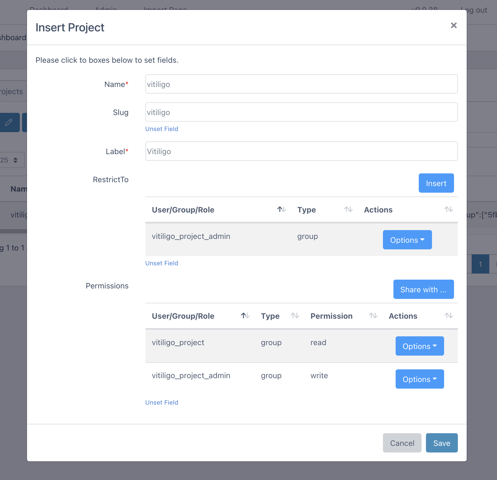
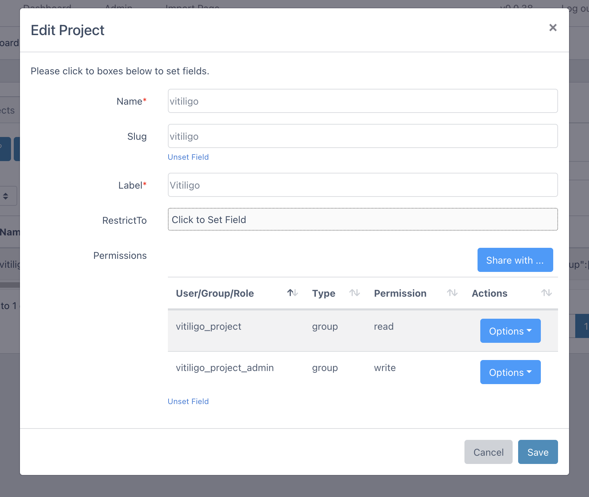

# Project Guide

Within Via Foundry and V-Meta, projects serve as platforms for managing your collection and field data. At the top of the projects section, you'll find three action buttons with which you can manage your projects: `Insert`, `Edit` and `Delete`.

## Creating Projects

To create a new project, simply click on the `Insert` button, and it will open a new project form. Here, you can fill in the following fields:

-   **Name:** Enter your project's name in this field.
-   **Label:** Provide a longer description or label for the project.
-   **RestrictTo:** Select users or groups who are allowed to insert new collections into the project. You can add new users/groups by clicking the `Insert` button and then choosing the appropriate user/group/role for insert permission. If you wish to remove this permission, click on `Options` and then the `Delete` button.
-   **Permissions:** Select users or groups who are allowed to view or edit the project. To add new users/groups, click on the `Share` button, choose the desired user/group, set read/write permissions, and then click `Save`. If you need to edit or remove these permissions, click on the `Options` button.

{.align-center width="99.0%"}

## Editing Projects

After clicking the checkbox corresponding to the project you'd like to edit, you can start editing by clicking
the `Edit` button. A window similar to `Insert Project` will open, in which you can edit aspects of your metadata, including all those listed above in [Creating Projects](vmeta_projects.md#creating-projects).

{.align-center width="99.0%"}

## Delete Project

To remove a project, just select its checkbox on the Projects dashboard and click `Delete`.