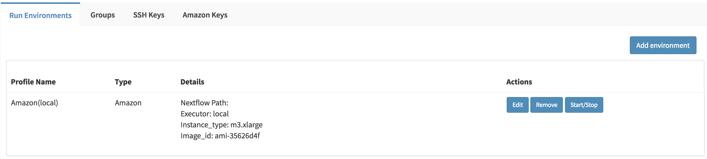
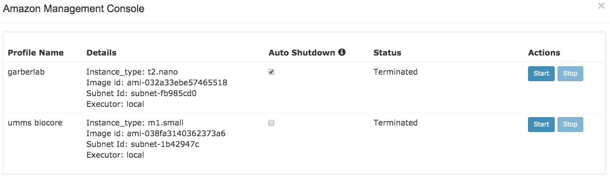
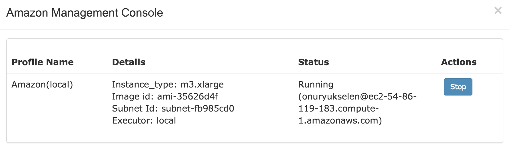

******************
Amazon Cloud Guide
******************

Via Foundry supports submitting jobs to the Amazon AWS Cloud by using Nextflow. It allows you to practically set up, start and stop a computing cluster, and run your pipeline within the AWS infrastructure.

Configuration
=============
Once logged in, click on the ``Profile`` tab in the top right of the screen (identifiable by a head icon). When setting up for the first time, you'll need to set up your `SSH key information <profile.html#ssh-keys>`_ in the SSH Keys tab, and `Amazon Keys information <profile.html#amazon-keys>`_ in the Amazon Keys tab. Then, you can proceed with creating an `Amazon connection profile <profile.html#b-defining-amazon-profile>`_ in the Run Environments tab. After successfully creating a profile, a ``Start/Stop`` button will appear in the **Actions** column of your Amazon profile, as shown in the image below:

Clicking on ``Start/Stop`` will open a new window, called **Amazon Management Console**.

Amazon Management Console
=========================

Starting and stopping AWS Cloud jobs is housed in the Amazon Management Console. You can open the console by clicking ``Profile > Run Environments > Start/Stop``.

.. comment: Update with original second method if an Amazon widget is put into the site.

The status of your profiles will be shown as below:

Starting Cluster
================
In order to activate an AWS cluster, click on the ``Start`` button of the profile you want to initiate. You'll be prompted with the following options:

* **Nodes:** Enter the number of instances you want to initiate. The first node created will be the ``Master`` node, and the remaining ``Workers``.

* **Use Autoscale:**  This is Nextflow's critical feature; it allows the cluster to dynamically adapt to the workload by manipulating the computing resources it uses. After clicking this option and entering your desired number of **Maximum Instances**, which should reflect the upper limit of instances you want to add to control the cluster, new instances will be automatically added to the cluster when tasks wait for 5 minutes in ``Pending`` status. By default, unused instances are removed when they are not utilised.

* **Auto Shutdown:** Your Amazon instance will be automatically shut down when there has been no ongoing run for 10 minutes. Note that this feature will only be activated after you initiate your first run.

Your profile status will be updated to ``Waiting for reply`` as soon as you click the ``Activate Cluster`` button. If your credentials and profile are correct, the profile status will change to ``Initializing`` and then ``Running``. However, in the case of missing or wrong profile information, the status will turn into ``Terminated``, and information about the error will appear next to the status. All possible states of a profile are listed in the table below for clarity:

======================= ================================================================
Status                  Meaning
======================= ================================================================
Inactive                AWS Cloud has not been initiated yet.
Waiting for reply       Cluster request has been sent.
Initializing            Cluster request has been accepted and nodes are initializing.
Running                 AWS Cloud is ready to submit jobs.
Waiting for termination Cluster termination request has been sent and is waiting for termination.
Terminated              AWS Cloud has terminated.
======================= ================================================================

Once the cluster initialization is complete, ``user@hostname`` will appear next to the ``Running`` status as shown in the image below.

You can connect to the master node by using the following SSH command::

    ssh user@hostname

Submit a Job
============
Similar to regular job submission, follow these steps:

1. `Select your pipeline and add into a project <project.html>`_
2. `Initiate run <run.html>`_

On the run page, you should select your active Amazon profile as a `Run Environment <run.html#run-settings>`_ and click ``Ready to Run``.

Stopping Cluster
===============
When runs are complete, you can stop cluster by clicking the ``Stop`` button on the Amazon Management Console page. Your profile status will be updated to ``Waiting for termination``, and as soon as confirmation is received, it will change to ``Terminated``.

Support
=======
For any questions or help, please reach out to support@viascientific.com with your name and question.
